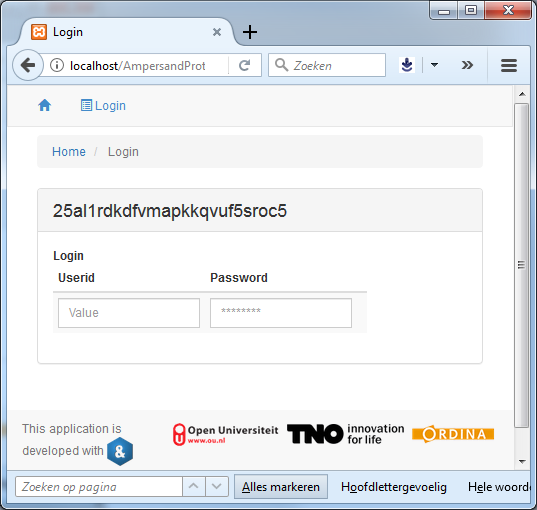

# Examples

This page is a collection of examples, meant for learning and explaining the language Ampersand.
TODO: refactor this documentation to match the latest syntax.

## Example: Client {#services-example-client}

This example illustrates the structure of [services in Ampersand](./reference-material/syntax-of-ampersand#the-interface-statement)

### A Client service

Suppose we have a delivery-hub that distributes orders over vendors and registers the subsequent deliveries. Let us define a service for clients, to allow clients to change their name and address and display their orders.

```text
INTERFACE ClientInfo FOR Client,Vendor : I[Client]
BOX [ "Name" : clientName
    , "Street" : clientAddress
    , "City" : clientCity
    , "All orders" : orderedBy~
      BOX [ vendor :orderedAt
          , product : orderOf
          ]
    , "Orders to be accepted by provider" : orderedBy~ - V;orderAccepted~
    , "Orders pending delivery" : orderedBy~ /\ (V;orderAccepted~ - orderReceived~)
    , "Received orders" : orderReceived~
    ]
```

### Structure

The service has a **header**, which is the first line in this example:

```text
INTERFACE ClientInfo FOR Client,Vendor : I[Client]
```

The word `ClientInfo` is the **name** of this service. This name identifies the service , so it must be unique throughout the entire context.

This service is shown only to users with roles `Client` or `Vendor`. That is indicated by the restriction `FOR Client,Vendor`. Without that restriction, the service is available for every user in any role.

The term to the right of the colon \(`:`\) symbol is called the **interface term**. A service is called from an atom which must be in the domain of this term. Let, for example, `Peter` be a `Client`. As `Peter` is an element of the domain of `I[Client]`, the service can be called from that atom.

The same term, `I[Client]`, is also used as **box term** for the box that follows the header. For every element in the codomain of the box term, a container \(in HTML: `<div>`\) will be drawn on the user screen. That box serves as a subinterface, which is called with precisely one atom. With `I[Client]` as box term, the codomain will contain just one atom, which is precisely the atom from which the service was called.

In this example, the outermost box contains seven **box items** and the innermost box two. Each box item has a label and an term. For example the box item `"Name" : clientName` has `"Name"` as its label and `clientName` as term. The atom `a` from which the box was called is used to select the pairs \(`a`,`x`\) from the term. All `x`-es for which \(`a`,`x`\) is in `clientName` will be displayed. Supposing that the relation `clientName` associates only one name to a client, this specific box item displays just one name. However, in the fifth box item, the term `orderedBy~ - V; orderAccepted~` may contain an arbitrary number of orders to be accepted by provider, all of which are shown.

---

## description: 'TODO: This example is subject to bitrot. It has to be redone.'

# Example: Login {#services-example-login}

This example defines a login/logout service,  
because it is familiar. We show this example to demonstrate how to get different interface structures under varying conditions.

## Preliminaries

The compiler uses templates to adapt an interface to specific needs regarding its HTML structure. Please read the [documentation of templates](./reference-material/syntax-of-ampersand#layout-of-interfaces) first for details.

To link system activities to a person or organisation, we use the notion of `Account`. To log in means to associate a session with the `Account` of the user. This association is made in the relation `sessionAccount`. To log out means to break that link, i.e. to remove the session/account pair from relation `sessionAccount`. When logging in, it is customary that the user identifies herself. In this example we do this with a `UserID` and `Password`.

A `UserId` is used to identify the user by a unique name. In this way, the \(system generated\) key of the user in the database is kept within the database.

To make it more difficult to use an other person's `Account`, the system registers passwords. A `Password` is a string of characters known to the user only. For this reason, the login service must not expose the password while the user is typing it.

To isolate a data space for one specific user, we use the notion of session. A `SESSION` corresponds with the notion of session as used in browsers. Ampersand links the session called `'_SESSION'` to the current browser session, which results in the behaviour one would expect of a browser session.

## How the service works

A login service allows a user to log in and log out of the system. Here is what it looks like in a browser:



Wonder what the 25al1rdkdfvmapkkqvuf5sroc5 means? Well this is the session number of the actual browser session. It is the value for which the atom

`"_SESSION"`

stands in your script.

When you type your name, it shows up in the field Userid, but when you type in the password it is obscured by dots

\(

as we would expect

\)

:


When we then type

`<enter>`

, the login functionality disappears and the logout functionality appears:


When you click the checkbox, you have logged out and will return to the first screen

## What the Ampersand code looks like

To understand how it all works, let us discuss the code for this service:

```text
INTERFACE Login : '_SESSION'[SESSION] cRud BOX <HROWS>
   [ "Login": I - sessionAccount;sessionAccount~ cRud BOX <HCOLS>
      [ "Userid"   : loginUserid cRUd
      , "Password": loginPassword crUd -- crUd is needed for Passwords
      ]
   , "Logout": I /\ sessionAccount;sessionAccount~ cRud BOX <ROWSNL>
      [ "Logout": I cRud BOX <HCOLS>
         [ "Logout?": logoutRequest cRUd
         , "UserID": sessionUserid cRud
         ]
      ]
   ]
```

If you analyse this code, notice the nested structure of `BOX`-es. The service is a box on the top level with two sub-boxes labeled `"Login"` and `"Logout"`.

The top-level box has `"_SESSION"[SESSION]` as its box-term. What you must remember is that the every atom of the codomain of that term causes one contain \(HTML: `<div>`\). In this example, the codomain of `"_SESSION"[SESSION]` is just one atom, which is the session identifier. That is shown in the title of the outmost box in the browser.

### Selectively showing subboxes by `<HROWS>`

We would expect to see two subboxes, one labeled `"Login"` and another labeled `"Logout"`. However, the outmost box was annotated with `<HROWS>`. The `H` stands for hidden. It means that empty subboxes will be hidden from the user. Now look at the box-terms of the `"Login"`- and `"Logout"` subboxes. Which elements are in the codomain of the box-term of the `"Login"` subbox? It says: "All sessions without an account associated with it". Since there is only one session \(i.e. the browser-session\) this comes down to "the current session, provided there is no account associated with it." So if nobody is logged in in the current browser session, the session atom is the only atom. Otherwise there is no atom and the `"Login"` subbox is not shown. Similarly, which elements are there to make the the `"Logout"` subbox appear? That box-term shows all sessions associated with an account. Which would be the account of the current session, provided someone is logged in.

That explains why the `"Login"` subbox is shown when nobody is logged in and the `"Logout"` subbox is shown when someone is logged in.

So let us do the following experiment: change the

`<HROWS>`

annotation to

`<ROWS>`

. Then we will see both boxes:


Notice that both subboxes have the

`H`

in their annotations, so in the screeshot above the

`"Logout"`

subbox remains empty. However, when logged in, the other subbox remains empty:


## Example {#example-service-structure}

To understand the structure of a service (keyword: `INTERFACE`), this section introduces a small example of a user interface, which shows the name, status, e-mail and co-workers of a person called "J. Lovell".


The specification of this user interface is given in the following service definition:

```
INTERFACE Person : I[Person]
BOX
  [ "Name"       : personName
  , "Status"     : personStatus
  , "Email"      : personEmail
  , "Works with" : workswith
  ]
```

To understand this fragment, take notice of:

1. The name of this service is `Person`. This name immediately follows the keyword `INTERFACE`.
2. The term following the colon, `I[Person]`, is the interface term of this service.
3. The service can be applied to any atom from the _domain of the interface term_. So this particular service is applicable to any atom of type `Person`. In the screenshot, it applies to `"J. Lovell"`.
4. The labels "Name", "Status", "Email", and "Works with" correspond to field names in the user interface.
5. Each term at the right of a field name specifies which data is presented in the field. For this reason it is called the _field term_ for that field. Field name and field term are separated by a colon.
6. Of all pairs `<"J. Lovell", x>` from the field term, the field displays the right atom `x`. A field term always works on one specific atom on the left, which is `"J. Lovell"` in this example.
7. Field terms are subject to type checking. The following relations provide an example for getting a type-correct service:

   ```
   RELATION personName :: Person * PersonName [UNI]
   RELATION personStatus :: Person * PersonStatus [UNI]
   RELATION personEmail :: Person * Email [UNI,TOT]
   RELATION workswith :: Person * Person
   ```

   The source concepts of a field term must match the target concept of the interface term.

8. Looking at the screenshot, we can tell that `"J. Lovell"` has one personName (which is `"J. Lovell"`), it has no personStatus, one personEmail and three persons to work with in `RELATION workswith`.

## Example of a Service {#service-introductory-example}

```text
INTERFACE Overview : "_SESSION"                  cRud
BOX <TABS>
     [ Students : V[SESSION*Student]             cRuD
       BOX <TABLE>
                [ "Student" : I[Student]         cRud
                , "Enrolled for" : isEnrolledFor cRUD
                , "Course" : takes CRUD
                ]
     , Course : V[SESSION*Course]                cRuD
       BOX <TABLE>
                [ "Course" : I                   cRud
                , "Modules" : isPartOf~          CRUD
                ]
     , Modules : V[SESSION*Module]               cRud
       BOX <TABLE>
                [ "Modules" : I                  cRuD
                , "Course" : isPartOf            cRUd
                , "Students" : isEnrolledFor~    CRUD
                ]
     ]
```

This example specifies three tabs. One shows students, one shows courses and one shows modules. This is what it looks like when run in a browser:


Notice the following features:

1. The structure of a service is hierarchical. It consists of boxes within a box. This is because a field term may be followed by a `BOX` with a list of subservices. Without it, it is just a field term.
2. When a field term is followed by a `BOX`, every atom in the _codomain of the field term_ is displayed in a box of its own on the screen. That box behaves like a service with the field term serving as interface term of that subservice.
3. By this mechanism, the hierarchical structure of the entire service translates directly to the hierarchical structure of the web-page in which it is displayed.
4. The source concept of a field term must match with the target concept of the field term outside the box.
5. The target concept of a field term that has a box, must match with the source concepts of each field inside that box.
