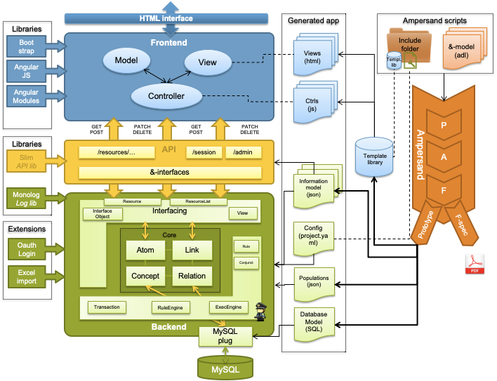

# Architecture of an Ampersand Application

This chapter is intended for programmers who wish to know more about the software Ampersand generates. There can be many reasons, such as wanting to change the user experience, add or change functionality in views and/or controls, or simply to use the API of an Ampersand application. In this chapter you will find more details of the applications you generate.

## Information systems

In general, any information system has a structure like the one depicted below:

An information system is meant to support users (e.g. Peter, Sally, Daisy). Differences among users can be handled by using roles (e.g. customerRep, sysMgr, MgmtSupporter). In this diagram, users are coloured to depict different roles.&#x20;

An information system consists of a number of services. We distinguish user facing services and non-user facing services. User facing services (e.g. register a client, sanitize case files, login) can be made available for a limited number of roles, giving each user access to precisely the services he or she is meant to see. In the diagram, user-facing services are colored corresponding to the roles they serve. Non-user facing services are not colored. Therefore, they are used exclusively by other software. Services can be either stateful or stateless. In the diagram, stateful services are drawn with a data container inside.

Services communicate by means of streams or by means of remote calls.

Currently, Ampersand generates correct information systems with one stateful service, which is the database. All other services are stateless and client-facing.

An Ampersand information system is deployed as a whole. Therefore it qualifies as a "monolithic" system.

.png>)

## Infrastructural Architecture of an Ampersand application

Let us look at a typical Ampersand Application called RAP, as an example:

.png>)

This example demonstrates how Ampersand applications function on the web. The application is deployed on a docker platform to facilitate frequent deployment anywhere in a robust manner and to isolate the internals from the outside world. Its structure has been defined statically (in docker-compose) to allow automated maintenance in production. The application itself is implemented as a statefree service, `rap4`. It uses a database service, `db`, for persistent storage. It is connected to the internet by a proxy which takes care of https and http traffic on ports 443 and 80 respectively. Two local networks separate data traffic to facilitate future work load balancing. The components `db`, `phpmyadmin`, and `proxy` are open source components which we have reused from the internet. The component `rap4` has been generated by Ampersand and has the structure shown in the following section.

## Software Architecture of an Ampersand application

Let us take a look at the structure of any system that Ampersand generates.

The diagram shows an Ampersand framework (Ampersand FW, i.e. the green area), which is a database application that works as a stateful service. It ensures that all invariants are kept satisfied in production, as changes to the database are being made. So the integrity of the data is defined by the rules in the Ampersand script and perpetuously maintained in the back-end of the application.

The framework is encapsulated by an application programming interface (API, the yellow area), which exports the functionality in a standardised way. Every application that interfaces through that API will therefore automatically preserve the integrity of data.

On top of the API, the application comes with a front-end application (the blue area). This web-application has a conventional structure, based on the well-known [Model-View-Control (MVC) pattern](https://en.wikipedia.org/wiki/Model%E2%80%93view%E2%80%93controller) used in many web-applications.

The Ampersand compiler (the orange thing on the right) generates the application as a collection of HTML-pages (views) and JavaScript pages (controls), together with static code that is loaded from a framework. So the framework and the API are generic components, in which the semantics are "injected" as JSON files from the Ampersand compiler.

The structure described above is reflected in the directory structure generated by Ampersand:&#x20;

.png>)

So if you look in your directory, the generated application will look like this:

The following figure shows the view-files to the left, the controller-files in the middle, and the services used by the controllers to the right.

