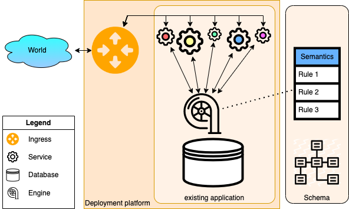

# A Theory of Information Systems

This chapter documents a theory of information systems, upon which Ampersand generates information systems.

The purpose of an information system is to make data meaningful to its
users. Users have their own tasks and responsibilities and may work from
different locations and on different moments. This collective use by
multiple users serves a purpose which we will loosely call "the
business". To preserve meaning, the business maintains semantic
constraints on the data, amidst of all changes that are going on around
them.

Information systems are typically used by actors (both users and
computers) who are distributed and work with data all the time. As a
consequence, the data in a system changes continually. In practice,
actors "talk to" the system through an ingress mechanism, which connects
each user to the right service(s). The ingress function is provided by
the deployment platform, so it is beyond the scope of this paper. Also,
every service runs independent of other services, meaning that each
service can be stopped, (re)started and substituted without disrupting
the other services.

Every system contains a dataset, which represents the state of the
system. Every service produces and consumes events that may change the
state of the system. This state is represented in a persistent store,
aka the database [^3]. Events that the system detects may cause the
state to change.

To keep our theory technology independent, datasets are assumed to
contain triples. This makes the theory valid for any kind of database
that triples can represent, such as SQL databases, object-oriented
databases, graph databases, triple stores, and other no-SQL databases.
The system's semantics is represented as constraints, which most
database management systems refer to as integrity rules. The purpose of
integrity rules is to keep the constraints they represent satisfied.

An *information system* is a combination of dataset, schema, and functionality. Each is defined in a separate section.

## Datasets {#sct:Datasets}

A dataset $\mathscr{D}$ describes a set of structured data, which is
typically stored persistently in a database of some kind. The notation
$\mathscr{D}_{\mathscr{S}}$ refers to the dataset of a particular
information system $\mathscr{S}$. The purpose of a dataset is to
describe the data of a system at one point in time. Before defining
datasets, let us first define the constituent notions of atom, concept,
relation, and triple.

Atoms serve as data elements. Atoms are values without internal
structure of interest, meant to represent atomic data elements (e.g.
dates, strings, numbers, etc.) in a database. From a business
perspective, atoms represent concrete items of the world, such as
`Peter`, `1`, or `the king of France`. By convention throughout the
remainder of this paper, variables $a$, $b$, and $c$ represent *atoms*.
All atoms are taken from an infinite set called $\mathbb{A}$.

Concepts are names that group atoms of the same type. All concepts are
taken from an infinite set $\mathbb{C}$. $\mathbb{C}$ and $\mathbb{A}$
are disjoint. For example, a developer might choose to classify `Peter`
and `Melissa` as `Person`, and `074238991` as a `TelephoneNumber`. In
this example, `Person` and `TelephoneNumber` are concepts. In the
sequel, variables $A$, $B$, $C$, $D$ will represent concepts.

The relation $\text{\it inst}:\mathbb{A}\times\mathbb{C}$ is the
instance relation between atoms and concepts. The expression
$a\ \text{\it inst}\ C$ means that atom $a$ is an *instance* of
concept $C$. This relation is used in the type system, in which
$\text{\it inst}$ assigns a concept to every atom in the dataset.

Relations serve to organize and store data, to allow a developer to
represent facts. In this paper, variables $r$, $s$, and $d$ represent
relations. All relations are taken from an infinite set $\mathbb{R}$.
$\mathbb{R}$ is disjoint from $\mathbb{C}$ and $\mathbb{A}$. Every
relation $r$ has a name, a source concept, and a target concept. The
notation $r=\text{\it n}_{\langle{A},{B}\rangle}$ denotes that
relation $r$ has name $n$, source concept $A$, and target concept $B$.

Triples serve to represent data. A triple is an element of
$\mathbb{A}\times\mathbb{R}\times\mathbb{A}$.

A dataset $\mathscr{D}$ is a tuple
$\langle{\mathcal{T}},{\text{\it inst}}\rangle$ that satisfies:

$\forall\langle{a},{\text{\it n}_{\langle{A},{B}\rangle}},{b}\rangle\in\mathcal{T}:\ a\ \text{\it inst}\ A\ \wedge\ b\ \text{\it inst}\ B$

This equation defines what it means for a triple to be well-typed.
For example,
$\langle{\text{{\tt\small Peter}}},{\text{\it phone}_{\langle{\tt Person},{\tt TelephoneNumber}\rangle}},{\text{{\tt\small 074238991}}}\rangle$
is a triple.
The equation says that `Peter` is an instance of
`Person` and `074238991` is an instance of `TelephoneNumber`. In
practice, users can say that Peter has telephone number 074238991. So,
the "thing" that `Peter` refers to (which is Peter) has `074238991` as a
telephone number. This "meaning from practice" has no consequences in
the formal world. Users are entirely free to attach a practical meaning
to a triple.

The notations $\mathcal{T}_{\mathscr{D}}$ and
$\text{\it inst}_{\mathscr{D}}$ are used to disambiguate $\mathcal{T}$
and $\text{\it inst}$ when necessary. Every dataset is an element of
an infinite set called $\mathbb{D}$. To save writing in the sequel, the
notation $a\ r\ b$ means that $\langle{a},{r},{b}\rangle\in\mathcal{T}$.

A relation $r$ can serve as a container of pairs, as defined by the
function
$\text{\it pop}_r:\mathbb{D}\rightarrow\cal{P}\{\mathbb{A}\times\mathbb{A}\}$.
It defines a set of pairs, also known as the population of $r$:

$\text{\it pop}_{r}(\mathscr{D})\ =\ \{ \langle{a},{b}\rangle\mid\ \langle{a},{r},{b}\rangle\in\mathcal{T}_{\mathscr{D}}\}$

So, for every dataset $\mathscr{D}$:

$\langle{a},{b}\rangle\in\text{\it pop}_{\text{\it n}_{\langle{A},{B}\rangle}}(\mathscr{D})\ \Rightarrow\ a\ \text{\it inst}\ A\ \wedge\ b\ \text{\it inst}\ B$

For a developer, this means that the type of an atom depends only on the
relation in which it resides; not on the actual population of the
database. This allows for static typing, which has well established
advantages for the software engineering
process [@HanenbergKRTS14; @Petersen2014].

## Schemas {#sct:Schemas}
To design an information system, a developer defines a schema in which
she defines concepts, relations, and rules. Together, the concepts,
relations, and rules capture the semantics of an information
system [@Spivak2012]. Each rule in a schema serves to constrain the
dataset, to ensure its semantic integrity. Every rule is an element of
an infinite set called $\mathbb{U}$, which is disjoint from
$\mathbb{A}$, $\mathbb{C}$, $\mathbb{R}$, and $\mathbb{D}$. In this
paper, variables $u$ and $v$ represent rules.

A type system in Ampersand [@vdWoude2011] identifies certain rules that
are provably false. It also ensures that all rules can be interpreted
within the set of relations in the schema. Due to this type system, the
Ampersand compiler only generates code for scripts without type errors.
As a result, for every rule $u$ in the schema, there is a predicate
$\text{\it sat}_{u}(\mathbb{D})$ that says whether dataset
$\mathscr{D}$ satisfies rule $u$. A discussion of the type system is out
of scope because this paper only makes use of the predicate
$\text{\it sat}_{u}(\mathbb{D})$.

Rules serve as invariants, i.e. constraints that the data in the
database must satisfy at all times. At times in which the dataset does
not satisfy a rule, that rule is said to be *broken*. In those cases,
something or someone must take action to fix the situation and restore
invariance of that rule.

A schema $\mathscr{Z}$ is a triple
$\langle{\mathcal{C}},{\mathcal{R}},{\mathcal{U}}\rangle$, in which
$\mathcal{C}$ is a finite set of concepts, $\mathcal{R}$ is a finite set
of relations, and $\mathcal{U}$ is a finite set of rules. The notation
$\mathscr{Z}_{\mathscr{S}}$ refers to the schema of information system
$\mathscr{S}$. Disambiguation sometimes requires to write
$\mathcal{C}_{\mathscr{Z}}$, $\mathcal{R}_{\mathscr{Z}}$, and
$\mathcal{U}_{\mathscr{Z}}$ rather than $\mathcal{C}$, $\mathcal{R}$,
and $\mathcal{U}$ respectively.

In order to do static type checking, all concepts and relations must be
"known" in the schema:
$\begin{aligned}
   \text{\it n}_{\langle{A},{B}\rangle}\in\mathcal{R}&\Rightarrow&A\in\mathcal{C}\ \wedge\ B\in\mathcal{C}\\
   \langle{a},{\text{\it n}_{\langle{A},{B}\rangle}},{b}\rangle\in\mathcal{T}&\Rightarrow&\text{\it n}_{\langle{A},{B}\rangle}\in\mathcal{R}
\end{aligned}$

We say that a triple $\langle{a},{r},{b}\rangle$ 
*befits* schema $\langle{\mathcal{C}},{\mathcal{R}},{\mathcal{U}}\rangle$ if it satisfies these requirements.

A special kind of rule is used for specialization. The rule $A\preceq B$
(pronounce: $A$ is a $B$) states that any instance of $A$ is an instance
of $B$ as well.

$\text{\it sat}_{A\preceq B}(\mathscr{D})\ \Leftrightarrow\ \forall a: a\ \text{\it inst}\ A\rightarrow a\ \text{\it inst}\ B$

This is called *specialization*, but it is also known as
*generalization* or *subtyping*. You need specialization to allow
statements such as: "An employee is a person" or "A human is a mammal".
The specialization rules in a schema form a partial order $\preceq$,
meaning that $\preceq$ is reflexive, transitive, and antisymmetric.
Specialization rules are special for two reasons: Firstly, the system
keeps $A\preceq B$ satisfied automatically by changing
$\text{\it inst}$ whenever needed. This means that a system that
contains rule $A\preceq B$ can never be brought into a state in which
$\text{\it sat}_{A\preceq B}$ is False. This allows for certain
run-time optimizations, which are beyond the scope of this paper. A
second property that sets specialization rules apart, is that they play
a role in the Ampersand compiler. For example, code that determines
equality between atoms only works for atoms that are an instance of the
same concept. To ensure that this does not result in problems at
run-time, users are required to write all specialization rules
explicitly.

As a result, if an atom is an instance of concept $A$ and $A\preceq B$,
this atom has all properties that atoms of type $B$ have.

## Information Systems {#sct:Information Systems}

This section defines the notion of information system.
As before, a suffix disambiguates the elements of this definition when needed.

**Definition 1** (information system).

*An information system $\mathscr{S}$ is a tuple
$\langle\mathscr{D},\mathscr{Z},\mathcal{O},\text{\it maint}\rangle$,
in which*

-   *dataset
    $\mathscr{D}=\langle{\mathcal{T}},{\text{\it inst}}\rangle$ as
    defined previously;*

-   *schema
    $\mathscr{Z}=\langle{\mathcal{C}},{\mathcal{R}},{\mathcal{U}}\rangle$
    as defined previously;*

-   *$\mathcal{O}$ is a set of roles;*

-   *$\text{\it maint}: \mathcal{O}\times\mathcal{U}$ is the
    maintainance relation between roles and rules.*

A *role* is a name that identifies a group of users.
It serves as a placeholder for a person or a machine (i.e. an
actor) that works with the dataset (i.e. create, read, update, or delete
triples). The purpose of a role is to mention an individual user (human)
or an automated actor (bot) without knowing who that user is.

The system is *at rest* when every rule in the schema is satisfied:

$\forall u\in\mathcal{U}:\ \text{\it sat}_{u}(\mathscr{D})$

However, the system continually registers events that insert or delete
triples in its dataset, which may cause rules to be broken. This
requires a reaction to restore invariance. Example: if a rule says that
every request must be acknowledged, the receipt of a request (which is
an event) will violate this rule. Sending a message that acknowledges
this receipt (another event) will cause the rule to be satisfied again.
During the time between the receipt of the request and sending the
acknowledgment, the rule is (temporarily) not satisfied.

Ampersand assumes two ways of enforcing satisfaction of rules:
automatic or manual. Manual enforcement is specified by the developer by
assigning a rule $u$ to a role $o$. Any actor with role $o$, whether
person or machine, can restore invariance of rule $u$ by inserting or
deleting the right triples. For this reason, every rule is assigned to
at least one role by means of the relation $\text{\it maint}$:

$\forall u\in\mathcal{U}\ \exists o\in\mathcal{O}:\ o\ \text{\it maint}\ u$

$o\ \text{\it maint}\ u$ means that role $o$ must keep rule $u$
satisfied, i.e. to keep $\text{\it sat}_{u}(\mathscr{D})$ true. As
long as rule $u$ is broken, the system should notify actors in the
role(s) that are administered in $\text{\it maint}$ to do something
about it.

Automatic enforcement is specified by the developer with a special
syntax, the *enforcement rule*. An enforcement rule specifies not only the rule,
but also the way to restore invariance. The system features an engine
that restores invariance of all enforcement rules without unneccessary
delay. Whenever the dataset violates an enforcement rule, this engine will
make other changes to the dataset to satisfy that rule. Hence, the rule
is not satisfied during a small, finite amount of time.

The system contains a dedicated role for the enforcement engine, so
every rule has at least one role in the relation $\text{\it maint}$,
means that all roles together are keeping all rules satisfied.

## Example {#sct:Example existing IS}

Having defined an information system in mathematical terms, let us
discuss a small example. It is written in the language Ampersand to make
it more appealing to read. Let us first define a dataset of just a
handful of triples and three relations.

    RELATION takes[Student*Course] =
    [ ("Peter", "Management")
    ; ("Susan", "Business IT")
    ; ("John", "Business IT")
    ]

This declaration introduces a relation with the name `takes`, source
concept `Student`, and target concept `Course`. The informal meaning of
this relation is that it states which students are taking which courses.

The example system also has a second relation that states which modules
are part of which course.

    RELATION isPartOf[Module*Course] =
    [ ("Finance", "Management")
    ; ("Business Rules", "Business IT")
    ; ("Business Analytics", "Business IT")
    ; ("IT-Governance", "Management")
    ]

The third and last relation states which students are enrolled for which
module. It is left empty for now.

    RELATION isEnrolledFor[Student*Module]

A rule, `EnrollRule` completes the semantics It states that a student
can enroll for any module that is part of a course he or she takes. In
Ampersand, which is a syntactically sugared form of relation
algebra [@JoostenRAMiCS2017], each rule has a name and each rule has a
role to maintain its invariance:

    RULE EnrollRule: isEnrolledFor |- takes;isPartOf~
    ROLE Administrator MAINTAINS EnrollRule

The semantics of this rule defines
$\text{\it sat}_{\tt EnrollRule}(\mathscr{D})$ as:

$\begin{aligned}
   \forall \langle{s},{m}\rangle\in\text{\it pop}_{\tt isEnrolledFor}(\mathscr{D})\ \exists c\in\text{\tt Course}:\\
s\ \text{\tt isEnrolledFor}\ m\ \rightarrow\ s\ \text{\tt takes}\ c\ \wedge\ m\ \text{\tt isPartOf}\ c
\end{aligned}$

Rule `EnrollRule` is satisfied because relation
$\text{\it \tt isEnrolledFor}_{\langle{\tt Student},{\tt Module}\rangle}$
is empty.

Now let us check the requirements to verify that this example defines an
information system. The Ampersand compiler generates a dataset
$\mathscr{D}$, which contains a set of triples and a relation
$\text{\it inst}$. It defines the set of triples $\mathcal{T}$ as:

$$\begin{array}{llr}
\langle{\text{\tt "Peter"}},&{\text{\it \text{\tt takes}}_{\langle{\text{\tt Student}},{\text{\tt Course}}\rangle}},&{\text{\tt "Management"}}\rangle\\
\langle{\text{\tt "Susan"}},&{\text{\it \text{\tt takes}}_{\langle{\text{\tt Student}},{\text{\tt Course}}\rangle}},&{\text{\tt "Business IT"}}\rangle\\
\langle{\text{\tt "John"}},&{\text{\it \text{\tt takes}}_{\langle{\text{\tt Student}},{\text{\tt Course}}\rangle}},&{\text{\tt "Business IT"}}\rangle\\
\langle{\text{\tt "Finance"}},&{\text{\it \text{\tt isPartOf}}_{\langle{\text{\tt Module}},{\text{\tt Course}}\rangle}},&{\text{\tt "Management"}}\rangle\\
\langle{\text{\tt "Business Rules"}},&{\text{\it \text{\tt isPartOf}}_{\langle{\text{\tt Module}},{\text{\tt Course}}\rangle}},&{\text{\tt "Business IT"}}\rangle\\
\langle{\text{\tt "Business Analytics"}},&{\text{\it \text{\tt isPartOf}}_{\langle{\text{\tt Module}},{\text{\tt Course}}\rangle}},&{\text{\tt "Business IT"}}\rangle\\
\langle{\text{\tt "IT-Governance"}},&{\text{\it \text{\tt isPartOf}}_{\langle{\text{\tt Module}},{\text{\tt Course}}\rangle}},&{\text{\tt "Management"}}\rangle
\end{array}$$

The relation $\text{\it inst}$ contains the pairs:

$$\begin{array}{lcr}
\langle{\tt "Finance"}&,&{\tt Module}\rangle\\
\langle{\tt "Business Rules"}&,&{\tt Module}\rangle\\
\langle{\tt "Business Analytics"}&,&{\tt Module}\rangle\\
\langle{\tt "IT-Governance"}&,&{\tt Module}\rangle\\
\langle{\tt "Management"}&,&{\tt Course}\rangle\\
\langle{\tt "Business IT"}&,&{\tt Course}\rangle\\
\langle{\tt "Peter"}&,&{\tt Student}\rangle\\
\langle{\tt "Susan"}&,&{\tt Student}\rangle\\
\langle{\tt "John"}&,&{\tt Student}\rangle
\end{array}$$

The tuple $\langle{\mathcal{T}},{\text{\it inst}}\rangle$ is well-typed,
so this is a dataset $\mathscr{D}$ as
introduced before.

The Ampersand compiler generates a schema $\mathscr{Z}$, which contains
concepts, relations, and rules. It defines the set of concepts:

$\mathcal{C}=\{ {\tt Module}, {\tt Course}, {\tt Student}\}$

It defines the set of relations:

$$\begin{array}{ll}
\mathcal{R}\ =\ \{&\text{\it  \tt takes}_{\langle{\tt Student},{\tt Course}\rangle},\\
&\text{\it  \tt isPartOf}_{\langle{\tt Module},{\tt Course}\rangle},\\
&\text{\it  \tt isEnrolledFor}_{\langle{\tt Student},{\tt Module}\rangle}\ \}
\end{array}$$

And, it defines the set of rules $\mathcal{U}$ to
contain just one rule: `EnrollRule`.
This example contains no specialization.
So, the schema $\mathscr{Z}=\langle{\mathcal{C}},{\mathcal{R}},{\mathcal{U}}\rangle$
satisfies all requirements mentioned above.

Now let us check the definition of information system. Ampersand
generates a set of roles $\mathcal{O}=\{{\tt Administrator}\}$. The
relation $\text{\it maint}$ contains one pair only,
$\langle{{\tt Administrator}},{{\tt EnrollRule}}\rangle$, instructing
the run-time engine to forward all violations of `EnrollRule` to an
administrator so she can keep `EnrollRule` satisfied.
We can see that the only rule,
`EnrollRule`, is satisfied, which completes the requirements for
$\mathscr{S}=\langle\mathscr{D},\mathscr{Z},\mathcal{O},\text{\it maint}\rangle$.
This concludes the argument that $\mathscr{S}$ is an information system.

## Relation to other theories 
The following table compares the language used in the world of information systems with related worlds. It is compared with Ampersand, because we use Ampersand to design information systems. It is compared with the world of software, because Ampersand generates software. It is compared with the world of model theory [ref required], because the formal theory of Ampersand can be understood formally in model theory. 

| information system | Ampersand | software | model theory |
| -- | -- | -- | -- |
| rules | script | program | theory |
| data | population | state | model |
| formal statement | term | condition | term |
| generator | generator | compiler |
| store | database | database |
| service | service | service |

The following theoretical topics are relevant for Ampersand.

1. Relation Algebra [Maddux 2006]
Ampersand uses heterogeneous relation algebras with specialization as  a language to specify information systems. This is existing theory. It is relevant for people who specify information systems. It allows them to formalize business rules. Thus, they can ensure on design time that an information system complies with business rules.

2. Rewrite systems
The Ampersand compiler manipulates relation algebra terms. For this purpose, it uses rewrite systems. This is existing theory. It is relevant for people who make the Ampersand-compiler generate efficient code.

3. Type systems
The Ampersand compiler ensures that every type-correct specification can be built [1]. For this purpose it has a type system, which signals type-errors in Ampersand-scripts. The Ampersand-compiler generates code only for scripts without type errors.

4. Generating computations
It is possible to generate code to keep constraints satisfied. The theory for this is under development. It is relevant for automating tasks in information systems.

5. Compiler theory
Ampersand is a compiler. Its syntax is parsed by the Parsec-module of Haskell. A hand-written generator embodies the semantics. The theory is existing. This subject is relevant for people who wish to change the language of Ampersand.

Each of the following sections treats on of the topics mentioned above (work to be done).

[1] Michels, G., Joosten, S., van der Woude, J., Joosten, S.: Ampersand: ApplyingRelation Algebra in Practice. In: de Swart, H. (ed.) RAMICS 2011. LNCS, vol. 6663,pp. 280–293. Springer, Heidelberg (2011)