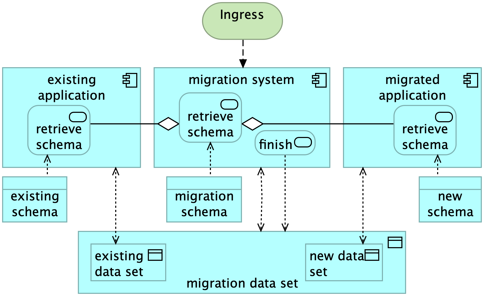

# Future plans

## Summary
Our goal is to make it fast and easy to build and maintain large information systems.
You know, the ones that tend to cost millions in projects that spin out of control and sometimes end in disaster.
For this to happen, we must overcome every single impediment.
But our quaest is shaping up. Already we can generate complete prototypes and do interesting stuff with them.

This chapter discusses our plans for the near future. Click on the hyperlinks for details

## Current State

To understand future developments, you may want to know where we stand now.


One purpose of Ampersand is to generate a web-application. Currently, the generator and the generated application follow this architecture:


The architecture is explained in more detail in [this chapter](./reference-material/architecture-of-an-ampersand-application).

## Low-code Ampersand
   The current RAP tool requires users to write Ampersand code in Ampersand syntax.
   The Atlas, which is part of RAP, then shows all concepts, relations and rules in a nice interface.
   We want to make the atlas interactive, so that users can manage their specifications directly in the Atlas instead of writing Ampersand code.
   We want them to deploy their specification directly from the Atlas.

### Purpose
   To make Ampersand more accessible to a wider audience, we want to create a low-code    version of Ampersand.

## Schema-Changing Data Migration
   Ampersand compiles and deploys a specification into a functional information system.
   However, it lacks support for data migration, so it is less useful for maintaining information systems.
   Only if an upgrade can be done by re-generating the entire system, Ampersand is useful.
   But when existing production data needs to be preserved, re-generation is not always an option.
   Especially for increments that alter the system's schema in production,
   developers must manually migrate the data, which is error-prone and time-consuming.
   This can inhibit a steady pace of releases and it inevitably involves down-time.
   Consequently, schema-changing data migrations often face challenges, leading developers to resort to manual migration or employ workarounds.

### Purpose
   To address this issue, we want Ampersand to support schema-changing data migration.
   We aim to generate migration scripts for automating the migration process, as described in Joosten\&Joosten, Data Migration under a Changing Schema in Ampersand, in: Proceedings of Relational and Algebraic Methods in Computer Science (RAMiCS), Prague, 2024.



   The overarching challenge is to preserve the business semantics of data amidst schema changes, under the condition of zero downtime.
   We plan to do this as a [project](https://github.com/orgs/AmpersandTarski/projects/12?pane=info) in the A-team.
   By solving this problem we can increase the frequency of releases in the software process.

## NoSQL storage
The current architecture builds on an SQL database, using MariaDB (formerly known as MySQL)
Instead of storing data to an SQL database only, we want to other types of databases to work with Ampersand as well.
Especially NoSQL databases \(e.g. triple stores, graph databases, persistent event streaming\) seem very suited for Ampersand.

This enhancement will gain traction when some party (e.g. a database vendor) sees benefits in this research and is willing to sponsor it (either in kind or in cash).

### Purpose
The problem is that modern persistent stores come in many sorts and shapes.
There are triple stores, graph databases, persistent event streaming, to name but a few technologies that have conquered the landscap of persistent data. We want Ampersand to link up with such technologies to serve a wider spectrum of problems.
We also want to experiment with the performance of different storage types, do research in optimization algorithms, connect to existing datasets and so on.

Ampersand is already prepared for this by the plug-mechanism.
So, this is an enhancement rather than a refactoring.


## API documentation
We want to generate documentation of the (generated) API to make it more useful in real life.
This addresses a real problem. If we generate a prototype that works together with other application components,
we need to communicate with other teams to get things done.
This communication will be greatly simplified if Open API documentation can be generated.
### Purpose
To take an API in production, it needs to be documented. For this purpose we want to generate Open API documentation.


## OWL and RDFS input
To work closer in sync with the semantic web we want to accept OWL and RDFS input. Currently Ampersand accepts only Ampersand-syntax, Archimate files, and Excel as input.
### Purpose
To work closer together with the semantic web community requires that Ampersand can deal with OWL and RDFS.
Ampersand and semantic web technologies have much in common. To explore this topic and to benefit from available ontologies expressed in RDF and OWL, we want to make an OWL/RDFS parser so we can interpret ontologies in Ampersand.


## Allow GraphQL on the back-end
GraphQL and Ampersand share the theory of triples. This makes it obvious to build an API that speaks GraphQL.

### Purpose
Ampersand is still linked to classical database applications.
To increase its appeal to the NoSQL-community, it is nice to allow GraphQL applications to tap into information systems that are generated by Ampersand.

## Data grid interface
Users who frequently import spreadsheets into Ampersand often want to edit and display that data in an excel-like fashion.
For now, `<TABLE>` is the closest fit, but the result lacks the user experience of spreadsheets.
This is a common problem with many implementations.
If the Ampersand interface could somehow mimic spreadsheet features, that would greatly enhance the usability of prototype. We're talking about features such as sorting and filtering, compact overviews with lots of cells, moving rows and columns, editing in cells (restrained by the CRUD regime).
If only the user of an Ampersand prototype could edit data as easily as in a spreadsheet...

This feature is [discussed on github](https://github.com/AmpersandTarski/Ampersand/issues/1166).

## Kleene operators `+` and `*`.
To increase the expressive power of Ampersand, we would like to expand the language to include terms of the form `<term>+` and `<term>*`.

In order to do this, we must precompile rules that contain a Kleene operator to rules without such operators.
This is possible by introducing a new relation and a new rule for every term `t*`.
Assuming that the term `t` has type `[A*B]`,
the compiler must add the following code:
```Ampersand
RELATION rel-t-plus[A*B]
RELATION rel-t-plus[A*B]
RELATION rel-t-minus[A*B]
ENFORCE rel-t-plus >: t;rel-t-plus
ENFORCE rel-t-star >: I\/rel-t-plus
ENFORCE
```
Then, the compiler must substitute every occurrence of `t+` by `rel-t-plus`
and every occurrence of `t*` by `rel-t-star`.

This solution has one problem: if `t` shrinks, even by one pair, `rel-t-plus`
and `rel-t-star` must be made empty.
