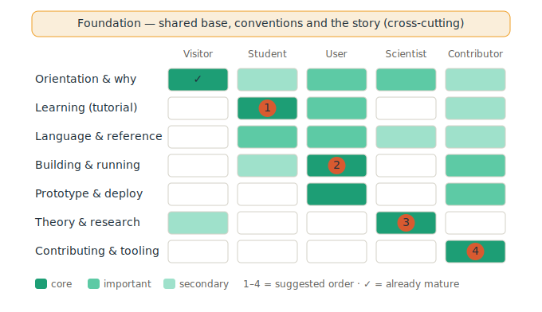

This page explains how the Ampersand documentation is put together and why. It describes the documentation as we intend it to be: the system that produces the site, the way the content is organised, the design choices behind that organisation, and the model we use to grow and maintain it over time. It is meant for anyone who writes documentation, reviews it, or wants to understand the structure before changing it.

## One site, many sources

The documentation is a single Docusaurus website, published at [ampersandtarski.github.io](https://ampersandtarski.github.io/). The content of that site does not live in the site repository. It is assembled at build time from the `docs/` folders of the source repositories: Ampersand for the language and compiler, Prototype for the prototype framework, and RAP for the project environment. The site repository, AmpersandTarski.github.io, holds the Docusaurus configuration and the build pipeline that brings those sources together.

The choice behind this is co-location: documentation lives in the same repository as the code it describes. Someone who changes the compiler updates the Ampersand documentation in the same pull request. Someone who changes the prototype framework documents it in the Prototype repository. The site then merges these sources into one coherent whole. Co-location keeps documentation close to the code, so the two evolve together and are reviewed together.

Each source repository owns its own slice of the navigation through a `docs/sidebar.js` file that exports sidebar fragments. The site's main `sidebars.js` stitches these fragments together into the menu the reader sees. This keeps responsibility where the knowledge is and prevents one central file from becoming a bottleneck.

## How the content is organised

The reader meets the documentation through two layers. The first layer is a set of landing pages, one per audience. The second layer is a Diátaxis structure that organises the actual content.

Diátaxis distinguishes four kinds of documentation: tutorials, how-to guides, reference, and explanation. The Ampersand site applies this as four areas. *Introduction* holds the audience landing pages. *Theory & background* holds the explanation: the ideas behind Ampersand and its scientific grounding. *Guides* bundles tutorials and how-to instructions from all repositories. *Reference materials* holds the reference: syntax, language constructs, and architecture. The value of this separation is that the reader always knows what kind of page to expect, and the writer always knows where a new page belongs.

The landing pages sit on top of Diátaxis as a routing layer. Ampersand attracts very different readers, from a student who wants a single tutorial to a scientist who wants the relation-algebraic foundation. The introduction asks the reader which curiosity fits best and then sends each reader to the entries that serve that curiosity.

## The five audiences

The documentation serves five audiences, defined in the landing pages of the Ampersand repository.

The *interested visitor* wants to know who uses Ampersand and why. The *student* wants to learn how to use Ampersand and build a first prototype. The *user* wants to build, run, and maintain a real information system. The *scientist* wants the research, the publications, and the theory behind the method. The *contributor* wants to change Ampersand and needs the project structure, the tools, and the contribution workflow.

The introduction is explicit about one audience it does not serve: someone who hopes Ampersand is a ready-made solution that solves problems without effort. Ampersand rewards those who make the effort to learn it, and the introduction says so plainly.

## The design choices, and why

Three choices shape the documentation, and one honest principle explains its character.

The first choice is co-location of documentation with code, so that documentation and code evolve and are reviewed together. The second is the audience-first entry, because the readers of Ampersand differ so widely that a single front door would serve none of them well. The third is the Diátaxis organisation, which keeps tutorials, reference, and explanation apart so that each page has one clear job.

These choices have a history. The documentation began as a GitBook. It was later migrated to Docusaurus, which gave the project per-repository sidebars, a tested build, and the audience-and-Diátaxis structure described above. The migration is the reason the current structure exists in the form it does.

Behind all of this stands a principle from the Ampersand design considerations: *working systems over comprehensive documentation*. Every Ampersand script that compiles yields a working system, which makes it easy to demonstrate progress through software rather than through documentation. This principle is honest about a tension. It makes working software the priority, and it makes documentation easy to postpone. Naming this tension is part of the architecture, because it explains why documentation needs a deliberate model to stay healthy. That model is the subject of the next section.

## How we grow and maintain the documentation

We organise the work as a matrix. The rows are the five audiences. The columns are the shared topics where audiences overlap, such as learning, language reference, and building. A cell expresses how central a topic is for an audience. The matrix lets us serve audiences in a visible way while editing shared content only once.

The model has four layers. A *foundation* comes first and cuts across everything: the shared backbone content that several audiences depend on, the writing and structure conventions, and this story itself. On top of that, the *audience* sets the course, because completing an audience's journey is the most visible kind of progress. The *topic* is the unit we actually edit, so that one improvement feeds every audience that shares it. The *repository* is the boundary where edits land and where pull requests are scoped.

In practice we walk the matrix along a diagonal. We begin with the audience whose journey gives the most visible gain and make the shared topics that journey needs correct and complete. Because those topics are shared, finishing one audience already advances the next. Working the student journey strengthens the language reference that the user also needs; finishing the user journey then only has to add building and deployment. The scientist's theory block can be done as a largely self-contained step once the main line stands. Each step delivers something a real reader notices.

## Where this fits

This page is part of the published documentation and belongs to the contributor's path. Two companion resources complete the picture. The build and deployment details, including the local test workflow, live in the [README of the site repository](https://github.com/AmpersandTarski/AmpersandTarski.github.io/blob/main/README.md). The practical workflow for adding or changing a page is described in [Documenting Prototype Framework Changes](../../prototype/guides/documenting-prototype-changes.md). Together they cover the how and the why of the Ampersand documentation.
