# Several information systems that use each other

One Ampersand script describes one information system: a context,
with one database and one application.
Many real situations involve more than one system.
A municipality that issues permits looks up its applicants in a population register that another organisation keeps.
A new version of a system has to take over the data of the version it replaces.
In both situations each system has its own database and its own rules,
and one system uses what the other one stores.

Ampersand lets you describe such a situation in one specification.
A context can include another context,
and it then sees everything that the other context declares and stores.
This guide shows how that works, with an example that you can run.
It assumes that you have written a script with relations and rules before,
for instance in the [tutorial](../tutorial-rap4.md).
The exact rules are in the reference,
under [Systems of contexts](../reference-material/syntax-of-ampersand.md#systems-of-contexts).

## Two contexts

The example has a population register and a permit system.
The register is a script of its own, `registry.adl`.
It knows nothing of permits.

```text
CONTEXT Registry IN ENGLISH

RELATION name[Person*Name] [UNI,TOT]
RELATION address[Person*Address] [UNI]

POPULATION name[Person*Name] CONTAINS
  [ ("p1", "Peter")
  ; ("p2", "Melissa")
  ]
POPULATION address[Person*Address] CONTAINS
  [ ("p1", "Main Street 1")
  ]

INTERFACE Persons : "_SESSION";V[SESSION*Person] cRud BOX
  [ "name" : name cRUd
  , "address" : address cRUd
  ]
ENDCONTEXT
```

The permit system is a second script, `permits.adl`.
Every permit has an applicant, and an applicant is a person in the register.

```text
CONTEXT Permits INCLUDES Registry FROM "registry.adl"

CONTEXT Permits IN ENGLISH

RELATION applicant[Permit*Registry.Person] [UNI,TOT]
RELATION address[Permit*Address] [UNI]

POPULATION applicant[Permit*Registry.Person] CONTAINS
  [ ("permit1", "p1")
  ; ("permit2", "p2")
  ]
POPULATION address[Permit*Address] CONTAINS
  [ ("permit1", "Harbour Road 12")
  ]

RULE located : applicant |- applicant;Registry.address;Registry.address~
MEANING "Every applicant has a home address in the register."
ROLE Clerk MAINTAINS located

INTERFACE Permits FOR Clerk : "_SESSION";V[SESSION*Permit] cRud BOX
  [ "applicant" : applicant;Registry.name cRud
  , "site" : address cRUd
  , "home address" : applicant;Registry.address cRud
  ]
ENDCONTEXT
```

The first line is new.
`CONTEXT Permits INCLUDES Registry FROM "registry.adl"` says that the context `Permits` includes the context `Registry`, which is to be found in the file `registry.adl`.
The statement stands outside the block `CONTEXT … ENDCONTEXT`,
because it says something about two contexts.

From that line on, the script of `Permits` can use what `Registry` declares.
It does so by writing the name of the included context in front, with a dot:
`Registry.Person` is the concept `Person` of the register,
and `Registry.address` is the relation that gives a person a home address.
We call `Registry.` a prefix.

## Why the prefix is there

Both scripts have a relation called `address`, and both have a concept called `Address`.
They mean different things.
In the register, an address is where a person lives.
In the permit system, it is the site that a permit is about.
The two authors chose their names independently, as authors of two systems do.

The prefix keeps the two apart.
`address` in the script of `Permits` is the relation of `Permits`,
and `Registry.address` is the relation of the register.
So, a name without a prefix always belongs to the context in which you write it.

That has a consequence which is easy to overlook.
If you write `Person` in the script of `Permits`, you get a new concept of `Permits`,
which has nothing to do with the persons of the register.
The compiler then reports that the two do not fit:

```text
Cannot match the signatures on the left and right of the composition.
  The target of applicant, which is Person, should be equal to (or share a concept with)
  the source of Registry.name, which is Registry.Person.
```

A misspelled name behind a prefix is reported as well,
because the compiler knows what the included context declares:

```text
The name Registry.Persn does not denote a concept.
      The context Registry has no concept Persn.
```

## Checking the system

You compile the system as you compile any script.

```bash
ampersand check permits.adl
```

The compiler reads `permits.adl`, finds the inclusion, and reads `registry.adl` too.
It checks the types across both contexts.
The register can still be compiled by itself with `ampersand check registry.adl`,
and the result is the same as before: being included changes nothing for the included context.

## One context, one database

Every context has a database of its own and an application of its own.
Each fact is stored once, in the database of the context that declares it.



The pairs of `applicant` are in the database of the permits,
and the pairs of `Registry.address` are in the database of the register.
The term `applicant;Registry.address` therefore reads two databases.
You do not have to arrange that: the compiler generates it.

This is the difference with the `INCLUDE` statement that you may know.
`INCLUDE "file.adl"` brings in the text of a file,
which becomes part of your own context and of your own database.
`CONTEXT A INCLUDES B` leaves `B` what it is: a context with a database of its own,
which `A` can see.

## A rule about somebody else's data

The rule `located` says that every applicant has a home address in the register.
It is a rule of `Permits`, and it depends on a relation of `Registry`.

Person `p2` has no address in the register, so permit `permit2` violates the rule.
The script assigns the rule to the role `Clerk`, so the violation is a signal:
a clerk sees it and has to do something about it.

There is a reason why this rule is not an invariant.
An invariant is a rule that an application keeps satisfied by refusing every change that violates it.
The permits application can refuse a change of its own data.
It cannot refuse a change in the register:
somebody at the register can remove the address of an applicant,
and the register does not know that `Permits` has a rule about it.
So, a rule that depends on data of another context is a rule for a role,
which signals its violations.

The opposite direction is safe.
The rules of the register hold in the register, whoever includes it.
The permit system can rely on them: every person it sees has a name,
because the register requires that.

## Running the system

The command `ampersand deploy` generates what you need to run both applications.
It is part of the compiler from the release in which the [release notes](https://github.com/AmpersandTarski/Ampersand/blob/main/ReleaseNotes.md) announce systems of contexts,
and it needs a prototype framework of the same generation.

```bash
ampersand deploy permits.adl --output-dir deploy
```

It writes a directory with a compose file, a Dockerfile for every context,
and a script that installs the applications.
The file `README.md` in that directory lists the contexts, their databases and their ports.

```bash
cd deploy
docker compose up -d --build
./install.sh
```

The first command builds and starts one application per context, next to one database server.
The second one installs the applications, the register first,
because the permit system reads its tables.
After that, the permit system answers on `http://localhost:8080` and the register on `http://localhost:8081`.

Try the following to see the two systems work together.

1. Open the permit system and look at the permits.
   Permit `permit2` is signalled, because Melissa has no home address.
2. Open the register and give Melissa an address.
3. Go back to the permit system.
   The home address of the applicant is there,
   and the signal is gone as soon as the application has evaluated its rules again.

You changed the data in one system and saw it in the other, while each fact is stored once.

The names of the databases and the ports are in the file `.env.example` of the generated directory.
Copy it to `.env` to change them.
The section on [`ampersand deploy`](../the-command-line-tool.md#deploy) describes every generated file.

## More than two contexts

A context can include several contexts, and an included context can include others.

```text
CONTEXT Permits INCLUDES Registry FROM "registry.adl", Towns FROM "towns.adl"
```

Three things are worth knowing when a system grows.

A context sees the data of every context it reaches, also in two steps.
If the register includes a context `Towns`, the permit system sees the towns,
because a relation of the register refers to them.

A prefix is the name of a context that your own context includes.
To write `Towns.Town` in the script of `Permits`, you state that `Permits` includes `Towns`.
That costs one line and no extra database:
it is the same context `Towns` that the register includes.

A context that two contexts include is still one context.
If the register and a system for shops both include `Towns`,
the town in which a person lives and the town of a shop are atoms of the same concept,
in the same database.

Inclusion has no cycles.
A context cannot include itself, directly or by way of another context.
That is what makes it possible to deploy a context without the contexts that include it.

## Two contexts with the same name

Sometimes two included contexts carry the same name.
The usual case is a migration: the existing system and the desired system are two versions of one context.
The prefix would then not tell which one you mean, so the compiler asks for an alias.

```text
CONTEXT Migration INCLUDES Kurk FROM "existing.adl" AS old,
                           Kurk FROM "desired.adl" AS new
```

An alias is a second name for an included context.
In the script of `Migration`, `old.r` is the relation `r` of the existing system and `new.r` is the relation `r` of the desired system.
You can give an alias to any included context, for instance to shorten a long name.

## Migrating data to a new version

A migration shows what the mechanism is for.
Suppose a system `Kurk` is in production, with a relation `r[A*B]`.
The new version requires that every `A` is paired with a `B`.
The data in production does not satisfy that: some atoms of `A` are paired with nothing.

The desired system simply states its rule.

```text
CONTEXT Kurk IN ENGLISH
RELATION r[A*B] [UNI]
RULE totalR : I[A] |- r;r~
ENDCONTEXT
```

The migration is a third context, which includes the existing system and the desired system.

```text
CONTEXT Migration INCLUDES Kurk FROM "existing.adl" AS old,
                           Kurk FROM "desired.adl" AS new
CONTEXT Migration IN ENGLISH

CLASSIFY old.A ISA new.A
CLASSIFY old.B ISA new.B

RELATION copyR[old.A*old.B]
ENFORCE copyDone : copyR >: new.r /\ old.r
ENFORCE copy : new.r >: old.r - copyR

ROLE User MAINTAINS new.totalR
ENDCONTEXT
```

Each part of this script does one thing.

- The concepts `old.A` and `new.A` are different concepts,
  because they belong to different contexts.
  `CLASSIFY old.A ISA new.A` says that every `A` of the existing system is an `A` of the desired system.
  The migration application brings the atoms across.
- The two `ENFORCE` rules copy the pairs of `r` from the existing system to the desired one.
  The relation `copyR` remembers what has been copied,
  so that a pair which a user removes is not copied again.
- `ROLE User MAINTAINS new.totalR` assigns the new rule of the desired system to a role.
  In the migration context the rule is then a signal that shows users what they have to repair.
  In the desired system it remains an invariant.

The last line is the heart of the migration.
The data that arrives from the existing system violates the new rule,
so the rule cannot be enforced yet.
The migration context relaxes it, and the rule hardens again as the work proceeds:
the violations that the application found can only disappear,
so a violation that a user has repaired cannot come back,
and a new atom has to satisfy the rule from the start.
When the last violation is repaired,
the desired system satisfies its own invariant on its own database,
and it can be taken into use as it is.

The existing system keeps running during all this.
The migration reads its database and never writes in it.
The script of the desired system contains nothing that serves the migration.

This is the method of *Data Migration under a Changing Schema in Ampersand* (Joosten and Joosten, RAMiCS 2024).
The reference describes [how a relaxed invariant hardens](../reference-material/syntax-of-ampersand.md#rules-classifications-and-writing).

## When a context writes in another database

A context reads the databases of the contexts it reaches.
It writes in the database of an included context in two cases, both of which occur in the migration.

- An `ENFORCE` rule of your context on a relation of the other context adds pairs to that relation,
  as `copy` does with `new.r`.
- A `CLASSIFY` statement whose generic concept belongs to the other context adds atoms to that concept, as `CLASSIFY old.A ISA new.A` does.

Everything else stays with its owner.
A `REPRESENT` statement belongs in the context that declares the concept,
and the interfaces of a context are the user interface of its own application.

## What the compiler tells you

| What you wrote | What the compiler reports |
| --- | --- |
| A name of the included context without its prefix, such as `Person` | A type error, because `Person` is a new concept of your own context. |
| A misspelled concept behind a prefix, such as `Registry.Persn` | "The context Registry has no concept Persn." |
| A misspelled relation behind a prefix, such as `Registry.adress` | "Undeclared relation Registry.adress". |
| A prefix that follows two inclusions, such as `Registry.Towns.Town` | "The context Registry has no concept Towns.Town." Include `Towns` yourself and write `Towns.Town`. |
| Two included contexts with the same name and no alias | The compiler asks you to add `AS` and an alias to each. |
| A context that includes itself, directly or indirectly | The compiler shows the cycle. |
| An included context that no name in your script refers to | A warning: the inclusion is not used. |

## Summary

- `CONTEXT A INCLUDES B FROM "file"` lets context `A` use what context `B` declares and stores.
- A thing of `B` is written in `A` with the prefix `B.`, or with an alias if you gave one.
- Every context has one database and one application.
  Each fact is stored once.
- A rule over data of another context is a rule for a role.
- `ampersand deploy` generates the files to run all applications together.
