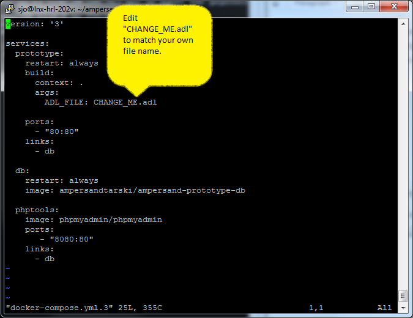

# Deploying your Prototype

## What do you need to understand?

We use a [docker-platform](https://en.wikipedia.org/wiki/Docker\_\(software\)) to run your Ampersand program on virtually any computer. So go ahead and [install docker](https://docs.docker.com/install/) if you don't already have it. You provide (once) a recipe for building (Dockerfile) and a description of the configuration (docker-compose.yml). We'll provide examples for you to adapt.

1. Your Ampersand prototype will run in a [container](https://www.docker.com/resources/what-container), which is a virtual machine.
2.  The container is started and stopped by `docker-compose`, which uses a[ docker-image](https://docs.docker.com/get-started/#images-and-containers)

    &#x20;that is built with your Dockerfile and deployed with your docker-compose.yml file.
3. [Run](https://docs.docker.com/engine/reference/run/) your image from your [command-line](https://en.wikipedia.org/wiki/Command-line\_interface), using the command `docker-compose up -d`. You can verify that it runs with `docker ps`.
4. Access your application through your browser, using \<TODO: Which URL?>

Please watch [this video](https://youtu.be/XqHTJfTVnoQ) (8 minutes) to see what Docker does to bring up your Ampersand program as a web application on your own machine.

## What do you need up front?

You need a computer that runs Docker and that has an internet connection. That lets you generate a Docker image from your Ampersand source code. Then run your program on Docker on localhost.

## What do you do to run your Ampersand program?

First, you create a directory in which you will organize your Ampersand (.adl) files and some other stuff. We will refer to this directory as your working directory. In this working directory, make sure you have:

1. A file called `Dockerfile`, which contains the recipe for creating a Docker image
2. A file called `docker-compose.yml`, which contains the runtime configuration of the containers running your program.
3. The source code of your Ampersand program, as specified in `Dockerfile` and `docker-compose.yml.`

Then from you command line interface run:

`docker-compose up -d`

Sit back and watch. Don't worry, the second time around Docker downloads much less as it builds up its local image repository.

## Deploying

The deployment consists of the following steps:

1. Copy your `.adl`-file to a working directory on your server. &#x20;
2.  Get two docker-files from internet by executing the following commands:

    ```
     wget https://raw.githubusercontent.com/AmpersandTarski/Ampersand/feature/dockerize/docker/sample/Dockerfile
     wget https://raw.githubusercontent.com/AmpersandTarski/Ampersand/feature/dockerize/docker/sample/docker-compose.yml
    ```

    On servers other than Linux, you may need another command than `wget`, but the files are the same.
3.  In the file called

    `docker-compose.yml`

    you must specify your own

    `.adl`

    \-file:

    
4.  Run docker-compose to deploy your prototype by executing the following command:

    ```
     docker-compose up
    ```

    Alternatively, if you want your prototype to keep running after you have closed your CLI, execute:

    ```
     docker-compose up -d
    ```
5. Browse to the web-location `my.server.com`, where the prototype is being served.

## Redeploying

After you deploy the first time, you may want to edit your program. Just save the results and redeploy with the command:

```
docker-compose up -d --build
```

If you want to see which images are stored on your local computer, type

```
docker images
```

## In trouble?

* Check if there is a firewall that blocks the port from internet. Make sure that port 80 is open for http-traffic.
* Check the port settings and adapt `docker-compose.yml` if you must use a port other than port 80.
* Use a recent browser. We have developed Ampersand on FireFox and tested it on FireFox and Chrome, so you should be fine with one of these two.
* If you have trouble with the database (e.g. you cannot login, or do not have the correct authorization), check out the [instructions](installing-the-tools-manually.md) for creating a properly authorized user `ampersand` for the database. As you can see in `docker-compose.yml`, the database itself is accessible through port 8080.
* It is a good idea to deploy your webapplication to localhost for testing. However, if you use a subdomain (e.g. my.ampersand.app.localhost) you will find that your `hosts`-file does not support wildcard redirection. You can do this by installing a local dns server (details on [http://passingcuriosity.com/2013/dnsmasq-dev-osx/](http://passingcuriosity.com/2013/dnsmasq-dev-osx/))
