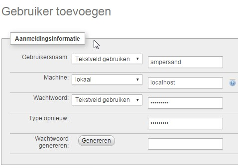

# Installing the tools manually

1. All graphical output is created using [**GraphViz**](http://www.graphviz.org/). You need to install it. **Make sure** _**dot**_ **and** _**neato**_ **are in your path**  (set the $PATH environment variable if necessary). Also, if you compile it from source, make sure you install it with gts support.
2. There are several formats that you can generate a functional specification document in. Currently, the best results can be obtained in [docx ](https://www.lifewire.com/docx-file-2620750)or [LaTeX (PDF)](https://en.wikipedia.org/wiki/LaTeX). Depending on your taste, you need appropriate software:
   1. For docx, you could of course use Microsoft Word, but there are [other options](https://www.maketecheasier.com/open-docx-file-without-microsoft-office/) as well.
   2. If you want to generate PDF files, using LaTeX, you need a LaTeX compiler. On Windows, we recommend [**MiKTeX**](http://miktex.org/). On Linux and MacOS, we recommend [**texlive**](https://www.tug.org/texlive/).

Ampersand models are written as source code files. Hence, you need a text editor in which you can do so. We recomend [Visual Studio Code](https://code.visualstudio.com/docs/setup/setup-overview), which has [a nice extention for Ampersand scripts](https://marketplace.visualstudio.com/items?itemName=AmpersandTarski.language-ampersand). You could however use any text editor that you are familiar with, as long as you make sure it saves files as [UTF8 ](https://en.wikipedia.org/wiki/UTF-8)format.

## Installing an Ampersand compiler

The following instructions presume that you are familiar with the basics of your own computer.

### The easy way: Use a prebuilt executable file

The easiest way is by use of available executables. We release frequently. Have a look at [our latest release](https://github.com/AmpersandTarski/Ampersand/releases). For Windows users, there is a file called ampersand.exe in the release. Put it on your disk on a location of your choice, for example /Ampersand/bin/. Make sure [your `$PATH`(or: `PATH`) environment variable contains this location](https://www.google.com/search?q=setting+your+path+variable), so the command "ampersand" is known on the command line. That's all. Note that double-clicking`ampersand.exe`will not work, because it is a command line tool.

Here is a way to test whether or not you have succeeded: open a command line tool (e.g. `CMD` on Windows), and type `ampersand -v`. If all is well, the version number of the Ampersand tool is output.

Now you can compile and check your Ampersand scripts. However, you are likely to want to do more with such scripts. Currently it is possible to generate functional specifications and/or functional prototypes from such scrips. You will need to install some additional software in order to do that.

### Additional software for generating functional SPECIFICATIONS:

If you want to generate functional specifications from ampersand scripts, you need the following additional software (if you don't, don't bother installing them):

1. In order to generate PDF files that contain your functional specification, you need a LaTeX compiler. On Windows, we recommend [**MiKTeX**](http://miktex.org/). On Linux and MacOS, we recommend [**texlive**](https://www.tug.org/texlive/).
2. All graphical output is created using [**GraphViz**](http://www.graphviz.org/). You need to install it. **Make sure** _**dot**_ **and** _**neato**_ **are in your path**  (set the $PATH environment variable if necessary). Also, if you compile it from source, make sure you install it with gts support.

### Additional software for generating functional PROTOTYPES

If you want to generate functional prototypes from ampersand scripts, you need the following additional software (if you don't, don't bother installing them):

1. In order to run the generated prototype, you need **Apache** (or another web server) with **SQL** and **PHP v 7.1 or higher**. In Windows, a practical way is to install [**XAMPP**](https://www.apachefriends.org/download.html)
   *   You must create an account in SQL for

       `localhost`

       , that has a user called

       `ampersand`

       with a password

       `ampersand`

       , with rights to create/read/update/delete databases as well as their contents. If you use phpmyadmin this could look like:

       
   * The webserver must run on `localhost` . By default you will use port 80, but you could change that if required. See the documentation of you webserver.
2. You will also need to install [**Composer**](https://getcomposer.org/download/), because at runtime, the prototype has dependencies of libraries . Composer will take care of that.

### The less easy way: Installing from Source

If there is no executable for your operating system, or if you prefer to build an Ampersand compiler yourself, follow these steps:

> 1. Install stack, the haskell tool stack. [instructions are here](http://docs.haskellstack.org/en/stable/install\_and\_upgrade.html)
> 2. use [git](https://git-scm.com/) to clone the latest version of Ampersand. The code can be found at [github](https://github.com/AmpersandTarski/Ampersand/tree/master). (the master branch is our stable branch)
> 3. Open a command line terminal, and go to the directory that contains the file named `ampersand.cabal`
> 4. Then, close your command line terminal and reopen another one (this helps to reload the environment variables that the `stack` installation may have added or modified),&#x20;
> 5.  Let `stack` install everything you need to compile (see the Notes below!) by executing:
>
>     `$ stack setup`
> 6. Build the Ampersand.exe file (see the Notes below!) by executing: `$ stack install`

This will build an Ampersand-compiler named "ampersand.exe" and install it into your path.

Testing your installation

* Open a [command prompt](http://www.c3scripts.com/tutorials/msdos/open-window.html).
*   Type "Ampersand --version". The expected behaviour is that Ampersand replies with the version of Ampersand. It will look something like:

    ```
    C:> ampersand.exe --version
    Ampersand v3.1.0[master:2fa348f*], build time: 08-Sep-15 14:04:58 West-Europa (z
    omertijd)
    ```

    The version number is important to specify, whenever you have a question of like to report an issue. It **really** helps us when you add the version number, **including everything between the brackets** when you contact us.

## Test to see if you can build your first prototype

Ampersand allows you to generate a working prototype of your ampersand model. An Ampersand prototype is a website that requires a webserver to run on and a (My)SQL database server. This chapter describes the prerequisites for getting such prototypes up, and running.

First, you should get a working script. Let's assume it is called `myModel.adl` and it contains valid content such as is shown here below:

```bash
CONTEXT HelloWorld IN ENGLISH
PURPOSE CONTEXT HelloWorld
{+This script allows you to check whether or not you can actually use Ampersand.+}

REPRESENT MyName TYPE ALPHANUMERIC
sessionMyName :: SESSION * MyName [UNI]
MEANING "My name can be known in the current session."

ROLE User MAINTAINS "Please click on 'Registration' to specify your name"
RULE "Please click on 'Registration' to specify your name": "_SESSION"[SESSION] |- sessionMyName;sessionMyName~
VIOLATION (TXT "You can find the 'Registration' item in the navigationbar (top of the screen).")

INTERFACE Registration: "_SESSION"[SESSION] cRud ROWS
   [ "My name is" : sessionMyName cRUd 
   ]

sayHelloReq :: SESSION * SESSION [PROP]
ROLE ExecEngine MAINTAINS "Say hello when name is specified"
RULE "Say hello when name is specified": "_SESSION"[SESSION] /\ sessionMyName;sessionMyName~ |- sayHelloReq
VIOLATION (TXT "{EX} SetNavToOnCommit;/Hello_44__32_World"
          ,TXT "{EX} InsPair;sayHelloReq;SESSION;", SRC I, TXT ";SESSION;", TGT I
          )

INTERFACE "Hello, World": "_SESSION"[SESSION] cRud ROWS
   [ "Hello, world. My name is" : sessionMyName cRud
   ]

ENDCONTEXT
```

Don't worry if you do not understand what everything in this script means. That isn't important for now.

If you do not have such a script, you can copy the above text, paste it in a text editor and save it. Different novice users have shown that this may present some problems. One is that in some browsers (e.g. IE), copying the text will include the line numbers. If you see your file has line numbers embedded in the text, you should get rid of them before saving it. Another one is that it may contain characters that are not displayable in the editor - some editors will turn such characters into printable ones, e.g. a question mark. If that's the case with you, you should also get rid of them. You should end up with text in a file that is as is shown above.

Then, you can generate the prototype website for the script in file `myModel.adl` by typing the command:

```
 ampersand --proto myModel.adl
```

This creates a directory `myModel.proto` (in the current directory), that contains the prototype website. Obviously, you will need a web server and a database server to run the prototype. This is discussed at [Installing Ampersand](installing-the-tools-manually.md).

Usually, you would have some demands regarding particulars of the generation. For example, you may want to generate the website in a specific directory, specify a particular CSS file for this website, etc. For the complete syntax of the Ampersand executable, see the chapter about the [command line interface](../the-command-line-tool/)\*\*\*\*

**Notes:**\
1\. Do **not** use Hackage to get ampersand. It does not contain all non-haskell files. (See [issue #213](https://github.com/AmpersandTarski/ampersand/issues/213))\
2\. `stack` memory usage may require other applications to be terminated (e.g. on 8GB Windows systems). If `stack` terminates prematurely, re-invoking the command will pick-up where it stopped.\
3\. `stack` may terminate on various errors [(See this issue)](https://github.com/commercialhaskell/stack/issues/2617), e.g. that it doesn't have permission to access or rename files. Again, if `stack` terminates prematurely, re-invoking the command will pick-up where it stopped. Users have mentioned having to restart `stack` several times before it would finally complete building Ampersand.exe.

#### Footnotes
