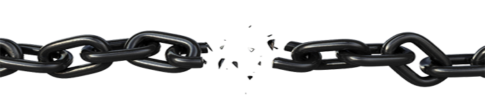
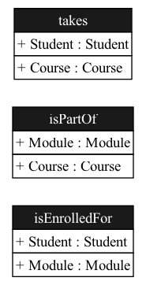

# Conceptual modeling
We use the Ampersand language to make domain models.
A domain model is a conceptual model of a domain.
It is a representation of the domain's concepts, relationships, and constraints. It is a way to describe the structure of a domain, the business processes that take place within it, and the rules that govern it.

We use the terms "conceptual model" and "domain model" interchangeably because we will always apply this technique to a specific domain.

## Why bother?

Domain modeling is used for various purposes:

1. To explore unknown domains. The act of making domain models is an efficient way to familiarize yourself with a new domain and to unravel jargon.
2. To define the boundaries of individual services. A domain model should make these boundaries clear, to develop components as independently as possible.
3. To avoid misunderstandings over terminology in a project with multiple stakeholders. A terminology list does not always suffice in practice. A domain model should consolidate consensus and make misunderstandings explicit and debatable before they do harm.
4. Learning. A learner must familiarize herself with new words and specific phrases. Making a domain model improves both the speed and depth of learning.

The Ampersand way of conceptual modeling is a traditional approach where a conceptual model is built for a chosen domain. The Ampersand approach is particularly valuable when:

1. Your model needs to be interpreted by a computer to create specific useful artifacts, such as a data model, a prototype implementation, or documentation.
2. Your model has an interpretation in natural language, which you can use to standardize and unify the language of the business.

## What is a conceptual model?
A conceptual model consists of concepts and relations that describe the language structure of a domain and comprises the constraints that govern it.

|     |     |     |
| --- | --- | --- |
| Component | Description | Example |
| Concepts | The fundamental entities or ideas within a domain. | In an e-commerce domain, concepts might include product, customer, and order. |
| Relations | Relations describe how concepts are related to each other. | For example, the relation `orders` can represent facts about which customer has placed which order. |
| Language Structure | The specific vocabulary and terminology used to describe the concepts and relations. A conceptual model helps ensure consistency and clarity in how people communicate about the domain. |  |
| Constraints | Rules that govern the behavior of the domain. They specify limitations or conditions that apply to concepts and relations. | Examples of constraints in e-commerce include a product must have a name and price, and a customer must have a unique identifier (e.g., email address). |

## Example: a conceptual model in Ampersand
A conceptual model may have many different representations. Here is an example of a conceptual model in Ampersand source code:
```Ampersand
CONTEXT Enrollment IN ENGLISH

    RELATION takes[Student*Course]
    RELATION isPartOf[Module*Course]
    RELATION isEnrolledFor [Student*Module]

    RULE ModuleEnrollment: isEnrolledFor |- takes;isPartOf~

ENDCONTEXT
```
The following diagram represents the conceptual model visually. Note that this diagram does not represent the constraint:


@stefjoosten, TODO: please fix this link. It was pointing to the non-existent file `../assets/CDRuleModuleEnrollment.png`

The following diagram shows the conceptual model as a data model:



Constraints are rarely visualized in graphical representations of conceptual models.
Yet, they are an essential part of the conceptual model. They are the rules that govern the domain.

## First validation
Can your conceptual model represent facts in your domain?
This is your first step in creating a conceptual model.
The following Ampersand code represents eight facts in the domain of enrollment:
```Ampersand
CONTEXT Enrollment IN ENGLISH

POPULATION takes[Student*Course] CONTAINS
[ ("Peter", "Management")
; ("Susan", "Business IT")
; ("John", "Business IT")
]

POPULATION isPartOf[Module*Course] CONTAINS
[ ("Finance", "Management")
; ("Business Rules", "Business IT")
; ("Business Analytics", "Business IT")
; ("IT-Governance", "Business IT")
; ("IT-Governance", "Management")
]

ENDCONTEXT
```
Among others, this code represents the fact that
Peter takes the course Management and the fact that the module IT-Governance is part of two courses: Business IT and Management.

We advise strongly to invent 2-3 facts for every relation in your domain and to represent them in Ampersand code,
to verify that your relations can represent the facts you intend them to represent
.
## Steps

Here is a summary of the things you do.

1.  Start with an informal analysis of the business, defining

    1. stakeholders, such as: sales rep, student, DBA, inspector, etc.
    2. relevant areas of expertise, such as insurance, security, legal, management, etc.
    3. business functions, such as invoicing, applying for a job, computing rates, etc.

    In essence, this step yields three lists. You obtain them by studying documentation and talking to people as you scope your work.
2. Formalize concepts and relations to reconstruct the language of the business. Validate that language with your stakeholders, creating consensus over terms and phrases. Your goal is to define the smallest agreed language in which agreements can be expressed.
3.  Use this language and adapt it when needed:

    1. to generate visual representations of your domain model (letting your computer do the drawing work);
    2. to resolve language-based misunderstandings in your team;
    3. to generate a database, either for prototyping or production purposes;
    4. to define, verify and validate services that constitute your application;
    5. to audit designs;
    6. to generate documentation (letting your computer do a lot of writing);
    7. other purposes, that arise incidentally.

    In essence, this step yields a conceptual model of your domain. In some cases, however, the act of modeling is more important than having the model.
4. draw boundaries to define bounded contexts. Identify reusable patterns. Identify entities, attributes, aggregates and services for each bounded context. Assign developers, stakeholders, product-owners to develop each bounded context further.

## Informal analysis

## Formalize concepts and relations

## Use and maintain the model

## Drawing boundaries
