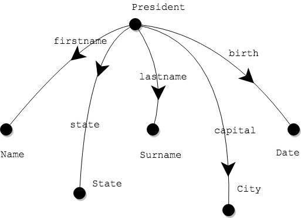
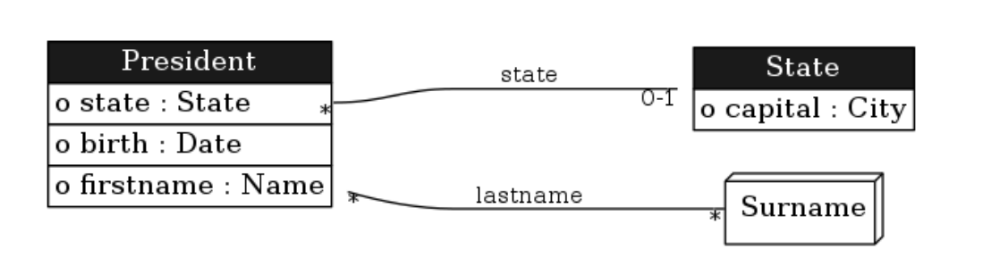

# Data modeling

When a data model serves to build an information system, it must ensure that all data that is needed in practice can be represented in the database. So you need a practical modeling technique based on actual data. By using real-life samples of data, you can decide which data elements to include or leave out in the new model and be reasonably confident that you don't leave any gaps.

In this section we will systematically extract concepts and relations based on data from a spreadsheet. The result of this analysis is an Ampersand model, which you can use to generate a data model for you.

## Example

Let us start by looking at an example:

|  | firstname | lastname | birth |
| :--- | :--- | :--- | :--- |
| 1 | Abraham | Lincoln | February 12, 1809 |
| 2 | Barack | Obama | August 4, 1961 |
| 3 | Calvin | Coolidge | July 4, 1872 |
| 4 | Dwight | Eisenhower | October 14, 1890 |

Since Ampersand works with [relations](../the-language-ampersand/relations.md), it must represent this table as relations. Three relations can do the job in the following manner:

```text
POPULATION firstname[President*Name] CONTAINS
  [ ("1", "Abraham")
  , ("2", "Barack")
  , ("3", "Calvin")
  , ("4", "Dwight")
  ]

POPULATION lastname[President*Surname] CONTAINS
  [ ("1", "Lincoln")
  , ("2", "Obama")
  , ("3", "Coolidge")
  , ("4", "Eisenhower")
  ]

POPULATION birth[President*Date] CONTAINS
  [ ("1", "February 12, 1809")
  , ("2", "August 4, 1961")
  , ("3", "July 4, 1872")
  , ("4", "October 14, 1890")
  ]
```

## Extract relations from tables

In our example, each row in the spreadsheet represents a president. So, the [source concept](../the-language-ampersand/relations.md#examples) of each relation is `President`. Each column represents a different relation. So we can use the name of each column as relation name. Then, we invent names to describe the content of each column: `Name`, `Surname`, `Date`.

When things get bigger, it is useful to draw the relations on a whiteboard or in your notebook. This helps you keep overview. Here is how it is done:

  

This drawing shows every relation als a line, drawn from source to target. The arrowhead in the middle is only to remind the reader of which is the source and which is the target concept. If you point the arrowhead from source to target, you will always know how the relation is defined.

## Adapt as needed

Suppose we have a second table, which also has information

| \[State\] | capital | president |
| :--- | :--- | :--- |
| Vermont | Plymouth | Coolidge |
| Hawaï | Honolulu | Obama |
| Kentucky | Frankfort | Lincoln |
| New York | New York | Roosevelt |
| Georgia | Atlanta | Carter |

This table is similar with respect to the interpretation of a row: here too, each row represents a president. However, the presidents aren't numbered in this table, so we have to add these numbers.

|  | \[State\] | capital | president |
| :--- | :--- | :--- | :--- |
| 3 | Vermont | Plymouth | Coolidge |
| 2 | Hawaii | Honolulu | Obama |
| 1 | Kentucky | Frankfort | Lincoln |
| 5 | New York | New York | Roosevelt |
| 6 | Georgia | Atlanta | Carter |

Numbering rows has the advantage that it is easier to recognise a president.

```text
POPULATION state[President*State] CONTAINS
  [ ("1", "Kentucky")
  , ("2", "Hawaii")
  , ("3", "Vermont")
  , ("5", "New York")
  , ("6", "Georgia")
  ]

POPULATION lastname[President*Surname] CONTAINS
  [ ("1", "Lincoln")
  , ("2", "Obama")
  , ("3", "Coolidge")
  , ("4", "Eisenhower")
  , ("5", "Roosevelt")
  , ("6", "Carter")
  ]

POPULATION capital[President*City] CONTAINS
  [ ("1", "Frankfort")
  , ("2", "Honolulu")
  , ("3", "Plymouth")
  , ("5", "New York")
  , ("6", "Atlanta")
  ]
```

Notice that this deviates slightly from the previous recipe. Instead of making a new relation `president[President*President]`, we have reused the relation `lastname`. By doing so, we have interpreted the third column of the spreadsheet as the last name of the president. More importantly, we have reused an earlier relation. The drawing can also be extended: 

There seems to be something funny about the relation `capital[President*City]`. In the model this relation pairs presidents to capital cities of the state in which they were born. This meaning can be made more obvious, by redefining one relation somewhat:

```text
POPULATION capital[State*City] CONTAINS
  [ ("Kentucky", "Frankfort")
  , ("Hawaii", "Honolulu")
  , ("Vermont", "Plymouth")
  , ("New York", "New York")
  , ("Georgia", "Atlanta")
  ]
```


Obviously, the relation `capital[State*City]` feels more natural. The reason is obvious: a capital city belongs more to the state than it belongs to a president who happens to have been born in that state.

This example illustrates that you may find "strange things" in your data samples. You can fix them as you go, as we did with the relation `capital` in this example.

So far, we have looked at relations that can be extracted from existing spreadsheet data. With some practice, you will soon learn to do larger and more realistic problems. The essence of this technique is to break down knowledge in relations, to get to the bottom of the conceptual structure.

## Add Meaning

More often than not, the meaning of data in a spreadsheet is obvious. For instance, in the relation `firstname` it hardly needs to be said that it contains the first name of each president. But it is not always that obvious. In the second example we saw that the meaning of the relation `capital[President*City]` was far from obvious. It relates a president to the capital city of the state in which he was born. There are two things we need to do about it:

1. replace a relation with a complicated meaning for a simpler one;
2. document the meaning of each relation.

The second thing, to document each relation, is necessary to ensure consensus and support. To make the meaning of every relation explicit is meant to trigger stakeholders to stand up and voice any different insights.

```text
RELATION firstname[President*Name]
MEANING "The first name of a president is registered in this relation."

RELATION lastname[President*Surname]
MEANING "The last name of a president is registered in this relation."

RELATION birth[President*Date]
MEANING "The date of birth of a president is registered in this relation."

RELATION state[President*State]
MEANING "The state in which a president was born is registered in this relation."

RELATION capital[State*City]
MEANING "The capital of a state is registered in this relation."
```

The meaning of a relation gives guidance to the reader in the way we should speak about the contents of the relation. For instance, if the pair $$(p,s)$$ is a pair from `RELATION birth[President*State]`, the reader should interpret that as "President $$p$$ was born in $$s$$."

## Add multiplicity constraints

For making a data model, you need to do one more thing: decide which relations must be constrained to unique elements. Consider for example the fact that anyone is born in at most one state. A duplicate state of birth therefore considered a mistake. President Van Buren cannot have been born both in New York and in Maine. We can impose that on a data model by stating that `RELATION birth[President*State]` must be univalent:

```text
RELATION birth[President*State] [UNI]
```

Two properties are relevant for the data model: univalent \(`UNI`\) and injective \(`INJ`\):

* Relation `r[A*B] [UNI]` means that there is at most one pair $$(a,b)$$ in the relation for every $$a$$ in `A`.
* Relation `r[A*B] [INJ]` means that there is at most one pair $$(a,b)$$ in the relation for every $$b$$ in B.
* Relation `r[A*B] [UNI,INJ]` means the relation is both univalent and injective.

We have to do this for every relation:

```text
CONTEXT Presidents

RELATION firstname[President*Name] [UNI]
MEANING "The first name of a president is registered in this relation."

RELATION lastname[President*Surname]
MEANING "The last name of a president is registered in this relation."

RELATION birth[President*Date] [UNI]
MEANING "The date of birth of a president is registered in this relation."

RELATION state[President*State] [UNI]
MEANING "The state in which a president was born is registered in this relation."

RELATION capital[State*City] [UNI,INJ]
MEANING "The capital of a state is registered in this relation."

ENDCONTEXT
```

Five decisions have been made here:

1. We will register only one first name for every president, as a result of constraining the relation `firstname` to be univalent.
2. The system may register multiple last names, as a result of not imposing any constraints on the relation `lastname`.
3. Only one date of birth will be registered, as a result of constraining the relation `birth` to be univalent
4. Only one state of birth will be registered, as a result of constraining the relation `state` to be univalent
5. Every state has only one capital city and every city is capital to only one state, as a result of constraining the relation `capital` to be univalent and injective.

Note that we can envelop the relation definition in a `CONTEXT` and run it on RAP3. Ampersand will produce the following data model: 

## Bonus

In [this video](https://youtu.be/ruO4UgjA11E) you sit in in a private lecture in Dutch on data modeling. In 32 minutes, most of the above is being discussed. It may help you to get a different perspective on the theory above.

## Assignment

1. Generate a functional specification from this script, open the generated document, and look up what your data model looks like.
2. Make a data analysis of a small problem of your own choosing; then generate a functional specification from that script.

## What have you learned?

After finishing your assignment, you have learned:

* why it makes sense to analyse actual data samples for creating a data model;
* how to analyze spreadsheet data and produce relations from it;
* why it is necessary to document meaning for each relation;
* how to constrain relations with univalence and injectivity;
* how easily mistakes are made \(by using the Ampersand compiler in the assignment\);
* how Ampersand's messages help you fix mistakes;
* how to make Ampersand create a data model based on your data analysis.

