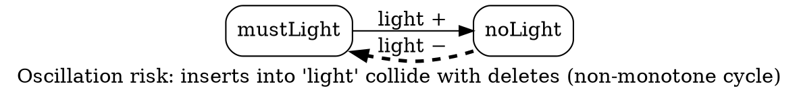

# Investigative Report: Visualizing Oscillation Cycles

> **Status: unpublished research.** This working note records literature search 2
> (see `literature_search/literature_search.csv`) and derives from it a design for a
> diagnostic visualization of oscillation cycles, to be generated by the compiler and
> used in the diagnosis chapter (`docs/guides/oscillations/README.md`).

*In-text citations use the symbolic keys `[@cite_key]`; the full reference for each key
is listed under [References](#references). Keys from search 1 (the Stage-1 report,
`making-oscillation-risk-visible.md`) are reused where applicable.*

---

## 0. The question, and what the analysis already provides

The Stage-1 analysis computes, per warning, a strongly-connected component of automated
rules with signed triggering edges: an edge `A → B` labelled with the relation on which
`A`'s repair writes and the sign of that write (insert = positive, delete/merge =
negative). The warning text names the rules and the colliding relations. The question of
this search:

> Which visualization idioms let a human expert — someone who knows Ampersand — see and
> understand such an oscillation risk **at a glance**, and which of those idioms can the
> compiler **generate automatically**?

Two requirements frame everything below. The picture must carry the *diagnosis* (which
rules chase each other, on which relation, and where the non-monotone step sits), and it
must be producible from the data Stage 1 already has — no manual drawing.

## 1. Why a picture at all

Developers set aside static-analysis tools whose findings arrive as hard-to-interpret
text; in interviews, the presentation and explanation of warnings ranks among the main
barriers to adoption, and better result presentation is a top requested improvement
[@Johnson2013StaticAnalysisWhyNot]. The oscillation warning is precisely the kind of
finding that needs explaining: its evidence is a *cycle*, and a cycle is a spatial
object. The active-database community drew the same conclusion in the 1990s: both VITAL
[@Benazet1995VITAL] and the DEAR debugger [@Diaz1994DEARDebugger] present rule
interaction as a graph, because that is the form in which designers reason about it.

## 2. Idiom families: characteristics and trade-offs

Five families of visual idioms cover the literature found. They are compared here on
equal footing against the two requirements (at-a-glance comprehension; compiler
generatability).

### 2.1 Node-link triggering graph (active databases)

Rules as nodes, triggering as arrows — the direct picture of the Stage-1 data structure.
VITAL draws exactly this graph statically and animates executions on it
[@Benazet1995VITAL]; DEAR shows the runtime cascade as a triggering tree
[@Diaz1994DEARDebugger].

- **+** Isomorphic to the analysis: no translation between what is computed and what is
  shown. Rules keep their names; edges carry the relation.
- **+** Controlled experiments show node-link representations outperform matrices on
  small graphs (±20 nodes) for almost all reading tasks, and path-following in
  particular [@Ghoniem2005NodeLinkMatrix]. Oscillation SCCs are small (2–10 rules), and
  "follow the cycle" is a path task — the favourable case.
- **−** Degrades into a hairball on large, dense SCCs (the unfavourable case in the same
  experiments).
- **−** A bare triggering graph does not show *why* the cycle is dangerous; the signs
  must be added (2.2).

### 2.2 Signed loops with polarity badges (system dynamics)

Causal-loop diagrams annotate every edge with a sign and every loop with an explicit
polarity badge (reinforcing/balancing). Richardson's analysis of this idiom carries a
directly transferable warning: readers routinely mis-derive a loop's character by
mentally multiplying edge signs, so the diagram must state the loop-level verdict
itself, not leave it as an exercise [@Richardson1986CausalLoopProblems]. For structure,
Oliva shows how to keep signed-loop pictures readable at scale: first partition the
graph into strongly-connected components, then decompose each component into a small
independent loop set and present that, rather than every edge at once
[@Oliva2004ModelStructureAnalysis]. For salience, the Loops-that-Matter line scores
loops and links and renders prominence (e.g. line weight) from the score, so the eye
lands first on the loop that explains the behaviour [@Schoenberg2020LoopsThatMatter].

- **+** Supplies exactly the missing semantics of 2.1: signed edges plus an explicit
  per-cycle verdict.
- **+** The salience principle (emphasize the risky edge, mute the benign remainder)
  addresses at-a-glance comprehension head-on.
- **−** The idiom's variables-and-rates vocabulary does not transfer; only its sign,
  badge, and emphasis conventions do.

### 2.3 Matrix / DSM representations

A square rule-by-rule matrix with a mark where one rule triggers another; after
partitioning, cycles appear as blocks on the diagonal [@Browning2001DSMReview]. The
eDSM variant enriches each cell with the *cause* of the dependency and was built
specifically to identify and break cycles in software, with a user study reporting
effective cycle diagnosis [@Laval2009EnrichedDSM].

- **+** Scales to dense rule sets where node-link drawings clot; no edge crossings.
- **+** The eDSM lesson — every cell/edge must name the concrete thing that closes the
  cycle — applies to any idiom chosen.
- **−** The same experiments that favour matrices on large graphs show they are the
  *worst* representation for path-following [@Ghoniem2005NodeLinkMatrix], and reading a
  cycle is path-following. For 2–10 rules the matrix is the wrong default.

### 2.4 Pairwise conflict tables with drill-down (graph transformation)

AGG presents critical-pair analysis as a rule-by-rule conflict matrix; clicking a cell
reveals the minimal situation on which the two rules conflict [@Taentzer2004AGG].

- **+** The two-level pattern — compact overview, per-pair witness on demand — matches a
  compiler that prints a one-line warning and can offer detail elsewhere.
- **−** A pair table shows collisions but not the cycle that threads them together; it
  complements rather than replaces a cycle picture.

### 2.5 Runtime trace views

VITAL's animation and DEAR's triggering tree visualize *one execution*
[@Benazet1995VITAL; @Diaz1994DEARDebugger].

- **+** Unbeatable for post-mortem diagnosis of an oscillation that did happen.
- **−** Needs a running prototype and data; the compiler warns *before* any data exists.
  A trace view is a prototype-framework feature, not a compile-time one.

### 2.6 Generatability

All idioms above are automatically producible; the node-link family has the shortest
path in this codebase. The layered layout algorithm behind GraphViz `dot` — cycle
breaking, ranking, ordering, coordinates — was designed for exactly this class of small
directed graphs with labelled edges [@Gansner1993DotLayout], and the compiler already
generates GraphViz output for the conceptual and object-model pictures. Matrix and table
forms are trivially generatable as text but inherit the reading drawbacks above.

## 3. Comparison

| Idiom | At a glance (small SCC) | Shows *why* (signs) | Names the cause | Scales dense | Compiler effort |
| --- | --- | --- | --- | --- | --- |
| 2.1 node-link triggering graph | strong [@Ghoniem2005NodeLinkMatrix] | only with 2.2 added | edge labels | weak | low (dot exists) |
| 2.2 signed loops + badges | strong, if badge stated [@Richardson1986CausalLoopProblems] | **yes** | edge signs+labels | needs 2.2-decomposition [@Oliva2004ModelStructureAnalysis] | low (attributes on 2.1) |
| 2.3 matrix / eDSM | weak for cycles | cell content | **yes** (eDSM) | **strong** | medium |
| 2.4 conflict table | overview only | per cell | **yes** | strong | low |
| 2.5 runtime trace | n/a (needs data) | shows *what happened* | yes | n/a | out of scope (framework) |

No single row wins every column; the columns that matter most — at-a-glance reading of a
small cycle, visible signs, generatability — point at a combination of 2.1 and 2.2, with
2.3/2.4 as the dense-case and drill-down companions.

## 4. Selection

**One node-link diagram per warning: the SCC drawn as a signed triggering graph in the
causal-loop idiom, generated as GraphViz `dot`.** Concretely, the design adopts one
finding from each source:

1. **Nodes are the rules of one SCC, nothing more** — the per-warning diagram stays in
   the 2–10 node range where node-link reading is empirically strongest
   [@Ghoniem2005NodeLinkMatrix]. Ampersand-specific: the node shows the rule name, as
   the warning text already does.
2. **Every edge carries the relation name and the write's sign** — the eDSM lesson: the
   viewer must read *what closes the cycle* off the picture itself
   [@Laval2009EnrichedDSM]. An insert-edge and a delete-edge are distinguished by line
   style and a `+`/`−` glyph in the label, not by colour alone.
3. **The diagram states the verdict as a loop badge** — a caption or cluster label such
   as *"non-monotone cycle: inserts into `light` collide with deletes"*, so the reader
   is never left to multiply edge signs mentally
   [@Richardson1986CausalLoopProblems].
4. **The negative edge is the salient element** — drawn heavier/dashed while positive
   edges stay light, following the emphasis principle of loop-dominance visualization
   [@Schoenberg2020LoopsThatMatter]. The eye should land on the opposing write first.
5. **Only cycle-participating edges appear; large SCCs get a loop-set decomposition** —
   per Oliva: SCC first, then a small independent loop set, never the full hairball
   [@Oliva2004ModelStructureAnalysis]. (Deferred until a real model produces an SCC too
   large to draw whole.)
6. **Layout is delegated to `dot`** [@Gansner1993DotLayout], which the compiler already
   uses; the diagnosis chapter embeds pre-rendered SVGs (the docs site renders no
   mermaid), and a compiler flag can write the `.gv` next to the warning so a modeller
   regenerates the picture for their own model.

The matrix (2.3) and conflict-table (2.4) forms are consciously *not* the primary
picture; they return as companions if models with dense SCCs appear. A runtime trace
view (2.5) belongs to the prototype framework, not the compiler.

### 4.1 Sketch: the `insdel-cycle` fixture as the compiler would draw it

`mustLight` (`trigger |- light`, repaired by `InsPair;light`) and `noLight`
(`light /\ trigger |- -light`, repaired by `DelPair;light`) are the two rules of the
`insdel-cycle` regression fixture. Two rules, one relation, one heavy dashed arrow: the
opposing write — the picture the
runtime's "Rules fixed in last run" message describes in prose, available before any
data is loaded.

## 5. Implementation (2026-08-12)

The selected design is implemented in the compiler, in the Diagnosis chapter of the
generated functional design document (`ampersand documentation`). The pieces:

- `Ampersand.FSpec.Oscillation` now exports the risky components as data
  (`OscillationCycle`: rules, signed edges, colliding relations); the warnings are
  derived from the same structure, so diagram and warning cannot drift apart.
- `Ampersand.Graphic.Graphics` gained a picture type `PTOscillationCycle` and a
  generator `oscillation2Dot`, next to the existing class-diagram and
  conceptual-diagram generators. The images land in `images/OscillationCycle<n>.*`
  in every format the documentation run produces (`.gv`, `.png`, `.svg`).
- The Diagnosis chapter embeds one figure per risky cycle with reading
  instructions, or states explicitly that the analysis found nothing.

Two readability measures came out of the visual test on real models (BIM: no risky
cycles, section reports that; FC5: six cycles):

- **Node labels are truncated at 60 characters.** An `ENFORCE` statement generates a
  rule whose name contains the whole term; untruncated, one such node stretched the
  `insdel`-style two-rule diagram to 1844 px wide.
- **Parallel edges between the same pair of rules merge into one arrow** with a
  multi-line label (one line per relation+sign), risky style winning. On FC5's
  session-role web this shrank the widest diagram from 28353 px to 10708 px.

This settles open questions 1 and 2 below (rule name only, truncated; the picture
lands in the Diagnosis chapter). The dense-SCC decomposition of §4 point 5 remains
open: FC5's genuine session-role web still produces a diagram that needs panning,
and the independent-loop-set treatment [@Oliva2004ModelStructureAnalysis] is the
designed answer.

## 6. Open questions

1. **Node content.** Rule name only, or also the maintaining `{EX}` primitive
   (`InsPair`/`DelPair`/`MrgAtoms`) inside the node? The primitive is what the modeller
   must change, which argues for showing it.
2. **Where the picture lands.** A `--oscillation-graph <dir>` flag writing one `.gv` per
   warning is the minimal compiler surface; whether the prototype framework should also
   serve the rendered SVG is a separate decision.
3. **Benign context.** Should pruned-as-benign edges (the Stage-2a certificate) appear
   greyed-out for honesty, or disappear for clarity? Emphasis research suggests muting,
   not deleting, when the reader may ask "why is this edge not a problem?"
   [@Schoenberg2020LoopsThatMatter].
4. **Validation.** A small comprehension check with Ampersand users (can they point at
   the offending repair within seconds?) would replicate the at-a-glance claim for our
   diagrams; the Ghoniem task taxonomy offers ready-made task phrasings
   [@Ghoniem2005NodeLinkMatrix].

---

## References

Machine-readable source: `literature_search/literature_search.csv`, search id 2.

- **[@Benazet1995VITAL]** Benazet, E., Guehl, H., Bouzeghoub, M. (1995). *VITAL: a visual tool for analysis of rules behaviour in active databases.* In: Rules in Database Systems (RIDS'95), LNCS 985, pp. 182–196. [doi:10.1007/3-540-60365-4_127](https://doi.org/10.1007/3-540-60365-4_127)
- **[@Browning2001DSMReview]** Browning, T.R. (2001). *Applying the design structure matrix to system decomposition and integration problems: a review and new directions.* IEEE Transactions on Engineering Management 48(3), 292–306. [doi:10.1109/17.946528](https://doi.org/10.1109/17.946528)
- **[@Diaz1994DEARDebugger]** Díaz, O., Jaime, A., Paton, N.W. (1994). *DEAR: a DEbugger for Active Rules in an object-oriented context.* In: Rules in Database Systems (RIDS'93), Workshops in Computing, pp. 180–193. [doi:10.1007/978-1-4471-3225-7_11](https://doi.org/10.1007/978-1-4471-3225-7_11)
- **[@Gansner1993DotLayout]** Gansner, E.R., Koutsofios, E., North, S.C., Vo, K.-P. (1993). *A technique for drawing directed graphs.* IEEE Transactions on Software Engineering 19(3), 214–230. [doi:10.1109/32.221135](https://doi.org/10.1109/32.221135)
- **[@Ghoniem2005NodeLinkMatrix]** Ghoniem, M., Fekete, J.-D., Castagliola, P. (2005). *On the readability of graphs using node-link and matrix-based representations: a controlled experiment and statistical analysis.* Information Visualization 4(2), 114–135. [doi:10.1057/palgrave.ivs.9500092](https://doi.org/10.1057/palgrave.ivs.9500092)
- **[@Johnson2013StaticAnalysisWhyNot]** Johnson, B., Song, Y., Murphy-Hill, E., Bowdidge, R. (2013). *Why don't software developers use static analysis tools to find bugs?* In: Proceedings of ICSE 2013, pp. 672–681. [doi:10.1109/ICSE.2013.6606613](https://doi.org/10.1109/ICSE.2013.6606613)
- **[@Laval2009EnrichedDSM]** Laval, J., Denier, S., Ducasse, S., Bergel, A. (2009). *Identifying cycle causes with enriched dependency structural matrix.* In: Proceedings of WCRE 2009, pp. 113–122. [doi:10.1109/WCRE.2009.11](https://doi.org/10.1109/WCRE.2009.11)
- **[@Oliva2004ModelStructureAnalysis]** Oliva, R. (2004). *Model structure analysis through graph theory: partition heuristics and feedback structure decomposition.* System Dynamics Review 20(4), 313–336. [doi:10.1002/sdr.298](https://doi.org/10.1002/sdr.298)
- **[@Richardson1986CausalLoopProblems]** Richardson, G.P. (1986). *Problems with causal-loop diagrams.* System Dynamics Review 2(2), 158–170. [doi:10.1002/sdr.4260020207](https://doi.org/10.1002/sdr.4260020207)
- **[@Schoenberg2020LoopsThatMatter]** Schoenberg, W., Davidsen, P., Eberlein, R. (2020). *Understanding model behavior using the Loops that Matter method.* System Dynamics Review 36(2), 158–190. [doi:10.1002/sdr.1658](https://doi.org/10.1002/sdr.1658)
- **[@Taentzer2004AGG]** Taentzer, G. (2004). *AGG: a graph transformation environment for modeling and validation of software.* In: Applications of Graph Transformations with Industrial Relevance (AGTIVE 2003), LNCS 3062, pp. 446–453. [doi:10.1007/978-3-540-25959-6_35](https://doi.org/10.1007/978-3-540-25959-6_35)

*Reading copies: open-access copies of Gansner1993DotLayout, Laval2009EnrichedDSM and
Schoenberg2020LoopsThatMatter (arXiv preprint) are archived under `copies/2/`; the
remaining items are on `literature_search/worklist.md` for retrieval through the OU
library.*
