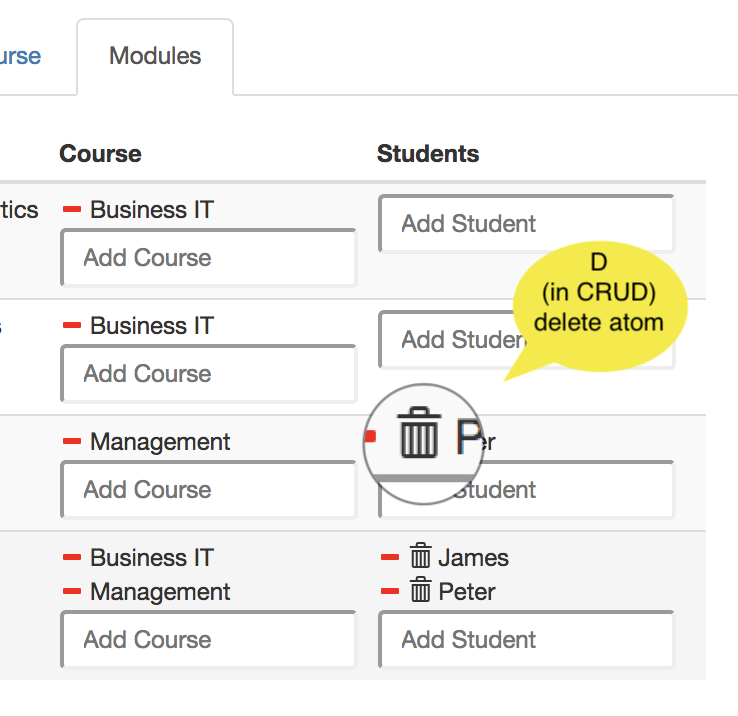

* [The language Ampersand](./the-language-ampersand/README.md)
  * [How to read syntax statements](./the-language-ampersand/how-to-read-syntax-statements)
  * [Truth](./the-language-ampersand/truth)
  * [Atoms](./the-language-ampersand/atoms)
  * [Terms](./the-language-ampersand/terms)
    * [Semantics](./the-language-ampersand/terms#semantics)
    * [Semantics in logic](./the-language-ampersand/terms#semantics-in-logic)
      * [Primitive terms](./the-language-ampersand/terms#primitive-terms-in-logic)
      * [Boolean operators](./the-language-ampersand/terms#boolean-operators-in-logic)
      * [Relational operators](./the-language-ampersand/terms#relational-operators-in-logic)
      * [Residual operators](./the-language-ampersand/terms#residual-operators-in-logic)
    * [Semantics in natural language](./the-language-ampersand/terms#semantics-in-natural-language)
      * [Primitive terms in natural language](./the-language-ampersand/terms#primitive-terms-in-natural-language)
      * [Boolean operators in natural language](./the-language-ampersand/terms#boolean-operators-in-natural-language)
      * [Relational operators in natural language](./the-language-ampersand/terms#relational-operators-in-natural-language)
      * [Residual operators in natural language](./the-language-ampersand/terms#residual-operators-in-natural-language)
    * [Semantics in set theory](./the-language-ampersand/terms#semantics-in-set-theory)
      * [Primitive terms in set theory](./the-language-ampersand/terms#semantics-in-set-theory)
      * [Boolean operators in set theory](./the-language-ampersand/terms#boolean-operators-in-set-theory)
      * [Relational operators in set theory](./the-language-ampersand/terms#relational-operators-in-set-theory)
    * [Semantics of terms, defined algebraically](./the-language-ampersand/terms#semantics-in-relational-algebra)
      * [Boolean operators in algebra](./the-language-ampersand/terms#boolean-operators-in-algebra)
      * [Relational operators in algebra](./the-language-ampersand/terms#relational-operators-in-algebra)
    * [Semantics visualized](./the-language-ampersand/terms#semantics-visualized)
      * [Boolean operators visualized](./the-language-ampersand/terms#boolean-operators-visualized)
      * [Relational operators visualized](./the-language-ampersand/terms#relational-operators-visualized)
      * [Residuals visualized](./the-language-ampersand/terms#residual-operators-visualized)
  * [Context](./the-language-ampersand/context)
  * [Syntactical Conventions](./the-language-ampersand/how-to-read-syntax-statements)
    * [Language support](./syntax-of-ampersand#language-support)
  * [Patterns](./syntax-of-ampersand#patterns)
## Services

### Purpose
Services are meant to expose functionality and data from a [context](./the-language-ampersand/context.md), to let users or information systems interact with the system by creating, reading, updating, and deleting data.

### Description
A service is a component of an information system that exposes functionality and data from a [context](./the-language-ampersand/context.md), to let users or information systems interact by creating, reading, updating, and deleting data. The first [example](../Examples.md#example-service-structure) introduces a simple service informally. Another [example](../Examples.md#service-introductory-example) introduces the main features of a service with nested interfaces.

A *service* is a component of an information system. During the time that this service can actually be used, we say it is *deployed*. We also call this the *lifetime* of a service. A typical instance of a service is a user interface based on HTML-CSS that runs in a browser. But an application program interface \(API\) that serves other computers with web services is a perfectly valid instance as well.

Please note that the keyword `INTERFACE` is still used. That may be confusing. In a future release of Ampersand the keyword `INTERFACE` will become obsolete and the word `SERVICE` will be used.

### Syntax and Meaning {#syntax-of-interface-statement}
Note: The service definition must be outside a pattern

A service specification has the following structure. It is identical for user interfaces (`INTERFACE`) and application programming interfaces (`API`).

```
INTERFACE <name> <forRoles>? : <term> <crud>? <view>? <subinterface>?
API       <name> <forRoles>? : <term> <crud>? <view>? <subinterface>?
```

The name of a service must be unique within the context. The term defines the atoms to which the interface can be applied. The (optional) crud annotation constrains the possible interactions a user can do. The (optional) views determine what the service will look like. If no view is specified, the service will look like the screenshot above. Finally the sub-interface contains all the contents, i.e. the fields, field names and the constraints on them.

The hierarchy of boxes in a service comes from the following (recursive) syntax of `<subinterface>`.

A sub-interface may be defined on the spot (by `<boxKey> <box>`) or it may link to another service to reuse its structure:

```
<subinterface> ::= <boxKey> <box>
                 | LINKTO ( INTERFACE | API ) <name>
```

The boxKey is meant to tell the front-end application what the service looks like. The compiler uses templates to adapt an interface to specific needs regarding its HTML structure.

```
<boxKey> ::= BOX '<' <htmlname> '>'
           | BOX
```

If no htmlname is specified, Ampersand uses `BOX <FORM>` by default.

A box is simply a list of service items (`ifcItem`) separated by commas. Each service item specifies a field in the service or a sub-interface.

```
<box> ::= '[' <ifcItem> ( ',' <ifcItem> )* ']'
```

Each service item has a label that must be unique within the box. After the colon there is either a term or a text. The term specifies which data is related to the field it specifies if it has no sub-interface. If it does, it specifies the atoms on which the box is applied.

```
<ifcItem> ::= <label> ':' <term> <crud>? <view>? <subinterface>?
            | <label> ':' <text>
```

You can specify that a service is available only to actors (i.e. computers or persons) in a specific role.
```
<forRoles> ::= FOR <roles>
<roles> ::= <rolename> ',' <roles>
          | <rolename>
```

### Using a service
On the user screen each atom is displayed in some form as data. If a service exists for that atom, that is shown to the user as a hyperlink to which you can navigate.

When running an application in your browser, you are watching one user interface at any given moment in time. Each hyperlink on your screen represents an atom to which some service applies. To navigate to that user interface, you click on the hyperlink. You will see the service being applied solely to the atom you just clicked. To determine the atom\(s\) to which a service applies, each service has an _interface term_.

Further examples:

* a [client service](../Examples.md#services-example-client) to allow clients of a web shop to change their name and address and show them status information of their orders;
* a [login service](../Examples.md#services-example-login) to demonstrate how to get different interface structures under varying conditions.

### CRUD annotations {#crud}
CRUD annotations are used in services to constrain the functionality of fields and boxes in an `INTERFACE`-statement. This allows you to minimize the functionality for your users, to design for easy learning.

Each CRUD annotation comes right after a [term](./the-language-ampersand/terms.md), so we can always refer to "the term" to which a CRUD annotation belongs. A CRUD annotation constrains the things your user can do with the target atoms and the pairs of its term.

The CRUD-annotation specifies Create, Read, Update, and Delete rights for the term it follows. Capital = allowed, Non-capital = not allowed. CRUD is the default, so if you specify nothing, everything is allowed. The following service definition illustrates this.

```
INTERFACE Overview : "_SESSION"                  cRud
BOX <TABS>
     [ Students : V[SESSION*Student]             cRuD
       BOX <TABLE>
                [ "Student" : I[Student]         cRud
                , "Enrolled for" : isEnrolledFor cRUD
                , "Course" : takes CRUD
                ]
     , Course : V[SESSION*Course]                cRuD   -- used for a box
       BOX <TABLE>
                [ "Course" : I                   cRud   -- used for a field
                , "Modules" : isPartOf~                 -- CRUD is default
                ]
     , Modules : V[SESSION*Module]               cRud
       BOX <TABLE>
                [ "Modules" : I                  cRuD
                , "Course" : isPartOf            cRUd
                , "Students" : isEnrolledFor~    CRUD
                ]
     ]
```

The user interface defined by this service is shown as a screenshot below. Notice that the lowercase r in the annotation of the Students box prevents showing the underlying box. The full CRUD functionality in Course yields 'create' functionality (the green plus-button), 'remove pair' functionality (red minus button), and 'delete atom' functionality (the red trash can button). The lowercase c, u, and d in the Modules box prevents displaying that functionality in the user interface.


The next sections give some more detailed information on the runtime semantics for CRUD annotations as implemented in Ampersand.

#### Create

| CRUD | for a box                                                                                                                                                                                                 | for a field.                                                                                                                                                                                                                                                  |
| ---- | --------------------------------------------------------------------------------------------------------------------------------------------------------------------------------------------------------- | ------------------------------------------------------------------------------------------------------------------------------------------------------------------------------------------------------------------------------------------------------------- |
| C    |  A + (plus) button is displayed that lets you create a new atom, but only if the box-term is editable. |  Enter a new atom and a `+` button appears. Click the + to add that atom to the listed set of atoms. If you enter an atom that exists (Peter), you can select it. |
| c    | Atoms cannot be created                                                                                                                                                                                   | Atoms cannot be created                                                                                                                                                                                                                                       |

#### Read

| Read | CRUD for boxes      |   | CRUD for fields     |
| ---- | ------------------- | - | ------------------- |
| R    | Read is allowed     |   | Read is allowed     |
| r    | Read is not allowed |   | Read is not allowed |

#### Update

| Update | CRUD for boxes                                                                                                                                                                                                                                               | CRUD for fields                                                                                                                                                                                                                                                |
| ------ | ------------------------------------------------------------------------------------------------------------------------------------------------------------------------------------------------------------------------------------------------------------ | -------------------------------------------------------------------------------------------------------------------------------------------------------------------------------------------------------------------------------------------------------------- |
| U      |  Removing and/or adding a pair (src,tgt) is allowed if expr is editable and the atom exists. Deleting a pair is done with the - button; the atom will NOT be deleted. |  Removing and/or adding a pair (src,tgt) is allowed if expr is editable and the atom exists. Deleting a pair is done with the - button; the atom will NOT be deleted. |
| u      | Update is not allowed                                                                                                                                                                                                                                        | Update is not allowed                                                                                                                                                                                                                                          |

#### Delete

| Delete | CRUD for boxes                                                                                                                                                                          | CRUD for fields                                                                                                                                |
| ------ | --------------------------------------------------------------------------------------------------------------------------------------------------------------------------------------- | ---------------------------------------------------------------------------------------------------------------------------------------------- |
| D      |  Deleting a pair is done with the - (minus) button. Deleting an atom is done with the trash bin. |  Delete atom (tgt) and all pairs in which it is used. |
| d      | delete not allowed                                                                                                                                                                      | delete not allowed                                                                                                                             |

A top-level Update or Create are common in my own scripts, e.g. to create an overview of People and be able to create a new Person: `INTERFACE "People" : V[SESSION*Person] CRud COLS []`. And update is also possible.

#### Things to remember

1. The red minus is enabled by `U`. It unlinks an atom (by deleting a pair from a relation) and leaves the atom alone.
2. The red trash bin is enabled by `D`. It removes an atom and all pairs in which that atom is used.

Motivations for CRUD-functionality are found in the [GitHub discussions on CRUD](https://github.com/AmpersandTarski/Ampersand/issues?utf8=%E2%9C%93\&q=is%3Aissue+label%3Acrud+) functionality.

reference-material/The-language-Ampersand.md#layout-of-interfaces
### Layout of user interfaces {#layout-of-interfaces}
Ampersand is meant for back-end design. It offers no features for front-end design. For that purpose we advise you use contemporary front-end tools for web-based applications. Your Ampersand application is [designed to be adaptable](../architecture-of-an-ampersand-application/README.md), especially for this purpose.

However, Ampersand offers a few layout features that let you place items. It has three built-in layout options, [colums](./#column-layout), [rows](./#row-layout) and [tabs](./#tabular-layout), which you can mix freely.

#### Table layout

The column layout uses `BOX <TABLE>` to instruct the front-end application to use a tabular layout in user interfaces. Here is an example of a service, which uses the table layout.

```
INTERFACE Overview : "_SESSION"                  cRud
BOX <TABS>
     [ Students : V[SESSION*Student]             cRuD
       BOX <TABLE>
                [ "Student" : I[Student]         cRud
                , "Enrolled for" : isEnrolledFor cRUD
                , "Course" : takes CRUD
                ]
     , Course : V[SESSION*Course]                cRuD
       BOX <TABLE>
                [ "Course" : I                   cRud
                , "Modules" : isPartOf~          CRUD
                ]
     , Modules : V[SESSION*Module]               cRud
       BOX <TABLE>
                [ "Modules" : I                  cRuD
                , "Course" : isPartOf            cRUd
                , "Students" : isEnrolledFor~    CRUD
                ]
     ]
```

This service shows three columns in the user interface, **Students**, **Course** and **Modules**. The first column is not readable, because the [CRUD annotation](#CRUD) blocks this column for reading. It would have shown students in each row, because the target of `V[SESSION*Student]`is `Student`. The second column shows courses in two columns, **Course** and **Modules**. The third column shows modules in three columns. This is what the user will see on the screen.


#### FORM layout

The row layout uses  `BOX <FORM>` to instruct the front-end application to layout the user interface one field on one row, as you would expect in a form. Here is an example of a service, which uses the form layout on the top level.

```
INTERFACE Overview : "_SESSION"                  cRud
BOX <FORM>
     [ Students : V[SESSION*Student]             cRuD
        BOX <FORM>
                [ "Student" : I[Student]         CRUD
                , "Enrolled for" : isEnrolledFor cRUD
                , "Course" : takes               CRUD
                ]
     , Course : V[SESSION*Course]                CRUD
        BOX <FORM>
                [ "Course" : I                   cRud
                , "Modules" : isPartOf~          CRUD
                ]
     ]
```

This service shows three rows in the user interface, **Students**, **Course** and **Modules**. The first column shows students in each of its rows. Each student is shown in the column layout. The second row shows courses in two columns, **Course** and **Modules**. Please read about [templates](#layout-of-interfaces) if you are curious which other ways of displaying information there are besides `BOX <FORM>`.  Please read the [explanation of CRUD annotations](./the-language-ampersand/services.md#CRUD) if you are curious about the CRUD annotations. This is what the user will see on the screen.


#### TABS layout

The column layout uses `BOX <TABS>` to instruct the front-end application to tabs in the user interface. Here is an example of a service, which uses the column layout.

```
INTERFACE Overview : "_SESSION"                  cRud
BOX <TABS>
     [ Students : V[SESSION*Student]             cRuD
        BOX <TABLE>
                [ "Student" : I[Student]         CRUD
                , "Enrolled for" : isEnrolledFor cRUD
                , "Course" : takes CRUD
                ]
     , Course : V[SESSION*Course]                CRUD
        BOX <TABLE>
                [ "Course" : I                   cRud
                , "Modules" : isPartOf~          CRUD
                ]
     , Modules : V[SESSION*Module]               cRud
        BOX <TABLE>
                [ "Modules" : I                  cRuD
                , "Course" : isPartOf            cRud
                , "Students" : isEnrolledFor~    CRUD
                ]
     ]
```

This service shows three tabs in the user interface, **Students**, **Course** and **Modules**. Only one tab is shown at a time, to avoid cluttered data. This is what the user will see on the screen.


We have discussed the `FORM`, `TABLE`, and `TABS` layout options. Please note that these options do not change the semantics; whatever your options, Ampersand displays the same data in the same fields.

If these options are not enough, you can [enhance your application with your own layouts](../tutorial/services.md#layout-and-widgets).

#### Your own widgets \(HTML and CSS\)
You don't have to put up with the [Ampersand built-in layout options](#layout-of-interfaces) if they don't suit your purpose. You can change most anything by including your own code snippets.  \(to be done...\). 

