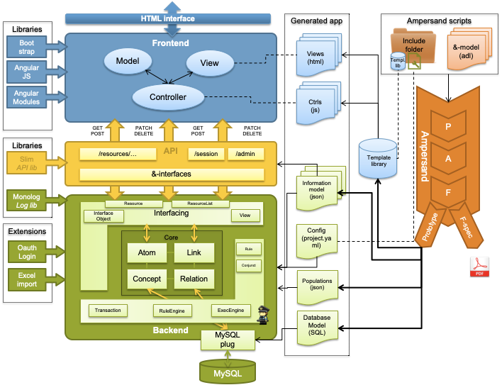

# Architecture of an Ampersand Application
This chapter is intended for programmers who wish to know more about the software Ampersand generates.
There can be many reasons, such as wanting to change the user experience, add or change functionality in views and/or controls, or simply to use the API of an Ampersand application.
In this chapter you will find more details of the applications you generate.

## Information systems

In general, any information system has a structure like the one depicted below:


An information system is meant to support users (e.g. Peter, Sally, Daisy).
Differences among users can be handled by using roles (e.g. customerRep, sysMgr, MgmtSupporter).
In this diagram, users are coloured to depict different roles.

An information system provides services, each of which realizes a business function.
An example is a service to produce a police report (i.e. the business function), which is to be used only by authorized police officers (i.e. the role).
We distinguish user facing services and non-user facing services.
User facing services (e.g. register a client, sanitize case files, login) can be made available for a limited number of roles,
giving each user access to precisely the services he or she is meant to see.
In the diagram, user-facing services are colored corresponding to the roles they serve.
Non-user facing services are not coloredand are used exclusively by other software.
Services can be either stateful or stateless.
Ampersand stores the state in a database, so all of Ampersand's services are stateless.
This allows scaling an interface manyfold to serve multiple users at a time.
In the diagram, stateful services are drawn with a data container inside.

Each service provides one or more interfaces to communicate with the rest of the world.
We distinguish graphical user interfaces (GUIs) and application programming interfaces (APIs).

Services communicate by means of streams or by means of remote calls.

## Information systems generated by Ampersand
Currently, Ampersand generates correct information systems with one stateful service, which is the database, and one stateless service, which contains the interfaces.


An Ampersand information system is deployed as a whole. Therefore it qualifies as a "monolithic" system.
Let us discuss the components.
At run time, an Ampersand system is just a web-based application.
It consists of a HTML/CSS layer and a front-end, both of which run in the browser of a user.
It consists of a back-end with an API, which runs on a server.
The API contains functionality to create, read, update, and delete business objects (e.g. a police report) directly.
The back-end translates these in terms of database tables to database queries, which it runs on the database.
The database may reside on a different server than the back-end.
The Ampersand compiler generates the entire information system from an Ampersand script.
For that purpose it generates views, controllers, an information model and a database model,
all of which are input to a prototype framework, which yields a complete web application.


## An Ampersand application deployed on a docker platform

Let us look at a typical Ampersand Application called RAP3, as an example, to demonstrates how Ampersand applications work on a docker platform.
We use docker to facilitate frequent deployment anywhere in a robust manner and to isolate the internals from the outside world.

.png>)

 The structure of RAP3 has been defined statically (in docker-compose) to allow automated maintenance in production.
 The application itself is implemented as a stateless service, `rap3`.
 It uses a database, `db`, for persistent storage. It is connected to the internet by a proxy which takes care of https and http traffic on ports 443 and 80 respectively. Two local networks separate data traffic to facilitate future work load balancing. The components `db`, `phpmyadmin`, and `proxy` are open source components which we have reused from the internet.

## Software Architecture of an Ampersand application

Let us take a look at the structure of any system that Ampersand generates.



The green area is a database application that works as a stateful service.
It ensures that all invariants are kept satisfied in production as changes to the database are being made.
The integrity of the data is defined by the rules in the Ampersand script and perpetuously maintained in the back-end of the application.

The framework is encapsulated by an application programming interface (API, the yellow area), which exports the functionality in a standardised way. Every application that interfaces through that API will therefore automatically preserve the integrity of data.

On top of the API, the application comes with a front-end application (the blue area). This web-application has a conventional structure, based on the well-known [Model-View-Control (MVC) pattern](https://en.wikipedia.org/wiki/Model%E2%80%93view%E2%80%93controller) used in many web-applications.

The Ampersand compiler (the orange thing on the right) generates the application as a collection of HTML-pages (views) and JavaScript pages (controls), together with static code that is loaded from a framework. So the framework and the API are generic components, in which the semantics are "injected" as JSON files from the Ampersand compiler.

The rules from your script are part of those injected semantics. [From rules to running code](./from-rules-to-running-code.md) explains where each rule ends up: the compiler turns it into a SQL violation query that the back-end runs against the database.

The structure described above is reflected in the directory structure generated by Ampersand:


So if you look in your directory, the generated application will look like this:


## The data structures of a running prototype

The sections above describe the components of a generated application.
This section describes the same system by its data structures, because that is how a programmer navigates the code.
On the compiler side, that chain is documented in [Compilation process](../CompilationProcess.md):
the parser produces the **P-structure**, the type checker produces the **A-structure**, and enrichment produces the **FSpec**, on which all generators run.
The FSpec is where the compiler's data structures end.
A running prototype continues with a chain of its own: the database, the object graph in the PHP back-end, the JSON that crosses the API, the resource tree in the Angular front-end, and finally the DOM.

Class and file names below refer to the [prototype framework repository](https://github.com/AmpersandTarski/prototype):
PHP classes live under `backend/src/Ampersand/` and TypeScript sources under `frontend/src/app/`.



One example threads through this section:

```
RELATION projectName[Project*Name] [UNI]
RELATION member[Project*Person]

INTERFACE Project : I[Project] cRud BOX<FORM>
  [ "Name"    : projectName cRUd
  , "Members" : member      CRUd
  ]
```

### The FSpec, frozen as data

The compiler does not hand the FSpec to the runtime.
Instead, it serializes the parts the runtime needs into the `generics/` directory of the generated application.
These files are the FSpec, frozen as data:

| File | Contents | Read by |
| --- | --- | --- |
| `concepts.json` | every concept, with its technical type, its taxonomy, the table it is administered in, and the conjuncts affected when its population changes | `Model::loadConcepts` |
| `relations.json` | every relation, with its multiplicities and the table and columns where its pairs are administered | `Model::loadRelations` |
| `interfaces.json` | every interface as a tree of objects, each node carrying a ready-made SQL query, its CRUD rights, and (if editable) its relation | `Model::loadInterfaces` |
| `rules.json` | invariants and signals, with meaning, violation message, and the conjuncts each rule decomposes into | `Model::loadRules` |
| `conjuncts.json` | one violation query (SQL) per conjunct | `Model::loadConjuncts` |
| `views.json` | VIEW definitions, with one SQL fragment per segment | `Model::loadViews` |
| `roles.json` | the roles and the rules each role maintains | `Model::loadRoles` |
| `populations.json` | the initial population, used at (re)installation | `Installer` |
| `settings.json` | context name, compiler version, and a hash of the model | `Settings` |
| `database.sql` | the CREATE TABLE statements, used at (re)installation | `MysqlDB` |

For the front-end, the compiler generates Angular code rather than JSON:
one component per INTERFACE statement (a TypeScript class, an HTML template, and a type describing the shape of its data),
plus a `BackendService` with one GET method per interface, the routes and menu of the application, and a copy of `interfaces.json` that the front-end serves as an asset.
[Box templates](./interfaces.md#layout-of-user-interfaces) determine the HTML the compiler writes into those templates.

Together, these artifacts imply a division of labour that holds throughout this section:
**the back-end contains no evaluator for relation algebra**.
Every query the runtime will ever need — interface queries, view queries, violation queries — is generated at compile time;
at run time, the back-end merely substitutes the placeholders `_SESSION` and `_SRCATOM` and sends the query to the database.
[From rules to running code](./from-rules-to-running-code.md) works this out for rules.

### The back-end: a schema layer and a population layer

The PHP back-end is stateless: it rebuilds its entire object graph at every HTTP request and discards it afterwards.
That graph has two layers, which are easy to confuse and important to keep apart.



The **schema layer** holds the model: one PHP object per definition in your script.
`AmpersandApp` (`AmpersandApp.php`) is the root object of a request.
It contains a `Model` (`Model.php`), which holds maps of `Concept`, `Relation`, `Ifc`, `Rule`, `Conjunct`, `View`, and `Role` objects — one per CONCEPT, RELATION, INTERFACE, RULE, and so on.
`Model::init` deserializes them from `generics/*.json` in dependency order and verifies the model hash against the one registered in the database, so a regenerated application cannot silently run against a stale schema.
Inside an `Ifc`, the interface definition lives on as a tree of `InterfaceExprObject`s (`Interfacing/InterfaceExprObject.php`), one node per box item — the runtime counterpart of the `ObjectDef` in your INTERFACE statement.
Each node carries its compiled SQL query, its CRUD rights, and, when its term is an editable relation, a reference to that `Relation`.

The **population layer** is where the business objects appear, and its defining property is that they do not live in PHP.
The population lives in the database; in PHP, an atom appears only fleetingly as an `Atom` (`Core/Atom.php`): a value object of just an identifier plus a reference to its `Concept`.
An `Atom` has no attribute fields — in Ampersand, all data resides in relations, so what would be an attribute in an object-oriented design is a `Link` (`Core/Link.php`): a source atom, a target atom, and the `Relation` they belong to.
Behaviour follows the same pattern: `Atom::add()`, `Atom::delete()`, and `Link::add()` delegate to their `Concept` and `Relation`, which in turn delegate to a storage plug.
So where a conventional application would materialize a `Project` object with `name` and `members` fields, an Ampersand back-end materializes nothing:
the project exists as a row key in the database, and its name and members exist as pairs in the relations `projectName` and `member`.

The storage plug (`Plugs/MysqlDB/MysqlDB.php`) administers this population in MariaDB in two table shapes, both generated by the compiler (see [Concept hierarchies and database mapping](./concept-hierarchies-and-database-mapping.md)):

- a **wide table** per concept hierarchy, with one column per concept in the hierarchy and one column per univalent relation the compiler chose to store there.
  In the example, table `Project` has columns `Project` (the atom identifier, primary key) and `projectName`.
- a **narrow table** per remaining relation, with one column for the source atom and one for the target atom.
  In the example, `member` gets its own two-column table, because a project can have many members.

Which relation is administered where is itself part of the frozen model: `relations.json` records the table and columns for every relation, so the plug never has to decide — it only executes.

### The resource tree: how a business object crosses the API

When the front-end asks for a business object, it does not ask for "the project" — it asks for *the project as seen through an interface*:

```
GET /api/v1/resource/Project/{id}/Project
```

The back-end answers by walking the `InterfaceExprObject` tree of that interface.
For each node, it runs the node's compiled query against the database (substituting the atom it starts from), wraps each resulting row in an `Atom`, and recurses into the subinterfaces.
The classes `Resource` and `ResourceList` (`Interfacing/Resource.php`, `ResourceList.php`) drive this walk: a `Resource` is an `Atom` viewed through an interface node, and it is also the unit the REST API addresses.
The recursion returns a nested structure — **the resource tree** — which is serialized as the JSON response.
For the example interface:

```json
{
  "_id_": "project1",
  "_label_": "Project Alpha",
  "_path_": "resource/Project/project1",
  "Name": "Project Alpha",
  "Members": [
    { "_id_": "peter", "_label_": "Peter", "_path_": "resource/Project/project1/Members/peter" },
    { "_id_": "sally", "_label_": "Sally", "_path_": "resource/Project/project1/Members/sally" }
  ]
}
```

The shape follows the INTERFACE statement one-to-one.
Every object node carries three meta-properties: `_id_` (the atom identifier), `_label_` (its VIEW representation), and `_path_` (the REST path of this resource, which the front-end will use to address changes).
Every box item becomes a property, named after its field label; labels that contain characters that are not allowed in identifiers are encoded (a space becomes `_32_`, and so on), so the same name works in JSON, TypeScript, and HTML.
A univalent field holds a single value or `null`; any other field holds an array.

Note that the back-end builds this tree per request and throws it away with the rest of the object graph.
It is a projection of the database, not a copy that could go stale.

### Mutations: JSON-Patch and the Transaction

Changes travel the same path in reverse.
The front-end sends a PATCH request with [JSON-Patch](https://jsonpatch.com/)-style operations (`add`, `replace`, `remove`, `create`) whose paths are interface paths:

```
PATCH /api/v1/resource/Project/project1
[ { "op": "add", "path": "Members", "value": "daisy" } ]
```

The back-end walks each patch path through the interface tree, checks the CRUD rights on the node it lands on, and translates the operation into `Relation::addLink`/`deleteLink` or `Concept::addAtom`/`deleteAtom` calls.
Those calls do two things at once: they update the database, and they register the affected concept or relation with the current `Transaction` (`Transaction.php`).

Closing that transaction is where the rules come in:

1. the ExecEngine runs, repairing violations of automated rules (which may cause further changes, which register themselves in turn);
2. the transaction re-evaluates exactly the conjuncts affected by the registered changes — the correspondence between "what changed" and "which conjuncts to re-check" is precomputed by the compiler and proven exact in [From rules to running code](./from-rules-to-running-code.md);
3. if all affected invariants hold, the database transaction commits; otherwise it rolls back and the violations become error messages.

The response reports the verdict alongside the fresh content of the whole interface:

```json
{
  "content": { ... },
  "isCommitted": true,
  "invariantRulesHold": true,
  "notifications": { "errors": [], "signals": [ ... ], ... }
}
```

`isCommitted` and `invariantRulesHold` tell the front-end whether the change went through; the `signals` list the process-rule violations the active role is expected to resolve.

### The front-end: one resource tree per interface

The browser holds two structures: the DOM, which the user sees, and the resource tree, which the application reasons about.
The resource tree is the JSON from the API, kept as plain JavaScript objects.
There is exactly one per open interface, and its owner is the generated interface component:
for `INTERFACE Project`, the compiler generates a `ProjectComponent` that extends the framework class `AmpersandInterfaceComponent` (`shared/interfacing/ampersand-interface.class.ts`), fetches the JSON on navigation, and stores it in `this.resource.data`.
There is no separate store; the tree itself is the single source of truth in the browser.



Between the tree and the DOM sit two families of generic components from the framework:

- **box components** (`shared/box-components/`) render the BOX structure — one component class per box template: FORM, TABLE, TABS, and so on.
  They handle structural changes: creating, linking, and removing whole atoms.
- **atomic components** (`shared/atomic-components/`) render the leaves — one component class per technical type: ALPHANUMERIC, DATE, BOOLEAN, OBJECT, and so on.
  They handle value changes in a single field.

The generated template wires them up.
Every component receives a *reference* into the resource tree (`[resource]`, `[data]`) and a reference to the owning interface component (`[interfaceComponent]="this"`), so however deep the nesting, all components of one interface work on subobjects of the same tree and report to the same owner.
An atomic component binds the DOM directly to the tree with two-way binding: `[(ngModel)]="resource[propertyName]"`.
This closes the chain: a keystroke in the DOM mutates the resource tree, and Angular's change detection projects the tree back onto the DOM.

The way back to the server is deliberate rather than keystroke-by-keystroke:

1. typing only sets a `dirty` flag and updates the tree locally;
2. on leaving the field (blur, or Enter), the atomic component sends a JSON-Patch on `resource._path_` via the interface component;
3. the interface component retargets the patch to the *root* of the interface, so the response carries the complete interface content — necessary because the ExecEngine may have changed fields elsewhere in the tree;
4. if the response says `isCommitted: true`, the fresh content is reconciled **in place** with `mergeDeep` (`shared/helper/deepmerge.ts`): object references stay intact, so Angular updates DOM nodes instead of replacing them, cursor focus survives, and the field the user is currently editing is protected from being overwritten;
5. if the response says `isCommitted: false`, the patches wait in a `pendingPatches` list and travel along with the next attempt, so a user can resolve an invariant violation by completing the data.

Interfaces marked [transactional](./interfaces.md#transactional-interfaces) buffer their patches locally and validate them with dry-run requests until the user hits SAVE, but they use this same machinery.

Beside the resource tree, the front-end keeps a small amount of application state: the session and its roles, the navigation menu, and the open signals (all fetched from the back-end), plus the generated `interfaces.json` as static metadata.
None of it duplicates the population: business data appears in the browser only inside resource trees.

### Where the state lives

The chain, summarized by lifetime:

| Data structure | Lives in | Lifetime |
| --- | --- | --- |
| P-structure, A-structure, FSpec | the compiler | one compiler run |
| `generics/*.json`, `database.sql`, generated Angular code | files in the generated application | until you regenerate |
| the population (wide and narrow tables) | MariaDB | persistent |
| conjunct violation cache | MariaDB | persistent, updated per transaction |
| schema layer (`Model` with `Concept`, `Relation`, `Ifc`, ...) | PHP | one HTTP request |
| `Atom`, `Link`, `Resource`, the serialized resource tree | PHP | moments within a request |
| resource JSON | the wire | one response |
| resource tree | the browser | one interface visit |
| DOM | the browser | continuously updated projection of the resource tree |

Two consequences are worth spelling out.
First, the back-end is stateless across requests: everything it knows, it re-reads from `generics/` and the database.
Even the user's session is population — SESSION is a concept, the session identifier in the browser's cookie is the identifier of a SESSION atom, and session attributes such as the active roles are ordinary relations in the database.
This is what allows an Ampersand application to scale horizontally: any back-end container can serve any request.
Second, the front-end trusts the back-end, not itself: after every mutation it re-fetches the interface content and reconciles, so whatever the ExecEngine and the rules decided becomes visible without any rule logic existing in the browser.

## The ExecEngine
The execengine runs with every prototype generated by Ampersand.
Both enforcement rules and automated rules use the execengine to fix violations automatically.

## Hooks

Hookpoint use the following naming convention:

* camelCasing
* start with _pre_ or _post_ to define if hooks are called before or after the following position
* specify classname or file where hookpoint is positioned
* specify functionname where hookpoint is positioned
* optionally specify postion within function where hookpoint is positioned

Current list of hookpoints:

| Hookpoint | Extensions that use it |
| :--- | :--- |
| postDatabaseReinstallDB | ExecEngine |
| postDatabaseUpdate | Mutation \(experimental\), Mqtt \(experimental\) |
| postDatabaseInsert | Mutation \(experimental\), Mqtt \(experimental\) |
| postDatabaseDelete | Mutation \(experimental\), Mqtt \(experimental\) |
| preDatabaseCloseTransaction | ExecEngine |
|  | postDatabaseCloseTransaction |
| postDatabaseAddAtomToConceptInsert | Mqtt \(experimental\) |
|  | postDatabaseAddAtomToConceptSkip |
| postDatabaseDeleteAtom | Mqtt \(experimental\) |
|  | postDatabaseStartTransaction |
| postDatabaseCommitTransaction | Mqtt \(experimental\) |
|  | postDatabaseRollbackTransaction |

More hookpoints will be defined when needed.