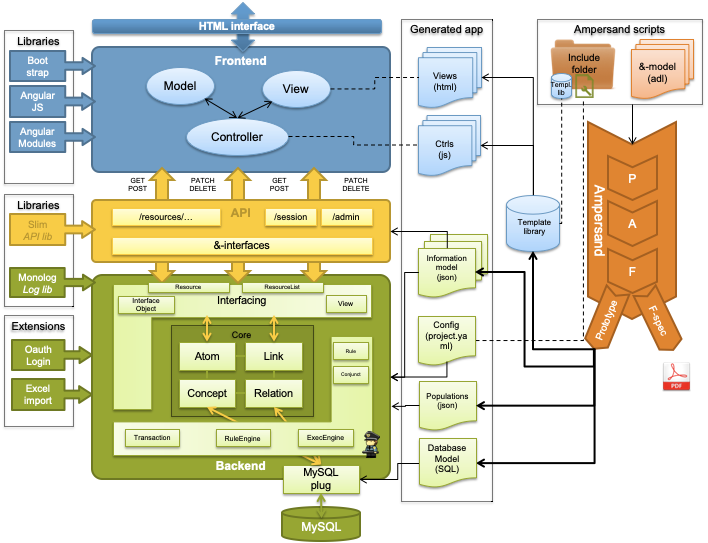

# Architecture of an Ampersand Application
This chapter is intended for programmers who wish to know more about the software Ampersand generates.
There can be many reasons, such as wanting to change the user experience, add or change functionality in views and/or controls, or simply to use the API of an Ampersand application.
In this chapter you will find more details of the applications you generate.

## Information systems

In general, any information system has a structure like the one depicted below:

An information system is meant to support users (e.g. Peter, Sally, Daisy).
Differences among users can be handled by using roles (e.g. customerRep, sysMgr, MgmtSupporter).
In this diagram, users are coloured to depict different roles.

An information system provides services, each of which realizes a business function.
An example is a service to produce a police report (i.e. the business function), which is to be used only by authorized police officers (i.e. the role).
We distinguish user facing services and non-user facing services.
User facing services (e.g. register a client, sanitize case files, login) can be made available for a limited number of roles,
giving each user access to precisely the services he or she is meant to see.
In the diagram, user-facing services are colored corresponding to the roles they serve.
Non-user facing services are not coloredand are used exclusively by other software.
Services can be either stateful or stateless.
Ampersand stores the state in a database, so all of Ampersand's services are stateless.
This allows scaling an interface manyfold to serve multiple users at a time.
In the diagram, stateful services are drawn with a data container inside.

Each service provides one or more interfaces to communicate with the rest of the world.
We distinguish graphical user interfaces (GUIs) and application programming interfaces (APIs).

Services communicate by means of streams or by means of remote calls.

## Information systems generated by Ampersand
Currently, Ampersand generates correct information systems with one stateful service, which is the database, and one stateless service, which contains the interfaces.

An Ampersand information system is deployed as a whole. Therefore it qualifies as a "monolithic" system.
Let us discuss the components.
At run time, an Ampersand system is just a web-based application.
It consists of a HTML/CSS layer and a front-end, both of which run in the browser of a user.
It consists of a back-end with an API, which runs on a server.
The API contains functionality to create, read, update, and delete business objects (e.g. a police report) directly.
The back-end translates these in terms of database tables to database queries, which it runs on the database.
The database may reside on a different server than the back-end.
The Ampersand compiler generates the entire information system from an Ampersand script.
For that purpose it generates views, controllers, an information model and a database model,
all of which are input to a prototype framework, which yields a complete web application.

## An Ampersand application deployed on a docker platform

Let us look at a typical Ampersand Application called RAP3, as an example, to demonstrates how Ampersand applications work on a docker platform.
We use docker to facilitate frequent deployment anywhere in a robust manner and to isolate the internals from the outside world.

.png>)

 The structure of RAP3 has been defined statically (in docker-compose) to allow automated maintenance in production.
 The application itself is implemented as a stateless service, `rap3`.
 It uses a database, `db`, for persistent storage. It is connected to the internet by a proxy which takes care of https and http traffic on ports 443 and 80 respectively. Two local networks separate data traffic to facilitate future work load balancing. The components `db`, `phpmyadmin`, and `proxy` are open source components which we have reused from the internet.

## Software Architecture of an Ampersand application

Let us take a look at the structure of any system that Ampersand generates.

The green area is a database application that works as a stateful service.
It ensures that all invariants are kept satisfied in production as changes to the database are being made.
The integrity of the data is defined by the rules in the Ampersand script and perpetuously maintained in the back-end of the application.

The framework is encapsulated by an application programming interface (API, the yellow area), which exports the functionality in a standardised way. Every application that interfaces through that API will therefore automatically preserve the integrity of data.

On top of the API, the application comes with a front-end application (the blue area). This web-application has a conventional structure, based on the well-known [Model-View-Control (MVC) pattern](https://en.wikipedia.org/wiki/Model%E2%80%93view%E2%80%93controller) used in many web-applications.

The Ampersand compiler (the orange thing on the right) generates the application as a collection of HTML-pages (views) and JavaScript pages (controls), together with static code that is loaded from a framework. So the framework and the API are generic components, in which the semantics are "injected" as JSON files from the Ampersand compiler.

The structure described above is reflected in the directory structure generated by Ampersand:

So if you look in your directory, the generated application will look like this:

## The ExecEngine
The execengine runs with every prototype generated by Ampersand.
Both enforcement rules and automated rules use the execengine to fix violations automatically.

## Hooks

Hookpoint use the following naming convention:

* camelCasing
* start with _pre_ or _post_ to define if hooks are called before or after the following position
* specify classname or file where hookpoint is positioned
* specify functionname where hookpoint is positioned
* optionally specify postion within function where hookpoint is positioned

Current list of hookpoints:

| Hookpoint | Extensions that use it |
| :--- | :--- |
| postDatabaseReinstallDB | ExecEngine |
| postDatabaseUpdate | Mutation \(experimental\), Mqtt \(experimental\) |
| postDatabaseInsert | Mutation \(experimental\), Mqtt \(experimental\) |
| postDatabaseDelete | Mutation \(experimental\), Mqtt \(experimental\) |
| preDatabaseCloseTransaction | ExecEngine |
|  | postDatabaseCloseTransaction |
| postDatabaseAddAtomToConceptInsert | Mqtt \(experimental\) |
|  | postDatabaseAddAtomToConceptSkip |
| postDatabaseDeleteAtom | Mqtt \(experimental\) |
|  | postDatabaseStartTransaction |
| postDatabaseCommitTransaction | Mqtt \(experimental\) |
|  | postDatabaseRollbackTransaction |

More hookpoints will be defined when needed.