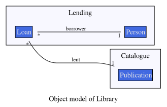
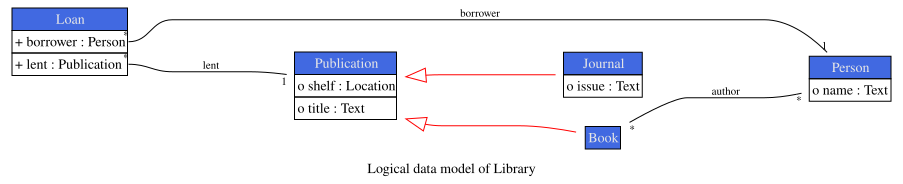
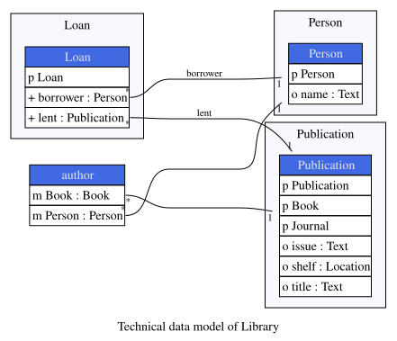

Every time you generate documentation, Ampersand draws your model. It draws it three times over, at three levels of detail, because readers ask three different questions of a model and no single picture answers them all.

The **object model** shows the entity types of your domain and the relations between them. The **logical data model** shows every concept, with the univalent relations folded in as attributes. The **technical data model** shows the tables the prototype creates in its database.

This page describes what each picture contains, so you can tell them apart and pick the one that fits your purpose. It is written for anyone who reads a generated model: the modeller checking their own work, and the user maintaining a system someone else specified. To read the pictures you need to know what a concept and a relation are; the [syntax reference](./syntax-of-ampersand.md) covers those.

## One example, three pictures

The pictures below all come from one small script. It has two patterns, a taxonomy of publications, and a handful of relations.

```text
CONTEXT Library IN ENGLISH

PATTERN Catalogue
  CONCEPT Publication "Anything the library lends out."
  CONCEPT Book "A publication that is printed and bound."
  CONCEPT Journal "A publication that appears periodically."
  CLASSIFY Book ISA Publication
  CLASSIFY Journal ISA Publication

  RELATION title[Publication*Text] [UNI]
  RELATION shelf[Publication*Location] [UNI]
  RELATION author[Book*Person]
  RELATION issue[Journal*Text] [UNI]
ENDPATTERN

PATTERN Lending
  CONCEPT Person "Someone who may borrow from the library."
  CONCEPT Loan "The lending of one publication to one person."
  RELATION borrower[Loan*Person] [UNI,TOT]
  RELATION lent[Loan*Publication] [UNI,TOT]
  RELATION name[Person*Text] [UNI]
ENDPATTERN

ENDCONTEXT
```

Save it as `Library.adl` and run `ampersand documentation --datamodelOnly --graphicFormats svg Library.adl` to reproduce the first two pictures yourself.

## The object model



The object model answers one question: which things does this domain deal with, and how do they hang together? Three boxes remain of the five concepts the script declares, and the relations between them carry their multiplicities.

Two rules decide what you see.

A concept gets a box when it is the **root** of its taxonomy, which is the most general concept of the hierarchy it belongs to. `Book` and `Journal` are therefore absent: every book is a publication, so the box `Publication` already stands for them. The picture shows a whole [concept hierarchy](./concept-hierarchies-and-database-mapping.md) as its top.

A relation is drawn when both its source and its target have a box. This is why `author[Book*Person]` does not appear: `Book` has no box of its own, so the line would have nowhere to start. It also explains the absence of `title`, `issue`, `name` and `shelf`, whose targets are value types such as `Text` and `Location` — the object model leaves those out, so that what remains is the shape of the domain rather than the contents of its records.

One end of every generalisation is a specialisation, which has no box here, so a `CLASSIFY` statement has nothing to link and the object model carries no generalisation arrows.

The boxes are framed by the pattern that defines them, as `Catalogue` and `Lending` do here. Ampersand draws this picture in two variants, one with these frames and one without.

## The logical data model



The logical data model shows the whole model. Every concept keeps its own box, `Book` and `Journal` included, and the red arrows record the two `CLASSIFY` statements. A univalent relation such as `title[Publication*Text]` is folded into the box as an attribute row, so the target concepts of those relations become types rather than boxes.

The mark in front of an attribute tells you what the relation guarantees. A `+` marks a value that is always present and single, an `o` marks a single value that may be absent, an `m+` marks at least one value and possibly several, an `m` marks any number of values, and a `p` marks a property. So `+ lent : Publication` says that every loan has exactly one publication, while `o title : Text` says a publication may or may not have a title.

Relations that are neither univalent nor injective stay outside the boxes and are drawn as associations, which is where `author` reappears.

Ampersand draws this picture for the context as a whole, once with pattern frames and once without. A full documentation run adds one logical data model per pattern, which helps when a context grows past the point where a single picture stays readable.

## The technical data model



The technical data model shows the database that the prototype builds. Three tables remain: the whole publication hierarchy lives in one `Publication` table, because atoms of `Book` and `Journal` are atoms of `Publication` and share its identifier. The rule behind that folding is explained in [concept hierarchies and database mapping](./concept-hierarchies-and-database-mapping.md).

The relation `author` gets a table of its own, since a book may have several authors and a person may write several books.

Names in this picture are the names of tables and columns as they exist in the database. Where the other two pictures show a `LABEL` from your script, this one keeps the generated name, because that is what you will type in a query.

## Choosing a picture

Reach for the object model when you discuss the domain with someone who does not read Ampersand, and when you want to check that the entity types and their connections match the business. Reach for the logical data model when you want to see what your relations and their properties amount to, since it is the only one of the three that shows every property. Reach for the technical data model when you are looking at the database, writing a query, or wondering why a table has the columns it has.

## Generating them

The pictures come out of the `documentation` command, described in full on the page about [the command-line tool](../the-command-line-tool.md).

```bash
ampersand documentation --datamodelOnly --graphicFormats svg Library.adl
```

This writes four files to the `images` directory: `ObjectModel.svg` and `ObjectModel_Grouped_By_Pattern.svg` for the object model, and `LogicalDataModel.svg` and `LogicalDataModel_Grouped_By_Pattern.svg` for the logical data model. The `--datamodelOnly` option keeps the run to these data models and skips the document text.

Drop that option and Ampersand generates the full functional design document, with the classification diagram, the logical data model and the technical data model embedded in its data-analysis chapter, and with the object model alongside as an image file you can use where you need it.

Use `--graphicFormats` to choose among `svg`, `png`, `pdf` and the other formats the command supports, and `--output-dir` to say where they land. Scalable formats such as `svg` and `pdf` keep a large picture readable when you zoom in.

## Names and labels in a picture

A picture shows the name you declared, unless the concept, relation or pattern carries a [`LABEL`](./syntax-of-ampersand.md#the-label-annotation). Where a label exists, the object model, the logical data model and the classification diagram show it, and so does the caption beneath the drawing. That lets you keep working names in the script while the picture speaks the language of its reader. Only the technical data model stays with the names, since those are the ones in the database.
