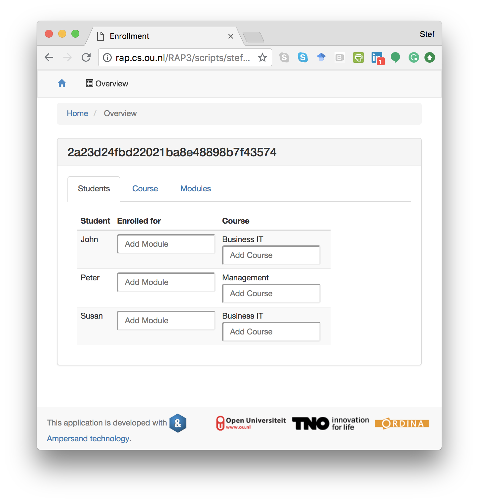
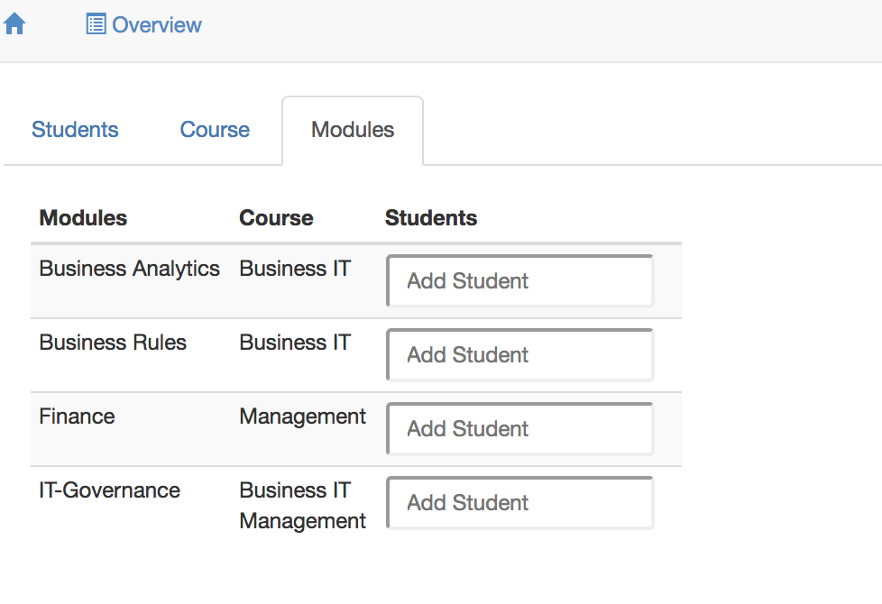
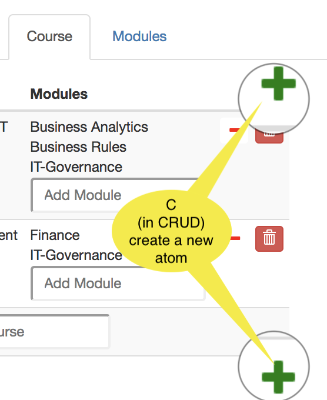
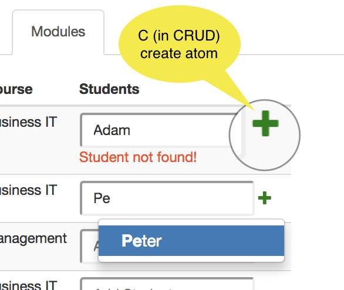
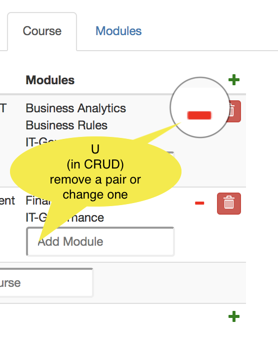
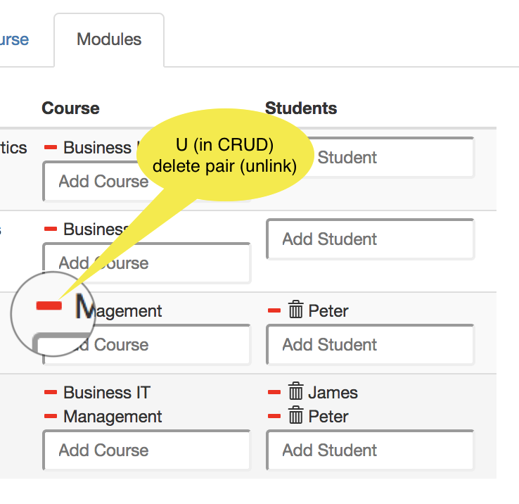
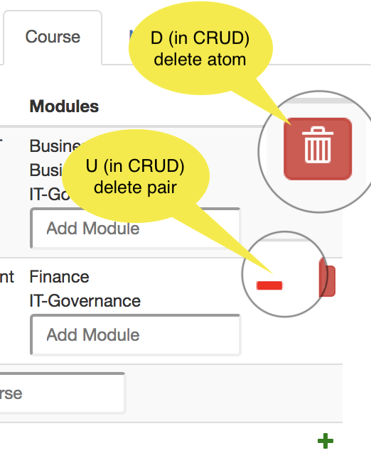
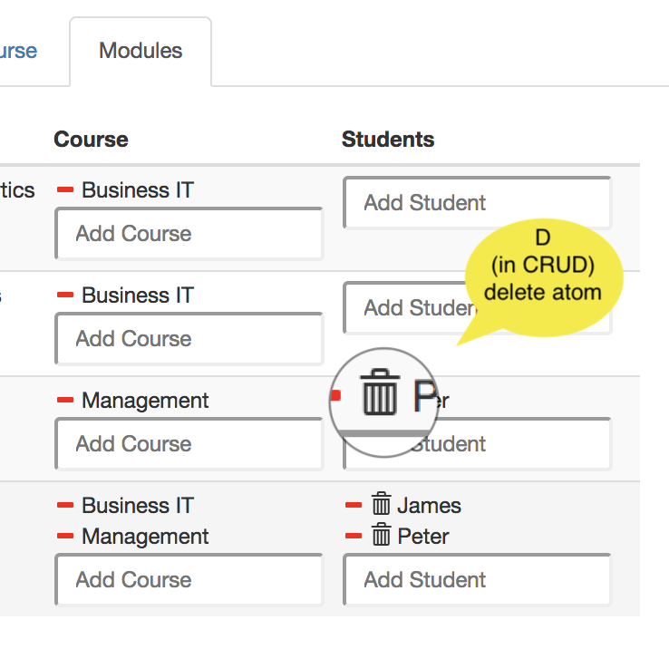

# Interfaces

<!-- Purpose -->

An interface is a component of an information system that exposes functionality and data from a [context](./syntax-of-ampersand#the-context-statement), to let users or other information systems interact by creating, reading, updating, and deleting data.

## Description

The life of an interface starts when it is deployed and ends when it is pulled back. A typical instance is a user interface based on HTML-CSS that runs in a browser. But an application program interface \(API\) that serves other computers with web interfaces is a perfectly valid instance as well.

The definition of an interface specifies which data is presented to which users. For every different use of the system a different interface can be defined. This may lead to a substantial amount of interfaces for large and complex systems. However, one device will show one interface only at any given moment in time.

[This page] gives syntactic details of interfaces. Please find tutorial explanations [here](../tutorial/interfaces.md).

## Example

```text
INTERFACE Overview : "_SESSION"                  cRud
BOX <TABS>
     [ Students : V[SESSION*Student]             cRuD
       BOX <TABLE>
                [ "Student" : I[Student]         cRud
                , "Enrolled for" : isEnrolledFor cRUD
                , "Course" : takes CRUD
                ]
     , Course : V[SESSION*Course]                cRuD
       BOX <TABLE>
                [ "Course" : I                   cRud
                , "Modules" : isPartOf~          CRUD
                ]
     , Modules : V[SESSION*Module]               cRud
       BOX <TABLE>
                [ "Modules" : I                  cRuD
                , "Course" : isPartOf            cRUd
                , "Students" : isEnrolledFor~    CRUD
                ]
     ]
```

This example specifies three tabs. One shows students, one shows courses and one shows modules. This is what it looks like when run in a browser:



## Syntax and Meaning {#syntax-of-interface-statements}

This chapter gives the formal syntax of interfaces for the purpose of reference.

An interface specification has the following structure. It is identical for user interfaces (`INTERFACE`) and application programming interfaces (`API`).

```
INTERFACE <name> <forRoles>? : <term> <crud>? <view>? <subinterface>?
API       <name> <forRoles>? : <term> <crud>? <view>? <subinterface>?
```

The name of an interface must be unique within the context. The term defines the atoms to which the interface can be applied. The (optional) crud annotation constrains the possible interactions a user can do. The (optional) views determine what the interface will look like. If no view is specified, the interface will look like the screenshot above. Finally the sub-interface contains all the contents, i.e. the fields, field names and the constraints on them.

The hierarchy of boxes in an interface comes from the following (recursive) syntax of `<subinterface>`.

A sub-interface may be defined on the spot (by `<boxKey> <box>`) or it may link to another interface to reuse its structure:

```
<subinterface> ::= <boxKey> <box>
                 | LINKTO ( INTERFACE | API ) <name>
```

The boxKey is meant to tell the front-end application what the interface looks like. The compiler uses templates to adapt an interface to specific needs regarding its HTML structure. Please read the [documentation of templates](./syntax-of-ampersand#layout-of-interfaces) for details.

```
<boxKey> ::= BOX '<' <htmlname> '>'
           | BOX
```

If no htmlname is specified, Ampersand uses `BOX <FORM>` by default.

A box is simply a list of interface items (`ifcItem`) separated by commas. Each interface item specifies a field in the interface or a sub-interface.

```
<box> ::= '[' <ifcItem> ( ',' <ifcItem> )* ']'
```

Each interface item has a label that must be unique within the box. After the colon there is either a term or a text. The term specifies which data is related to the field it specifies if it has no sub-interface. If it does, it specifies the atoms on which the box is applied.

```
<ifcItem> ::= <label> ':' <term> <crud>? <view>? <subinterface>?
            | <label> ':' <text>
```

## Layout of user interfaces

Ampersand is meant for back-end design. It offers no features for front-end design. For that purpose we advise you use contemporary front-end tools for web-based applications. Your Ampersand application is [designed to be adaptable](./architecture-of-an-ampersand-application), especially for this purpose.

However, Ampersand offers a few layout features that let you place items. It has three built-in layout options, [colums](#table-layout), [rows](#forms-layout) and [tabs](#tabs-layout), which you can mix freely.

<a name="table-layout"></a>

### Table layout

The column layout uses `BOX <TABLE>` to instruct the front-end application to use a tabular layout in user interfaces. Here is an example of an interface, which uses the table layout.

```
INTERFACE Overview : "_SESSION"                  cRud
BOX <TABS>
     [ Students : V[SESSION*Student]             cRuD
       BOX <TABLE>
                [ "Student" : I[Student]         cRud
                , "Enrolled for" : isEnrolledFor cRUD
                , "Course" : takes CRUD
                ]
     , Course : V[SESSION*Course]                cRuD
       BOX <TABLE>
                [ "Course" : I                   cRud
                , "Modules" : isPartOf~          CRUD
                ]
     , Modules : V[SESSION*Module]               cRud
       BOX <TABLE>
                [ "Modules" : I                  cRuD
                , "Course" : isPartOf            cRUd
                , "Students" : isEnrolledFor~    CRUD
                ]
     ]
```

This interface shows three columns in the user interface, **Students**, **Course** and **Modules**. The first column is not readable, because the [CRUD annotation](#CRUD) blocks this column for reading. It would have shown students in each row, because the target of `V[SESSION*Student]`is `Student`. The second column shows courses in two columns, **Course** and **Modules**. The third column shows modules in three columns. This is what the user will see on the screen.


<a name="forms-layout"></a>

### ROW layout

The row layout uses `BOX <FORM>` to instruct the front-end application to layout the user interface row by row. Here is an example of an interface, which uses the row layout on the top level.

```
INTERFACE Overview : "_SESSION"                  cRud
BOX <FORM>
     [ Students : V[SESSION*Student]             cRuD
        BOX <FORM>
                [ "Student" : I[Student]         CRUD
                , "Enrolled for" : isEnrolledFor cRUD
                , "Course" : takes               CRUD
                ]
     , Course : V[SESSION*Course]                CRUD
        BOX <FORM>
                [ "Course" : I                   cRud
                , "Modules" : isPartOf~          CRUD
                ]
     ]
```

This interface shows three rows in the user interface, **Students**, **Course** and **Modules**. The first column shows students in each of its rows. Each student is shown in the column layout. The second row shows courses in two columns, **Course** and **Modules**. Please read about [templates](./syntax-of-ampersand#layout-of-interfaces) if you are curious which other ways of displaying information there are besides `BOX <FORM>`. Please read the [explanation of CRUD annotations](#CRUD) if you are curious about the CRUD annotations. This is what the user will see on the screen.


<a name="tabs-layout"></a>

### Tabs layout

The column layout uses `BOX <TABS>` to instruct the front-end application to tabs in the user interface. Here is an example of an interface, which uses the column layout.

```
INTERFACE Overview : "_SESSION"                  cRud
BOX <TABS>
     [ Students : V[SESSION*Student]             cRuD
        BOX <TABLE>
                [ "Student" : I[Student]         CRUD
                , "Enrolled for" : isEnrolledFor cRUD
                , "Course" : takes CRUD
                ]
     , Course : V[SESSION*Course]                CRUD
        BOX <TABLE>
                [ "Course" : I                   cRud
                , "Modules" : isPartOf~          CRUD
                ]
     , Modules : V[SESSION*Module]               cRud
        BOX <TABLE>
                [ "Modules" : I                  cRuD
                , "Course" : isPartOf            cRud
                , "Students" : isEnrolledFor~    CRUD
                ]
     ]
```

This interface shows three tabs in the user interface, **Students**, **Course** and **Modules**. Only one tab is shown at a time, to avoid cluttered data. This is what the user will see on the screen.



We have discussed the `FORM`, `TABLE`, and `TABS` layout options. Please note that these options do not change the semantics; whatever your options, Ampersand displays the same data in the same fields.

<a name="layout-and-widgets"></a>

### Your own layout and your own widgets \(HTML and CSS\)

You don't have to put up with the [Ampersand built-in layout options](./syntax-of-ampersand#layout-of-interfaces) if they don't suit your purpose. You can change most anything by including your own code snippets. \(to be done...\).

## CRUD {#CRUD}

CRUD annotations are used in interfaces to constrain the functionality of fields and boxes in an `INTERFACE`-statement. This allows you to minimize the functionality for your users, to design for easy learning.

Each CRUD annotation comes right after a [term](./terms.md), so we can always refer to "the term" to which a CRUD annotation belongs. A CRUD annotation constrains the things your user can do with the target atoms and the pairs of its term.

The CRUD-annotation specifies Create, Read, Update, and Delete rights for the term it follows. Capital = allowed, Non-capital = not allowed. CRUD is the default, so if you specify nothing, everything is allowed. The following interface definition illustrates this.

```
INTERFACE Overview : "_SESSION"                  cRud
BOX <TABS>
     [ Students : V[SESSION*Student]             cRuD
       BOX <TABLE>
                [ "Student" : I[Student]         cRud
                , "Enrolled for" : isEnrolledFor cRUD
                , "Course" : takes CRUD
                ]
     , Course : V[SESSION*Course]                cRuD   -- used for a box
       BOX <TABLE>
                [ "Course" : I                   cRud   -- used for a field
                , "Modules" : isPartOf~                 -- CRUD is default
                ]
     , Modules : V[SESSION*Module]               cRud
       BOX <TABLE>
                [ "Modules" : I                  cRuD
                , "Course" : isPartOf            cRUd
                , "Students" : isEnrolledFor~    CRUD
                ]
     ]
```

The user interface defined by this interface is shown as a screenshot below. Notice that the lowercase r in the annotation of the Students box prevents showing the underlying box. The full CRUD functionality in Course yields 'create' functionality (the green plus-button), 'remove pair' functionality (red minus button), and 'delete atom' functionality (the red trash can button). The lowercase c, u, and d in the Modules box prevents displaying that functionality in the user interface.


The next sections give some more detailed information on the run time semantics for CRUD annotations as implemented in Ampersand.

### Create

| CRUD | for a box                                                                                                                                                                                        | for a field.                                                                                                                                                                                                                                       |
| ---- | ------------------------------------------------------------------------------------------------------------------------------------------------------------------------------------------------ | -------------------------------------------------------------------------------------------------------------------------------------------------------------------------------------------------------------------------------------------------- |
| C    |  A + (plus) button is displayed that lets you create a new atom, but only if the box-expression is editable. |  Enter a new atom and a `+` button appears. Click the + to add that atom to the listed set of atoms. If you enter an atom that exists (Peter), you can select it. |
| c    | Atoms cannot be created                                                                                                                                                                          | Atoms cannot be created                                                                                                                                                                                                                            |

### Read

| Read | CRUD for boxes      |     | CRUD for fields     |
| ---- | ------------------- | --- | ------------------- |
| R    | Read is allowed     |     | Read is allowed     |
| r    | Read is not allowed |     | Read is not allowed |

### Update

| Update | CRUD for boxes                                                                                                                                                                                                                                      | CRUD for fields                                                                                                                                                                                                                                       |
| ------ | --------------------------------------------------------------------------------------------------------------------------------------------------------------------------------------------------------------------------------------------------- | ----------------------------------------------------------------------------------------------------------------------------------------------------------------------------------------------------------------------------------------------------- |
| U      |  Removing and/or adding a pair (src,tgt) is allowed if expr is editable and the atom exists. Deleting a pair is done with the - button; the atom will NOT be deleted. |  Removing and/or adding a pair (src,tgt) is allowed if expr is editable and the atom exists. Deleting a pair is done with the - button; the atom will NOT be deleted. |
| u      | Update is not allowed                                                                                                                                                                                                                               | Update is not allowed                                                                                                                                                                                                                                 |

### Delete

| Delete | CRUD for boxes                                                                                                                                                                 | CRUD for fields                                                                                                                       |
| ------ | ------------------------------------------------------------------------------------------------------------------------------------------------------------------------------ | ------------------------------------------------------------------------------------------------------------------------------------- |
| D      |  Deleting a pair is done with the - (minus) button. Deleting an atom is done with the trash bin. |  Delete atom (tgt) and all pairs in which it is used. |
| d      | delete not allowed                                                                                                                                                             | delete not allowed                                                                                                                    |

A top-level Update or Create are common in my own scripts, e.g. to create an overview of People and be able to create a new Person: `INTERFACE "People" : V[SESSION*Person] CRud COLS []`. And update is also possible.

### Things to remember

1. The red minus is enabled by `U`. It unlinks an atom (by deleting a pair from a relation) and leaves the atom alone.
2. The red trash bin is enabled by `D`. It removes an atom and all pairs in which that atom is used.

### Background

Motivations for CRUD-functionality are found in the [GitHub discussions on CRUD](https://github.com/AmpersandTarski/Ampersand/issues?utf8=%E2%9C%93&q=is%3Aissue+label%3Acrud+) functionality.

## Creating Custom BOX Templates
### BOX \<PROPBUTTON\>

The `BOX <PROPBUTTON>` template creates interactive buttons for toggling boolean properties on atoms. Users click these buttons to set, clear, or toggle property values.

#### When to use PROPBUTTON

Use PROPBUTTON for boolean properties like on/off, yes/no, or active/inactive states. The template works well when you want users to change a property with one click rather than typing or selecting from dropdowns. Consider PROPBUTTON for status toggles, approval workflows, or feature flags.

Do not use PROPBUTTON for properties with more than two states. Complex validation logic before state changes makes regular fields more suitable. Relations that are not univalent will cause compilation errors.

Alternatives include regular fields with checkboxes (`property : relation cRUD`), dropdown selection for limited target sets, radio buttons for exclusive boolean relations, or text fields for non-boolean properties.

#### Simple Example

This example creates a toggle for marking tasks as completed:

```ampersand
CONTEXT TaskManagement

RELATION taskName [Task*TaskName] [UNI,TOT]
RELATION isCompleted [Task] [PROP,UNI]

INTERFACE TaskList : "_SESSION" ; V[SESSION*Task] cRud
BOX <TABLE>
[ "Task Name" : taskName cRud
, "Status" : I cRud BOX <PROPBUTTON>
  [ "label" : TXT "Mark Complete"
  , "property" : isCompleted cRUd
  ]
]
```

The property relation must have both `[PROP,UNI]` constraints for PROPBUTTON to work. Use the prescribed field names `"label"` and `"property"` exactly as shown, including the quotes. The property expression should reference the relation itself, not an I-expression. The CRUD annotation on the property must allow Update (capital U) for toggling to function.

#### Complete Reference

The syntax structure follows this pattern:

```ampersand
<fieldname> : <term> <crud>? BOX <PROPBUTTON>
[ "label" : <labelExpression>
, "property" : <propertyRelation> <crud>
, "popovertext" : <tooltipExpression>
, "color" : <colorExpression>
, "action" : <actionExpression>
]
```

PROPBUTTON requires specific field names. The `"label"` field contains the text displayed on the button. The `"property"` field specifies the boolean property to toggle and must reference a `[PROP,UNI]` relation. Optional fields include `"popovertext"` for tooltip text, `"color"` for button color using CSS color values, and `"action"` for button behavior.

Three action types control button behavior. Toggle mode (default) switches between true and false on each click. Set mode always changes the property to true. Clear mode always changes the property to false.

```ampersand
"action" : TXT "toggle"  -- Switches between true/false
"action" : TXT "set"     -- Always sets to true
"action" : TXT "clear"   -- Always sets to false
```

### Advanced Example

This project management interface demonstrates multiple PROPBUTTON instances:

```ampersand
CONTEXT ProjectManagement

RELATION projectName [Project*ProjectName] [UNI,TOT]
RELATION isActive [Project] [PROP,UNI]
RELATION isArchived [Project] [PROP,UNI]
RELATION priority [Project*Priority] [UNI]

INTERFACE ProjectDashboard : "_SESSION" ; V[SESSION*Project] cRud
BOX <TABLE>
[ "Project" : projectName cRud
, "Priority" : priority cRud
, "Active" : I cRud BOX <PROPBUTTON>
  [ "label" : TXT "Toggle Active"
  , "property" : isActive cRUd
  , "popovertext" : TXT "Click to activate/deactivate this project"
  , "color" : TXT "#28a745"
  , "action" : TXT "toggle"
  ]
, "Archive" : I cRud BOX <PROPBUTTON>
  [ "label" : TXT "Archive"
  , "property" : isArchived cRUd
  , "popovertext" : TXT "Archive this project"
  , "color" : TXT "#dc3545"
  , "action" : TXT "set"
  ]
]
```

### Common Issues

TypeScript compilation errors about property type mismatch occur when the property relation lacks the `[UNI]` constraint. The error message `Type 'Object & { _view_: ...; }[]' is not assignable to type 'PropButtonItem'` indicates this problem. Add both `[PROP,UNI]` constraints to fix it.

Buttons that do not respond to clicks usually have CRUD annotations that prevent updates. Check that the property's CRUD annotation includes a capital U for Update permission.

Interface generation errors often stem from incorrect field names. Use `"label"` and `"property"` exactly as written, including the quotes. Misspellings or variations will break the interface.

Multiple buttons interfering with each other suggests they share the same property relation. Create separate relations for different buttons to avoid conflicts.

### Integration

PROPBUTTON combines with other interface elements in the same interface:

```ampersand
INTERFACE ItemManager : "_SESSION" ; V[SESSION*Item] cRud
BOX <TABLE>
[ "Name" : itemName cRud
, "Description" : description cRud
, "Actions" : I cRud BOX <FORM>
  [ "Active" : I cRud BOX <PROPBUTTON>
    [ "label" : TXT "Active"
    , "property" : isActive cRUd
    ]
  , "Priority" : priority cRUD
  , "Tags" : tags cRUD
  ]
]
```

This creates an interface mixing PROPBUTTON with regular fields for different types of user interactions.

## Creating Custom VIEW Templates

A VIEW in Ampersand determines how an atom renders in the frontend. Without a VIEW, the frontend shows the atom's internal identifier. A VIEW maps relations onto named slots and passes those slot values to an HTML template for rendering.

This differs from a BOX template. A BOX template controls how a container lays out multiple fields. A VIEW template controls how a single atom value looks — for example, a short label with a long tooltip.

### The VIEW declaration

A VIEW declaration names a concept and binds relations to slot names:

```adl
VIEW <name> : <Concept> [DEFAULT]
{ "<slot1>" : <relation1>
, "<slot2>" : <relation2>
  ...
} HTML TEMPLATE "<filename>.html" ENDVIEW
```

The keyword `DEFAULT` makes this VIEW the default for the concept. When an interface contains an atom reference with no explicit VIEW annotation, Ampersand uses the default VIEW.

The backend evaluates each relation per atom at request time and collects the results in a JSON object named `_view_`. It includes that object in the API response alongside the atom.

The Ampersand compiler:
1. Evaluates the relations for every atom that needs to be displayed.
2. Passes the results as a JSON object under the key `_view_` alongside the atom in API responses.
3. Substitutes template variables (`$name$`, `$if(exprIsUni)$`, …) to produce an Angular HTML fragment.
4. The Angular frontend binds live data from the API, resolves `*ngIf` conditions, and renders plain HTML.

### Template file

An (optional) template overrules the default HTML-layout. This file contains Angular HTML with StringTemplate variables. The Ampersand compiler substitutes those variables at build time.

Two variables are available in every VIEW template.

`$name$` is the property name of this subinterface item in the parent component. At runtime, `resource.$name$` gives the data object for the atom.

`$if(exprIsUni)$` selects between two branches. A univalent expression (`[UNI]`) produces at most one atom; the template uses `*ngIf` to bind it. A non-univalent expression produces a list; the template uses `*ngFor` to iterate. The compiler inserts the correct branch.

Inside both branches, `viewData['_view_']` holds the JSON object the backend built from the VIEW relations.

### Example: TextWithPopover

The following VIEW displays a short label and shows a tooltip with a longer text on hover:

```adl
VIEW EisMetUitleg : Eis DEFAULT
{ "text"    : eisTekst[Eis*EisTekst]
, "popover" : bijschrijving[Eis*Tekst]
} HTML TEMPLATE "TextWithPopover.html" ENDVIEW
```

In this example, `VIEW EisMetUitleg: Eis DEFAULT` is the *default* way to display any atom of concept `Eis`.
The item `"text" : eisTekst[Eis*EisTekst]` fills slot `text` with the target concepts of the relation `eisTekst`.
`"popover" : bijschrijving[Eis*Tekst]` fills slot `popover` with the target of the relation `bijschrijving`.
The part `HTML TEMPLATE "TextWithPopover.html"` delegates the HTML to this custom template file.

The file `project/templates/TextWithPopover.html` implements this:

```html
$if(exprIsUni)$
<ng-container *ngIf="resource.$name$ as viewData">
  <span *ngIf="viewData['_view_']['text'] && viewData['_view_']['popover']"
        [title]="viewData['_view_']['popover']"
        style="cursor: help; text-decoration: underline dotted;">
    {{ viewData['_view_']['text'] }}
  </span>
  <span *ngIf="viewData['_view_']['text'] && !viewData['_view_']['popover']">
    {{ viewData['_view_']['text'] }}
  </span>
  <span *ngIf="!viewData['_view_']['text'] && viewData['_view_']['popover']">
    {{ viewData['_view_']['popover'] }}
  </span>
</ng-container>
$else$
<div *ngFor="let viewData of resource.$name$">
  <span *ngIf="viewData['_view_']['text'] && viewData['_view_']['popover']"
        [title]="viewData['_view_']['popover']"
        style="cursor: help; text-decoration: underline dotted;">
    {{ viewData['_view_']['text'] }}
  </span>
  <span *ngIf="viewData['_view_']['text'] && !viewData['_view_']['popover']">
    {{ viewData['_view_']['text'] }}
  </span>
  <span *ngIf="!viewData['_view_']['text'] && viewData['_view_']['popover']">
    {{ viewData['_view_']['popover'] }}
  </span>
</div>
$endif$
```

The user interface applies this template to every atom of concept `Eis`, unless it is overruled by another (non-DEFAULT) template.

### The rendering pipeline

Template variables and what they resolve to:

| Variable | Resolved at | Value for this example |
|---|---|---|
| `$name$` | Compile time | `I` (the property name in the interface) |
| `$if(exprIsUni)$` | Compile time | `true` — `I[Eis]` is UNI (identity is always UNI) |
| `viewData['_view_']['text']` | Angular runtime | value from `eisTekst[Eis*EisTekst]` |
| `viewData['_view_']['popover']` | Angular runtime | value from `bijschrijving[Eis*Tekst]` |

---

#### 1. After Ampersand Compilation (Step 2: Template with Substituted Variables)

After the Ampersand compiler processes the template, `$name$` → `I` and the `$if(exprIsUni)$` branch is selected.  
The result is placed inside the generated Angular component HTML for the `Eisen` interface.

**Generated file:** `/var/www/frontend/src/app/generated/eisen/eisen.component.html` (excerpt)

```html
<ng-container *ngIf="resource.I as viewData">
  <!-- Text with tooltip (both slots filled) -->
  <span *ngIf="viewData['_view_']['text'] && viewData['_view_']['popover']"
        [title]="viewData['_view_']['popover']"
        style="cursor: help; text-decoration: underline dotted;">
    {{ viewData['_view_']['text'] }}
  </span>
  <!-- Text only (no tooltip) -->
  <span *ngIf="viewData['_view_']['text'] && !viewData['_view_']['popover']">
    {{ viewData['_view_']['text'] }}
  </span>
  <!-- Popover only -->
  <span *ngIf="!viewData['_view_']['text'] && viewData['_view_']['popover']">
    {{ viewData['_view_']['popover'] }}
  </span>
</ng-container>
```

This is still Angular. The `*ngIf`, `[title]`, and `{{ }}` are Angular directives that are resolved at browser runtime.

---

#### 2. The Backend API Response (what Angular receives)

The Angular frontend fetches the interface data from the Ampersand backend API.  
For `EIS_AZ_012` the response looks like this:

```
GET /api/v1/resource/SESSION/1/Eisen?limit=10&content=true
```

Relevant portion of the response (abbreviated):

```json
{
  "_id_": "EIS_AZ_012",
  "_label_": "vrijVan…",
  "_view_": {
    "text":    "vrijVan",
    "popover": "The plants were tested and found free from Tomato yellow leaf curl virus, Tomato brown rugose fruit virus, Ralstonia solanacearum, Pepino mosaic virus, Tomato spotted wilt virus."
  },
  "I": {
    "_id_": "EIS_AZ_012",
    "_view_": {
      "text":    "vrijVan",
      "popover": "The plants were tested and found free from Tomato yellow leaf curl virus, Tomato brown rugose fruit virus, Ralstonia solanacearum, Pepino mosaic virus, Tomato spotted wilt virus."
    }
  }
}
```

Important: the `_view_` object appears *both* at the top level of the atom and inside the `I` sub-resource.  
The template accesses it via `resource.I` (the column), so it uses `resource.I._view_` = `viewData['_view_']`.

---

#### 3. Resolved Template with Real Values (Step 3: Template with Data Injected)

With the API data bound, Angular evaluates the `*ngIf` conditions. For `EIS_AZ_012`:

- `viewData['_view_']['text']`    = `"vrijVan"` → truthy ✓  
- `viewData['_view_']['popover']` = `"The plants were tested…"` → truthy ✓  
- First `*ngIf` condition evaluates to **true**

The first `<span>` block is selected, the other two are excluded by Angular.  
The Angular template collapses to the following effective HTML:

```html
<span
  title="The plants were tested and found free from Tomato yellow leaf curl virus, Tomato brown rugose fruit virus, Ralstonia solanacearum, Pepino mosaic virus, Tomato spotted wilt virus."
  style="cursor: help; text-decoration: underline dotted;">
  vrijVan
</span>
```

No Angular remains. This is plain HTML sent to the browser's DOM.

---

#### 4. The Rendered UI (Step 4: Screenshot)

In the browser the table cell shows:

```
┌──────────────────┐
│  vrijVan···      │  ← dotted underline; cursor changes to ❓ on hover
└──────────────────┘
```

When the user hovers over the cell, the native browser tooltip appears:

```
┌──────────────────────────────────────────────────────────────────────────────────────┐
│ The plants were tested and found free from Tomato yellow leaf curl virus, Tomato     │
│ brown rugose fruit virus, Ralstonia solanacearum, Pepino mosaic virus, Tomato        │
│ spotted wilt virus.                                                                  │
└──────────────────────────────────────────────────────────────────────────────────────┘
```

> **Note:** The tooltip is rendered via the HTML `title` attribute — a native browser tooltip.  
> It appears after hovering for approximately one second. No JavaScript library is required.

---

#### 5. The Four Cases

The template handles all four combinations of populated/empty slots:

| `text` | `popover` | Rendered output |
|--------|-----------|-----------------|
| ✓ filled | ✓ filled | Text with dotted underline + tooltip on hover |
| ✓ filled | ✗ empty / null | Plain text, no tooltip |
| ✗ empty | ✓ filled | Popover text shown as plain text |
| ✗ empty | ✗ empty | Nothing rendered (outer `*ngIf="resource.I"` is falsy) |

---

#### 6. Summary: The Complete Pipeline

```
ADL script (Kernmodel.adl)
  │
  │  VIEW EisMetUitleg: Eis DEFAULT
  │  { "text"    : eisTekst[Eis*EisTekst]
  │  , "popover" : bijschrijving[Eis*Tekst]
  │  } HTML TEMPLATE "TextWithPopover.html" ENDVIEW
  │
  ▼ Ampersand compiler (compile time)
  │  - reads TextWithPopover.html
  │  - substitutes $name$ → "I"
  │  - selects $if(exprIsUni)$ branch
  │  - writes eisen.component.html
  │
  ▼ Angular build (compile time)
  │  - type-checks the template against EisenInterface
  │  - bundles into browser JavaScript
  │
  ▼ PHP Backend (runtime, per HTTP request)
  │  - evaluates eisTekst[EIS_AZ_012] → "vrijVan"
  │  - evaluates bijschrijving[EIS_AZ_012] → "The plants were tested…"
  │  - returns JSON: { "_view_": { "text": "vrijVan", "popover": "…" } }
  │
  ▼ Angular frontend (runtime, in browser)
  │  - binds resource.I to viewData
  │  - evaluates *ngIf conditions
  │  - resolves {{ viewData['_view_']['text'] }} → "vrijVan"
  │  - resolves [title] binding → "The plants were tested…"
  │
  ▼ Browser DOM (rendered HTML)
     <span title="The plants were tested…"
           style="cursor: help; text-decoration: underline dotted;">
       vrijVan
     </span>
```

---

### Reusing this Pattern

To create a similar VIEW for another concept, the pattern is:

```adl
VIEW MyView: MyConcept DEFAULT
{ "text"    : <term-for-short-label>[MyConcept*SomeType]
, "popover" : <term-for-long-text>[MyConcept*Tekst]
} HTML TEMPLATE "TextWithPopover.html" ENDVIEW
```

Place `TextWithPopover.html` in `project/templates/`. The Dockerfile copies this directory to `/var/www/frontend/templates/` so the Ampersand compiler picks it up automatically during the next `docker compose up --build`.

The template file is **concept-independent** and **reusable** — any VIEW that defines `"text"` and `"popover"` slots can use it.