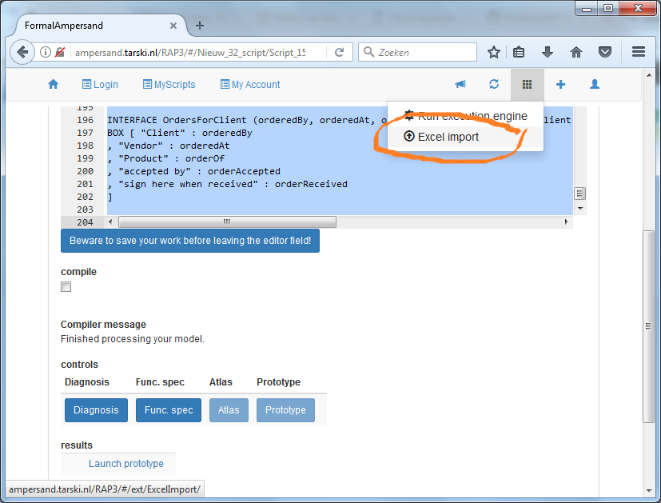
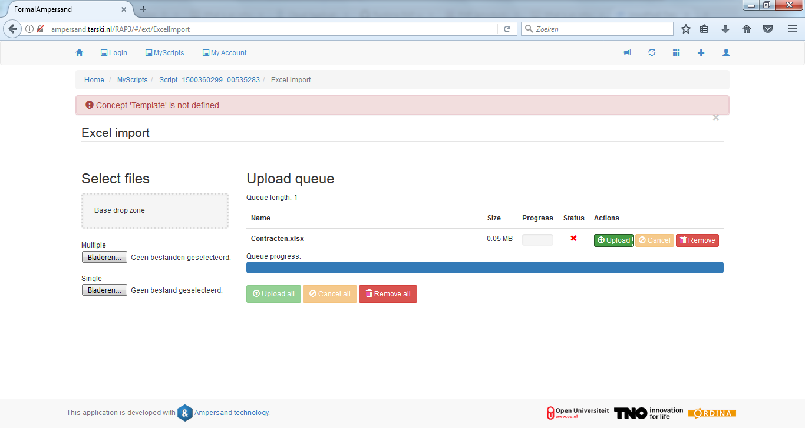
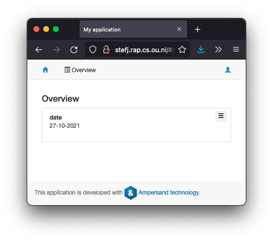

# Syntax and Semantics of Ampersand

This page defines the syntax and semantics of the statements in the Ampersand language.
[Terms](./terms.md) and [interfaces](./interfaces.md) are defined in separate pages.
Please use it as a reference document rather than an introductory course.

## Structuring your Ampersand specification

Structuring an Ampersand specification effectively is crucial for readability, maintainability, and ease of development. There are several ways that can help:

1. `Include` statements enable you to use multiple files. This can help to separate your statements by concerns.
2. `Pattern`s can help to devide your rules etc. by theme. The generated documentation takes this into account.

Not all statements can be used inside a Pattern. This table shows what elements are available inside a Pattern and inside a Context:

| element                                    | description                                                                                      | Context | Pattern |
| ------------------------------------------ | ------------------------------------------------------------------------------------------------ | ------- | ------- |
| [<include\>](#the-include-statement)       | a statement to include another file in the context                                               | ✅      | ❌      |
| <meta\>                                    | a statement to provide metadata to a script, such as author, company, etc.                       | ✅      | ❌      |
| [<pattern\>](#the-pattern-statement)       | a block of code that represents rules on a single and specific topic, at the user's discretion   | ✅      | ❌      |
| [<conceptDef\>](#the-concept-statement)    | a description of a concept, to document its meaning                                              | ✅      | ✅      |
| [<representation\>](#the-concept-statement | a statement that defines the atomic type of a concept                                            | ✅      | ✅      |
| [<classify\>](#the-classify-statement)     | a statement that specifies generalization/specialization of concepts                             | ✅      | ✅      |
| [<relation\>](#the-relation-statement)     | a declaration of a relation, stating the existence of a relation within the context              | ✅      | ✅      |
| [<rule\>](#the-rule-statement)             | a statement that declares a rule                                                                 | ✅      | ✅      |
| <roleRule\>                                | a statement that makes a role responsible for satisfying a rule                                  | ✅      | ✅      |
| [<enforce\>](#the-enforce-statement)       | a statement to declare an automatic enforcement rule                                             | ✅      | ✅      |
| [<ident\>](#the-ident-statement)           | a declaration of an identity rule on a concept                                                   | ✅      | ✅      |
| <viewDef\>                                 | a statement for presenting facts in a readable sentence                                          | ✅      | ✅      |
| [<purpose\>](#the-purpose-statement)       | a statement to describe the purpose of a pattern or a pattern element                            | ✅      | ✅      |
| [<population\>](#the-population-statement) | a statement that sums up the initial population of a relation                                    | ✅      | ✅      |
| [<interface\>](#the-interface-statement)   | a unit of code that can be run independently and specifies interaction with a user or a computer | ✅      | ❌      |
| [<purpose\>](#the-purpose-statement)       | a statement to describe the purpose of a context or a context element                            | ✅      | ✅      |
| [<population\>](#the-population-statement) | a statement that sums up the initial population of a relation                                    | ✅      | ✅      |

## The CONTEXT statement

#### Purpose

The data contained in a business system represents a view of \(a very small part of\) the real world. Ideally, this view must be consistent, meaning that there may be no contradictions within that view. Since different business systems have different ways of viewing the real world, and/or look at different parts of the real world, we need to be able to distinguish between such views. We use the word 'Context' to refer to an individual view. Thus, a Context is defined in terms of concepts, relations and rules, and it consists of atoms and links to populate them.

#### Semantics

Any Ampersand model has one context.  
The model is true within its context and there is no knowledge in a model about other contexts.

#### Syntax

The model is specified between the keywords CONTEXT and ENDCONTEXT. A context has a name. You can optionally specify the language and markup \(see below\).

```text
CONTEXT MyModel
INCLUDE*

<all kind of elements in the model>

ENDCONTEXT
```

Other models included with the INCLUDE statement become part of the context they are included in.

###### Optional parts

######### Language definition

To tell Ampersand what language your context is in, you can append a language directive to your context. Currently English and Dutch are supported. To do so, directly following the name of your context, you can specify

```text
IN <language>
```

Where `<language>` can be `ENGLISH` or `DUTCH`.

######### Markup format

Directly following the optional language definition, you can optionally specify the format of your texts \(see PURPOSE statement\). Ampersand understands some different markup styles. The default style is REST \(Restructured Text\)

```text
<markupStyle>
```

where can be one of

`REST`,

`HTML`,

`LATEX`,

`MARKDOWN`.

\(For details on these formats, see [pandoc.org](http://pandoc.org/)\).

## The INCLUDE statement

#### Purpose

To facilitate reusing code, Ampersand allows its user to divide code over different files.

#### Description

The `INCLUDE`-statement includes the code of another Ampersand-script or the data of a .xlsx-file into the context.

#### Examples

```text
INCLUDE "foo.adl"
INCLUDE "subdirectory/foo.adl"
INCLUDE "bar.xlsx"
```

#### Syntax and meaning

```text
INCLUDE <filename>
```

This statement specifies files that need to be included before compiling. The filename is given in double quotes, including a path that is relative to the position of the main adl-file. The main adl-file is the file that is called with the command Ampersand.

Possible files to include are:

- other adl-files
- xlsx-files to include population

All code in the included adl-files will become part of the context of the main adl-file.

Make sure to include the adl-files before including xlsx-files.

Included files may contain `INCLUDE`statements themselves. The files mentioned there are treated as though they were included in the main file. So their code is also part of the same context. Nested adl-files can have their own xlsx-files included.

For formatting your excel-file see the text on [the Excel Importer](../the-excel-importer.md).

## The PATTERN statement

#### Purpose

Patterns are meant to isolate discussions and make solutions reusable, as known from [design patterns](http://en.wikipedia.org/wiki/Design_pattern).

#### Description

A pattern is a set of rules that describes a theme or a general reusable solution to a commonly occurring problem.

For instance, if specific concerns about security arise, you might want to discuss this with stakeholders in security. With them you can discuss which rules in particular constitute your solution. Divide your problem in smaller pieces and discuss each piece with just the right stakeholders. This allows you to go deeper by talking to the right people. It saves time as well by freeing others from having to participate. An even larger benefit arises if you reuse patterns that have been discussed and scrutinized before. The best thing comes once your stakeholders agree. By that time, your pattern represents their agreement formally in Ampersand, so you can use it in the larger context of the information system.

#### Example

```
PATTERN Security

RELATION required[Subject*Destination]
MEANING "A subject that you must have passed to qualify for the school trip to a destination"

RELATION pass[Subject*Student]
MEANING "The subjects that have been passed by specific students"

RELATION attends[Student*Destination]

PURPOSE RULE guardPrerequisites
{+ This rule prevents students from registering for a trip
without having passed the required courses. +}
RULE guardPrerequisites : attends;required |- pass

ENDPATTERN
```

#### Syntax

Every pattern has the following form:

```
PATTERN <pattern name>
    <pattern element>*
ENDPATTERN
```

#### Good practice

A model can have as many patterns as you want.
It has no effect on how the code is processed.

The interface definition must be outside a pattern

A pattern contains rules in an arbitrary order.
The context in which these rules are valid must contain the definition for each of the relations that are used in those rules.
It is good practice to declare all relations in the pattern itself.
That practice makes the pattern self-contained and therefore more suitable for reuse.

Ampersand advocates **one theme in one pattern**. Stakeholders confine their discussion to one theme, and deliver the result in one pattern.

#### Restrictions

In the current implementation of Ampersand, patterns are defined within a context. (This will change in a future version.) If you want to reuse patterns, you have to cut-and-paste them from one context to another. In the future, there will be a better mechanism for reusing patterns in different contexts.

## The CONCEPT statement

#### Purpose:

A concept statement defines a concept in natural language. A concept is a name for similar things. For example: `Peter`, `John`, and `Barack` are things you might want to call `Person`, whereas `45-NP-88` and `KD-686-D` could be instances of the concept `LicensePlate`.

#### Syntax:

```text
CONCEPT <Uppercase identifier> <String> <String>?
```

This statement may occur anywhere within a context, either inside or outside a pattern.

#### Semantics

This statement means that there exists a concept called `<Uppercase identifier>` in the current context.

- `<Uppercase identifier>` specifies the name of the concept.
- `String` contains a definition of the concept. This definition is used by the documentation generator, which expects it to be a grammatically correct and complete sentence.
- `String?` is an \(optional\) reference to the source of the definition. It is meant for traceability.

#### Examples

```text
CONCEPT Person "A person is a human creature." "Ventroli1997"
```

```text
CONCEPT Organization "An organization is a collection of persons that work together to achieve specific objectives."
```

```text
CONCEPT Criterion "A criterion is a standard on which a judgment or decision may be based." "Merriam-Webster"
```

#### Miscellaneous

- The name of a concept starts with an uppercase.
- A concept should be used for immutable concepts. E.g. use a concept `Person` to express that a person will always be a person and will not change in, let us say, a table. However, don't use `Employee`, because termination of an employee's contract causes a person to be an employee no longer. So employees are not immutable. To be an employee is a dynamic property, so model it as a relation.
- The description will be printed in the functional specification, so please check that your definition is a complete sentence.
- Concepts need not be defined. If you use a concept without a definition, Ampersand defines it for you \(regardless of whether you defined it or not\).

## The CLASSIFY statement

#### Purpose

A _**classify statement**_ is also called a _**specialization**_. It specifies that atoms of one concept are atoms of another concept as well. You can use it to buils classifications like [Linnaeus](https://www.britannica.com/science/taxonomy/The-Linnaean-system) did.

#### Syntax and meaning

```
CLASSIFY <upper case identifier> ISA <upper case identifier>
```

In a specialization, e.g. `CLASSIFY Sedan ISA Car`, we call the first concept (`Sedan`) the specific concept and the second (`Car`) the generic concept. The meaning of a specialization is that every atom from the specific concept is an atom from the generic concept as well. So every (atom that is a) Sedan is a Car as well.

So in general: `CLASSIFY` $$A$$ `ISA` $$B$$ means: $$\forall a: a\in A\Rightarrow a\in B$$.

#### Examples

```
CLASSIFY Monkey ISA Mammal
```

```
CLASSIFY Sedan ISA Car
```

To save some writing, you may specify

```
CLASSIFY Monkey, Cow, Human ISA Mammal
```

`This means exactly the same as`

```
CLASSIFY Monkey ISA Mammal
CLASSIFY Cow ISA Mammal
CLASSIFY Human ISA Mammal
```

#### Best practice

A specialization is a static relationship. If you want to say that a student is a person, please consider whether you want this to be static. If a person can enroll to become a student, or graduate or drop out to become non-student again, the dynamics of that cannot be captured in a specialization. Use a relationship instead to model the state of being a student. \
E.g. `RELATION student[Person*Enrollment]`

By adding and removing pairs to that relation, it continuously reflects which persons are a student.

## The RELATION statement

#### Purpose

A _**relation statement**_ says that a relation exists. It introduces (defines, declares) the relation in the context that uses the relation statement.

A _**population statement**_ specifies which pairs (of atoms) are in a relation.

#### Description

A relation is a set that contains pairs of atoms. Over time, pairs can be inserted into or deleted from a relation, for example by a user typing data into an Ampersand application. So the content of a relation is changing over time.

When discussing relations, an arbitrary relation is referred to as $$r$$, $$s$$, or $$t$$. To say that a pair $$(a,b)$$ belongs to a relation $$r$$, we write $$a\ r\ b$$ or alternatively $$(a,b)\in r$$.

#### Examples

```
RELATION soldBy[Order*Person]
```

```
RELATION contract[Order*ContractID] [UNI,TOT]
PRAGMA "Order " " has contract " " as its legal basis."
MEANING
{+ Every Order has a unique ContractID which specifies the legal basis
   for that particular order.
+}
```

In this example:

- `contract` is the _**name**_ of the relation,
- `Order` is the _**source concept**_ of the relation,
- `ContractID` is the _**target concept**_ of this relation, and
- `UNI` and `TOT` are _**constraints**_ of this relation.

#### Syntax and meaning

Each relation used in Ampersand has to be declared. This means that the developer tells the system that this particular relation exists. A relation declaration can have one of the following formats:

```
RELATION <lower case identifier>
         '[' <upper case identifier> '*' <upper case identifier> ']'
         <properties>? <pragma>? <meaning>?
```

In the _**declaration**_ `RELATION owner[Person*Building]`, `owner` is the _**name**_ and `[Person*Building]` is the _**type**_ of the relation. Relation names start with a lower case character, to avoid confusion with concept names. The _**signature**_ of this relation is `owner[Person*Building]`. The signature identifies the relation within its context. The left hand concept, `Person`, is called the _**source**_ of the relation and the right concept, `Building`, is called the _**target**_.

All three formats define a relation by its name, its source concept and its target concept. By convention, the name of a relation is a single word that starts with a lower case letter. The source and target concepts start with an upper case letter. This convention avoids confusion between concepts and relations.

A relation statement means that there exists a relation in the current context with the specified name, source concept and target concept.

A relation statement may occur anywhere inside a context, both inside and outside a pattern.

The optional `<properties>` and `<pragma>`-parts are discussed in the sequel. The `<meaning>`-part is discussed [here](#the-meaning-substatement\).

The name, source concept and target concept together identify a relation uniquely within its context. As a consequence, the name of a relation does not have to be unique. E.g. `name[Book*Name]` can be specified in the same context as `name[Person*Name]`. Because they have different source concepts, these are different relations.

#### Properties

The `<properties>`-part is meant for writing multiplicity constraints in a comma separated list between square brackets '\[' and ']'. E.g. `[UNI,TOT]` . The following properties can be specified on any relation `r[A*B]`

| &   | property   | semantics                                                                                                                                                                      |
| --- | ---------- | ------------------------------------------------------------------------------------------------------------------------------------------------------------------------------ |
| UNI | univalent  | For any `a` in `A` there can be not more than one `b` in `B` in the population of `r`. This implies that every `a` occurs not more than once (is unique) in the source of `r`. |
| INJ | injective  | For any `b` in `B` there can be not more than one `a` in `A` in the population of `r`. So, every `b` occurs not more than once in the target of `r`.                           |
| SUR | surjective | For any `b` in `B` there must be at least one `a` in `A` in the population of `r`.                                                                                             |
| TOT | total      | For any `a` in `A` there must be at least one `b` in `B` in the population of `r`.                                                                                             |
| MAP | -          | Shortcut for the combination of total and univalent.                                                                                                                           |
| BIJ | -          | Shortcut for the combination of surjective and injective.                                                                                                                      |

There are additional relations that can be specified on endo relations. An endo relation is a relation where the source and target concepts are equal. `r[A*A]`.

| &    | property      | semantics                                                                 |
| ---- | ------------- | ------------------------------------------------------------------------- |
| SYM  | symmetric     | For each (`a`,`b`) in `r`, (`b`,`a`) is in `r`.                           |
| ASY  | antisymmetric | If (`a`,`b`) and (`b`,`a`) are both in `r`, then `a` = `b`                |
| TRN  | transitive    | If (`a`,`b`) and (`b`,`c`) are both in `r`, then (`a`,`c`) is in `r`.     |
| RFX  | reflexive     | For each `a` in `A`, the pair (`a`,`a`) is in the population of `r`       |
| IRF  | irreflexive   | For each `a` in `A`, the pair (`a`,`a`) is _not_ in the population of `r` |
| PROP | -             | Shortcut for the combination of symmetric and antisymmetric.              |

Let's assume that we want to express that any person can live in one city only. So under this constraint "_Joe Smith lives in New York_" and "_Joe Smith lives in Denver_" cannot both be true at the same time.

In relation algebra, we say that the relation is univalent, which means that every atom in the source concept can only be paired with a single atom in the target concept. This is modeled as

```
RELATION lives[Person*City][UNI]
MEANING "A person can live in one city only."
```

#### PRAGMA

A pragma is optional and is characterized by the reserved word `PRAGMA`. The `PRAGMA` is followed by two or three strings. It is used to construct sentences in natural language, using pairs from the actual population of a relation. A pragma specifies how we speak (in natural language) about any pair in the relation. Ampersand also uses pragmas to generate examples in the functional specification. Example of a pragma with three strings:

```
PRAGMA "Student " " flies the flag of " " in top."
```

To use this pragma on the pair `(John,Amsterdam)` results in the sentence `"Student John flies the flag of Amsterdam in top."`. The two atoms are fitted in between the three strings. A pragma with two strings is identical to a pragma in which the third string is empty.

(The `PRAGMA` keyword will become obsolete in a future version of Ampersand. It will be replaced by the `VIEW`-statement which offers more flexibility in composing sentences.)

Example:

```
RELATION accepted[Provider * Order] [INJ] PRAGMA "Provider " " has accepted order "
```

The `PRAGMA` tells us that it makes sense to utter the phrase `"Provider Mario's Pizza's has accepted order 12345."`

#### MEANING

For a full discussion of meaning, we refer to [`this page`](#the-meaning-substatement\).

#### Miscellaneous

-

## The RULE statement

#### Purpose

The purpose of a rule is to constrain data. Refer to the chapter about rules in the tutorial for examples and a practice oriented explanation.

A rule statement defines something that should be true. It does not define the enforcement.

#### Syntax of rules

A `<rule>` has the following syntax:

```text
RULE <label>? <term> <meaning>* <message>* <violation>?
```

#### Syntax of labels

A `<label>` is optional. It can be a single word or a string \(enclosed by double brackets\) followed by a colon \(`:`\).

###### Term

A term can be any of:

- Term BinaryOperator Term
- UnaryOpPre Term
- Term UnaryOpPost
- a \(reference to a\) relation \(including an optional signature, when required to disambiguate\):
  - A relation by name
  - `I` \(the Identity relation\)
  - `V` \(carthesian product\) Note that this can also be used to denote the empty relation, by using the unary negation operator: '-v'
  - A singleton term \(the value of an atom\)
- a term enclosed in brackets.

The [semantics of terms](./terms) is documented in a separate page.

######### Operators

The following operators are available to build expressions:

- Binary operators
  - equivalence: `=`
  - composition: `;`
  - inclusion: `|-`
  - intersection: `/\`
  - union: `\/`
  - difference: `-`
  - left residual: `/`
  - right residual: `\`
  - diamond: `<>`
  - relative addition: `!`
  - cartesian product: `#`
- Unary operator \(pre-operator\)
  - complement: `-`
- Unary operators \(post-operator\)
  - conversion \(flip\): `~`
  - Reflexive, transitive closure: `*` \(Kleene star\) 
  - transitive closure: `+` \(Kleene plus\)

###### MEANING\*

The meaning of a rule can be written in natural language in the Meaning part of the RULE statement.  
It is a good habit to specify the meaning! The meaning will be printed in the functional specification.  
The meaning is optional.

######### Syntax

```text
MEANING Language? Markup? <text>
```

The `<text>` part is where the the meaning is written down. We support both:

- a simple string, enclosed by double quotes
- any text, starting with `{+` and ending with `-}`

The optional language is specified as

- `IN ENGLISH` or
- `IN DUTCH`.

The optional Markup is one of :

- `REST` \(Restructured text\)
- `HTML`
- `LATEX`
- `MARKDOWN`

If you need specific markup, there are several options to do so. The default markup is used, but you can override that here. We rely on [Pandoc](http://pandoc.org/) to read the markup.

###### MESSAGE\*

Messages may be defined to give feedback whenever the rule is violated. The message is a predefined string. Every message for a rule should be for another Language.

```text
MESSAGE Markup
```

###### VIOLATION?

A violation message can be constructed so that it gives specific information about the violating atoms:

```text
VIOLATION (Segment1,Segment2,... )
```

Every segment must be of one of the following forms:

- `TXT` String
- `SRC` Term
- `TGT` Term

A rule is violated by a pair of atoms \(source, target\). The source atom is the root of the violation message. In the message the target atoms are printed. With the Identity relation the root atom itself can be printed. You can use a [term](./terms) to print other atoms.
The two examples below define a violation of the rule that each project must have a project leader.
The first prints the project's ID, the second the project's name using the relation projectName:

`VIOLATION ( TXT "Project ", SRC I, TXT " does not have a projectleader")`

`VIOLATION ( TXT "Project ", SRC projectName, TXT " does not have a projectleader")`

#### ROLE MAINTAINS

By default rules are invariant rules.  
By preceding the rule statement with a role specification for this rule, the rule becomes a process rule.

## The ENFORCE statement {#the-enforce-statement}

#### Purpose

The purpose of this statement is to automatically modify the population of a relation based on rules.

#### Syntax

Since ampersand 4.4.0 the syntax of this statement is:

```
ENFORCE <RelationRef> <type>?
        <operator>
        <Term>
```

The `<operator>` can be one of **`:=`**, `:<`, or `>:` .

This statement may occur anywhere within a context, either inside or outside a pattern.

#### Semantics

This statement means the population of the relation will automatically be kept respectively equal ( **`:=`**), a subset (`:<`) or a superset (`>:`) of the population of the given [term](./terms).

#### Examples

```
ENFORCE r := s;t
{- Ampersand will keep the population of the relation r equal to the population
   of the term s;t . It will do so by changing the contents of r
   without affecting the contents of s;t .
   The effect can be observed in the prototype.
   This statement ensures that the rule `r = s;t` is continuously enforced.
   (by populating or depopulating `r`, as necessary).
-}
```

```
ENFORCE canDrive :< hasCar /\ hasDriverLicence
{- Ampersand will keep the population of the relation canDrive smaller than
   the population of the term hasCar /\ hasDriverLicence .
   It will do so by deleting pairs from the contents of canDrive
   without affecting the contents of hasCar /\ hasDriverLicence .
   So, whenever a person can drive, that person needs to have a car and a driver licence.
   However, if that person has both these assets, it is still possible that he/she
   cannot drive.
   This statement ensures that the rule `canDrive |- hasCar /\ hasDriverLicense` is continuously enforced
   (only by depopulating `canDrive` whenever necessary).
-}
```

#### Miscellaneous

- Both the sources and the targets of the relation and the term must match. An error message is given otherwise.
- The relation must be specified in order to use it here, as is the case with any relation used in a term.


## The IDENT statement
#### Purpose:

This statement is a rule, which defines an identity on a concept. It is syntactic sugar for specifying a set of relations that identify atoms in a specific concept. For example, if relations `pi` and `rho` determine an atom of concept `T` uniquely, you can write:

```text
IDENT "T uniqueness" :  T (pi, rho)
```

As the IDENT statement defines a rule, it can be in the same places as any other RULE.

#### Syntax

```text
`IDENT` (<label> `:`)? <Concept> `(` <term>* `)`
```

where:

- `<label>` is the name of the rule. It can be a single word or a string \(enclosed by double brackets\). It is followed by a colon \(`:`\) to distinguish the label from the concept that follows.
- `<Concept>` is the name of the Concept for atoms of which the rule specifies an identity
- Between brackets are [terms](./terms) whose source concept must be `<Concept>`. This is enforced by the type system.

#### Informal Semantics

```text
IDENT RuleName : C (e1, e2, ...)
```

translates into the following rule:

```text
  RULE RuleName :  {e1}<>{e1}~ /\ {e2}<>{e2}~ /\ ... |- I[C]
```

Note that

- Since for every `e` that is univalent and total `e<>e~` equals `e;e~`, so if `e1`, `e2`, ... are all univalent and total, the rule is equivalent to:

   ```text
      RULE RuleName :  {e1};{e1}~ /\ {e2};{e2}~ /\ ... |- I[C]
   ```

- in case every `e` is univalent but not total, you should use the `IDENT` statement \(or the rule that it implements\), because that also works when an `e` is not populated.

## The POPULATION statement

#### Purpose

To store data in a database corresponds to populating the relations in a context. Atoms are the data and pairs of atoms are inserted and deleted during the lifetime of a relation.

#### Description

All pairs in a relation are called the population of that relation. All atoms in a concept constitute the population of that concept. The population of all relations and concepts in a context make the population of that context.

There are two ways to populate a concept with atoms:

- A `POPULATION` statement defines the initial population of a concept or a relation.
- An `INCLUDE` statement defines the initial population from an xlsx-file \(i.e. an Excel speadsheet\)

[Using spreadsheets](#population-in-spreadsheets) to define an initial population allows you to work with larger populations. Often you can use an existing spreadsheet and adapt it to become acceptable as Ampersand input.

#### Syntax

You can define atoms separately and you can define the pairs in a relation. Both methods result in added population for each concept.

```text
POPULATION Tree CONTAINS
    [ "Oak"
    , "Birch"
    , "Willow"
    ]
```

```text
POPULATION personBank[Person*Bank] CONTAINS
    [ ("John", "ING")
    , ("Jane", "TRIODOS")
    ]
```

The list of pairs is a comma-separated list between square brackets. Pairs are comma-separated pairs between round brackets. Each atom is enclosed in double quotes.

#### Population in spreadsheets

In this section we will make an Ampersand script that is based on an existing spreadsheet. This technique is useful for quickly adding population to an information system. Ampersand has a facility that allows you to import existing .xlsx files with minimal changes.

###### Theory: tables vs. binary relations

We can consider Ampersand as a finite system of relations. Every relation is a set of \(ordered\) pairs and each pair contains two atoms. However, in the real world we also store information in wider tables, as we do in spreadsheets and relational databases. Here is the trick. If we have two pairs that share the same left atom, e.g. \(1, Abraham\) and \(1, Lincoln\), we can put them in the same row. Using the same trick, we can interpret a row in a spreadsheet as a number of pairs.

######### Example

Let us look at an example:

|     | firstname | lastname   | birth             |
| :-- | :-------- | :--------- | :---------------- |
| 1   | Abraham   | Lincoln    | February 12, 1809 |
| 2   | Barack    | Obama      | August 4, 1961    |
| 3   | Calvin    | Coolidge   | July 4, 1872      |
| 4   | Dwight    | Eisenhower | October 14, 1890  |

Since Ampersand works with relations, it must represent this table as relations. Three relations can do the job in the following manner:

```text
POPULATION firstname[President*Name] CONTAINS
  [ ("1", "Abraham")
  , ("2", "Barack")
  , ("3", "Calvin")
  , ("4", "Dwight")
  ]

POPULATION lastname[President*Surname] CONTAINS
  [ ("1", "Lincoln")
  , ("2", "Obama")
  , ("3", "Coolidge")
  , ("4", "Eisenhower")
  ]

POPULATION birth[President*Date] CONTAINS
  [ ("1", "February 12, 1809")
  , ("2", "August 4, 1961")
  , ("3", "July 4, 1872")
  , ("4", "October 14, 1890")
  ]
```

Notice that the column names in the table correspond with the relation names in Ampersand. In the table we call them "attributes". So it makes sense to say that a relation in Ampersand can correspond with an attribute in a table.

###### Practice: how to prepare a spreadsheet

In theory, the population of the Hawaii-script might just as well be given in a spreadsheet. This works in practice too. It looks like this:

| \[Subject\]     | pass      | required    |
| :-------------- | :-------- | :---------- |
| Subject         | Student   | Destination |
| Surfing         | Brown     | Hawaii      |
| Surfing         | Conway    |             |
| Latin           | Brown     | Rome        |
| World Religions | Applegate |             |
| World Religions | Brown     | Rome        |

Please copy this in a spreadsheet of your own. The element in the first column with square brackets tells Ampersand that a new table starts. The first row contains relation names. The second row contains concept names. The rows that follow contain pairs. Ampersand reconstructs those pairs as in the example above.

###### Reusing existing data

In practical applications, you might want to reuse data from existing spreadsheets. People tend to have lots of "informal administration" in spreadsheets, which gives you access to authentic population. Surely you need that data organized in rows, but fortunately that is reasonably common. In such cases, you just add two lines above each table to inform Ampersand about the relations that are populated. In other cases, you have some work organizing the spreadsheet for importing it.

:::tip

Save your spreadsheet as a regular `.xlsx` Excel worksheet. Remember that the extension `.xlsx` is no guarantee because Excel uses the same extension, `.xlsx`, for the Strict Open XML format. The Ampersand compiler does not read Strict Open XML files properly. (more details in [#1560](https://github.com/AmpersandTarski/Ampersand/issues/1560))

:::

###### Uploading your spreadsheet

You will find the Excel import function in the menu bar on the top right of your screen:



This is what your upload screen looks like:



You can upload one or more .xlsx-files by dropping them in the drop zone or by selecting them. You have to upload the population with the green

_Upload_

button. At that time, all population from the .xlsx-file is added to the context and checked for inconsistencies. As a result, you may get errors when uploading. Only error-free spreadsheets will be uploaded successfully. As long as an error remains, the population in your context will not change.

###### Assignment

Make a population of your own for the Hawaii-script and put it in a .xlsx spreadsheet. As described above. Make sure to delete the population statements from your Hawaii source code, to make sure that you get to see the population from your .xlsx-file. Generate a prototype from your Hawaii-application, upload your population in Excel and play around with the results.

###### What have you learned?

After finishing your assignment, you have learned:

- to upload population to your Ampersand application in the form of a spreadsheet in .xlsx-format;
- to understand how a `POPULATION`-statement relates to the contents of a spreadsheet;
- that the contents of the spreadsheet is added to the population of your context, provided this does not lead to any conflict.

#### Purpose

Patterns are meant to isolate discussions and make solutions reusable, as known from [design patterns](http://en.wikipedia.org/wiki/Design_pattern).

#### Description

A pattern is a set of [rules](#the-rule-statement) that describes a theme or a general reusable solution to a commonly occurring problem.

For instance, if specific concerns about security arise, you might want to discuss this with stakeholders in security. With them you can discuss which rules in particular constitute your solution. Divide your problem in smaller pieces and discuss each piece with just the right stakeholders. This allows you to go deeper by talking to the right people. It saves time as well by freeing others from having to participate. An even larger benefit arises if you reuse patterns that have been discussed and scrutinized before. The best thing comes once your stakeholders agree. By that time, your pattern represents their agreement formally in Ampersand, so you can use it in the larger context of the information system.

#### Example

```text
PATTERN Security

RELATION required[Subject*Destination]
MEANING "A subject that you must have passed to qualify for the school trip to a destination"

RELATION pass[Subject*Student]
MEANING "The subjects that have been passed by specific students"

RELATION attends[Student*Destination]

PURPOSE RULE guardPrerequisites
{+ This rule prevents students from registering for a trip
without having passed the required courses. +}
RULE guardPrerequisites : attends;required |- pass

ENDPATTERN
```

## The INTERFACE statement

#### Purpose

Interfaces are meant to expose functionality and data from a [context](#the-context-statement), to let users or information systems interact with the system by creating, reading, updating, and deleting data.

#### Description

An interface is a component of an information system that exposes functionality and data from a [context](#the-context-statement), to let users or information systems interact by creating, reading, updating, and deleting data. The first [example](../examples#example-interface-structure) introduces a simple interface informally. Another [example](../examples#interface-introductory-example) introduces the main features of an interface with nested interfaces.

A _interface_ is a component of an information system. During the time that this interface can actually be used, we say it is _deployed_. We also call this the _lifetime_ of a interface. A typical instance of a interface is a user interface based on HTML-CSS that runs in a browser. But an application program interface \(API\) that serves other computers with web services is a perfectly valid instance as well.

#### Syntax and Meaning {#syntax-of-interface-statement}

Note: The interface definition must be outside a pattern

An interface specification has the following structure. It is identical for user interfaces (`INTERFACE`) and application programming interfaces (`API`).

```
INTERFACE <name> <forRoles>? : <term> <crud>? <view>? <subinterface>?
API       <name> <forRoles>? : <term> <crud>? <view>? <subinterface>?
```

The name of an interface must be unique within the context. The [term](./terms) defines the atoms to which the interface can be applied. The (optional) crud annotation constrains the possible interactions a user can do. The (optional) views determine what the interface will look like. If no view is specified, the interface will look like the screenshot above. Finally the sub-interface contains all the contents, i.e. the fields, field names and the constraints on them.

The hierarchy of boxes in an interface comes from the following (recursive) syntax of `<subinterface>`.

A sub-interface may be defined on the spot (by `<boxKey> <box>`) or it may link to another interface to reuse its structure:

```
<subinterface> ::= <boxKey> <box>
                 | LINKTO ( INTERFACE | API ) <name>
```

The boxKey is meant to tell the front-end application what the interface looks like. The compiler uses templates to adapt an interface to specific needs regarding its HTML structure.

```
<boxKey> ::= BOX '<' <htmlname> '>'
           | BOX
```

If no htmlname is specified, Ampersand uses `BOX <FORM>` by default.

A box is simply a list of interface items (`ifcItem`) separated by commas. Each interface item specifies a field in the interface or a sub-interface.

```
<box> ::= '[' <ifcItem> ( ',' <ifcItem> )* ']'
```

Each interface item has a label that must be unique within the box. After the colon there is either a term or a text. The term specifies which data is related to the field it specifies if it has no sub-interface. If it does, it specifies the atoms on which the box is applied.

```
<ifcItem> ::= <label> ':' <term> <crud>? <view>? <subinterface>?
            | <label> ':' <text>
```

You can specify that an interface is available only to actors (i.e. computers or persons) in a specific role.

```
<forRoles> ::= FOR <roles>
<roles> ::= <rolename> ',' <roles>
          | <rolename>
```

#### Using an interface

On the user screen each atom is displayed in some form as data. If an interface exists for that atom, that is shown to the user as a hyperlink to which you can navigate.

When running an application in your browser, you are watching one user interface at any given moment in time. Each hyperlink on your screen represents an atom to which some interface applies. To navigate to that user interface, you click on the hyperlink. You will see the interface being applied solely to the atom you just clicked. To determine the atom\(s\) to which an interface applies, each interface has an _interface term_.

Further examples:

- a [client interface](../examples#interfaces-example-client) to allow clients of a web shop to change their name and address and show them status information of their orders;
- a [login interface](../examples#interfaces-example-login) to demonstrate how to get different interface structures under varying conditions.

### CRUD annotations

CRUD annotations are used in interfaces to constrain the functionality of fields and boxes in an `INTERFACE`-statement. This allows you to minimize the functionality for your users, to design for easy learning.

Each CRUD annotation comes right after a [term](./terms.md), so we can always refer to "the term" to which a CRUD annotation belongs. A CRUD annotation constrains the things your user can do with the target atoms and the pairs of its term.

The CRUD-annotation specifies Create, Read, Update, and Delete rights for the term it follows. Capital = allowed, Non-capital = not allowed. CRUD is the default, so if you specify nothing, everything is allowed. The following interface definition illustrates this.

```
INTERFACE Overview : "_SESSION"                  cRud
BOX <TABS>
     [ Students : V[SESSION*Student]             cRuD
       BOX <TABLE>
                [ "Student" : I[Student]         cRud
                , "Enrolled for" : isEnrolledFor cRUD
                , "Course" : takes CRUD
                ]
     , Course : V[SESSION*Course]                cRuD   -- used for a box
       BOX <TABLE>
                [ "Course" : I                   cRud   -- used for a field
                , "Modules" : isPartOf~                 -- CRUD is default
                ]
     , Modules : V[SESSION*Module]               cRud
       BOX <TABLE>
                [ "Modules" : I                  cRuD
                , "Course" : isPartOf            cRUd
                , "Students" : isEnrolledFor~    CRUD
                ]
     ]
```

The user interface defined by this interface is shown as a screenshot below. Notice that the lowercase r in the annotation of the Students box prevents showing the underlying box. The full CRUD functionality in Course yields 'create' functionality (the green plus-button), 'remove pair' functionality (red minus button), and 'delete atom' functionality (the red trash can button). The lowercase c, u, and d in the Modules box prevents displaying that functionality in the user interface.


The next sections give some more detailed information on the runtime semantics for CRUD annotations as implemented in Ampersand.

###### Create

| CRUD | for a box                                                                                                                                                                               | for a field.                                                                                                                                                                                                                                    |
| ---- | --------------------------------------------------------------------------------------------------------------------------------------------------------------------------------------- | ----------------------------------------------------------------------------------------------------------------------------------------------------------------------------------------------------------------------------------------------- |
| C    |  A + (plus) button is displayed that lets you create a new atom, but only if the box-term is editable. |  Enter a new atom and a `+` button appears. Click the + to add that atom to the listed set of atoms. If you enter an atom that exists (Peter), you can select it. |
| c    | Atoms cannot be created                                                                                                                                                                 | Atoms cannot be created                                                                                                                                                                                                                         |

###### Read

| Read | CRUD for boxes      |     | CRUD for fields     |
| ---- | ------------------- | --- | ------------------- |
| R    | Read is allowed     |     | Read is allowed     |
| r    | Read is not allowed |     | Read is not allowed |

###### Update

| Update | CRUD for boxes                                                                                                                                                                                                                                   | CRUD for fields                                                                                                                                                                                                                                    |
| ------ | ------------------------------------------------------------------------------------------------------------------------------------------------------------------------------------------------------------------------------------------------ | -------------------------------------------------------------------------------------------------------------------------------------------------------------------------------------------------------------------------------------------------- |
| U      |  Removing and/or adding a pair (src,tgt) is allowed if expr is editable and the atom exists. Deleting a pair is done with the - button; the atom will NOT be deleted. |  Removing and/or adding a pair (src,tgt) is allowed if expr is editable and the atom exists. Deleting a pair is done with the - button; the atom will NOT be deleted. |
| u      | Update is not allowed                                                                                                                                                                                                                            | Update is not allowed                                                                                                                                                                                                                              |

###### Delete

| Delete | CRUD for boxes                                                                                                                                                              | CRUD for fields                                                                                                                    |
| ------ | --------------------------------------------------------------------------------------------------------------------------------------------------------------------------- | ---------------------------------------------------------------------------------------------------------------------------------- |
| D      |  Deleting a pair is done with the - (minus) button. Deleting an atom is done with the trash bin. |  Delete atom (tgt) and all pairs in which it is used. |
| d      | delete not allowed                                                                                                                                                          | delete not allowed                                                                                                                 |

A top-level Update or Create are common in my own scripts, e.g. to create an overview of People and be able to create a new Person: `INTERFACE "People" : V[SESSION*Person] CRud COLS []`. And update is also possible.

###### Things to remember

1. The red minus is enabled by `U`. It unlinks an atom (by deleting a pair from a relation) and leaves the atom alone.
2. The red trash bin is enabled by `D`. It removes an atom and all pairs in which that atom is used.

Motivations for CRUD-functionality are found in the [GitHub discussions on CRUD](https://github.com/AmpersandTarski/Ampersand/issues?utf8=%E2%9C%93&q=is%3Aissue+label%3Acrud+) functionality.

#### Layout of user interfaces
Ampersand lets you define the structure of your interface.
It lets you place items and offers three built-in layout options, [colums](./#column-layout), [rows](./#row-layout) and [tabs](./#tabular-layout), which you can mix freely.
Ampersand is meant for back-end design. It offers no features for front-end design. For that purpose we advise you use contemporary front-end tools for web-based applications. Your Ampersand application is [designed to be adaptable](./architecture-of-an-ampersand-application), especially for this purpose.

## Interface templates
Templates are used to generate prototype user interfaces based on Ampersand INTERFACE definitions.
There are 3 types of templates:
1. Box template -> 
2. Atomic templates -> used for interface leaves nodes (without a user defined VIEW specified)
3. View templates -> used for user defined views

#### Example
```adl
INTERFACE "Project" : I[Project] cRud BOX           <-- the default FORM box template is used
  [ "Name"                : projectName             <-- the default atomic template for a alphanumeric type is used
  , "Description"         : projectDescription
  , "(Planned) start date": projectStartDate 
  , "Active"              : projectActive
  , "Current PL"          : pl <PersonEmail>        <-- a user defined PersonEmail view template is used
  , "Project members"     : member BOX <TABLE>      <-- the built-in TABLE box template is used
    [ "Name"              : personFirstName
    , "Email"             : personEmail
    ]
  ]
```


### FORM
The FORM template is the default BOX template.
It structures the interface like a form, with each item on a separate line, i.e. a vertical layout style.
It displays one form for each target atom. The sub interfaces are used as form fields.
This template replaces former templates: `ROWS`, `HROWS`, `HROWSNL` and `ROWSNL`

Usage `BOX <FORM attributes*>`

For root interface boxes automatically a title is added which equals the interface name. To hide this title use `noRootTitle` attribute.

Examples:
- `BOX <FORM>`
- `BOX <FORM hideLabels>`
- `BOX <FORM hideOnNoRecords>`
- `BOX <FORM title="Title of your form">`
- `BOX <FORM hideLabels hideOnNoRecords noRootTitle>`

Possible attributes are:

| attribute | value | description |
| --------- | ----- | ----------- |
| hideOnNoRecords | - | when attribute is set, the complete form is hidden in the interface when there are no records |
| hideSubOnNoRecords | - | when attribute is set, specific form fields (i.e. sub interfaces) that have no records are hidden |
| hideLabels | - | when attribute is set, no field labels are shown |
| title | string | title (or description) for the forms. Title is shown above the form |
| noRootTitle | - | hides title; usefull for root interface boxes where a title is automatically is added |
| showNavMenu | - | show 'hamburger' button to navigate to other interfaces designed for target concept of expression |

#### Example
The row layout uses `BOX <FORM>` to instruct the front-end application to layout the user interface one field on one row, as you would expect in a form. Here is an example of an interface, which uses the form layout on the top level.

```
INTERFACE Overview : "_SESSION"                  cRud
BOX<FORM>
     [ Students : V[SESSION*Student]             cRuD
        BOX <FORM>
                [ "Student" : I[Student]         CRUD
                , "Enrolled for" : isEnrolledFor cRUD
                , "Course" : takes               CRUD
                ]
     , Course : V[SESSION*Course]                CRUD
        BOX <FORM>
                [ "Course" : I                   cRud
                , "Modules" : isPartOf~          CRUD
                ]
     ]
```

This interface shows three rows in the user interface, **Students**, **Course** and **Modules**. The first column shows students in each of its rows. Each student is shown in the column layout. The second row shows courses in two columns, **Course** and **Modules**. Please read about [templates](#layout-of-interfaces) if you are curious which other ways of displaying information there are besides `BOX <FORM>`. Please read the [explanation of CRUD annotations](./interfaces.md#CRUD) if you are curious about the CRUD annotations. This is what the user will see on the screen.


### TABLE
The TABLE template structures an interface like a table.
Every target atoms of the interface is displayed as a row as in a table.
The sub interfaces are used as columns.
This templates replaces former templates: `COLS`, `SCOLS`, `HCOLS`, `SHCOLS` and `COLSNL`

Usage: `BOX <TABLE attributes*>`

For root interface boxes automatically a title is added which equals the interface name. To hide this title use `noRootTitle` attribute.

Examples:
- `BOX <TABLE>`                              -- was: COLS
- `BOX <TABLE noHeader>`
- `BOX <TABLE hideOnNoRecords>`              -- was: HCOLS
- `BOX <TABLE title="Title of your table">`
- `BOX <TABLE noHeader hideOnNoRecords title="Table with title">`

Possible attributes are:
| attribute | value | description |
| --------- | ----- | ----------- |
| hideOnNoRecords | - | when attribute is set, the complete table is hidden in the interface when there are no records |
| noHeader | - | when attribute is set, no table header is used (all column labels are hidden) |
| title | string | title / description for the table. Title is shown above table |
| noRootTitle | - | hides title; usefull for root interface boxes where a title is automatically is added |
| sortable | - | makes table headers clickable to support sorting on some property of the data. Only applies to univalent fields |
| sortBy | sub interface label | Add default sorting for given sub interface. Use in combination with 'sortable' |
| order | `desc`, `asc` | Specifies default sorting order. Use in combination with 'sortBy'. Use `desc` for descending, `asc` for ascending |
| showNavMenu | - | show 'hamburger' button to navigate to other interfaces designed for target concept of expression |

#### Example
The column layout uses `BOX <TABLE>` to instruct the front-end application to use a tabular layout in user interfaces. Here is an example of an interface, which uses the table layout.

```
INTERFACE Overview : "_SESSION"                  cRud
BOX <TABS>
     [ Students : V[SESSION*Student]             cRuD
       BOX <TABLE>
                [ "Student" : I[Student]         cRud
                , "Enrolled for" : isEnrolledFor cRUD
                , "Course" : takes CRUD
                ]
     , Course : V[SESSION*Course]                cRuD
       BOX <TABLE>
                [ "Course" : I                   cRud
                , "Modules" : isPartOf~          CRUD
                ]
     , Modules : V[SESSION*Module]               cRud
       BOX <TABLE>
                [ "Modules" : I                  cRuD
                , "Course" : isPartOf            cRUd
                , "Students" : isEnrolledFor~    CRUD
                ]
     ]
```

This interface shows three columns in the user interface, **Students**, **Course** and **Modules**. The first column is not readable, because the [CRUD annotation](#CRUD) blocks this column for reading. It would have shown students in each row, because the target of `V[SESSION*Student]`is `Student`. The second column shows courses in two columns, **Course** and **Modules**. The third column shows modules in three columns. This is what the user will see on the screen.


### TABS
Interface template for a form structure with different tabs. For each sub interface a tab is added.
This template is used best in combination with univalent interface expressions (e.g. `INTERFACE "Test" : univalentExpression BOX <TABS>`), because for each target atom of the expression a complete form (with all tabs) is shown.

Usage `BOX <TABS attributes*>`

For root interface boxes automatically a title is added which equals the interface name. To hide this title use `noRootTitle` attribute.

Example:
- `BOX <TABS>`
- `BOX <TABS title="Tabs with title">`
- `BOX <TABS noRootTitle>`

Possible attributes are:
| attributes | value | description |
| ---------- | ----- | ----------- |
| title      | string | title / description for the table. Title is shown above tabs structure |
| noRootTitle    | - | hides title; usefull for root interface boxes where a title is automatically is added |
| hideOnNoRecords | - | when attribute is set, the complete tab set is hidden in the interface when there are no records |
| hideSubOnNoRecords | - | when attribute is set, specific tabs (i.e. sub interfaces) that have no records are hidden |


The column layout uses `BOX <TABS>` to instruct the front-end application to tabs in the user interface. Here is an example of an interface, which uses the column layout.

#### Example
```
INTERFACE Overview : "_SESSION"                  cRud
BOX <TABS>
     [ Students : V[SESSION*Student]             cRuD
        BOX <TABLE>
                [ "Student" : I[Student]         CRUD
                , "Enrolled for" : isEnrolledFor cRUD
                , "Course" : takes CRUD
                ]
     , Course : V[SESSION*Course]                CRUD
        BOX <TABLE>
                [ "Course" : I                   cRud
                , "Modules" : isPartOf~          CRUD
                ]
     , Modules : V[SESSION*Module]               cRud
        BOX <TABLE>
                [ "Modules" : I                  cRuD
                , "Course" : isPartOf            cRud
                , "Students" : isEnrolledFor~    CRUD
                ]
     ]
```

This interface shows three tabs in the user interface, **Students**, **Course** and **Modules**. Only one tab is shown at a time, to avoid cluttered data. This is what the user will see on the screen.


We have discussed the `FORM`, `TABLE`, and `TABS` layout options. Please note that these options do not change the semantics; whatever your options, Ampersand displays the same data in the same fields.

### RAW
Interface template without any additional styling and without (editing) functionality. Just plain html `<div>` elements
This template replaces former templates: `DIV`, `CDIV` and `RDIV`

Usage: `BOX <RAW attributes*>`

Examples:
- `BOX <RAW>`
- `BOX <RAW form>`
- `BOX <RAW table>`

Possible attributes are:
| attribute | value | description |
| --------- | ----- | ----------- |
| form      | -  | uses simple form structure to display data. Similar to `FORM` template, but without any functionality nor markup. This is the default layout for `RAW` template.
| table     | -  | uses simple table structure to display data. Similar to `TABLE` template (see below), but without any functionality, header and styling

### PROPBUTTON
Interface template that provides a botton that, when clicked, can set, clear and/or toggle/flip the value of a number of property-relations (i.e. a relation that is [PROP] (or: [SYM,ASY])). 

The interface provides means to:

- construct the label (i.e. the text that shows on the button) from fixed texts (i.e. `TXT "some text here"`) as well as valiues of expression. This allows you to create detailed/customized texts on a button.
- flip, set, and clear (up to 3) property-relations. This allows you to easily create complex state machines, where clicking a single button can flip, set and clear several property-relations simultaneously.
- specify the color of the button, and a different color for when it is disabled.
- hide and/or disable the button by specifying an expression (that must be a [PROP]-type).
- provide a popover text for the button, both when it is enabled and when it is disabled. 

Usage (note that all attributes are optional, and you can rearrange their order as you see fit) :

```.adl
expr cRud BOX <PROPBUTTON> 
  [ "label":  expr or txt    -- text on button = result of expr or txt
  , "label1": expr or txt    -- text on button = label+label1
  , "label2": expr or txt    -- text on button = label+label1+label2
  , "label3": expr or txt    -- text on button = label+label1+label2+label3
  , "property": propRel cRUd -- value of propRel is flipped when the button is clicked (backward compatible)
  , "fliprop1": propRel cRUd -- value of propRel is flipped when the button is clicked
  , "fliprop2": propRel cRUd -- value of propRel is flipped when the button is clicked
  , "fliprop3": propRel cRUd -- value of propRel is flipped when the button is clicked
  , "setprop1": propRel cRUd -- value of propRel is set (made true) when the button is clicked
  , "setprop2": propRel cRUd -- value of propRel is set (made true) when the button is clicked
  , "setprop3": propRel cRUd -- value of propRel is set (made true) when the button is clicked
  , "clrprop1": propRel cRUd -- value of propRel is cleared (made false) when the button is clicked
  , "clrprop2": propRel cRUd -- value of propRel is cleared (made false) when the button is clicked
  , "clrprop3": propRel cRUd -- value of propRel is cleared (made false) when the button is clicked
  , "color": color           -- see below for details.
  , "hide": expr cRud        -- button is hidden (not shown) when expression evaluates to true
  , "disabled": expr         -- button is disabled (not clickable) when expression evaluates to true
  , "disabledcolor": color   -- optional; see below for details.
  , "disabledpopovertext": expr or txt -- text is shown instead of popovertext when button is disabled.
  , "popovertext": expr or txt -- text that is displayed when hovering the button
  ]
```
where:
- `propRel` is an & `[PROP]`-type relation, whose value will be toggled when the user clicks the button.
- `expr` refers to an &-expression that should be univalent (and should be followed by `cRud` except when explicitly mentioned otherwise);
- `txt` refers to the syntax `TXT "some text here"`;
- `color` refers to `TXT "colorword"` can be primary (blue), secondary (grey), success (green), warning (yellow), danger (red), info (lightblue), light (grey), dark (black). So, if you want a red button, you write `"color": TXT "danger" -- button is red`.
It should be possible to precede color names 'outline-' (e.g. 'outline-primary') to make outline buttons (i.e. buttons with only the outline coloured), but that does not yet seem to work properly.


Possible attributes are:
| attribute | value | description |
| --------- | ----- | ----------- |
| *currently there are no attributes for this template*


If these options are not enough, you can [enhance your application with your own layouts](../tutorial/interfaces.md#layout-and-widgets).

### Your own templates and widgets \(HTML and CSS\)

You don't have to put up with the [Ampersand built-in layout options](#layout-of-interfaces) if they don't suit your purpose. You can change most anything by including your own code snippets. \(to be documented...\).

### Atomic templates (i.e. interface leaves)

#### OBJECT

#### ALPHANUMERIC, BIGALPHANUMERIC, HUGEALPHANUMERIC

#### BOOLEAN

#### DATE, DATETIME

#### INTEGER, FLOAT

#### PASSWORD

#### TYPEOFONE
Special interface for singleton 'ONE' atom. This probably is never used in an prototype user interface. 

#### OBJECTDROPDOWN
Interface template that can be used to populate a relation (whose target concept MUST BE an object) using a dropdown list.
Objects are concepts for which there is no `REPRESENT` statement; non-objects (or values) are concepts for which there is (e.g. `REPRESENT SomeConcept TYPE ALPHANUMERIC`). This template can be used for objects. Use `BOX <VALUEDROPDOWN>` for non-objects.

Usage:
```
expr cRud BOX <OBJECTDROPDOWN>
[ "selectfrom": selExpr cRud <ObjectView> -- population from which the user can make a selection.
, "setrelation": setRel cRUd -- If the relation is [UNI], a newly selected object will replace the existing population.
, "instruction": expr or txt -- Text that shows when nothing is selected yet.
, "selectflag": selectEventFlag cRUd -- [PROP]-type relation that toggles when OBJECT is selected.
, "deselectflag": deselectEventFlag cRUd -- [PROP]-type relation that toggles when NO OBJECT is selected.
]
```

where:
- `expr` is an expression that, if and only if 'TRUE' causes the dropdown box to be shown.
- `selExpr cRud` specifies the objects that the user may select from. 
- `<ObjectView>` the VIEW to be used to show the selectable objects in the dropdown box.
- `setRel cRUd` is the relation whose population is modified as a result of the users actions. 
  - If the relation is `[UNI]` the user may overwrite its value (tgt atom) by selecting an object.
  - If the relation is not `[UNI]`, the user can add values (tgt atoms) by selecting one or more objects.
  - When the user selects the NO OBJECT, the (list of) tgt atom(s) is cleared.
- `expr or txt` in the 'instruction' field specifies the text that the user sees when no object has been selected.
- `selectEventFlag cRUd` specifies a [PROP]-type relation that will be toggled when an object is selected.
- `deselectEventFlag cRUd` specifies a [PROP]-type relation that toggles when NO OBJECT is selected.

NOTE that the `cRud` and `cRUd` usage must be strictly followed here!

#### VALUEDROPDOWN
Interface template that can be used to populate a relation (whose target concept is NOT an object) using a dropdown list. Objects are concepts for which there is no `REPRESENT` statement; non-objects (or values) are concepts for which there is (e.g. `REPRESENT SomeConcept TYPE ALPHANUMERIC`). This template can be used for values (non-objects). Use `BOX <OBJECTDROPDOWN>` for concepts that are objects.

Usage:
```
expr cRud BOX <VALUEDROPDOWN>
[ "selectfrom": selExpr cRud <ValueView> -- population from which the user can make a selection.
, "setrelation": setRel cRUd -- If the relation is [UNI], a newly selected value will replace the existing population.
, "instruction": expr or txt -- Text that shows when nothing is selected yet.
, "selectflag": selectEventFlag cRUd -- [PROP]-type relation that toggles when VALUE is selected.
, "deselectflag": deselectEventFlag cRUd -- [PROP]-type relation that toggles when NO VALUE is selected.
]
```

where:
- `expr` is an expression that, if and only if 'TRUE' causes the dropdown box to be shown.
- `selExpr cRud` specifies the values that the user may select from. 
- `<ValueView>` the VIEW to be used to show the selectable values in the dropdown box.
- `setRel cRUd` is the relation whose population is modified as a result of the users actions. 
  - If the relation is `[UNI]` the user may overwrite its value (tgt atom) by selecting an value.
  - If the relation is not `[UNI]`, the user can add values (tgt atoms) by selecting one or more values.
  - When the user selects the NO VALUE, the (list of) tgt atom(s) is cleared.
- `expr or txt` in the 'instruction' field specifies the text that the user sees when no value has been selected.
- `selectEventFlag cRUd` specifies a [PROP]-type relation that will be toggled when an value is selected.
- `deselectEventFlag cRUd` specifies a [PROP]-type relation that toggles when NO VALUE is selected.

NOTE that the `cRud` and `cRUd` usage must be strictly followed here!

### Built-in VIEW templates

#### FILEOBJECT
The purpose of this template, and the associated code, is to allow users to download and upload files.

To use: add the following statements to your script:

```
  IDENT FileObjectName: FileObject (filePath)
  RELATION filePath[FileObject*FilePath] [UNI,TOT]
  RELATION originalFileName[FileObject*FileName] [UNI,TOT]

  REPRESENT FilePath,FileName TYPE ALPHANUMERIC

  VIEW FileObject: FileObject DEFAULT 
  { apiPath  : TXT "api/v1/file"
  , filePath : filePath
  , fileName : originalFileName
  } HTML TEMPLATE "View-FILEOBJECT.html" ENDVIEW
```

#### LINKTO
This template can be used to specify the interface to which the user must navigate.

Usage:
```
  "label": expr LINKTO INTERFACE "InterfaceName"
```

where:
- `expr` is an ampersand expression, as usual
- `InterfaceName` is the name of an existing interface whose (SRC) concept matches the TGT concept of `expr`.

#### PROPERTY

#### STRONG

#### URL

## The PURPOSE statement

#### Semantics

Most things in your model are in it for a reason. To document these, you should use the PURPOSE statement.

#### Syntax

`PURPOSE` `<type of thing>` `<name>` `<language>?` `<markup>?`

`{+` `<anything>` `+}`

Where `<type of thing>` and `<name>` are the type and name of the thing that is refered to. This could be one of: `CONCEPT`, `RELATION`, `RULE`, `IDENT`, `VIEW`, `PATTERN`, `INTERFACE`, `CONTEXT`

The optional and can be used to override the settings for language and markup. If omitted, these are inherited from the pattern of context where the PURPOSE statement is specified in.

#### Examples

```text
PURPOSE CONCEPT Person {+The concept Person keeps all personal data together.+}
```

```text
PURPOSE RELATION accountOwner
{+ The system shall register all accounts to an owner,
   so accounts with the same owner are linked in this way.
+}
```

When defining the purpose of a relation, make sure that Ampersand can identify the relation unambiguously. If you have multiple relations `accountOwner`, add the signature to disambiguate it. For instance:

```text
PURPOSE RELATION accountOwner[Account*Owner]
{+ The system shall register all accounts to an owner,
   so accounts with the same owner are linked in this way.
+}
```

#### Markup

For the purpose of documentation, you may state the language in which you write a purpose. You may also state in which markup language you use. Examples:

```text
PURPOSE CONCEPT Person IN ENGLISH {+ The concept PERSON keeps all personal data together, which we need to comply with the GDPR.  +}
```

If you specify the language, Ampersand can restrict the documentation for the language you choose. Currently, you can only choose `DUTCH` or `ENGLISH`. The default language is English.

```text
PURPOSE RELATION accountOwner LATEX
{+ The system {\em shall} register all accounts to an owner, so accounts with the same owner are linked in this way.
+}
```

By specifying a markup language, Ampersand interprets the text as specified. If you do not specify the markup language, your text is interpreted as REStructured Text \(`REST`\). The available markup languages are `LATEX`, `MARKDOWN`, `HTML`, and `REST`.

```text
PURPOSE RULE CheckDigitCharacter
IN ENGLISH MARKDOWN
{+ This rule enforces the use of a check digit character
   as described in [ISO 7064](en.wikipedia.org/wiki/ISO/IEC_7064).
   This is applicatble to IBAN bank account numbers.
+}
```

## The MEANING sub-statement

A meaning is optional and is characterized by the reserved word `MEANING`. It specifies the meaning of a concept, a relation, or a rule in natural language. The meaning is used to generate documentation and is printed in the functional specification. A `<meaning>` can be any text, starting with `{+` and ending with `+}` e.g.
MEANING can be used with [CONCEPT](#the-concept-statement), [RELATION](#the-relation-statement), and [RULE](#the-rule-statement)-statements, to define the meaning of your concepts, relations, and rules.

```text
MEANING
{+ This is an example that is
   spread over multiple lines.
+}
```

The optional `<language>` is specified as

- `IN ENGLISH` or
- `IN DUTCH`.

Example :

```text
MEANING IN DUTCH {+ Dit is een voorbeeld in een (1) regel.+}
```

This is a way to override the default language \(which is English\).

Sometimes you need formatting in the meaning, such as dotted lists, italics, or mathematical symbols. For this purpose you have a choice in which syntax you specify the meaning. The optional `<markup>` is one of :

- `REST` \(Restructured text. This is the default\)
- `HTML`
- `LATEX`
- `MARKDOWN`

Example :

```text
MEANING LATEX {+This is a {\em mathematical} formula $\frac{3}{x+7}$.+}
```

Ampersand uses Pandoc to offer a choice for your markup. See [pandoc.org](http://pandoc.org/) for details.

## Miscellaneous
###Language support

#### Purpose

To generate documentation, Ampersand is language aware.

#### Description

Ampersand assigns a language to every text written as documentation, whether it is a `MEANING`, `PURPOSE` or other text except comment.

Ampersand does not recognize any language, so you must tell which language is meant. To tell Ampersand what language you use, you can append a language directive to a context, a meaning, and to a purpose statement. Currently English and Dutch are supported.

#### Syntax

A language directive has the following syntax

```text
IN <language>
```

Where `<language>` can be `ENGLISH` or `DUTCH`.

#### Semantics by example

The first example is a context declaration in which the language `ENGLISH` is specified.

```text
CONTEXT Foo IN ENGLISH
...
ENDCONTEXT
```

This means that all natural language elements within this context are written in `ENGLISH`, unless specified otherwise.

The second example is a `MEANING`, which can be used in a `RULE` statement and in a `RELATION` statement. This example uses a `MEANING` in `ENGLISH`:

```text
RELATION ptpic[Pattern*Image] [UNI]
MEANING IN ENGLISH "Relation ptpic relates a pattern to the image of its conceptual diagram."
```

The language directive `IN ENGLISH` means that the meaning of the relation `ptpic[Pattern*Image]` is written in `ENGLISH`.

The third example is a `PURPOSE` statement in which the language `DUTCH` is specified.

```text
PURPOSE CONCEPT Person IN DUTCH
{+ Een persoon is een natuurlijke persoon of een rechtspersoon +}
```

This means that the contents of this purpose statement is written in `DUTCH`.

#### Additional information

Ampersand assumes that whatever is written is written in the language denoted in the language directive. It doesn't check whether that language is actually used, because it cannot recognize languages.

If a `CONTEXT` has no language directive, `IN ENGLISH` is used by default. If a `CONTEXT` has a language directive, that language will be the default language of all natural language items within that context.

If a `PURPOSE` statement or a `MEANING` has no language directive, Ampersand assumes this to be the language of its context. So, the user needs to specify a language only if it is an exception to the default.

Documentation generated by the Ampersand-compiler is written in a single language, which is specified when the compiler is called.

Documentation generated by RAP4 is written in `DUTCH`. Natural language items written in any other language are ignored. This is [not a mistake](https://github.com/AmpersandTarski/Ampersand/issues/702), but a feature. RAP4 only "speaks Dutch" and ignores anything else.

### Automated rules
#### Purpose

The purpose of automated rules is to resolve violations automatically when enforcement rules are insufficient for the job at hand.

#### Syntax

```text
ROLE ExecEngine MAINTAINS <label>
RULE <label> <term> <meaning>* <message>* <violation>?
```
The [RULE syntax](#the-rule-statement) is the same as for ordinary rules.
However, the violations are specified differently.
We will define the specifics by examples.
Most of the examples are taken from the demo script [Project Administration Example](https://github.com/AmpersandTarski/ampersand-models/tree/master/examples/ProjectAdministration). You can compile and run this script, and reproduce several of the examples that follow.

#### Example \(`InsPair` and `DelPair`\)

Consider the following example:

```text
RELATION pl[Project*Person]      MEANING "A project can have project leaders."
RELATION member[Project*Person]  MEANING "A person can do actual work within a project."
RELATION coworker[Person*Person] MEANING "Two people are co-workers in a project."
```

The following rule defines coworkers. Two different persons are coworker if they work in the same project. As a person can be either a project leader or a member, we get this rule:

```text
RULE coworker = (pl\/member)~;(pl\/member)-I
```

This rule basically says that `coworker` is shorthand for the much more complicated [term](./terms) `(pl\/member)~;(pl\/member)-I`. Quite useful indeed. Now suppose this rule is satisfied in the system. Then some manager assigns a new person, Harry, to the project Zeus-III. To administer that fact in the system, he adds a pair `("Zeus-III", "Harry")` to the relation `member`. Now there is a problem. The prototype will not accept this input, because our rule is violated. For all present workers in the project now have Harry as a new coworker. That should be administered in the relation `coworker` in order to satisfy the rule.

One way to do that is to allow the manager to edit the relation coworker. This is not very convenient for that manager. He will be irritated, as he is forced to enter a number of pairs into the relation `coworker` that is equal to the number of persons in the project plus the number of projectleaders of that project. This rule is typically a candidate for automation.

We have to consider that whenever a person is added to the project, that person must be added to `coworker` as well. But when a person is discharged from the project, that person must be removed from `coworker`. We can split the rule in two, knowing that `r=s` is always equivalent to both `r|-s` and `s|-r`.

```text
ROLE "ExecEngine" MAINTAINS r1
RULE r1:  (pl\/member)~;(pl\/member)-I |- coworker
VIOLATION (TXT "InsPair;coworker;Person;", SRC I, TXT ";Person;", TGT I)

ROLE "ExecEngine" MAINTAINS r2
RULE r2:  coworker |- (pl\/member)~;(pl\/member)-I
VIOLATION (TXT "DelPair;coworker;Person;", SRC I, TXT ";Person;", TGT I)
```

Let us discuss both rules, starting with the first one. The `ROLE` statement assigns rule `r1` to the ExecEngine. The instruction for the ExecEngine is given in the `VIOLATION` string. It will be executed for each violation of rule `r1`.

Elaborating on this example, just which violations will the ExecEngine resolve? Suppose the project has Alfred and Bob on the team before Harry is assigned. This means that the relation `coworker` contains `("Alfred", "Bob")` and `("Bob", "Alfred")` for starters. When the pair `("Zeus-III", "Harry")` is added to the relation `member`, we get the following violations: `("Alfred", "Harry")`, `("Harry", "Alfred")`, `("Bob", "Harry")`, and `("Harry", "Bob")`. So, the following instructions will be given to the ExecEngine:

```text
"InsPair;coworker;Person;Alfred;Person;Harry"
"InsPair;coworker;Person;Harry;Person;Alfred"
"InsPair;coworker;Person;Bob;Person;Harry"
"InsPair;coworker;Person;Harry;Person;Bob"
```

Note that the violations of rule `r1` are precisely the pairs the ExecEngine must add to `coworker` to satisfy rule `r1`. The function `InsPair` is a predefined ExecEngine function, that adds to the population of a relation. The corresponding function `DelPair` removes pairs from the population of a relation. In the example, it is used to remove people from `coworker` that no longer share a project.

**Notes**:

* The examples use `SRC I` or `TGT I` to produce atoms that are to be inserted or deleted. However, `I` may be any [term](./terms) whose source concept is the same as that of the preceeding `SRC` or `TGT`. 
* The `SRC <term>` and `TGT <term>` is a set of pairs \(a,b\), where a is the source atom or target atom of the violation and b is a set of atoms that is the result of `<term>`. In the examples given, this set of atoms has cardinality 1 \(which is most often the case\). However, if it is empty, that is considered regular behaviour, and this will hence not result in an error. Also, if it has a cardinality &gt; 1, then `InsPair` will insert them all whereas `DelPair` will produce an error. 

#### Example \(`InsAtom`\) and \(`{EX}`\)

Consider the following example:

```text
RELATION pl[Project*Person]                     MEANING "A project can have project leaders."
RELATION project[Assignment*Project] [UNI,TOT]  MEANING "Every Assignment must apply to one project"
RELATION assignee[Assignment*Person] [UNI,TOT]  MEANING "Every Assignment must apply to one person"
```

The following rule states that for every project leader, an assignment must exist that applies to one person and one project, basically assigning that person to be a project leader for the Project.

```text
RULE RequireAssignment : pl |- project~;assignee
```

This calls for two different things: first, the automated creation of an atom in the concept `Assignment`, and second the consecutive population of relations `project` and `assignee` using this newly created atom.

This is specified as follows:

```text
ROLE "ExecEngine" MAINTAINS CreateAssignment
RULE CreateAssignment : pl |- project~;assignee
VIOLATION (TXT "{EX} InsAtom;Assignment"
          ,TXT "{EX} InsPair;project;Assignment;_NEW;Project;", SRC I
          ,TXT "{EX} InsPair;assignee;Assignment;_NEW;Person;", TGT I
          )
```

First, note that we have three consecutive statements: an `InsAtom` command followed by two `InsPair`s. Using the phrase `{EX}` in front of each statement allows the interpreter of the violation texts to recognize each individual command and its arguments. In order to ensure that you do not forget about this, you may want to consider habituating yourself to _always_ use {EX} before any function.

The first statement assigns the rule `Create Assignment` to the ExecEngine. The prototype will send all violations of this rule to the ExecEngine. The rule says that for every project with a project leader, there must be an assignment. Without that assignment, the rule is violated. The `VIOLATION` statement specifies that a new `Assignment` must be made for each violation. For that purpose, we use the predefined function `InsAtom`. This function takes a single argument, being the concept within which an atom has to be generated \(`Assignment` in the example\).

The second statement calls the `InsPair` function in order to populate the relation `project`, in the manner we described above. Note that at the position where we want to specify the newly created Assignment atom, we use the phrase `_NEW`. The third statement calls the `InsPair` function in a similar fashion, and thus populates the relation `assignee`.

Note that

* in an `InsPair` \(or `DelPair`\), the source-atom or the target-atom \(or both\) can be the keyword `_NEW`.
* the keyword `_NEW` refers to the last atom that was created by the \(last\) `InsAtom` statement that was executed in the violation.
* when using `_NEW`, the corresponding concept \(obviously\) MUST be the same as the concept as specified in the `InsAtom` statement.

Here is how it works. Suppose the pair `("Zeus-III", "Rhea")` is added to the relation `pl`, meaning that `Rhea` is being made a project leader of project `Zeus-III`. This produces a violation `("Zeus-III", "Rhea")` of the rule `Create Assignment`. The associated VIOLATION statement produces the text

```text
 {EX} InsAtom;Assignment{EX} InsPair;project;Assignment;_New;Project;Zeus-III{EX} InsPair;assignee;Assignment;_NEW;Person;Rhea
```

which is passed to the ExecEngine, which splits the text in three statements

```text
 InsAtom;Assignment
 InsPair;project;Assignment;_New;Project;Zeus-III
 InsPair;assignee;Assignment;_NEW;Person;Rhea
```

and subsequently executes them. Executing the `InsAtom` statement creates a new atom in concept `Assignment` \(let's say it is `Assignment_3495812395`. The keywords `_NEW` in the InsPair statements are then replaced by `Assignment_3495812395`, so that `("Assignment_3495812395", "Zeus-III")` is inserted into relation `project[Assignment*Project]`, and `("Assignment_3495812395", "Rhea")` is inserted into relation `assignee[Assignment*Person]`.

#### Example \(`DelAtom`\)

In our example, whenever a project participant is discharged from his task, the corresponding Assignment needs to be deleted. We can do this by means of an automated rule:

```text
ROLE "ExecEngine" MAINTAINS DeleteAssignment
RULE DeleteAssignment :  project~;assignee |- pl\/member
VIOLATION ( TXT "DelAtom;Assignment;", SRC I)
```

The function 'DelAtom' is predefined, and takes two arguments: 1. the concept from which an atom is to be deleted; 2. the actual atom to be deleted.

Note that when an atom is deleted, also every pair \(in any relation\) is deleted if either its source atom or target atom is the deleted atom.

#### Example \(`_;`\)

When you try to create or delete pairs with atoms that contain texts, you may find that some texts contain the semi-colon. When such a text is used in a violation statement, this will be interpreted as an argument separator, causing all sorts of unexpected results. This can be prevented by using `_;` rather than `;` as an argument separator. However, the ExecEngine must be made aware that this alternative argument separator is used. This is done by mentioning it immediately at the beginning of a function call, as in the below example:

```text
VIOLATION (TXT "{EX}_;InsPair_;r1_;A_;", SRC I, TXT "_;B_;", TGT I)
```

Of course, if the SRC or TGT atom is a text that contains the characters `_;`, the problem still remains...

#### Example \(`TransitiveClosure`\)

Consider the `r :: A * A [IRF,ASY]`. In relation algebra, terms such as `r+` or `r*` are allowed, designating the transitive closure of `r`. The `+` and `*` operators are currently not supported in Ampersand.

This section describes a workaround that allows you to use transitive closures.To do so, we simply define a relation `rPlus :: A * A` and/or `rStar :: A * A`, and define the following automated rules to populate these relations:

```text
 ROLE ExecEngine MAINTAINS GrowRPlus
 RULE GrowRPlus : r;rPlus \/ rPlus;r |- rPlus
 VIOLATION (TXT "{EX} InsPair;rPlus;A;", SRC I, TXT ";A;", TGT I)

 ROLE ExecEngine MAINTAINS ShrinkRPlus
 RULE ShrinkRPlus : rPlus |- r;rPlus \/ rPlus;r
 VIOLATION (TXT "{EX} DelPair;rPlus;A;", SRC I, TXT ";A;", TGT I)

 ROLE ExecEngine MAINTAINS GrowRStar
 RULE GrowRStar : r \/ r;rStar \/ rStar;r |- rStar
 VIOLATION (TXT "{EX} InsPair;rStar;A;", SRC I, TXT ";A;", TGT I)

 ROLE ExecEngine MAINTAINS ShrinkRStar
 RULE ShrinkRStar : rStar |- r \/ r;rStar \/ rStar;r
 VIOLATION (TXT "{EX} DelPair;rStar;A;", SRC I, TXT ";A;", TGT I)
```

While this works \(certainly in theory\), a practical issue is that it quickly becomes very timeconsuming as the population of `r` grows, up to an unacceptable level. Also, Ampersand prototypes have a time limit \(30 or 60 seconds\) for an ExecEngine run. In order to make transitive closures a bit more practicable \(but certainly not workable for 'real' software\), we can use the predefined ExecEngine function `TransitiveClosure`, as follows:

```text
 rCopy :: A * A
 MEANING "a copy of the relation `r`, needed to detect deletions in `r`"

 rPlus :: A * A 
 ROLE ExecEngine MAINTAINS WarshallR
 RULE WarshallR LABEL "Warshall on r" : rCopy = r
 VIOLATION (TXT "{EX} TransitiveClosure;r;A;rCopy;rPlus")
```

What this does is the following. Any time that `r` is being \(de\)populated, the rule `Warshall on r` is violated. This calls the \(predefined\) function `TransitiveClosure` with its four arguments, the result of which is that 1. the relation `rPlus` is computed as the \(smallest\) transitive closure of `r` \(using the Warshall algorithm\); 2. the relation `rCopy` is made to have the same population as `r`, thereby resolving all violations of the rule.

Note that if you want to use \(the equivalent of\) `r*` somewhere in an term, the most practical way is to use the term `(I \/ rPlus)` at that spot.

#### HELP! I got errors!

As an Ampersand user, you are used to getting error messages from the compiler. Yet, errors in rules for the Exec-engine are not signalled by the compiler. Instead, you get runtime error message that some inexperienced users find hard to work with, as it requires some knowledge of the backgrounds.

Here are some tips.
1. Most \(all?\) predefined functions check for a valid number of arguments. If the error message relates to the number of arguments,
   1. you have missed out on a `;`. The function `NewStruct` is well-known to produce this error, because of the wealth of arguments allowed. Learning and maintaining a strict discipline regarding how you write such \(e.g. `NewStruct`\) statements is a big help in preventing this error from occurring.
   2. you may have too many `;`s. Of course, you may just mistakenly having written too many `;`s. Another, less known cause is where a violation occurs on an atom that happens to be a text containing one or more `;` characters. This will cause the ExecEngine to interpret the text as multiple arguments, which \(usually\) results in an illegal number of arguments error. The cure is to use the `_;` separator rather than the `;` separator \(see the appropriate section above\).
2. Most \(all?\) predefined functions that have arguments to specify a relation definition, will check \(at runtime\) whether or not this relation is actually defined \(at define-time\). Misspellings in relation or concept names \(e.g. capitalizations\) often cause this error.
3. You should specify a relation just with its name, e.g. `project` \(not: `project[Assignment*Project]`\). The reason for this is that it \(currently\) is the ExecEngine itself that parses the violation string \(rather than the Ampersand compiler\). This very simple parser does not handle `[Assignment*Project]`-like constructs.
4. For the same reason \(simple ExecEngine parser\), there is no type checking for the ExecEngine functions. This means that you must check yourself whether or not the type of atom\(s\) you want to insert or delete match with the source or target atom of the relation you try to \(de\)populate.
5. Look at the log window to get more information on what is actually happening when the ExecEngine executes. You can turn it on by clicking on the left-most icon of the icon-list that is at the right hand side in the menu bar. There, you turn on the 'Show log window'. In the log window, you can select what you do and do not see. Options you may want to select include 'ExecEngine', 'RuleEngine' and 'Database'.
6. If everything else fails, read the error messages and log lines slowly and carefully, as they \(sometimes unexpectedly\) do provide information that may actually help you to resolve the issue at hand.

For the time that researchers are working on this problem, you will have to live with all this. It makes programming of automated rules initially error-prone and time consuming, but when you get the hang of it, it gets better. Still, the best piece of advice we can currently give here is:

* Keep automated rules simple.
* Test thoroughly.

#### Ways to run the ExecEngine \(one or more times\)

The ExecEngine currently is a simple one. Whenever it executes, it evaluates the automated rules one after another. Whenever an automated rule produces violations, the associated violation text is executed for every such violation.

While rules are most often evaluated in the order in which they are defined, you really should not make any assumptions about the evaluation order \(nor about the order in which violations of a rule are processed\). Hence, it may happen that the violations are processed 'out of order', resulting in violations of automated rules that could 'easily' have been fixed.

To overcome this issue, the ExecEngine \(by default\) simply runs itself again, until all automated rules have no violations any more, or until the maximum amount of such reruns has been reached - this limit is set to guarantee that execution terminates. The default number of maximum reruns is 10 \(decimal\). You can modify this setting in `LocalSettings.php`, , by \(including and/or\) modifying the following texts:

```text
 Config::set('maxRunCount', 'execEngine', 10);
```

For research or debugging purposes, it may sometimes be neccesary to have further control over the manner in which the ExecEngine does. There are three possibilities for running the ExecEngine:

1. Automatically. This is the default behaviour. Turning the autoRerun feature off means that the ExecEngine will always run only once when called. You can specify this in the file `LocalSettings.php`, by replacing the text `true` by `false` in the line that contains the text:

   `Config::set('autoRerun', 'execEngine', true);`

2. Manually. This is when you, as a user, clik on the `refresh/reset options` icon in a prototype, and the select `Run execution engine`. Note that if you also use logins, you must have been assigned a role that allows you to do this, or you won't see this option.
3. By using the ExecEngine function `RerunExecEngine`, which takes one argument \(an explanatory text, that is used for logging - see the example below\). Whenever the ExecEngine calls this function, a flag is set requesting a rerun. When, at the end of an ExecEngine run, this flag is set, the ExecEngine will run itself again.

Here is an example of how `RerunExecEngine` can be used to create a transitive closure:

```text
 r :: A * A [ASY]
 rStar :: A * A -- This will contain a transitive closure

 ROLE ExecEngine MAINTAINS InsPairRStar
 RULE InsPairRStar LABEL "InsPair on rStar" : r \/ r;rStar \/ rStar;r |- rStar
 VIOLATION (TXT "{EX} InsPair;rStar;A;", SRC I, TXT ";A;", TGT I
           ,TXT "{EX} RerunExecEngine;InsPair on rStar"
           )
 ROLE ExecEngine MAINTAINS DelPairRStar
 RULE DelPairRStar LABEL "DelPair on rStar" : rStar |- r \/ r;rStar \/ rStar;r
 VIOLATION (TXT "{EX} DelPair;rStar;A;", SRC I, TXT ";A;", TGT I
           ,TXT "{EX} RerunExecEngine;DelPair on rStar"
           )
```

### Current date
The runtime system of Ampersand contains a function that produces the current date. Here is an example how to use it:

```
CONTEXT CurrentDate

   RELATION sessionToday[SESSION*Date] -- or whatever the DateTime concept is called
   REPRESENT Date TYPE DATE
   ROLE ExecEngine MAINTAINS InitDate
   RULE InitDate LABEL "Initialize today's date" : I[SESSION] |- sessionToday;sessionToday~
   VIOLATION (TXT "{EX} SetToday;sessionToday;SESSION;", SRC I, TXT ";Date")

INTERFACE Overview : "_SESSION" cRud
BOX [ date : sessionToday cRuD ]

ENDCONTEXT
```

If you run this program, this is what you'll see

<!--  -->

#### Explanation

The rule "Initialize today's date" tells us that there must be a date for every session. When your session starts, there is a session atom: `_SESSION`. The relation `sessionToday` does not relate that session atom to a date, so the rule is violated. As a consequence, the ExecEngine triggers the violation and calls the function `SetToday`. That PHP-function creates the desired link in the relation `sessionToday`. That is then displayed in the user screen.
