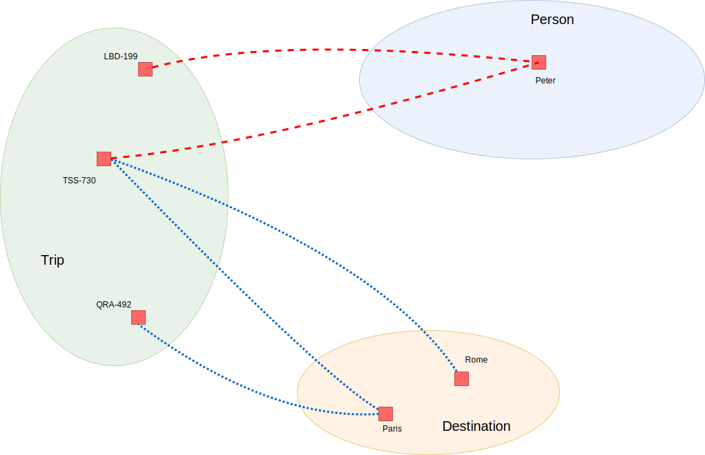

# Terms

## Purpose

The purpose of a term is to compute pairs that constitute a relation. We use operators to assemble terms from smaller terms, to express in formal language precisely what is meant in the natural language of the business. The smallest term is a single relation.

We noticed that our readers have different backgrounds. They have different preferences about the way we explain the operators in Ampersand. Some prefer an explanation in logic, others in algebra, and still others in set theory. So we decided to [explain the operators](#semantics) in many different ways simultaneously, hoping that one of them suits your preference.

## Description

A term is a combination of operators and relations. Its meaning is a set of pairs, which is in fact a newly created relation. The word "expression" may be used as a synonym for "term" in the context of Ampersand.

## Examples

`owner`

`r;s~`

`I /\ goalkeeper;goalkeeper~`

`destination;"Algarve" |- spoken;"Portugese"`

## Syntax

Every term is built out of relations, which are combined by operators. An term has one of the following 8 syntactic structures

```
<Term> <BinaryOperator> <Term>
<UnaryOpPre> <Term>
<Term> <UnaryOpPost>
<RelationRef> <type>?
I <type>?
V <type>?
<atom>
( <Term> )
```

## `Operators`

The operators come in families. We advise novices to study only the rule operators, boolean operators and relational operators. There is a wealth of things you can express with just these operators. The residual operators seem harder to learn and the Kleene operators are not fully implemented yet. You can click the hyperlink to navigate to the semantics of each family.

| Family                                       |                   binary operators | binding power |         unary operators | binding power |
| -------------------------------------------- | ---------------------------------: | ------------- | ----------------------: | ------------- |
| rules                                        |            $$=$$ and $$\subseteq$$ | 1 (weakest)   |                         |               |
| [boolean](#boolean-operators-in-logic)       |      $$\cup$$, $$\cap$$, and $$-$$ | 2             | $\overline{x}$ | prefix        |
| [relational](#relational-operators-in-logic) | $$;$$, $$\times$$, and $$\dagger$$ | 4             |         $$\smallsmile$$ | postfix       |
| [residual](#residual-operators-in-logic)     |   $$\backslash$$, $$/$$, and $$♢$$ | 3             |                         |               |
| Kleene                                       |                                    |               |         $$∗$$ and $$+$$ | postfix       |

## Brackets

Operators with different binding power may be used in the same term without brackets, because the binding power tells how it is interpreted. For example, $$r\cap s;t$$ means $$r\cap(s;t)$$ because $$;$$ has a higher binding power than $$\cap$$.

Operators with the same binding power must be used unambiguously. For example: $$r\cap(s-t)$$ means something different than $$(r\cap s)-t$$. In such cases Ampersand insists on the use of brackets, so readers without knowledge of the binding powers of the operators can read a term unambiguously.

Repeated uses of an associative operator does not require brackets. So $$r\cap s \cap t$$ is allowed because $$\cap$$ is associative.

## Notation on the keyboard

When coding in Ampersand, these operators are typed with characters on the keyboard. The following table shows the operators in math and their equivalent in code:

| operator name                |  code |          math          | remark                                     |
| ---------------------------- | :---: | :--------------------: | ------------------------------------------ |
| equivalence (equal)          |  `=`  |          $$=$$         | use only in a rule                         |
| inclusion                    | `\|-` |      $$\subseteq$$     | use only in a rule                         |
| intersect                    |  `/\` |          $$∩$$         | associative, commutative, idempotent       |
| union                        |  `\/` |          $$∪$$         | associative, commutative, idempotent       |
| difference (minus)           |  `-`  |          $$-$$         |                                            |
| complement (of some relation r) | `-`|     $$\overline{r}$$   | in code: Prefix; in math: Overline         |
| compose                      |  `;`  |          $$;$$         | associative                                |
| converse (flip)              |  `~`  |     $$\smallsmile$$    | postfix                                    |
| left residual                |  `/`  |          $$/$$         |                                            |
| right residual               |  `\`  |     $$\backslash$$     |                                            |
| diamond                      |  `<>` |      $$\Diamond$$      |                                            |
| relational product           |  `!`  |       $$\dagger$$      | associative                                |
| cartesian product            |  `#`  |       $$\times$$       | deprecated                                 |
| reflexive transitive closure |  `*`  |          $$∗$$         | in code: not implemented; in math: Postfix |
| transitive closure           |  `+`  |          $$+$$         | in code: not implemented; in math: Postfix |

## Semantics

We present the semantics of terms in 5 different (but equivalent) ways: one explanation in terms of logic, one in set theory, one in terms of axioms (algebraically), one in natural language, and one visual explanation. These ways are equivalent, so you can interpret a term in any of the presented ways. Any way will do; take your pick!

| Category        | Logic                                   | Sets                                              | Axioms                                     | Natural Language                                              | Visual                                     |
| --------------- | --------------------------------------- | ------------------------------------------------- | ------------------------------------------ | ------------------------------------------------------------- | ------------------------------------------ |
| primitive terms | [logic](#primitive-terms-in-logic)      | [set theory](#primitive-terms-in-set-theory)      | axioms                                     | [natural language](#primitive-terms-in-natural-language)      | visual                                     |
| boolean         | [logic](#boolean-operators-in-logic)    | [set theory](#boolean-operators-in-set-theory)    | [axioms](#boolean-operators-in-algebra)    | [natural language](#boolean-operators-in-natural-language)    | [visual](#boolean-operators-visualized)    |
| relational      | [logic](#relational-operators-in-logic) | [set theory](#relational-operators-in-set-theory) | [axioms](#relational-operators-in-algebra) | [natural language](#relational-operators-in-natural-language) | [visual](#relational-operators-visualized) |
| residual        | [logic](#residual-operators-in-logic)   | set theory                                        |                                            | [natural language](#residual-operators-in-natural-language)   | [visual](#semantics-visualized)            |
| products        | logic                                   | set theory                                        | axioms                                     | natural language                                              | visual                                     |

(the pages without hyperlinks are yet to be made).

### Semantics in logic

#### Primitive terms in logic

##### Relations

When a [relation](./syntax-of-ampersand#the-relation-statement) is used in a term, it stands for all pairs it contains at the moment it is evaluated. Those pairs (also referred to as the _**contents**_ or _**population**_ of the relation) can change over time as users add or delete pairs from it.

When a relation is used in a term, we can just use its name if that is unambiguous. For instance the name `owner` refers to `RELATION owner[Person*Building]` if that is the only relation the ampersand-compiler can link it to. In some cases, however the name alone is ambiguous. For example if there are two relations with the same name and different signatures. In such cases Ampersand will try to infer the type from the context. That however does not always succeed. In such cases, Ampersand generates an error message that asks you to remove the ambiguity by adding the correct type.

If a pair $$(a,b)$$ is an element of a relation $$r$$, we write $$a\ r\ b$$. Alternatively we may write $$(a,b)\in r$$ , since we know that $$r$$ is a set.

##### Identity

For every concept $$C$$, the term $$I_{[C]}$$ exists. It refers to the _**identity relation**_. It means that for every $$a\in C$$ and $$b\in C$$ we have:

$$
a = b\ \Leftrightarrow\ a\ I_{[C]}\ b
$$

The type of $$I_{[C]}$$ is $$[C*C]$$. In Ampersand code you write `I[C]`.

##### Complete relation

For every pair of concepts $$A$$ and $$B$$ the term $$V_{[A*B]}$$ refers to the _**complete relation**_. For every $$a\in A$$ and $$b\in B$$ we have:

$$
a\ V_{[A*B]}\ b
$$

The type of $$V_{[A*B]}$$ is $$[A*B]$$. In Ampersand code you write `V[A*B]`.

#### Boolean operators in logic

The notation $$a\ r\ b$$ means that the pair (a,b) is in relation $$r$$. This page defines when pair (a,b) is in relation $$r ∩ s$$ (the intersection of $$r$$ and $$s$$), $$r ∪ s$$ (the union of $$r$$ and $$s$$), $$r-s$$ (the difference of $$r$$ and $$s$$).

- intersection : $$a\ (r ∩ s)\ b\ \Leftrightarrow\ a\ r\ b\ ∧\ a\ s\ b$$ . In other words: if the pair $$(a,b)$$ is both in relation $$r$$ and $$s$$, then it is in the intersection of $$r$$ and $$s$$.
- union : $$a\ (r ∪ s)\ b\ \Leftrightarrow\ a\ r\ b\ \vee\ a\ s\ b$$ . In words: if the pair $$(a,b)$$ is in the relation $$r$$ or in $$s$$, then it is in the union of $$r$$ and $$s$$.
- difference : $$a\ (r-s)\ b\ \Leftrightarrow\ a\ r\ b\ ∧\ \neg(a\ s\ b)$$. In other words, the term $$r-s$$ contains all pairs from $$r$$ that are not in $$s$$.

The complement (or negation) of a relation $$r_{[A x B]}$$ is defined by means of the difference operator:

- complement : If $$r$$ is defined as $$r_{A\times B}$$, then $$\overline{r}$$ is the set of all tuples in $$A\times B$$ (the Cartesian product) that are not contained in $$r$$. So $$\overline{r} = V_{[A\times B]} - r$$

Note that the complement is defined in terms of $$A$$ and $$B$$. So, two relations with an identical population yet a different type may have different complements.

##### How to type boolean operators in your script

[This page](#notation-on-the-keyboard) shows how you can type boolean (and other) operators in your Ampersand script.

#### Relational operators in logic

##### Purpose of relational operators

To say things such as "the name of the owner", we want to string together multiple relations \(viz. `name` and `owner`\). Relational operators allow us to make such statements.

##### Converse

A relation can be altered by swapping the elements of every pair in the relation. Mathematically, $$(a, b)$$ is different from $$(b,a)$$. This operation is called the converse operator. It produces a new relation from an existing one. It is denoted by writing $$\smallsmile\$$ \(pronounced 'wok' or ’flip’\) after the relation name. This is how converse is defined:

$$
a(r\smallsmile)b\ \Leftrightarrow\ b\ r\ a
$$

If $$r$$ has type$$[A\times B]$$, then $$r\smallsmile$$ has type $$[B\times A]$$.

##### Composition

The composition operator is denoted by a semicolon $$;$$ between two terms. It is pronounced as 'composed with'. Let us take a look at $$r$$ composed with $$s$$. Let $$r_{[A\times B]}$$ and $$s_{[B\times C]}$$ be two relations, with the target of r being the same as the source of s. Then the composition of $$r$$ and $$s$$ is defined by:

$$
a(r;s)c\ \Leftrightarrow\ ∃ b∈B\ .\ a\ r\ b ∧ b\ s\ c
$$

If $$r$$ has type$$[A\times B]$$and $$s$$has type$$[B\times C]$$, then $$r;s$$ has type $$[A\times C]$$.

##### How to type boolean operators in your script

[This page](#notation-on-the-keyboard) shows how you can type boolean \(and other\) operators in your Ampersand script.

#### Residual operators in logic

[Residual operators](https://en.wikipedia.org/wiki/Residuated_Boolean_algebra) are used when "[material implication](https://en.wikipedia.org/wiki/Material_implication_%28rule_of_inference%29)" is involved.

- right residual : $$a\ (r\backslash s)\ b\ \Leftrightarrow\ \forall x: x\ r\ a\rightarrow x\ s\ b$$ . In other words: $$(a,b)$$ is in the right residual of $$r$$ and $$s$$ means that for every $$x$$, pair $$(x,a)$$ is in relation $$r$$ implies that pair $$(x,b)$$ is in $$s$$.
- left residual : $$a\ (s/r)\ b\ \Leftrightarrow\ \forall x: b\ r\ x\rightarrow a\ s\ x$$ . In words: $$(a,b)$$ is in the left residual of $$s$$ and $$r$$

  means that for every $$x$$ pair$$(b,x)$$ is in relation $$r$$ implies that pair $$(a,x)$$ is in $$s$$.

- diamond: $$a (r♢s) b\ \Leftrightarrow\ \forall x: a\ r\ x\ =\ x\ s\ b$$. In words: For every $$x$$, both $$a\ r\ x$$ and $$x\ s\ b$$ are true or both are false.

##### How to type boolean operators in your script

[This page](#notation-on-the-keyboard) shows how you can type boolean \(and other\) operators in your Ampersand script.

### Semantics in natural language

#### Primitive terms in natural language

##### Relations

When a [relation](./syntax-of-ampersand#the-relation-statement) is used in a term, it stands for a set of facts that are assumed true on the current time in the current context. Those facts \(also referred to as the contents or the population of the relation\) can change over time as users add or delete facts from it.

When a relation is used in a term, we can simply use its name if that is unambiguous. For instance the name `owner` refers to `RELATION owner[Person*Building]` if that is the only relation the ampersand-compiler can link it to. In some cases, however the name alone is ambiguous. For example if there are two relations with the same name and different signatures. In such cases Ampersand will try to infer the type from the context. That however does not always succeed. In such cases, Ampersand generates an error message that asks you to remove the ambiguity by adding the correct type.

If a pair $$(a,b)$$ is an element of a relation $$r$$, we write $$a\ r\ b$$ to denote the fact. It means that we consider $$a\ r\ b$$ to be true \(within the current context\).

##### Identity

Every atom in a concept $$C$$ identifies itself. If for example concept "Person" contains atoms {"Ann", "Bob", "Cecil"}, "Ann" identifies "Ann", "Bob" identifies "Bob", and "Cecil" identifies "Cecil". This makes "Ann" and "Bob" different atoms \(unequal\).

#### Boolean operators in natural language

##### Purpose of boolean operators

To say things such as pair `("peter","macbook")` is either in relation `ownsa` or `wantsa`, requires us to use boolean operators $$\cup$$, $$\cap$$, and $$-$$ .

##### Meaning

Let us explain the meaning of relational operators $$\cup$$, $$\cap$$, and $$-$$ by means of examples.

Assume we have a relation, `ownsa[Person*LaptopType]`, which contains the persons who own a particular type of laptop. A fact `"peter" ownsa "macbook"` means that Peter owns a MacBook.

Also assume another relation `wantsa[Person*LaptopType]`, which contains the persons who want a particular type of laptop. A fact `"peter" wantsa "macbook"` means that Peter wants a MacBook.

##### Union

The sentence: "Peter owns a MacBook or Peter wants a MacBook." is represented as\
`"peter"` (`ownsa` $$\cup$$ `wantsa`) `"macbook"`.

##### Intersection

The sentence: "Peter owns a MacBook and Peter wants a MacBook." is represented as\
`"peter"` (`label` $$\cap$$ `colour`) `"macbook"`.

##### Difference

The sentence: "Peter owns a MacBook and Peter does not want a MacBook." is represented as\
`"peter"` (`label` $$-$$ `colour`) `"macbook"`.

##### Natural language templates

There is a pattern to this. A computer can generate a literal translation from the formula to natural language. However, that translation looks clumsy, verbose and elaborate. It is up to you to turn that in normal language. The systematic translation is given in the following table:

| Formally            | Natural language template |
| ------------------- | ------------------------- |
| $$a\ (r\cup s)\ b$$ | `a r b `or `a s b`.       |
| $$a\ (r\cap s)\ b$$ | `a r b `and `a s b`.      |
| $$a\ (r-s)\ b$$     | `a r b `and not`a s b`.   |

#### Relational operators in natural language

##### Purpose of relational operators

To say things such as "the name of the owner", we want to string together multiple relations (viz. `name` and `owner`). Relational operators allow us to make such statements.

##### Meaning

The meaning of relational operators $$\smallsmile$$ and $$;$$ is best explained by means of examples.

Assume we have a relation, `label[Contract*Colour]`, which contains the colour of labels on contracts. A fact `"1834" label "blue"` means that contract 1834 has a blue label.

Also assume another relation `stored[Contract*Location]`, which gives the location where a contract is stored. Fact `"1834" store "cabinet 42"` means that contract 1834 is stored in cabinet 42.

##### Converse

A relation can be altered by swapping the elements of every pair in the relation. Mathematically, $$(a, b)$$ is a different from $$(b,a)$$. In natural language, however, the meaning does not change. So if`"1834" label "blue"` means that contract 1834 has a blue label, `"blue" label~ "1834"` also means that contract 1834 has a blue label.

- The sentence: "All contracts with a blue label are stored in cabinet 42." is represented as `"blue" (label\stored) "cabinet 42"`. Literally it says: For every contract, if it has a blue label, then it is stored in cabinet 42.

##### Composition

The sentence "A _contract with a blue label is stored in cabinet 42_." can be represented as `"blue" (label~;stored) "cabinet 42"`. Literally it says: There is a contract that has a blue label and is stored in cabinet 42.

##### Natural language templates

There is a pattern to this. A computer can generate a literal translation from the formula to natural language. However, that translation looks clumsy, verbose and elaborate. It is up to you to turn that in normal language. The systematic translation is given in the following table:

| Formally    | Natural language template                   |
| ----------- | ------------------------------------------- |
| `a (r;s) b` | There exists an x : if `a r x`then `x s b`. |
| `b r~ a`    | `a r b`.                                    |

The natural language translation for `b r~ a`is the same as language translation for `a r b`.

#### Residual operators in natural language

The meaning of residual operators $$/$$, $$\backslash$$, and $$\diamond$$ is best explained by means of examples.

Assume we have a relation, `label[Contract*Colour]`, which contains the colour of labels on contracts. A fact `"1834" label "blue"` means that contract 1834 has a blue label.

Also assume another relation `stored[Contract*Location]`, which gives the location where a contract is stored. Fact `"1834" store "cabinet 42"` means that contract 1834 is stored in cabinet 42.

- The sentence: "All contracts with a blue label are stored in cabinet 42." is represented as `"blue" (label\stored) "cabinet 42"`. Literally it says: For every contract, if it has a blue label, then it is stored in cabinet 42.
- The sentence: "All contracts that are stored in cabinet 42 have a blue label." is represented as `"blue" (label~/stored~) "cabinet 42"`. Literally it says: For every contract, if it is stored in cabinet 42, then it has a blue label.
- The sentence: "All blue labeled contracts and no others are stored in cabinet 42." is represented as `"blue" (label~<>stored) "cabinet 42"`. Literally it says: For every contract, if it has a blue label, then it is stored in cabinet 42 and if it is stored in cabinet 42, then it has a blue label.

##### Natural language templates

There is a pattern to this. A computer can generate a literal translation from the formula to natural language. However, that translation looks clumsy, verbose and elaborate. It is up to you to turn that in normal language. The systematic translation is given in the following table:

| Formally     | Natural language template                                           |
| :----------- | :------------------------------------------------------------------ |
| `a (r\s) b`  | For every `x`: if `x r a`then `x s b`.                              |
| `a (r/s) b`  | For every `x`: if `b s x` then `a r x`.                             |
| `a (r<>s) b` | For every `x`: if `a r x` then `x s b` and if `x s b` then `a r x`. |

### Semantics in set theory

#### Primitive terms in set theory

##### Relations

When a [relation](./syntax-of-ampersand#the-relation-statement) is used in a term, it stands for the set of pairs it contains at the moment it is evaluated. That set \(also referred to as the contents of the relation\) can change over time as users add or delete pairs from it.

When a relation is used in a term, we can simply use its name if that is unambiguous. For instance the name `owner` refers to `RELATION owner[Person*Building]` if that is the only relation the ampersand-compiler can link it to. In some cases, however the name alone is ambiguous. For example if there are two relations with the same name and different signatures. In such cases Ampersand will try to infer the type from the context. That however does not always succeed. In such cases, Ampersand generates an error message that asks you to remove the ambiguity by adding the correct type.

If a pair $$(a,b)$$ is an element of a relation $$r$$, we write $$(a,b)\in r$$. Alternatively we may write $$a\ r\ b$$.

##### Identity

For every concept $$C$$, the term $$I_{[C]}$$ represents the _**identity relation**_. It is defined by:

$$
I_{[C]}\ =\ \{(c,c) |\ c\in C\}
$$

The type of $$I_{[C]}$$ is $$[C*C]$$. In Ampersand code you write `I[C]`.

##### Complete relation

For every pair of concepts $$A$$ and $$B$$ the term $$V_{[A*B]}$$ represents the _**complete relation**_. It is defined by:

$$
V_{[A*B]}\ =\ \{(a,b) |\  a\in A\ \wedge\ b\in B\}
$$

The type of $$V_{[A*B]}$$ is $$[A*B]$$. In Ampersand code you write `V[A*B]`.

#### Boolean operators in set theory

A relation is by definition a subset of the Cartesian Product of the source and target sets. So, if two different relations r and s are defined on the same source A and target B, then the ordinary set operators can be applied to produce a new relation.

- intersection : $$r ∩ s$$ is the set that contains the elements that are contained in relation $$r$$ as well as in $$s$$, or $$r ∩ s\ =\ \{ (x,y)\ |\ (x,y) ∈ r ∧ (x,y) ∈ s \}$$
- union : $$r ∪ s$$ is the set that contains all elements that are contained either in relation $$r$$ or in $$s$$, or $$r ∪ s\ =\ \{ (x,y)\ |\ (x,y) ∈ r ∨ (x,y) ∈ s \}$$
- difference : $$r - s$$ is the set that contains the elements of relation $$r$$ that are not contained in $$s$$, or $$r - s\ =\ \{ (x,y)\ |\ (x,y) ∈ r ∧ (x,y) ∉ s \}$$

The complement \(or negation\) of a relation $$r_{[A x B]}$$ is defined by means of the difference operator:

- complement : If $$r$$ is defined as $$r_{A\times B}$$, then $$\overline{r}$$ is the set of all tuples in $$A\times B$$ \(the Cartesian product\) that are not contained in $$r$$. So $$\overline{r} = V_{[A\times B]} - r$$

Note that the complement is defined in terms of $$A$$ and $$B$$. So, two relations with the identical population yet a different type may have different complements.

##### How to type boolean operators in your script

[This page](#notation-on-the-keyboard) shows how you can write these things in your Ampersand script.

#### Relational operators in set theory

##### Purpose of relational operators

To say things such as "the name of the owner", we want to string together multiple relations \(viz. `name` and `owner`\). Relational operators allow us to make such statements.

##### Converse

A relation that contains pairs of the form $$(a, b)$$ can be altered by swapping the elements of every pair in the relation. Mathematically, $$(a, b)$$ is different from $$(b,a)$$. This operation is called the converse operator. It produces a new relation from an existing one. It is denoted by writing $$\smallsmile$$ \(pronounced 'wok' or ’flip’\) after the relation name. This is how converse is defined:

$$
r\smallsmile\ =\ \{ (b, a) | (a, b)∈r \}
$$

If $$r$$ has type $$[A\times B]$$, then $$r\smallsmile$$ has type $$[B\times A]$$.

##### Composition

The composition operator is denoted by a semicolon ; between two terms. It is pronounced as 'composed with', in this case: $$r$$ composed with $$s$$.

The composition operation is defined as follows: Let $$r_{[A\times B]}$$ and $$s_{[B\times C]}$$ be two relations, with the target of r being the same as the source of s. Then the composition of $$r$$ and $$s$$, is a relation with signature $$(r;s)_{[A\times C]}\ =\ \{ (a, c) | ∃ b∈B\ .\ a\ r\ b ∧ b\ s\ c \}$$

## Semantics in relational algebra

### Semantics of primitive terms in relational algebra

This chapter discusses the [boolean operators](#boolean-operators-in-algebra) and the [relational operators](#relational-operators-in-algebra) in the following sections.

#### Boolean operators in algebra

The boolean operators of Ampersand behave as one would expect in any boolean algebra. Union ($$\cup$$) and intersection ($$\cap$$) are both idempotent, commutative, and associative operators. In Ampersand we use a binary difference operator over with the usual semantics: $$(r-s)\cup(r\cap s) = r$$. The (more customary) complement operator is a partial function, because Ampersand supports heterogeneous relation algebra.

##### Union

The operator $$\cup$$ (union) satisfies the following axioms:

1. (commutativity of $$\cup$$) $$r\cup s\ =\ s\cup r$$
2. (associativity of $$\cup$$) $$r\cup (s\cup t)\ =\ (r\cup s)\cup t$$
3. (idempotence of $$\cup$$) $$r\cup r\ =\ r$$

##### Difference

The difference $$r-s$$ is the smallest relation $$t$$ that satisfies $$r\ \subseteq\ s\cup t$$. Smallest means: If there is a $$t'$$ for which $$s\cup t'=r$$, this implies that $$t\cup t'=t'$$.

##### Intersection

The intersection $$\cap$$ is defined as: $$r \cap s = r-(r-s)$$

##### Complement

The complement operator is defined as $$\overline{t} = V_{[A\times B]} - t$$. The type $$[A\times B]$$ comes from the term(s) in which $$t$$ is embedded. If that type does not exist or if it is ambiguous, Ampersand will refuse to compile with an appropriate error message.

##### How to type boolean operators in your script

[This page](#notation-on-the-keyboard) shows how you can write these things in your Ampersand script.

#### Relational operators in algebra

##### Purpose of relational operators

To say things such as "the name of the owner", we want to string together multiple relations \(viz. `name` and `owner`\). Relational operators allow us to make such statements.

There are two relational operators: the converse \($$\smallsmile$$\) and the composition \(semicolon $$;$$ \). This page discusses the most important laws about these operators.

##### Converse

There are two things you should know about the converse operator. The first is that the converse of the converse gives you the relation itself, whatever that relation may be:

$$
{r\smallsmile}\smallsmile\ =\ r
$$

The second thing you should know is that arguments switch places if the converse is brought outside \(or inside\) brackets

$$
r\smallsmile ; s\smallsmile\ =\ (s;r)\smallsmile
$$

##### Composition

The composition operator is denoted by a semicolon \(;\) between two terms. It is pronounced as 'composed with', in this case: $$r$$ composed with $$s$$.

Composition is associative, which means:

$$
r;(s;t)\ =\ (r;s);t
$$

The meaning stays the same, no matter how you place the brackets. So Ampersand lets you omit brackets entirely. You may write $$r;s;t$$ instead of $$r;(s;t)$$ or $$(r;s);t$$.

Composition has a left and a right identity. Let $$r_{[A\times B]}$$ be a relation, then

$$
I_A;r\ =\ r\ \ \ \text{and}\ \ \ r;I_B\ =\ r
$$

##### How to type relational operators in your script

[This page](#notation-on-the-keyboard) shows how you can write these things in your Ampersand script.

### Semantics visualized

For a visual presentation of the semantics of terms, we use [Venn-diagrams](https://en.wikipedia.org/wiki/Venn_diagram).

#### Boolean operators visualized

Consider two relations: `authorized[Account*Person]` and `beneficiary[Account*Person]`. The first relation tells which persons are authorized to which accounts. The diagram shows this as red dashed lines. The second relation tells which persons stand to benefit from which accounts.. It is depicted by dotted blue lines in the diagram.


This diagram gives an example population of the relations `authorized[Account*Person]` and `beneficiary[Account*Person]`. Bob is authorized for account DE9382991 and Ann is authorized for account RS746620. Carl stands to benefit from account NL19RABO03992844 and Ann stands to benefit from account RS746620. Formally, we say:

| statements                              |
| --------------------------------------- |
| `"NL19RABO03992844" beneficiary "Carl"` |
| `"DE9382991" authorized "Bob"`          |
| `"RS746620" authorized "Ann"`           |
| `"RS746620" beneficiary "Ann"`          |

By combining the relations `authorized` and `beneficiary`, we can derive the following true statements.

| statement                                             | natural language                                                           |
| ----------------------------------------------------- | -------------------------------------------------------------------------- |
| `"RS746620" (authorized/\beneficiary) "Ann"`          | Ann is authorized for and stands to benefit from for account RS746620.     |
| `"NL19RABO03992844" (authorized\/beneficiary) "Carl"` | Carl is authorized for or stands to benefit from account NL19RABO03992844. |
| `"RS746620" (authorized\/beneficiary) "Ann"`          | Ann is authorized for or stands to benefit from account RS746620.          |
| `"DE9382991" (authorized\/beneficiary) "Bob"`         | Bob is authorized for or stands to benefit from account DE9382991.         |

A different way to state the same is:

|                                                                                                                                                                                          |
| ---------------------------------------------------------------------------------------------------------------------------------------------------------------------------------------- |
| `authorized/\beneficiary = {("RS746620", "Ann")}`                                                                                                                                        |
| <p><code>authorized\/beneficiary =</code> </p><p> <code>{ ("NL19RABO03992844", "Carl")</code></p><p> <code>, ("RS746620", "Ann")</code></p><p> <code>, ("DE9382991", "Bob") }</code></p> |

#### Relational operators visualized

Consider two relations: `traveler[Trip*Person]` and `dest[Trip*Destination]`. The first relation tells which persons have traveled on which trip. The diagram shows this as red dashed lines. The second relation links trips to destinations. It is depicted by dotted blue lines in the diagram.



Each pair (fact) in the diagram can be written as a fact in two ways, using the converse operator:

| Fact                          | Fact                         |
| ----------------------------- | ---------------------------- |
| `"Peter" traveler~ "LBD-199"` | `"LBD-199" traveler "Peter"` |
| `"Peter" traveler~ "TSS-730"` | `"TSS-730" traveler "Peter"` |
| `"TSS-730" dest "Rome"`       | `"Rome" dest~ "TSS-730"`     |
| `"TSS-730" dest "Paris"`      | `"Paris" dest~ "TSS-730"`    |
| `"QRA-492" dest "Paris"`      | `"Paris" dest~ "QRA-492"`    |

From the diagram, we assume that each pair represents a true statement (i.e. a fact). The statements are given both formally and in natural language. The elaborate version is a literate translation of the [semantics in logic](#residual-operators-in-logic). The ordinary version tells the same in a more human sounding manner.

| Formal statement                   | Elaborate natural language                                           | Ordinary natural language      |
| ---------------------------------- | -------------------------------------------------------------------- | ------------------------------ |
| `"Peter" (traveler~;dest) "Rome"`  | There is a trip that Peter has made, which has Rome as destination.  | Peter has made a trip to Rome. |
| `"Peter" (traveler~;dest) "Paris"` | There is a trip that Peter has made, which has Paris as destination. | Peter has made a trip to Paris |

#### Residual operators visualized

Consider two relations: `traveler[Trip*Person]` and `dest[Trip*Destination]`. The first relation tells which persons have traveled on which trip. The diagram shows this as red dashed lines. The second relation links trips to destinations. It is depicted by dotted blue lines in the diagram.


From this diagram, we can tell which statements are true (i.e. facts). The statements are given both formally and in natural language. The elaborate version is a literate translation of the [semantics in logic](#residual-operators-in-logic). The ordinary version tells the same in a more human sounding manner.

| Formal statement                   | Elaborate natural language                                                 | Ordinary natural language                  |
| ---------------------------------- | -------------------------------------------------------------------------- | ------------------------------------------ |
| `"Peter" (traveler~/dest~) "Rome"` | For each trip, if it has destination Rome, then it has been made by Peter. | Every trip to Rome has been made by Peter. |

The following statements do _**NOT**_ follow from the population shown in the diagram:

| Formal statement                    | Elaborate natural language                                                | Ordinary natural language                                         |
| ----------------------------------- | ------------------------------------------------------------------------- | ----------------------------------------------------------------- |
| `"Peter" (traveler\dest) "Rome"`    | For each trip, if Peter has made the trip then its destination is Rome.   | Every trip that Peter made has Rome as destination.               |
| `"Peter" (traveler\dest) "Paris"`   | For each trip, if Peter has made the trip then its destination is Paris.  | <p>Every trip that Peter made has</p><p>Paris as destination.</p> |
| `"Peter" (traveler~/dest~) "Paris"` | For each trip, if Paris is the destination then Peter has made that trip. | Every trip to Paris has been made by Peter.                       |
