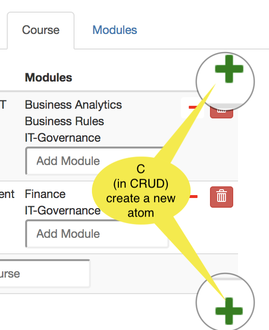
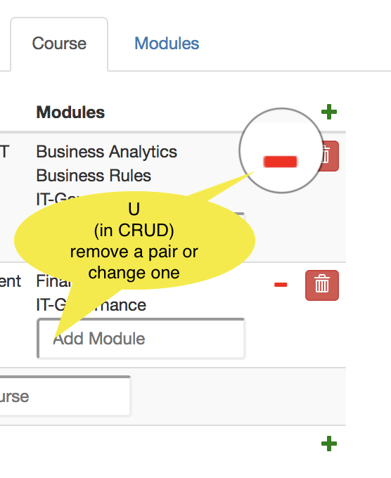
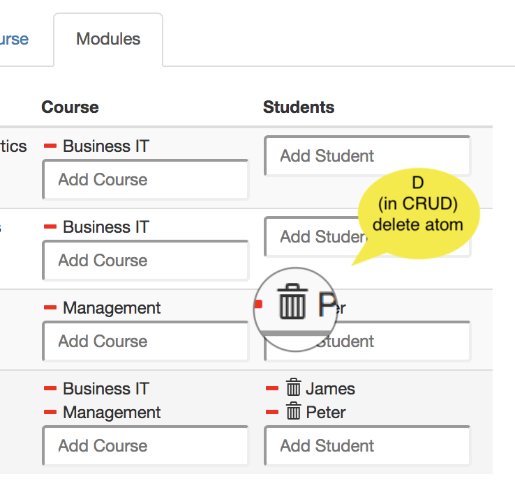

# Services

<!-- Purpose -->
A service is a component of an information system that exposes functionality and data from a [context](./context.md), to let users or information systems interact by creating, reading, updating, and deleting data.

## Description

A service is a component of an information system. Its life starts when it is deployed and ends when it is pulled back. A typical instance is a user interface based on HTML-CSS that runs in a browser. But an application program interface \(API\) that serves other computers with web services is a perfectly valid instance as well.

The definition of a service specifies which data is presented to which users. For every different use of the system a different service can be defined. This may lead to a substantial amount of services for large and complex systems. However, one device will show one service only at any given moment in time.

[This page](syntax-of-interface-statements) gives syntactic details of services. Please find tutorial explanations [here](../../tutorial/services.md).

## Example

```text
INTERFACE Overview : "_SESSION"                  cRud
BOX <TABS>
     [ Students : V[SESSION*Student]             cRuD
       BOX <TABLE>
                [ "Student" : I[Student]         cRud
                , "Enrolled for" : isEnrolledFor cRUD
                , "Course" : takes CRUD
                ]
     , Course : V[SESSION*Course]                cRuD
       BOX <TABLE>
                [ "Course" : I                   cRud
                , "Modules" : isPartOf~          CRUD
                ]
     , Modules : V[SESSION*Module]               cRud
       BOX <TABLE>
                [ "Modules" : I                  cRuD
                , "Course" : isPartOf            cRUd
                , "Students" : isEnrolledFor~    CRUD
                ]
     ]
```

This example specifies three tabs. One shows students, one shows courses and one shows modules. This is what it looks like when run in a browser:


<a name="syntax-of-interface-statements"></a>
## Syntax and Meaning
This chapter gives the formal syntax of services for the purpose of reference.

A service specification has the following structure. It is identical for user interfaces (`INTERFACE`) and application programming interfaces (`API`).

```
INTERFACE <name> <forRoles>? : <term> <crud>? <view>? <subinterface>?
API       <name> <forRoles>? : <term> <crud>? <view>? <subinterface>?
```

The name of a service must be unique within the context. The term defines the atoms to which the interface can be applied. The (optional) crud annotation constrains the possible interactions a user can do. The (optional) views determine what the service will look like. If no view is specified, the service will look like the screenshot above. Finally the sub-interface contains all the contents, i.e. the fields, field names and the constraints on them.

The hierarchy of boxes in a service comes from the following (recursive) syntax of `<subinterface>`.

A sub-interface may be defined on the spot (by `<boxKey> <box>`) or it may link to another service to reuse its structure:

```
<subinterface> ::= <boxKey> <box>
                 | LINKTO ( INTERFACE | API ) <name>
```

The boxKey is meant to tell the front-end application what the service looks like. The compiler uses templates to adapt an interface to specific needs regarding its HTML structure. Please read the [documentation of templates](../The-language-Ampersand.md#layout-of-interfaces) for details.

```
<boxKey> ::= BOX '<' <htmlname> '>'
           | BOX
```

If no htmlname is specified, Ampersand uses `BOX <FORM>` by default.

A box is simply a list of service items (`ifcItem`) separated by commas. Each service item specifies a field in the service or a sub-interface.

```
<box> ::= '[' <ifcItem> ( ',' <ifcItem> )* ']'
```

Each service item has a label that must be unique within the box. After the colon there is either a term or a text. The term specifies which data is related to the field it specifies if it has no sub-interface. If it does, it specifies the atoms on which the box is applied.

```
<ifcItem> ::= <label> ':' <term> <crud>? <view>? <subinterface>?
            | <label> ':' <text>
```

## Layout of user interfaces

Ampersand is meant for back-end design. It offers no features for front-end design. For that purpose we advise you use contemporary front-end tools for web-based applications. Your Ampersand application is [designed to be adaptable](../../architecture-of-an-ampersand-application/README.md), especially for this purpose.

However, Ampersand offers a few layout features that let you place items. It has three built-in layout options, [colums](#table-layout), [rows](#forms-layout) and [tabs](#tabs-layout), which you can mix freely.

<a name="table-layout"></a>
### Table layout

The column layout uses `BOX <TABLE>` to instruct the front-end application to use a tabular layout in user interfaces. Here is an example of a service, which uses the table layout.

```
INTERFACE Overview : "_SESSION"                  cRud
BOX <TABS>
     [ Students : V[SESSION*Student]             cRuD
       BOX <TABLE>
                [ "Student" : I[Student]         cRud
                , "Enrolled for" : isEnrolledFor cRUD
                , "Course" : takes CRUD
                ]
     , Course : V[SESSION*Course]                cRuD
       BOX <TABLE>
                [ "Course" : I                   cRud
                , "Modules" : isPartOf~          CRUD
                ]
     , Modules : V[SESSION*Module]               cRud
       BOX <TABLE>
                [ "Modules" : I                  cRuD
                , "Course" : isPartOf            cRUd
                , "Students" : isEnrolledFor~    CRUD
                ]
     ]
```

This service shows three columns in the user interface, **Students**, **Course** and **Modules**. The first column is not readable, because the [CRUD annotation](#CRUD) blocks this column for reading. It would have shown students in each row, because the target of `V[SESSION*Student]`is `Student`. The second column shows courses in two columns, **Course** and **Modules**. The third column shows modules in three columns. This is what the user will see on the screen.


<a name="forms-layout"></a>
### ROW layout

The row layout uses  `BOX <FORM>` to instruct the front-end application to layout the user interface row by row. Here is an example of a service, which uses the row layout on the top level.

```
INTERFACE Overview : "_SESSION"                  cRud
BOX <FORM>
     [ Students : V[SESSION*Student]             cRuD
        BOX <FORM>
                [ "Student" : I[Student]         CRUD
                , "Enrolled for" : isEnrolledFor cRUD
                , "Course" : takes               CRUD
                ]
     , Course : V[SESSION*Course]                CRUD
        BOX <FORM>
                [ "Course" : I                   cRud
                , "Modules" : isPartOf~          CRUD
                ]
     ]
```

This service shows three rows in the user interface, **Students**, **Course** and **Modules**. The first column shows students in each of its rows. Each student is shown in the column layout. The second row shows courses in two columns, **Course** and **Modules**. Please read about [templates](../The-language-Ampersand.md#layout-of-interfaces) if you are curious which other ways of displaying information there are besides `BOX <FORM>`.  Please read the [explanation of CRUD annotations](#CRUD) if you are curious about the CRUD annotations. This is what the user will see on the screen.


<a name="tabs-layout"></a>
### Tabs layout

The column layout uses `BOX <TABS>` to instruct the front-end application to tabs in the user interface. Here is an example of a service, which uses the column layout.

```
INTERFACE Overview : "_SESSION"                  cRud
BOX <TABS>
     [ Students : V[SESSION*Student]             cRuD
        BOX <TABLE>
                [ "Student" : I[Student]         CRUD
                , "Enrolled for" : isEnrolledFor cRUD
                , "Course" : takes CRUD
                ]
     , Course : V[SESSION*Course]                CRUD
        BOX <TABLE>
                [ "Course" : I                   cRud
                , "Modules" : isPartOf~          CRUD
                ]
     , Modules : V[SESSION*Module]               cRud
        BOX <TABLE>
                [ "Modules" : I                  cRuD
                , "Course" : isPartOf            cRud
                , "Students" : isEnrolledFor~    CRUD
                ]
     ]
```

This service shows three tabs in the user interface, **Students**, **Course** and **Modules**. Only one tab is shown at a time, to avoid cluttered data. This is what the user will see on the screen.


We have discussed the `FORM`, `TABLE`, and `TABS` layout options. Please note that these options do not change the semantics; whatever your options, Ampersand displays the same data in the same fields.

<a name="layout-and-widgets"></a>
### Your own layout and your own widgets \(HTML and CSS\)

You don't have to put up with the [Ampersand built-in layout options](../The-language-Ampersand.md#layout-of-interfaces) if they don't suit your purpose. You can change most anything by including your own code snippets.  \(to be done...\). 

## CRUD {#CRUD}

CRUD annotations are used in services to constrain the functionality of fields and boxes in an `INTERFACE`-statement. This allows you to minimize the functionality for your users, to design for easy learning.

Each CRUD annotation comes right after a [term](./terms.md), so we can always refer to "the term" to which a CRUD annotation belongs. A CRUD annotation constrains the things your user can do with the target atoms and the pairs of its term.

The CRUD-annotation specifies Create, Read, Update, and Delete rights for the term it follows. Capital = allowed, Non-capital = not allowed. CRUD is the default, so if you specify nothing, everything is allowed. The following service definition illustrates this.

```
INTERFACE Overview : "_SESSION"                  cRud
BOX <TABS>
     [ Students : V[SESSION*Student]             cRuD
       BOX <TABLE>
                [ "Student" : I[Student]         cRud
                , "Enrolled for" : isEnrolledFor cRUD
                , "Course" : takes CRUD
                ]
     , Course : V[SESSION*Course]                cRuD   -- used for a box
       BOX <TABLE>
                [ "Course" : I                   cRud   -- used for a field
                , "Modules" : isPartOf~                 -- CRUD is default
                ]
     , Modules : V[SESSION*Module]               cRud
       BOX <TABLE>
                [ "Modules" : I                  cRuD
                , "Course" : isPartOf            cRUd
                , "Students" : isEnrolledFor~    CRUD
                ]
     ]
```

The user interface defined by this service is shown as a screenshot below. Notice that the lowercase r in the annotation of the Students box prevents showing the underlying box. The full CRUD functionality in Course yields 'create' functionality (the green plus-button), 'remove pair' functionality (red minus button), and 'delete atom' functionality (the red trash can button). The lowercase c, u, and d in the Modules box prevents displaying that functionality in the user interface.


The next sections give some more detailed information on the run time semantics for CRUD annotations as implemented in Ampersand.

### Create

| CRUD | for a box                                                                                                                                                                                                 | for a field.                                                                                                                                                                                                                                                  |
| ---- | --------------------------------------------------------------------------------------------------------------------------------------------------------------------------------------------------------- | ------------------------------------------------------------------------------------------------------------------------------------------------------------------------------------------------------------------------------------------------------------- |
| C    |  A + (plus) button is displayed that lets you create a new atom, but only if the box-expression is editable. |  Enter a new atom and a `+` button appears. Click the + to add that atom to the listed set of atoms. If you enter an atom that exists (Peter), you can select it. |
| c    | Atoms cannot be created                                                                                                                                                                                   | Atoms cannot be created                                                                                                                                                                                                                                       |

### Read

| Read | CRUD for boxes      |   | CRUD for fields     |
| ---- | ------------------- | - | ------------------- |
| R    | Read is allowed     |   | Read is allowed     |
| r    | Read is not allowed |   | Read is not allowed |

### Update

| Update | CRUD for boxes                                                                                                                                                                                                                                               | CRUD for fields                                                                                                                                                                                                                                                |
| ------ | ------------------------------------------------------------------------------------------------------------------------------------------------------------------------------------------------------------------------------------------------------------ | -------------------------------------------------------------------------------------------------------------------------------------------------------------------------------------------------------------------------------------------------------------- |
| U      |  Removing and/or adding a pair (src,tgt) is allowed if expr is editable and the atom exists. Deleting a pair is done with the - button; the atom will NOT be deleted. |  Removing and/or adding a pair (src,tgt) is allowed if expr is editable and the atom exists. Deleting a pair is done with the - button; the atom will NOT be deleted. |
| u      | Update is not allowed                                                                                                                                                                                                                                        | Update is not allowed                                                                                                                                                                                                                                          |

### Delete

| Delete | CRUD for boxes                                                                                                                                                                          | CRUD for fields                                                                                                                                |
| ------ | --------------------------------------------------------------------------------------------------------------------------------------------------------------------------------------- | ---------------------------------------------------------------------------------------------------------------------------------------------- |
| D      |  Deleting a pair is done with the - (minus) button. Deleting an atom is done with the trash bin. |  Delete atom (tgt) and all pairs in which it is used. |
| d      | delete not allowed                                                                                                                                                                      | delete not allowed                                                                                                                             |

A top-level Update or Create are common in my own scripts, e.g. to create an overview of People and be able to create a new Person: `INTERFACE "People" : V[SESSION*Person] CRud COLS []`. And update is also possible.

### Things to remember

1. The red minus is enabled by `U`. It unlinks an atom (by deleting a pair from a relation) and leaves the atom alone.
2. The red trash bin is enabled by `D`. It removes an atom and all pairs in which that atom is used.

### Background

Motivations for CRUD-functionality are found in the [GitHub discussions on CRUD](https://github.com/AmpersandTarski/Ampersand/issues?utf8=%E2%9C%93\&q=is%3Aissue+label%3Acrud+) functionality.

## Using a service

On the user screen each atom is displayed in some form as data. If a service exists for that atom, that is shown to the user as a hyperlink to which you can navigate.

When running an application in your browser, you are watching one user interface at any given moment in time. Each hyperlink on your screen represents an atom to which some service applies. To navigate to that user interface, you click on the hyperlink. You will see the service being applied solely to the atom you just clicked. To determine the atom\(s\) to which a service applies, each service has an _interface term_.

The next sections contain two examples:

* a [client service](../../Examples.md#services-example-client) to allow clients of a web shop to change their name and address and show them status information of their orders;
* a [login service](../../Examples.md#services-example-login) to demonstrate how to get different interface structures under varying conditions.

