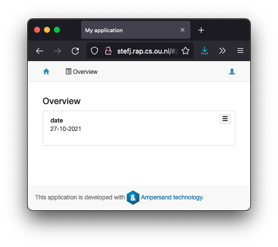

# Current date

The runtime system of Ampersand contains a function that produces the current date. Here is an example how to use it:

```
CONTEXT CurrentDate

   RELATION sessionToday[SESSION*Date] -- or whatever the DateTime concept is called
   REPRESENT Date TYPE DATE
   ROLE ExecEngine MAINTAINS "Initialize today's date"
   RULE "Initialize today's date": I[SESSION] |- sessionToday;sessionToday~
   VIOLATION (TXT "{EX} SetToday;sessionToday;SESSION;", SRC I, TXT ";Date")

INTERFACE Overview : "_SESSION" cRud
BOX [ date : sessionToday cRuD ]

ENDCONTEXT
```

If you run this program, this is what you'll see



### Explanation

The rule "Initialize today's date" tells us that there must be a date for every session. When your session starts, there is a session atom: `_SESSION`. The relation `sessionToday` does not relate that session atom to a date, so the rule is violated. As a consequence, the ExecEngine triggers the violation and calls the function `SetToday`. That PHP-function creates the desired link in the relation `sessionToday`. That is then displayed in the user screen.
