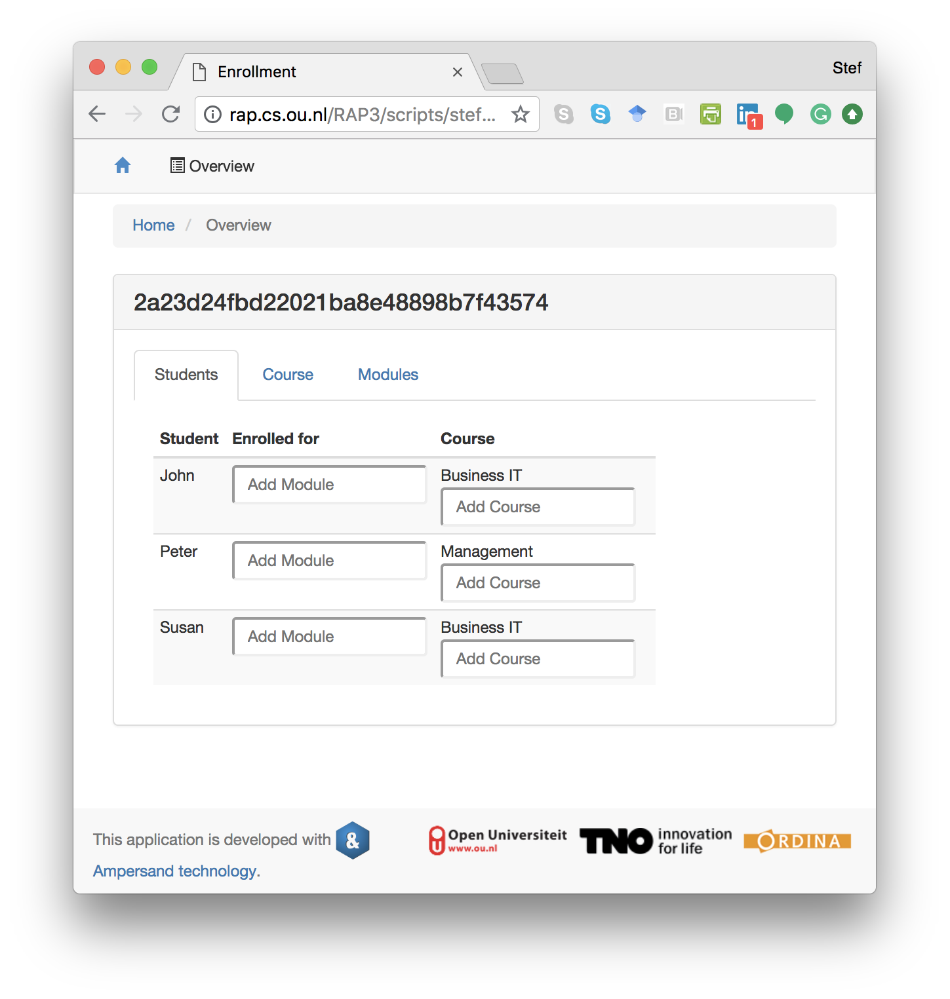

# Services

## Purpose

A service is a component of an information system that exposes functionality and data from a [context](../context.md), to let users or information systems interact by creating, reading, updating, and deleting data.

## Description

A service is a component of an information system. Its life starts when it is deployed and ends when it is pulled back. A typical instance is a user interface based on HTML-CSS that runs in a browser. But an application program interface \(API\) that serves other computers with web services is a perfectly valid instance as well.

The definition of a service specifies which data is presented to which users. For every different use of the system a different service can be defined. This may lead to a substantial amount of services for large and complex systems. However, one device will show one service only at any given moment in time.

[This page](syntax-of-interface-statements.md) gives syntactic details of services. Some more explanations [are found here](../syntactical-conventions/explanations.md).

## Example

Please note that the keyword `INTERFACE` is still used. That may be confusing. In a future release of Ampersand the keyword `INTERFACE` will become obsolete and the word `SERVICE` will be used.

```text
INTERFACE Overview : "_SESSION"                  cRud
BOX <TABS>
     [ Students : V[SESSION*Student]             cRuD
       BOX <TABLE>
                [ "Student" : I[Student]         cRud
                , "Enrolled for" : isEnrolledFor cRUD
                , "Course" : takes CRUD
                ]
     , Course : V[SESSION*Course]                cRuD
       BOX <TABLE>
                [ "Course" : I                   cRud
                , "Modules" : isPartOf~          CRUD
                ]
     , Modules : V[SESSION*Module]               cRud
       BOX <TABLE>
                [ "Modules" : I                  cRuD
                , "Course" : isPartOf            cRUd
                , "Students" : isEnrolledFor~    CRUD
                ]
     ]
```

This example specifies three tabs. One shows students, one shows courses and one shows modules. This is what it looks like when run in a browser:



## Syntax and Meaning

Due to the complexity of services, its syntax and meaning are discussed in [a separate section](syntax-of-interface-statements.md).

## Using a service

On the user screen each atom is displayed in some form as data. If a service exists for that atom, that is shown to the user as a hyperlink to which you can navigate.

When running an application in your browser, you are watching one user interface at any given moment in time. Each hyperlink on your screen represents an atom to which some service applies. To navigate to that user interface, you click on the hyperlink. You will see the service being applied solely to the atom you just clicked. To determine the atom\(s\) to which a service applies, each service has an _interface term_.

The next sections contain two examples:

* a [client service](example-client.md) to allow clients of a web shop to change their name and address and show them status information of their orders;
* a [login service](example-login.md) to demonstrate how to get different interface structures under varying conditions.

