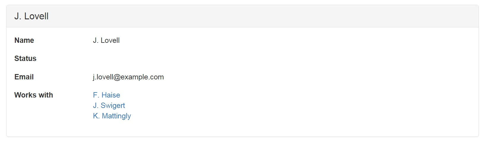
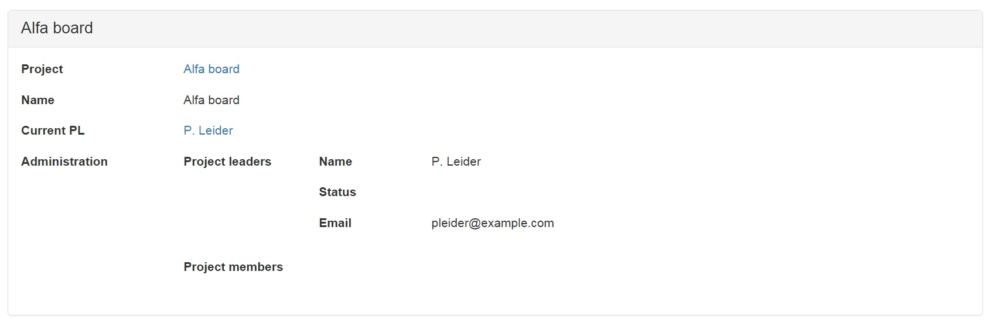
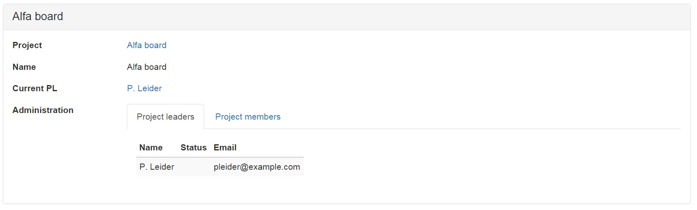

# Explanation

Services are meant to expose functionality and data from a [context](../context.md), to let users or information systems interact with the system by creating, reading, updating, and deleting data.

Note: The service definition must be outside a pattern

## Example

The following figure is an example of a user interface, which shows the name, status, e-mail and co-workers of a person called "J. Lovell".



The specification of this user interface is given in the following service definition:

```
INTERFACE Person : I[Person]
BOX
  [ "Name"       : personName
  , "Status"     : personStatus
  , "Email"      : personEmail
  , "Works with" : workswith 
  ]
```

To understand this fragment, take notice of:

1. The name of this service is `Person`. This name immediately follows the keyword `INTERFACE`.
2. The term following the colon, `I[Person]`, is the interface term of this service.
3. The service can be applied to any atom from the _domain of the interface term_. So this particular service is applicable to any atom of type `Person`. In the screenshot, it applies to `"J. Lovell"`.
4. The labels "Name", "Status", "Email", and "Works with" correspond to field names in the user interface. &#x20;
5. Each term at the right of a field name specifies which data is presented in the field. For this reason it is called the _field term_ for that field. Field name and field term are separated by a colon.
6. Of all pairs `<"J. Lovell", x>` from the field term, the field displays the right atom `x`. A field term always works on one specific atom on the left, which is `"J. Lovell"` in this example.
7.  Field terms are subject to type checking. The following relations provide an example for getting a type-correct service:

    ```
    RELATION personName :: Person * PersonName [UNI]
    RELATION personStatus :: Person * PersonStatus [UNI]
    RELATION personEmail :: Person * Email [UNI,TOT]
    RELATION workswith :: Person * Person
    ```

    The source concepts of a field term must match the target concept of the interface term.
8. Looking at the screenshot, we can tell that `"J. Lovell"` has one personName (which is `"J. Lovell"`), it has no personStatus, one personEmail and three persons to work with in `RELATION workswith`.

## Nesting

You can create structure in a service by nesting. Here is an example:



The specification of this service is given in the following code fragment.

```
INTERFACE "Project"  : I[Project] BOX
  [ "Project"     : I[Project]
  , "Name"        : projectName
  , "Current PL"  : pl
  , "Administration" : I[Project] BOX
     [ "Project leaders" : project~;assignee/\pl BOX
        [ "Name"      : personName
        , "Status"    : personStatus
        , "Email"     : personEmail
        ]
     , "Project members" : project~;assignee/\member BOX
        [ "Name"      : personName
        , "Status"    : personStatus
        , "Email"     : personEmail
        ]
     ]
  ]
```

Notice the following features:\
1\. The structure of a service is hierarchical. It consists of boxes within a box. This is because a field term may be followed by a `BOX` with a list of subservices. Without it, it is just a field term. 2. When a field term is followed by a `BOX`, every atom in the _codomain of the field term_ is displayed in a box of its own on the screen. That box behaves like a service with the field term serving as interface term of that subservice. 3. By this mechanism, the hierarchical structure of the entire service translates directly to the hierarchical structure of the web-page in which it is displayed. 4. The source concept of a field term must match with the target concept of the field term outside the box.\
5\. The target concept of a field term that has a box, must match with the source concepts of each field inside that box.

## Formatting

Especially in more complicated services, you will find it nice to adapt the layout of the fields in the user interface. For this purpose, you can substitute the word `BOX` by `COLS`, `ROWS`, or `TABS`, as in the following code fragment. Note that these annotation have no meaning other than to change what the user interface looks like.

```
INTERFACE "Project"  : V[SESSION*Project] ROWS
  [ "Project"     : I[Project]
  , "Name"        : projectName
  , "Current PL"  : pl
  , "Administration" : I[Project] TABS
     [ "Project leaders" : project~;assignee/\pl COLS
        [ "Name"      : personName
        , "Status"    : personStatus
        , "Email"     : personEmail
        ]
     , "Project members" : project~;assignee/\member COLS
        [ "Name"      : personName
        , "Status"    : personStatus
        , "Email"     : personEmail
        ]
     ]
  ]
```

Notice the effect that these changes have on the user interface.



Notice the following features:\
1\. The keyword `TABS` turns the box into a tabulated layout.\
2\. The keyword `COLS` turns the layout 90 degrees into columns.\
3\. The keyword `ROWS` is default for any box. It does not change the effect of `BOX`.

## Assignment

Compile and run the script [Project Administration Example](https://github.com/AmpersandTarski/ampersand-models/tree/master/Examples/ProjectAdministration). Start by reproducing everything that is shown above. It is quite likely that you will be trying out your own ideas before you get to the end... Have fun!

## What have you learned?

After finishing your assignment, you have learned:

* to explain how a service definition is displayed on the screen of a user.
* to predict which data items a service applies to, if you know which pairs are in an interface term.
* to predict which data items are displayed, if you know which pairs are in a field term.
* to explain which atoms are used in a sub-interface.
*   to understand what the keywords `TABS`, `COLS`, and `ROWS` do to your display.

    More than one service may apply to the same atom. That gives you a choice on runtime to which service you want to navigate. If no service applies, that atom is not navigable.
