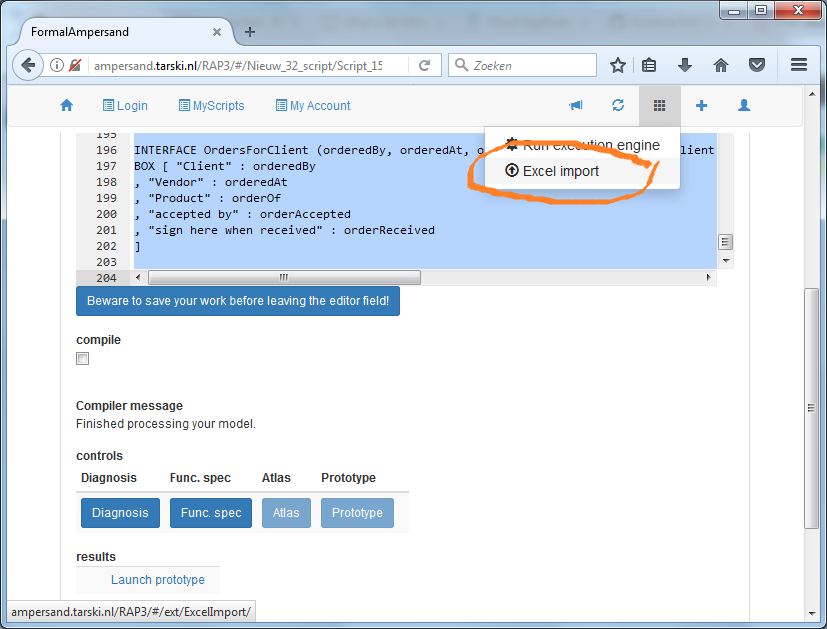
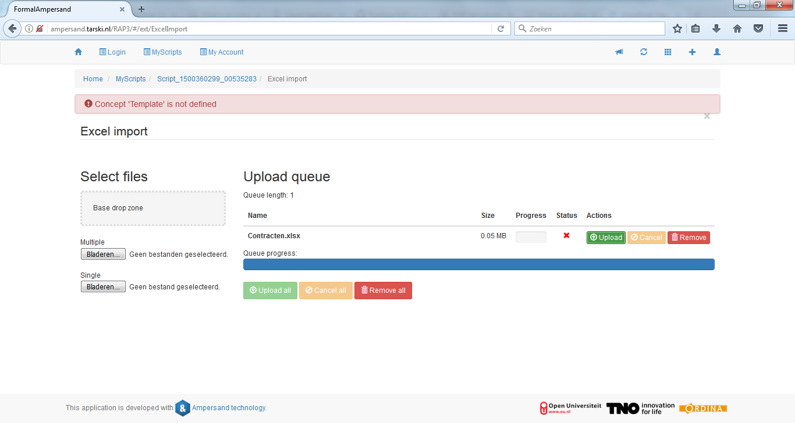

# Population in spreadsheets

In this section we will make an Ampersand script that is based on an existing spreadsheet. This technique is useful for quickly adding population to an information system. Ampersand has a facility that allows you to import existing .xlsx files with minimal changes.

## Theory: tables vs. binary relations

We can consider Ampersand as a finite system of relations. Every relation is a set of \(ordered\) pairs and each pair contains two atoms. However, in the real world we also store information in wider tables, as we do in spreadsheets and relational databases. Here is the trick. If we have two pairs that share the same left atom, e.g. \(1, Abraham\) and \(1, Lincoln\), we can put them in the same row. Using the same trick, we can interpret a row in a spreadsheet as a number of pairs.

### Example

Let us look at an example:

|  | firstname | lastname | birth |
| :--- | :--- | :--- | :--- |
| 1 | Abraham | Lincoln | February 12, 1809 |
| 2 | Barack | Obama | August 4, 1961 |
| 3 | Calvin | Coolidge | July 4, 1872 |
| 4 | Dwight | Eisenhower | October 14, 1890 |

Since Ampersand works with relations, it must represent this table as relations. Three relations can do the job in the following manner:

```text
POPULATION firstname[President*Name] CONTAINS
  [ ("1", "Abraham")
  , ("2", "Barack")
  , ("3", "Calvin")
  , ("4", "Dwight")
  ]

POPULATION lastname[President*Surname] CONTAINS
  [ ("1", "Lincoln")
  , ("2", "Obama")
  , ("3", "Coolidge")
  , ("4", "Eisenhower")
  ]

POPULATION birth[President*Date] CONTAINS
  [ ("1", "February 12, 1809")
  , ("2", "August 4, 1961")
  , ("3", "July 4, 1872")
  , ("4", "October 14, 1890")
  ]
```

Notice that the column names in the table correspond with the relation names in Ampersand. In the table we call them "attributes". So it makes sense to say that a relation in Ampersand can correspond with an attribute in a table.

## Practice: how to prepare a spreadsheet

In theory, the population of the Hawaii-script might just as well be given in a spreadsheet. This works in practice too. It looks like this:

| \[Subject\] | pass | required |
| :--- | :--- | :--- |
| Subject | Student | Destination |
| Surfing | Brown | Hawaii |
| Surfing | Conway |  |
| Latin | Brown | Rome |
| World Religions | Applegate |  |
| World Religions | Brown | Rome |

Please copy this in a spreadsheet of your own. The element in the first column with square brackets tells Ampersand that a new table starts. The first row contains relation names. The second row contains concept names. The rows that follow contain pairs. Ampersand reconstructs those pairs as in the example above.

## Reusing existing data

In practical applications, you might want to reuse data from existing spreadsheets. People tend to have lots of "informal administration" in spreadsheets, which gives you access to authentic population. Surely you need that data organized in rows, but fortunately that is reasonably common. In such cases, you just add two lines above each table to inform Ampersand about the relations that are populated. In other cases, you have some work organizing the spreadsheet for importing it.

## Uploading your spreadsheet

You will find the Excel import function in the menu bar on the top right of your screen

.



This is what your upload screen looks like:



You can upload one or more .xlsx-files by dropping them in the drop zone or by selecting them. You have to upload the population with the green

_Upload_

button. At that time, all population from the .xlsx-file is added to the context and checked for inconsistencies. As a result, you may get errors when uploading. Only error-free spreadsheets will be uploaded successfully. As long as an error remains, the population in your context will not change.

## Assignment

Make a population of your own for the Hawaii-script and put it in a .xlsx spreadsheet. As described above. Make sure to delete the population statements from your Hawaii source code, to make sure that you get to see the population from your .xlsx-file. Generate a prototype from your Hawaii-application, upload your population in Excel and play around with the results.

## What have you learned?

After finishing your assignment, you have learned:

* to upload population to your Ampersand application in the form of a spreadsheet in .xlsx-format;
* to understand how a `POPULATION`-statement relates to the contents of a spreadsheet;
* that the contents of the spreadsheet is added to the population of your context, provided this does not lead to any conflict.

