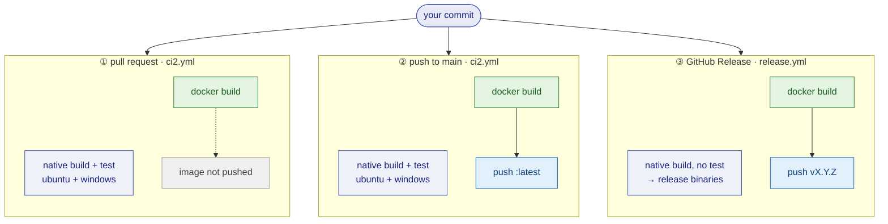

# The deploy pipeline

This page describes the route a commit travels from a pull request to a released compiler, and how you can walk that route by hand. It complements [automated builds](automated-builds.md), which lists the entry points, and [baking a Docker image](building-an-ampersand-compiler-as-docker-image.md), which walks through the Dockerfile step by step.

## The route a commit travels

One commit fans out into three stages. Each stage builds the Docker image; the native build produces the binaries that are attached to a release.



The workflows only start when the commit touches what the build actually consumes (`src/**`, `app/**`, `package.yaml`, `stack.yaml`, `Dockerfile`, and the other entries in the `paths:` list of `ci2.yml`). A change to documentation or release notes does not spin up a Haskell build.

The native build and test is the correctness gate: it compiles the compiler and runs the regression suite against a MariaDB. The Docker build produces the image that ends up on [Docker hub](https://hub.docker.com/r/ampersandtarski/ampersand).

## Why the Docker build is layered the way it is

Compiling Ampersand means compiling its imported dependency chain first: **231 packages, about 24 minutes**. Ampersand's own code takes about 3 minutes. So roughly 89% of a from-scratch build is spent on imports that did not change.

The dependency set is a function of `stack.yaml`, `stack.yaml.lock` and the dependency list in `package.yaml` — files that change far less often than `src/**`. The Dockerfile therefore compiles the dependencies in their own layer, before the source is copied in:

```docker
COPY stack.yaml stack.yaml.lock /opt/ampersand/
COPY --from=manifest /manifest/package.yaml /opt/ampersand/
RUN stack build --dependencies-only

COPY . /opt/ampersand
RUN stack install
```

Docker reuses a layer as long as the files it copies are unchanged. Because the source is copied *after* the dependency layer, editing `src/**` leaves that layer untouched and only Ampersand itself recompiles.

Two details make that work in practice, and both are easy to trip over when you edit the Dockerfile:

**`stack.yaml.lock` is copied on purpose.** It pins the exact dependency set, so a change to it must invalidate the dependency layer. The general `*.lock` rule in `.dockerignore` would keep it out of the build context, so `.dockerignore` re-includes it explicitly:

```
*.lock
# keep the lock in the build context so a dependency bump invalidates the deps layer
!stack.yaml.lock
```

**The version line is normalized away before the dependency layer.** Every release bumps `version:` in `package.yaml`. Copying that file straight into the dependency layer would change the layer's checksum on every release and recompile all 231 packages — invalidating exactly the layer the cache is meant to protect. A small `manifest` stage rewrites the version to a constant first:

```docker
FROM haskell:9.6.6 AS manifest
COPY package.yaml /manifest/package.yaml
RUN sed -i 's/^version:.*/version: 0.0.0/' /manifest/package.yaml
```

The dependency layer then keys on the *dependency set* alone. A version-only bump keeps the cache warm; a change to the dependency list, the resolver or the lock still invalidates it. The released binary is unaffected, because `COPY . /opt/ampersand` puts the real `package.yaml` back before `stack install` runs.

On GitHub's runners each job starts on a fresh machine with an empty layer cache, so the workflows hand that cache to and from the GitHub Actions cache:

```yaml
cache-from: type=gha,scope=ampersand-image
cache-to: type=gha,mode=max,scope=ampersand-image
```

This is the one part of the pipeline you cannot reproduce locally: `type=gha` only exists inside GitHub Actions. Your own machine has something better — a persistent local layer cache.

## Walking the pipeline by hand

Everything below runs from the root of your clone. None of it needs Buildx or any GitHub-specific tooling.

**Build the image, exactly as CI does:**

```bash
docker build . --tag myampersand
```

Add the version stamping arguments if you want the image to report its origin the way a released image does:

```bash
docker build . --tag myampersand \
  --build-arg GIT_SHA=$(git rev-parse HEAD) \
  --build-arg GIT_Branch=$(git rev-parse --abbrev-ref HEAD)
```

Expect the better part of an hour the first time, and Docker needs at least 5 GB of memory. Every later build reuses the dependency layer, so it takes minutes.

**Check what you built:**

```bash
docker run --rm myampersand --version
docker run --rm -it -v "$(pwd)":/scripts myampersand check hello.adl
```

**Run the native build and the regression suite** — the same gate CI applies:

```bash
stack build
stack test
```

**Confirm the dependency layer is doing its job.** Touch a source file and rebuild: the run should skip straight past `stack build --dependencies-only` with `CACHED` and recompile only Ampersand.

```bash
touch src/Ampersand.hs
docker build . --tag myampersand
```

**Confirm a version bump keeps the cache warm.** Change only the `version:` line in `package.yaml` and rebuild. The dependency layer should still report `CACHED`; if it recompiles, the manifest stage is not doing its work.

**Confirm a dependency change invalidates the cache.** Change `stack.yaml.lock` and rebuild. Now the dependency layer *should* recompile — that is the safety property that keeps an image from being built against stale dependencies.

## What to account for when you change things

| If you change… | Then the dependency layer… | So a rebuild takes… |
| --- | --- | --- |
| `src/**`, `app/**`, templates | is reused | minutes |
| only `version:` in `package.yaml` | is reused (normalized in the manifest stage) | minutes |
| the dependency list in `package.yaml` | is rebuilt | ~24 minutes |
| `stack.yaml`, `stack.yaml.lock`, the resolver | is rebuilt | ~24 minutes |
| the `Dockerfile` above the dependency layer | is rebuilt | ~24 minutes |

Two things surprise people reading an intermediate layer:

- Inside the `manifest` and dependency layers, `package.yaml` says `version: 0.0.0`. That is deliberate and does not reach the binary — `COPY .` restores the real file before `stack install`.
- The `manifest` stage uses the full `haskell:9.6.6` image just to run one `sed`. It costs nothing, because that image is already pulled for the build stage.

When you add a step to the Dockerfile, put it *below* the dependency layer unless it genuinely belongs to the dependency set. A step added above it invalidates the layer on every build and hands back the 24 minutes.

## Where the pieces live

| File | Role |
| --- | --- |
| `Dockerfile` | the image recipe: manifest stage, dependency layer, build stage, slim runtime image |
| `.dockerignore` | what stays out of the build context (and the `!stack.yaml.lock` exception) |
| `.github/workflows/ci2.yml` | stages ① and ②: native build + test, Docker build, push `:latest` from main |
| `.github/workflows/release.yml` | stage ③: release binaries and the versioned image |
| `.github/workflows/codeQuality.yml` | hlint and Weeder |

The measurements behind the layering, and the routes that were considered and declined, are recorded in [issue #1664](https://github.com/AmpersandTarski/Ampersand/issues/1664).
