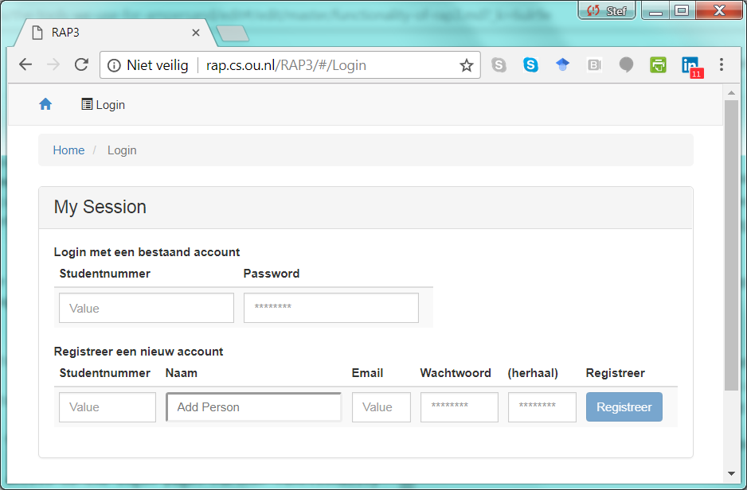
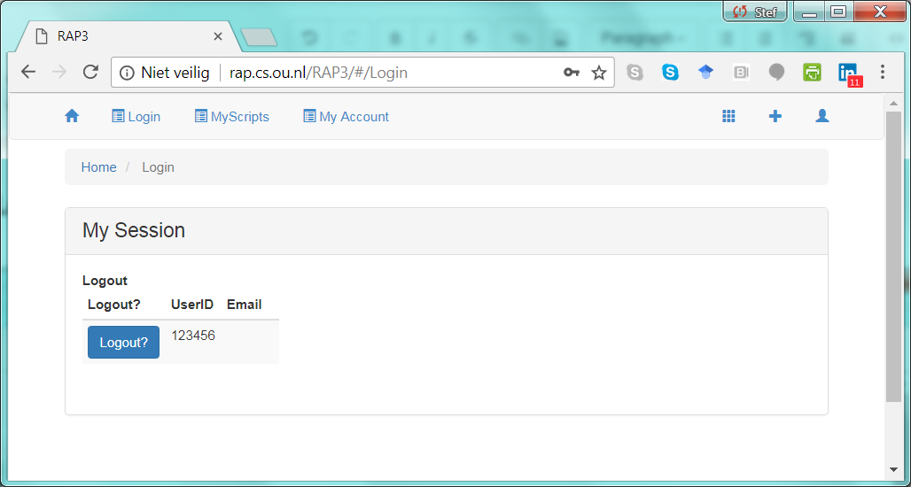
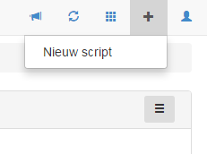
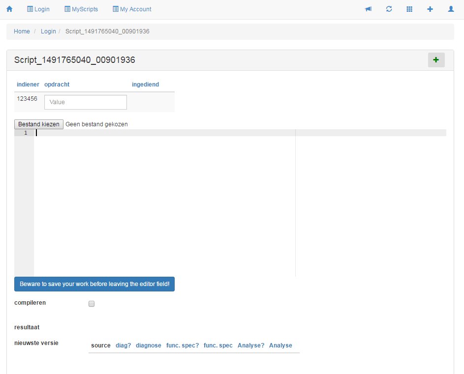
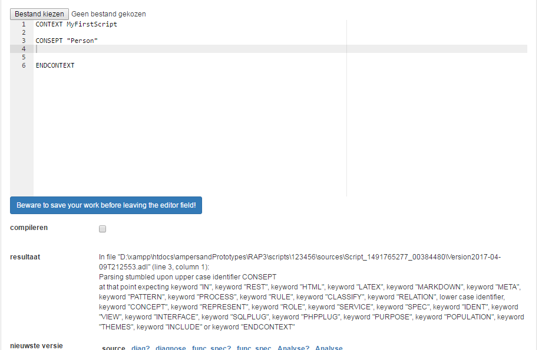
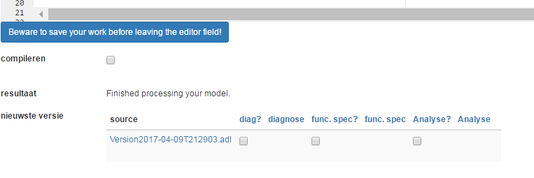

# Functionality of RAP4

These pages are meant to describe the functionality of RAP4. As RAP4 is still under development, some of this functionality is still work in progress. We will tell the current status of everything mentioned here. While doing so, this document will grow until it describes everything one can do with RAP4.

The purpose of RAP4 is to be a platform for people to learn how to work with Ampersand. We distinguage the following ROLEs:

* Student. 
* Tutor. This role is to watch the progress of students, and being able to give guidance.
* AccountMgr. This role is to create accounts and to grant access rights to users.
* GradStudent. This role is for more advanced students.

All of the above users have access to the login page. Further functionality is based on specific roles.

## Logging in 

When you log in, a userid and password must be entered.

## Logging out

After you have logged in, this screen turns into a logout-screen. The menu bar gives you the options you are entitled to by the role\(s\) you have. In this case you get `MyScripts` and `My Account`:

In the sequel, the functionality is described by role.

## Student

As a student, your main objective with RAP3 is to write Ampersand scripts and have them compiled. RAP3 will help you by giving error messages when your script contains errors. If your script complies to the Ampersand syntax and has no type errors, it will let you generate artifacts from your script. Currently these artifacts are

1. A diagnosis document
2. A functional design document
3. An analysis site, containing an overview of concepts, relations and rules in your script. 

You might find it interesting to know that RAP3 has been built with Ampersand itself!

### Create an Ampersand script

A new script can be made by hitting the + sign in the menu and go to New Script. A new script is being made, but it doesn't have any content:

In the header of the script you can see Script

\_

_\__

_\_1491765040_

_\_

\_

00901936, which is a 

\(

generated

\)

 identifier of the instance, with which you have nothing to do. The big white space in the middle is where you will write your script. You could als choose to upload a script from your computer. It is a good habit to save your scripts at your own computer, because currently we have no functionality to retrieve your script easily. Please take care of your own precious work yourself.

Each time you modify your script, you have to send it to Ampersand by pressing the big blue button below the white space. Only then Ampersand will be notified about your changes.

After you pressed the blue button, you can check the compile checkbox. Ampersand is launched and it will validate your script. If any error is found, it will notify you, as shown above.

If your script is OK however, it will also tell you, by letting you know that processing has come to an end:

Every time compilation is succesful, a new version of your script will be made. You will see the most recent version. Now you can ask for the artifacts, by checking an appropriate checkbox. This will take some time, and a link will appear at the right of the checkbox. If you follow that link, the result will be shown.

## Tutor

## Account Manager

## Graduate Student

