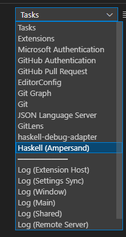

# Development using VS Code

## Agreements about the development of code

### Working with feature branches

All changes that are made to the code is done in feature branches. Such a branch should have a specific goal. Normally, this is documented in a single github issue. While the work can take some time, eventually a pull request is made in order to merge it into main. There are several requirements that must be met before a pull request can be merged. &#x20;

### Releasenotes

Every feature must be briefly documented in the releasenotes. A github action is in place that will notify if the releasenotes are not changed.&#x20;

### Code formatting

All code must be formatted in a consistent way. We use [ormolu](https://hackage.haskell.org/package/ormolu), a standard code formatting tool for Haskell. We only accept Haskell files that are properly formatted. This is enforced by a new [github action](https://github.com/mrkkrp/ormolu-action#ormolu-action).&#x20;

In order to use ormolu, you have to make sure it is available. Hopefully, some time in future, this will be installed automatically. Until then, you have to install it yourself:

```
stack install ormolu
```



If you use the devcontainer functionality (available in vscode), your code is auto-formatted by default. In other cases, you need to do that yourself. When merging code into the main branch, it should be formatted correctly. You can autoformat all haskell files with the command:

```bash
stack exec ormolu -- --mode inplace $(git ls-files '*.hs')
```


### Devcontainer

We provide a standard developer container to the developers of Ampersand. Documentation about this awsome VScode feature can be found [here](https://code.visualstudio.com/docs/remote/containers).

#### How to get started using the .devcontainer stuff

Setting up a Haskell environment with awsome tooling has never been as easy as today.

* Make sure you have vscode installed.
* Install the \`Remote - Containers\` extention.
* Make sure Docker is running.
* Go to the directory where your Ampersand stuff resides, and type \`code .\`
* In the lower right corner, you will see a message:&#x20;


* Push the button \`Reopen in Container\` and watch the show.


The first time, opening the development container will take quite some time. It will build some docker images and finally spin up the container. Fortunatly, this is one time only.&#x20;


* While you are waiting, you can watch the progress by inspecting the log. There will be a message containing a link to the log file.&#x20;

<details>

<summary>What if `Reopen in Container` doesn't appear?</summary>

This behaviour can happen when you clicked 'Don't Show Again...' in the past.&#x20;

In this case, you can click on the status bar at the place where the 'remote container' plugin shows the machine you are currently using:

&#x20;</img>

&#x20;After you clicked, choose the menu-item \`Reopen in container\`

</details>

* After everything is set up, open `Main.hs` . This will trigger the Haskell extention of vscode. Also here, the first time will take a while, because the project is being build. That includes all dependencies of Ampersand. If you want to see what is going on, go to the Output tab and open the dropdown called \`tasks\`. You will find the task building Ampersand:



