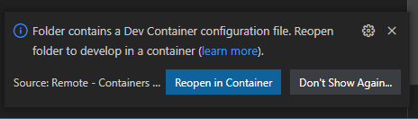
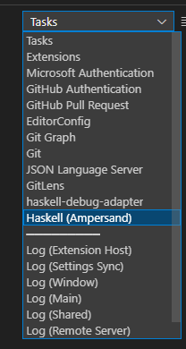

# Using VS Code

This section is about making changes to the Ampersand compiler. It is written in Haskell, so if you want to contribute, you need to have a development environment set up. You also need to know some of our way of working.  

## Agreements about the development of code

### Working with feature branches

All changes that are made to the code is done in feature branches. Such a branch should have a specific goal. Normally, this is documented in a single github issue. While the work can take some time, eventually a pull request is made in order to merge it into main. There are several requirements that must be met before a pull request can be merged.

### Releasenotes

Every feature must be briefly documented in the releasenotes. A github action is in place that will notify if the releasenotes are not changed.

### Code formatting

All code must be formatted in a consistent way. We use [ormolu](https://hackage.haskell.org/package/ormolu), a standard code formatting tool for Haskell. We only accept Haskell files that are properly formatted. This is enforced by a new [github action](https://github.com/mrkkrp/ormolu-action#ormolu-action).

In order to use ormolu, you have to make sure it is available. Hopefully, some time in future, this will be installed automatically. Until then, you have to install it yourself:

```
stack install ormolu
```

:::tip

If you use the devcontainer functionality (available in vscode), your code is auto-formatted by default. In other cases, you can best let vscode take care of it automatically. To do so, in the settings of vscode, enable format-on-save.

Alternatively, in case you do not like to enable the autoformat on save, you can do it manually every time before you commit:

```bash
stack exec ormolu -- --mode inplace $(git ls-files '*.hs')
```

:::

## Devcontainer

Devcontainer are [a VScode feature](https://code.visualstudio.com/docs/remote/containers), which makes settings and extensions readily available in VScode.
We provide a standard developer container for Ampersand, so compiling and building works out of the box.
This saves contributors the effort of setting up their development environment.
In the team, one person who improves the development environment can commit it to Git and share it with team members.

The devcontainer is written to ensure reproducible development across contributors. The versions of Ubuntu and GHC are consistent with the build containers to prevent build differences between local development and automated testing. The container includes PHP and MariaDB because Ampersand validation tests require it to verify generated prototypes. Code formatting happens automatically on save to enforce the ormolu standard without requiring manual intervention. The container builds the project after startup to catch compilation errors early and populate language server caches for better IDE performance.

### How to get started using the .devcontainer stuff

Setting up a Haskell environment in VScode.

- Make sure you have VScode installed.
- Install the [Remote Development](https://marketplace.visualstudio.com/items?itemName=ms-vscode-remote.vscode-remote-extensionpack) extension pack.
- Make sure Docker is running.
- Go to the directory where your Ampersand stuff resides, and type \`code .\`
- In the lower right corner, you will see a message:



- Push the button \`Reopen in Container\` and watch the show.

:::info
The first time, opening the development container will take quite some time. It will build some docker images and finally spin up the container. Fortunately, this is one time only, for it is stored in the build cache of Docker.
:::

- While you are waiting, you can watch the progress by inspecting the log. There will be a message containing a link to the log file.

### Troubleshooting Devcontainer Issues

<summary>What if `Reopen in Container` doesn't appear?</summary>

This behavior can happen when you clicked 'Don't Show Again...' in the past.

In this case, you can click on the status bar at the place where the 'remote container' plugin shows the machine you are currently using:

.png>)

After you clicked, choose the menu-item \`Reopen in container\`

- After everything is set up, open `Main.hs` . This will trigger the Haskell extension of vscode. Also here, the first time will take a while, because the project is being build. That includes all dependencies of Ampersand. If you want to see what is going on, go to the Output tab and open the dropdown called \`tasks\`. You will find the task building Ampersand:



If the container fails to start with "container is not running" errors:

1. **Check container status**: Run `docker compose ps` to see if containers are running
2. **View detailed logs**: Check VS Code's "Dev Containers" output panel for error details
3. **Clean up and rebuild**: 
   ```bash
   docker compose down
   docker compose up -d --build
   ```
4. **Verify container connectivity**: Test with `docker exec ampersand-dev whoami`

**Common cause**: The `.devcontainer/DockerfileUpstream` contains an `ENTRYPOINT` directive that conflicts with the `docker-compose.yml` command. The docker-compose file expects to run `sleep infinity` to keep the container alive, but an entrypoint prevents this. Remove or comment out any `ENTRYPOINT` lines in the Dockerfile if present.
