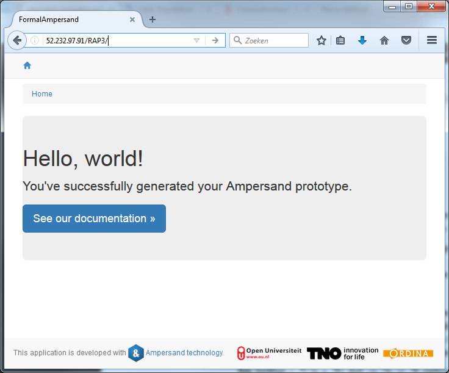
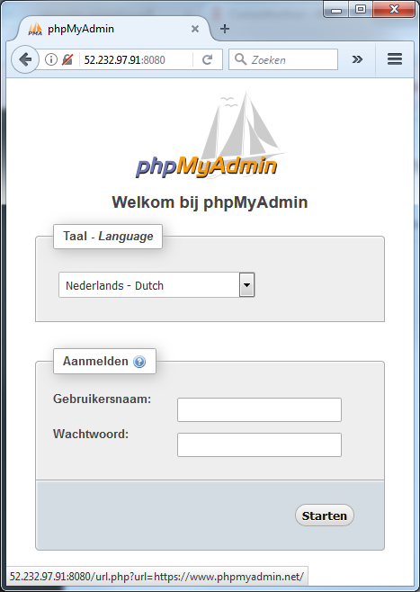

# Deploying RAP4 in the Azure cloud

In early 2017 the need arose for an Ampersand implementation in Ordina's cloud, to let young professionals get acquainted with Ampersand. We chose to implement RAP4 in Azure, because Ordina has an Azure subscription. RAP4 is the same environment that our students use at the Open Universiteit, so the maintainance of RAP4 can be reused for both target audiences.

This chapter is an account of the deployment of RAP4. You can use it as an example if you want to do it yourself.

Deployment has been automated using docker, because we want to make the deployment as much as possible automated. The required images are available on Docker-hub, so deployment is immediate. Automated deployment by docker means that we can quickly release updates too.

## 0. Deployment approach

We use Docker to simplify the deployment of RAP and make this installation portable to many different computers.

We took a simple Linux machine, installed docker, and built docker images for RAP4 and created three containers: db, rap4, and phpmyadmin. The first one, db, runs MariaDB and contains the administration of RAP4 and the Ampersand scripts of users. The rap4 container contains the RAP4 application proper. It is accessed on port 80. The container phpmyadmin is present for maintainers to inspect the database through phpMyAdmin. It is accessible through port 8080.

Each step in the installation process is described by a separate section in the sequel.

## 1. Setting up the virtual machine

I needed an Azure account to enter the Azure portal and install a server for Ampersand. I got my account from Ordina. Azure offers preconfigured installations to kick-start a virtual machine. In principle, any server that runs docker will work. I picked CoreOS, which is a minimal Linux platform and suitable for container computing with docker.

The following settings were made:

|  |  |
| :--- | :--- |
| subscription in Azure | Ordina TC - RT O Pega - Learning |
| server name | Wolfram |
| type VM-disk | SDD |
| OS | Linux |
| configuration | Ubuntu 18.04 |
| Admin user name | ampersandadmin |
| verification type | password \(Stef Joosten knows the password\) |
| Resource group \(in Azure\) | AmpersandRAP4 |
| location \(in Azure\) | Western Europe |
| Size | Standard DS11 v2 \(2 cores, 14 GB memory\) |
| Inbound port: RAP4 \(HTTP\) | TCP/80 |
| Inbound port: HTTPS | TCP/443 |
| Inbound port: SSH | TCP/22 |
| Public IP-adres | 137.117.190.28 \(static\) |
| the full name for calling the application | http://137.117.190.28/RAP4 |

I verified completion of this step by checking the Azure dashboard. It shows machine `Wolfram` running.

I have verified the machine was live by logging in via Putty \(a popular SSH-client\). I accessed this machine, using `ampersandadmin@137.117.190.28` and the correct password. In the sequel, I will refer to this machine as "the server".

## 2. Port settings

To perform this step, I didn't wait until step1 was completed. It is sufficient that the Netwerkbeveiligingsgroep `Wolfram-nsg` exists. In order to access RAP4 from the internet, we told the virtual machine to open port 80 for http and 443 for https. These settings were made in the Azure portal via `Resourcegroepen > AmpersandRAP4 > Wolfram-nsg (Netwerkbeveiligingsgroep) > inkomende beveiligingsregels`. A rules was added to make the server listen to port 80/TCP.

No rule was added for the database, so the database is only open to phpMyAdmin and RAP4, or from within its container.

## 3. Installing Docker

This step requires a server, so you must have finished section 1 successfully. \(If `docker` and `docker-compose` are available, this step is superfluous.\) To install docker I followed the following steps in the given order:

| step | Linux command |
| :--- | :--- |
| To work as root | sudo -i |
| To install docker, I followed the instructions on [https://www.digitalocean.com/community/tutorials/how-to-install-and-use-docker-on-ubuntu-18-04](https://www.digitalocean.com/community/tutorials/how-to-install-and-use-docker-on-ubuntu-18-04). |  |
| To install docker-compose | apt-get install docker-compose |
| To add the current user \(ampersandadmin\) to the docker group | usermod -aG docker $\(whoami\) |
| To start the docker daemon |  |
| now reboot the machine | reboot |

Of course, the last step \(reboot\) requires reconnecting to the machine.

Then I checked that docker is running by:

```text
 sudo docker ps
```

I checked that docker-compose is available  
by:

`which docker-compose`

To check whether ampersandadmin is member of the docker group, use command cat /etc/group`.`

## 4. Obtaining the install instruction

We need only one file: `docker-compose.yml`  
To get it, I used the `wget` command, which gets stuff from the web:

```text
sjo@Wolfram:~$ mkdir docker-RAP4
sjo@Wolfram:~$ cd docker-RAP4
sjo@Wolfram:~/docker-RAP4$ wget https://github.com/AmpersandTarski/RAP/raw/master/docker-compose.yml
```

## 5. Installing RAP4

To install RAP4:

```text
sjo@Wolfram:~$ sudo docker-compose up -d
```

To check whether this worked, I went to my browser and navigated to `http://137.117.190.28/`.  
It took a while to get started, because it was building a fresh database.

I checked whether the containers are running by means of the `docker ps` command.

Completion of this step allowed access to RAP4 from an arbitrary computer on the internet:



The database is accessible on port 8080:



