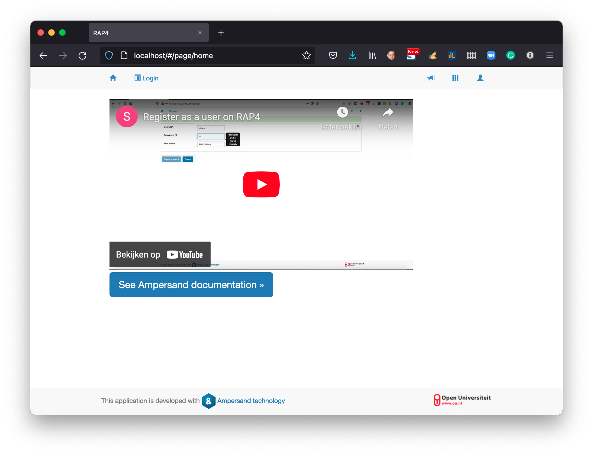
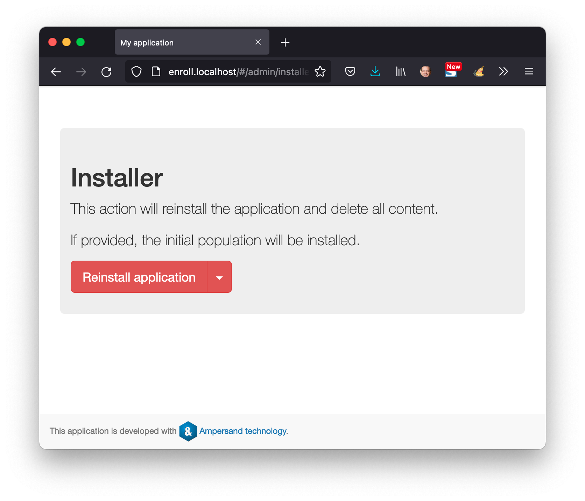

# Deploying to your own laptop

If you want to deploy RAP4 to your laptop, this chapter tells you how.

This example has worked on my Macbook. If you have a different computer, you may either change the commands below to the commands of your own computer or set up a virtual Linux machine on your laptop.

## Prerequisites

You need docker. Follow the instructions on`https://docs.docker.com/.`

You need git. Follow the instructions on `https://github.com/git-guides/install-git`.

You need to use a command-line, you need permission to install software on your laptop and you need to be connected to the Internet.

Start in your command-line interface \(CLI, terminal on a macbook\) and go to \(or make\) a working directory from which you want to keep Git repositories.

## Obtaining the files we need

Import the required files from Github \(note: you may need to log in into Github\):

```bash
git clone https://github.com/AmpersandTarski/RAPinstall
```

Expect roughly this response:

```text
Cloning into 'RAPinstall'...
remote: Enumerating objects: 19, done.
remote: Counting objects: 100% (19/19), done.
remote: Compressing objects: 100% (17/17), done.
remote: Total 19 (delta 2), reused 14 (delta 0), pack-reused 0
Unpacking objects: 100% (19/19), done.
```

Now go to the directory from which to install RAP:

```bash
cd RAPinstall
```

You need to create a proxy network to let RAP communicate with your browser \(no problem if it already exists; docker will tell you with an appropriate message\)

```bash
docker network create proxy
```

When docker has made the network, it tells you something like this:

```text
3f9552a7506ac5f2b5d9fcb158edae82f9f64e4e3d6b093916d624d118ba342a
```

Now spin up RAP4 \(note: in older versions of docker use `docker-compose` instead of `docker compose`. The difference is just a hyphen\):

```bash
docker compose up -d
```

The first time you spin up RAP4, docker will spontaneously download the images it needs. That generates substantial output. At the end docker will show the containers that have been started:

```text
 ⠿ Network rapinstall_db                           Created                                                                                                                                                                               3.9s
 ⠿ Network rapinstall_default                      Created                                                                                                                                                                               3.9s
 ⠿ Volume "rapinstall_rap4-data"                   Created                                                                                                                                                                               0.0s
 ⠿ Volume "rapinstall_db-data"                     Created                                                                                                                                                                               0.0s
 ⠿ Volume "rapinstall_letsencrypt"                 Created                                                                                                                                                                               0.0s
 ⠿ Container traefik                               Started                                                                                                                                                                               7.1s
 ⠿ Container rap4-db                               Started                                                                                                                                                                               5.2s
 ⠿ Container rapinstall_dummy-student-prototype_1  Started                                                                                                                                                                               5.1s
 ⠿ Container phpmyadmin                            Started                                                                                                                                                                              12.7s
 ⠿ Container rap4                                  Started                                                                                                                                                                              12.9s
 ⠿ Container enroll                                Started
```

Now, you need to "climb into" the rap4 container to execute one command manually:

```bash
docker exec -it rap4 bash
```

You now get a prompt like `root@bc774265c8ef:/usr/local/project#` that indicates that you are inside the rap4 container. Once inside, you need to give the following `chmod` command to enable RAP to generate prototypes.

```bash
chmod 666 /var/run/docker.sock
```

Finally, type exit to leave the rap4-container and return to the CLI of your laptop.

Now you are done. Just check whether everything works:

Type `localhost` in the URL-field of your browser, to see if RAP4 has started. You should see this:



Note that RAP runs on the insecure `http://` instead of `https://`.  This is not a problem if you keep your laptop safe from outsiders' trespassing. If you [deploy to a server](deploying-ounl-rap3.md), you need a secure setup.

You will find that the database is accessible on `http://phpmyadmin.localhost`


The demonstration application, Enrollment, is accessible on `http://enroll.localhost`



