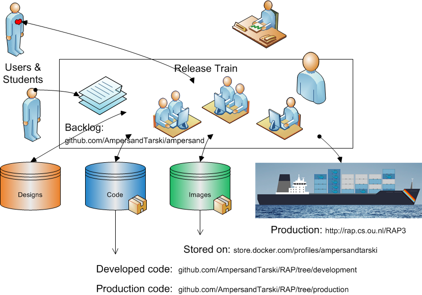
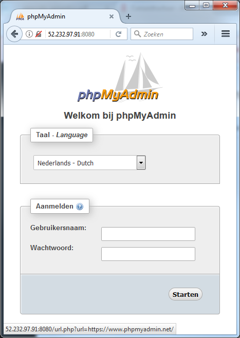

# Making Docker images

## Docker images

This chapter discusses the process of baking \(i.e. creating\) images for docker hub. It also gives a recipe for creating docker images. If you are interested only in installing RAP4, you do not need this chapter.

Docker images are baked when the Ampersand source code for RAP4 is ready to be deployed. This results in three files, to be stored on Docker hub:


## The release train

RAP4 is deployed as shown in this picture



## A recipe for creating images

Knowing what needs to be done allows you to understand how we make Ampersand's docker images. If you just want to do it, follow the steps below. We assume that you are working on an Ubuntu machine with `bash` as its command line interface.

### Check your Docker installation

First I checked that docker and docker-compose are installed on my computer:

```text
sjo@lnx-hrl-202v:~$ which docker
/usr/bin/docker
sjo@lnx-hrl-202v:~$ which docker-compose
/usr/bin/docker-compose
```

If you need to install docker, follow the instructions on [https://docs.docker.com/engine/installation](https://docs.docker.com/engine/installation) .

### 4. Building an Ampersand image

RAP is built on Ampersand and is compiled with Ampersand. For this reason, the RAP image builds on an Ampersand image. Run _./build.sh_ to build the initial ampersand container that serves as a base for the RAP4 application \(or any other Ampersand application\). This base images holds all required packages and the \(at that moment\) latest version of the ampersand compiler the workflow around this container can/should be improved since now the easiest way to rebuild is to remove the container \(_docker rmi ampersand:latest_\)

### 4. Making a Docker image

I cloned the docker files into a local directory  by the following command:

```bash
sudo -i
git clone https://github.com/AmpersandTarski/docker-ampersand/ /home/$(whoami)/docker-ampersand
cd docker-ampersand/
./build.sh
```

and sat back to watch an image being created. This takes over an hour. I left the session up and running, because stopping the session means that the docker build process stops. After coming back a day later, I verified that the image is present by running the same command again. That produced the following output:

```text
Wolfram docker-ampersand # docker build -t ampersand:latest ampersand
Sending build context to Docker daemon 4.096 kB
Step 1 : FROM php:7-apache
 ---> 2720c02fc079
Step 2 : ENV PATH /texlive/bin/x86_64-linux:$PATH
 ---> Using cache
 ---> 45d62477f5e2
Step 3 : RUN apt-get update  && apt-get install -y --no-install-recommends git graphviz wget xorriso  && curl -sSL https://get.haskellstack.org/ | /bin/sh  && rm -rf /var/lib/apt/lists/*
 ---> Using cache
 ---> e37542ec9301
Step 4 : ENV TL_VERSION 2016-20160523
 ---> Using cache
 ---> f95346ded414
Step 5 : ADD texlive.profile /tmp
 ---> Using cache
 ---> add9fd911c38
Step 6 : RUN cd ~  && wget -q   http://mirrors.ctan.org/systems/texlive/Images/texlive$TL_VERSION.iso  && wget -qO- http://mirrors.ctan.org/systems/texlive/Images/texlive$TL_VERSION.iso.sha512 | sha512sum -c  && osirrox -report_about NOTE -indev texlive$TL_VERSION.iso -extract / /usr/src/texlive  && rm texlive$TL_VERSION.iso  && /usr/src/texlive/install-tl -profile /tmp/texlive.profile  && rm -rf /usr/src/texlive  && rm /tmp/texlive.profile
 ---> Using cache
 ---> f0ebcd4cf50c
Step 7 : RUN mkdir ~/git  && cd ~/git  && git clone --branch development https://github.com/AmpersandTarski/Ampersand
 ---> Using cache
 ---> 08643d5cce73
Step 8 : RUN cd ~/git/Ampersand  && stack setup  && stack install --local-bin-path /usr/local/bin
 ---> Using cache
 ---> 636036e98214
Step 9 : RUN php -r "copy('https://getcomposer.org/installer', 'composer-setup.php');"  && php composer-setup.php --install-dir=/usr/local/bin --filename=composer  && php -r "unlink('composer-setup.php');"
 ---> Using cache
 ---> e8648c6657f6
Successfully built e8648c6657f6
```

When you build an image where nothing changes \(as shown above\), this takes virtually no time at all. However, if you run a fresh image from scratch, it takes a while. Should you want to close your SSH-session in which docker is running, that docker process will be killed. If you want to leave docker running in the background, `https://www.tecmint.com/keep-remote-ssh-sessions-running-after-disconnection/` will help. Best thing is to anticipate on it. However, if you didn't anticipate this, you can still send docker to the background by `^Z` and give the `disown -h` command. \(The latter is however the least elegant way.\)

I checked whether all images are built by the `docker images` command:

```text
sjo@lnx-hrl-202v:~/ampersand-models/RAP4$ docker images
REPOSITORY                               TAG                 IMAGE ID            CREATED             SIZE
ampersandtarski/ampersand-rap            latest              636643166a78        2 hours ago         3.62GB
ampersandtarski/ampersand-prototype-db   latest              d267da36fb90        4 hours ago         395MB
ampersandtarski/ampersand-prototype      texlive             efd0dccd6b4b        6 hours ago         3.11GB
phpmyadmin/phpmyadmin                    latest              200931982ab6        6 days ago          110MB
```

### 5. Publishing to docker-hub

For this step, you need an account on docker-hub. Then Docker will simply push the generated images to docker hub by means of the push-command:

```text
docker push ampersandtarski/ampersand-rap
docker push ampersandtarski/ampersand-prototype-db
docker push ampersandtarski/ampersand-prototype
```

At this point the images are published and this chapter is done. However, it is good to discuss a few collateral issues: deployment, maintenance and security.

### 6. Deploying directly on this server

We are making three containers: one for the database, one for the RAP4 application, and one for PhpMyAdmin. Containers are built from images by the command `docker-compose`:

```text
cd /home/ampersandadmin/docker-ampersand
docker-compose up -d
```

This command brings all three containers up and runs them in the background. For this to happen, the file `docker-compose.yml` must be in the current directory.

I checked whether the containers are running by means of the `docker ps` command.

Completion of this step allowed access to RAP4 from an arbitrary computer on the internet:


The database is accessible on port 8080:



### 7. Maintenance

The `docker-compose up` command aggregates the output of each container. When the command exits, all containers are stopped. Running `docker-compose up -d` starts the containers in the background and leaves them running.

To interfere with RAP4 as it is running, you need to get into the Rap4 container. It is not enough just being on the server, because all the data is in the container \(rather than directly on the server\). To go into the Rap4 container, use the command

```text
docker exec -ti dockerampersand_rap4_1 /bin/bash
```

### 10. Local Settings

To inspect and change the local settings, you need the file `localsettings.php` on directory `~/git/Ampersand-models/RAP4/include`. This step requires section 5 to be finished successfully. This file contains comments that guide you to use the correct settings in a development situation and in a production situation. Read the file and follow the instructions it contains, especially when making the transition from development to production.

### 11. Last minute changes before going to production

1. In the source code of RAP4, in the file SIAM\_importer.adl:
   1. disable "RAP4\_LoginForDevelopment.ifc", to prevent users from seeing 
   2. enable "RAP4\_LoginForProduction.ifc"
   3. disable "../SIAM/SIAM\_AutoLoginAccount.adl"
2. Is there anything we must alter in localsettings.php before going live?

 This is decribed in the file `docker-compose.yml`

