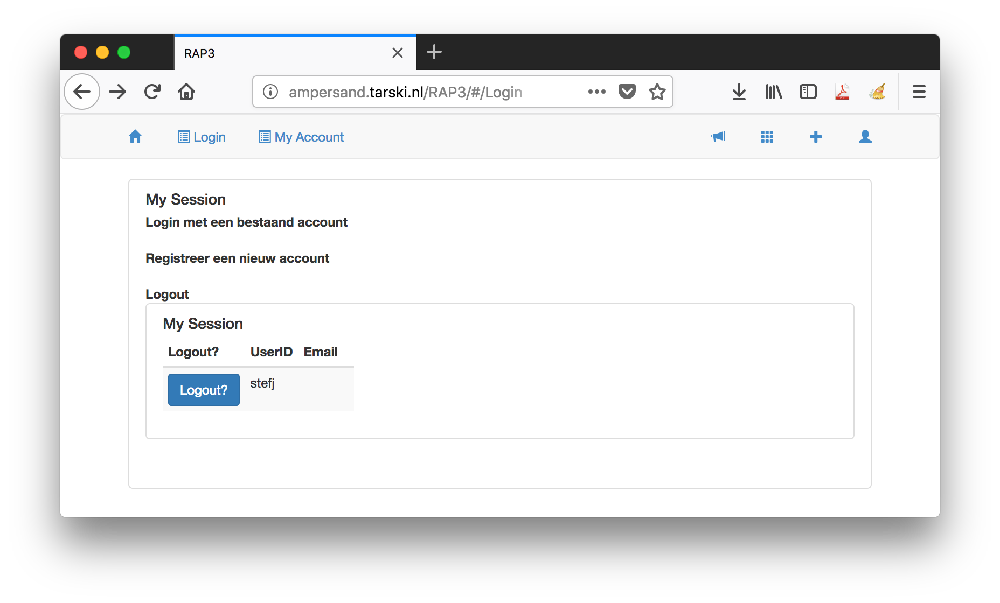

# Tutorial

- Ampersand is meant to develop information systems.
- This tutorial will get you going with Ampersand. Consult your tutor with questions.
- You have a [tool](#your-tool-rap4) to experiment with, supplemented by this video (in Dutch) to make your start even easier:

<iframe width="100%" height="444" src="https://www.youtube.com/embed/ZISLjxJqkqw" title="YouTube video player" frameborder="0" allow="accelerometer; autoplay; clipboard-write; encrypted-media; gyroscope; picture-in-picture; web-share" allowfullscreen></iframe>

This tutorial is meant for Business- or IT professionals who want to learn about [information systems](https://player.ou.nl/wowzaportlets/#!production/BDAXK2L) development. Knowledge about Ampersand is not presumed. The text offers pointers for you to find out many things on your own. This tutorial is intended for individual study, but you can always ask your tutor if things are unclear. The required theory is also available in Learning Unit 3 of the coursebook of the course [IM0403, Rule-Based Design](https://www.ou.nl/-/IM0403_Rule-Based-Design), taught at the Open University of the Netherlands.

## Overview

1. You will start by [looking at an information system called "Enrollment"](#example-system-enrollment) and learn what a simple specification looks like. 
2. Then you will be introduced to the web-based version of Ampersand, [RAP 4](#your-tool-rap4), in which you can specify an information system and create a working web-based prototype. With RAP 4, you can make information systems of your own, enabling you to complete the course.
3. Next, we will have a look at [the conceptual model](#conceptual-model-enrollment) behind the Enrollment system. You will learn to interpret one rule based on the given concepts and relations. You will see some basics of relational algebra, just to grasp the flavour of formally defining rules.

## Example system: Enrollment

In this section, you will learn the basic structure of information systems according to Ampersand. By studying a simple system, you will learn how Ampersand represents such systems.

We will study an information system called "Enrollment". The purpose of that system is to enroll students for modules. Students can enroll (or be enrolled) for any module that is part of the course they take.

Try it out on an Ampersand implementation. Copy this example code, make a new script on an Ampersand system, compile it, and generate a prototype implementation from it. Run the prototype and then click on the icon "Overview" in the top-left of the screen. The application will start. Browse through the data and change things. Find out which courses, students, and modules there are and try to see what happens if you add or remove information from the system. You can use this assignment as a guide:

### Assignment

- Who are the three students and what are the courses they take?
- Is there a module `HRM`?
  - Add, in the tab Course, the module HRM to the Management course. The system sees that the subject is unknown, and provides a green plus-sign to add it.
  - Each change will be saved automatically.
  - Note that this change is also visible in the tab Modules.
- Now enroll student `John` for the module `Business Rules`. You can do this either in the tab Students or the tab Modules. We will later see why this is the case.
- Now enroll student `Peter` for the module `Business Rules`.
  - This will trigger a message because this student does not take the course Business IT.
  - Click on the message to see details.
  - Look-up in the code below where this message is defined. It is the line that starts with `RULE`. You don't have to understand the syntax at this point.
  - Click cancel.
- Use the trash can icon to remove the course `Business IT` from`Susan` in the tab Students.
  - This also will trigger an error message because each student can only enroll for a module in courses he has registered in. Get rid of the message by going to the "List all interfaces" in the menu bar and navigate back to the overview.
  - Look up in the code the definition of the `RELATION takes`. The keyword `[TOT]` is responsible for this message.
- Note the four icons on the top-right of the screen and click on the second icon (nine dots).
  - Click on 'Reinstall database'
  - The Installer screen comes up. Click on the big red button and wait for it to turn green.
  - Click on 'overview' and the initial data is back.
  - Have a look at the code below, to find where the initial data is defined.
- Have a look at the code-part at the end called INTERFACE and compare it with the screen. Note which parts you recognize. The syntax of the code is discussed in the documentation.

This information system was built by the following code:

```
CONTEXT Enrollment IN ENGLISH
PURPOSE CONTEXT Enrollment
{+ A complete course consists of several modules.
Students of a course can enroll for any module that is part of the course.
+}

PATTERN Courses
-- The concepts
CONCEPT Student "Someone who wants to study at this institute"
PURPOSE CONCEPT Student
{+We have to know what person studies at this institute, so the system needs to keep track of them.+}
CONCEPT Course "A complete course that prepares for a diploma"
PURPOSE CONCEPT Course
{+We have to know what courses there are, so the system needs to keep track of them.+}
CONCEPT Module "An educational entity with a single exam"
PURPOSE CONCEPT Module
{+We have to know what modules exist, so the system needs to keep track of them.+}

-- The relations and the initial population
RELATION takes [Student*Course][TOT]
MEANING "A student takes a complete course"

POPULATION takes CONTAINS
[ ("Peter", "Management")
; ("Susan", "Business IT")
; ("John", "Business IT")
]

RELATION isPartOf[Module*Course]
MEANING "A module part of a complete course"

POPULATION isPartOf[Module*Course] CONTAINS
[ ("Finance", "Management")
; ("Business Rules", "Business IT")
; ("Business Analytics", "Business IT")
; ("IT-Governance", "Business IT")
; ("IT-Governance", "Management")
]

RELATION isEnrolledFor [Student*Module]
MEANING "Students enroll for each module in the course separately"

-- The one rule in this model
RULE ModuleEnrollment: isEnrolledFor |- takes;isPartOf~
MEANING "A student can enroll for any module that is part of the course the student takes"
MESSAGE "Attempt to enroll student(s) for a module that is not part of the student's course."
VIOLATION (TXT "Student ", SRC I, TXT " enrolled for the module ", TGT I, TXT " which is not part of the course ", SRC I[Student];takes)
ENDPATTERN

INTERFACE Overview : "_SESSION"                  cRud
BOX <TABS>
     [ Students : V[SESSION*Student]             cRuD
       BOX <TABLE>
                [ "Student" : I[Student]         cRud
                , "Enrolled for" : isEnrolledFor cRUD
                , "Course" : takes CRUD
                ]
     , Course : V[SESSION*Course]                cRuD
       BOX <TABLE>
                [ "Course" : I                   cRud
                , "Modules" : isPartOf~          CRUD
                ]
     , Modules : V[SESSION*Module]               cRud
       BOX <TABLE>
                [ "Modules" : I                  cRuD
                , "Course" : isPartOf            cRUd
                , "Students" : isEnrolledFor~    CRUD
                ]
     ]

ENDCONTEXT
```

## Your tool: RAP4

This section introduces the tool you will use during the course: RAP4. This tool stores Ampersand-scripts in which you can specify, analyze and build information systems. It runs on the internet, so all you need is a browser. [Click here if you are a student of the Open University](https://rap.cs.ou.nl) or [here if you are not](https://rap.tarski.nl) to start using it.

RAP4 is under development. New releases can be done daily. If you find problems with the software, please notify your tutor. If the software is to blame, we will ask you to [make an issue in RAP's issue registration system](https://github.com/AmpersandTarski/RAP/issues). This way you can help improve Ampersand's tooling, for which the Ampersand team is very grateful.

During the remainder of this course, you will compile and run your own scripts in this way, so it pays to familiarize yourself with RAP4.

### Login/Create account

RAP4 keeps your work together under a student number. So click on the button 'login' on the left top of the screen.


Register with your own student number and e-mail. Create a password. Your student number is your account, but you can fill in a name. This name should not exist yet, so a green plus sign will appear. Click on it and your name is added to the database.


Notes:

- About the user interface: Each time you change fields (e.g. using Tab), the form is updated. But you will not see what is the next active field. You may have to click again to ensure that your cursor is in the right field.
- This application has no connection with the OU database, so be careful to fill in the right number on this and future occasions.

  This login-screen is also the screen to logout later.

- When RAP4 is updated, probably your account will be reset. You need to register again. We will inform you in the unlikely event that this happens during a course.


### Use the system

After logging in, you will see your login name or student number in the RAP4 window.



In the menu bar you will find:

- A horn symbol. Just ignore that for now, because it contains debug settings.
- a 3x3 grid, which contains some Ampersand extensions.
- a plus (+) symbol. That is important, because it lets you create a new Ampersand script.
- a person-like symbol. It lets you switch on/off some role dependent functionalities. If you have more than one role, just try it out and watch functionalities appear and disappear from the menu bar. As a student you typically have just one role (User) so this button is not very relevant for you.

Notes:

- After a period of not using RAP4, you will be logged out automatically. In the current system, you may get errors or weird behaviour. Please navigate back to the login screen to check whether you are still logged in.

## Conceptual Model: Enrollment

In the code you can find the MEANING of each relation in natural language. In the model, each relation represents a set of pairs. The relation `takes` is filled with `(Student, Course)` -pairs that each specify a specific course that that specific student is taking. The same student can appear in more pairs and the same course can appear in more pairs. But each combination is unique, a specific pair (x,y) can only appear in the set once.

.png>)

You have seen the web application Enrollment in action. You have seen the code that defines the system in such a way that Ampersand can generate the web application. Now we will have a look at the conceptual model that is defined in that code. In this tutorial we will only describe the example to make you more familiar with the terminology. Just try to recognize what is described in the code and in the working system.

We have three ingredients:

- CONCEPT
- RELATION
- RULE

Before we discuss these three main ingredients, we will discuss the other keywords you see in the code.

- INTERFACE is not crucial for the conceptual model, but still crucial for the web application. It uses the conceptual model to define the tabs and fields displayed. We will come back to this later.
- The text after MEANING and PURPOSE is printed in the documentation that RAP4 can generate.
- MESSAGE and VIOLATION are used to display messages on screen to the user about rule violations.
- POPULATION provides the web application with actual data to test the rules with. Adding data to the system can also be done with an excel sheet. The data specifies elements that populate the concepts and whether or not these elements are connected to each other in a specific relation.

### The core of the model

The goal of the model is to define rules that will govern the behavior of the system. Rules are about relations and relations link elements of one concept with elements of another concept. So we need all three ingredients (concept, relation and rule) to define the model. Deciding about these ingredients, their name and their attributes is exactly the modeling that you will learn in this course.

A conceptual model of Enrollment can be represented with a diagram:

 (1).png>)

Watch [this clip](https://player.ou.nl/wowzaportlets/#!production/Cq0M1nv) to learn how we use the words atom, concept, and relation.

In the code you can find the MEANING of each relation in natural English. In the model, each relation represents a set of pairs. The relation `takes` is filled with `(Student, Course)` -pairs that each specify a specific course that that specific student is taking. The same student can appear in more pairs and the same course can appear in more pairs. But each combination is unique, a specific pair (x,y) can only appear in the set once.

In the code you see the keyword `[TOT]` in the definition of the relation `takes`. It is called a multiplicity. The multiplicity 'total' means that each student must take at least one course.

#### Assignment

**Question 1**: given the initial dataset in the source-code of Enrollment, what pairs are in the relation `isPartOf`?

**Question 2**: given the initial dataset in the source-code of Enrollment, which students are enrolled for which modules?

Check your answer in the web application Enrollment.

### The rule

So let’s finally go to the one rule that governs this information system: `isEnrolledFor |- takes ; isPartOf~`

The rule consists of two parts with `|-` as separator. On each side of the separator you find a relation. On the left-hand side we have the relation `isEnrolledFor` and on the right-hand side you see a relation that is not explicitly defined in the model. This relation is constructed with two relations that are in the model: `takes` and `isPartOf~` (pronounced as “isPartOf-flip”, indicating the relation in opposite direction). This constructed relation consists of (`Student`, `Module`)-pairs with **a specific student** that is taking **a course** that contains (among others) **this specific module**.
Try to trace this last description in the model and note that although the result is a pair of two elements, there are actually three concepts involved.
Let’s call this new relation `canEnrollFor`.

Now we can pronounce the rule in more or less natural language: "isEnrolledFor implies canEnrollFor". If the first is true than the second must also be true.

Everytime the user of the system tries to enroll a student for a module, the rule checks whether this student can be enrolled for this module based on the course the student is taking. If this enrollement is not allowed, the rule produces a violation message. In fact, with each ‘save’ in the database, all information in the database is checked against this rule.

#### Assignment

Try to reason about the answers to the following questions based on the conceptual model and the rule. After that, try it out in the system.

**Question 1**: Suppose the user adds to the database that student Peter is enrolled for the module IT-Governance. Will this cause a violation message?

**Question 2**: Next, what will happen when the module IT-Governance is no longer a part of the course Business IT. Why?

**Question 3**: Think of an entry you can do in the system to generate a violation message and try it out in the system.

**Question 4**: John is a hard working student and he wants to take a second course, Management. Will the system allow this? Why?

**Question 5**: The multiplicity \[TOT] seem to work as a rule. What is the difference between a multiplicity, like `TOT`, and a rule, like `isEnrolledFor |- takes ; isPartOf~`?

### What have you learned?

- an information system may be seen as a system of relations and rules that governs data, supplemented by user interfaces that give access to that data.
- a rule engine executes the rules on all data regularly

### What's next?

This concludes your first steps to get acquainted with Ampersand script and RAP4.
The Open University Coursebook contains all theoretical background you need to start understanding and creating your own model.
The documentation site you are reading now offers more practical and up to date information about the language Ampersand.
For the syntax and meaning of Ampersand constructs, consult the reference-material.
For more in depth information about modeling in Ampersand [click here](./modeling/README.md).
For the rest... have a look around and feel free to ask questions.

## Making your first Ampersand script

### Open your editor, copy a correct script into it, and have some fun...

When you click on the blue plus-sign on the top-right side in the menu bar in your screen, you can make a new script. Clicking this opens an editor screen in which you can type your very first Ampersand script.


### Assignment

- Copy the code for the system enrollment from [this page](#example-system-enrollment) or take it from the OU course-site. The code starts with `CONTEXT` and ends with `ENDCONTEXT`. Paste the script in the RAP4 editor (On rap.cs.ou.nl only: you now have to click on the big blue button "beware to save your work before leaving the editer field!"). The script is now saved in RAP4.
- Next, click on the blue Compile button. When RAP4 is finished compiling your script, the compiler message should read "The script of Enrollment contains no type errors" and two blue buttons should be visible below that. Please make it a habit to read the Compiler message carefully each time you compile a script


- Generate a Prototype: Click the blue button "Prototype" and when RAP4 has finished loading you will see a new link "Launch Prototype". Click the link.
- Now you see the information system you have just compiled from the code. You are already familiar with the look and feel. Click the Overview button in the top-left of the screen and have a look around.
- Try to generate documentation: Click on the button Diagnosis. When RAP4 is done, a link will be added below the button. Click on the button Func. spec + pictures and again a link will be added. These two functions create pdf-files with information about the code that has been compiled. During the course you can have a better look there.

During the remainder of this course you will compile and run your own scripts in this way, so it pays to familiarize yourself with it.

You are now going to change some code and view the results in RAP4. Navigate back to your script editor (wherever you are, you can always go back to it via "MyScripts" in the menu bar).

- If you want to save the original script, go to MyScripts, create a new script and copy the same code in there.
- Let's add the possibility to register teachers in this system:
  - Define a new concept with the keyword CONCEPT: `CONCEPT Teacher`with a short description. Note that concept names start with an Uppercase and that all quotes need to be double quotes.
  - Define the relation between Module and Teacher with the keyword RELATION: `RELATION providedBy[Module*Teacher]` `MEANING "A module is provided by a teacher"` Note that relation names start with lowercase.
  - You can define an initial set of teachers and relate them to a module following the examples already available in the script. But you can also add the data later using the prototype. (Adding initial data in the script is a lot of work. There is another method, using spreadsheets. This is another topic in this tutorial.)
  - Add an interface for the teachers in the third tab, the one for Modules. Below the codelines for "Modules" and above the line for "Course": `, "Teacher" : providedBy CRUD`
  - Save, compile, create protype, launch prototype, reinstall database and see the result in the third tab called "Modules". Note that you need to reinstall the database because the old database is still there, but the database structure has changed in the application.
  - Note that we have not defined any rules about teachers, so anything you fill in, is OK for this system.
- Try to understand what you see in the script by making other changes, compile and inspect the changes; learn by doing. Try for instance to create a new course with modules and teachers. Demonstrate your changes to your peers and discuss the results.

### What have you learned?

After finishing your assignment, you have learned:

- that the tool Ampersand helps you to develop information systems.
- to recognize details in the source code of your specification and relate them to the information system "Enrollment" that you have been playing with;
- that you can formalize a rule of the business in Ampersand.
- that business rule constrain data in a database.
- where to find the Repository for Ampersand Projects (RAP4)
- to register yourself in RAP4
- how to use RAP4 to write, save and compile code.
- the first basic keywords of Ampersand script and their effect on the prototype.

### Want to learn more?

1. How to describe functionality in a [conceptual model](#conceptual-model-enrollment)?
2. How can I upload [bulk data](./reference-material/syntax-of-ampersand#population-in-spreadsheets) from spreadsheets into my application?
1. How can I create my own information system in RAP4? Go to [Your tool: RAP4](#your-tool-rap4).
2. What is the conceptual model behind an Ampersand model? Go to [Conceptual Model: Enrollment.](#conceptual-model-enrollment)
3. How can I upload [bulk data](./reference-material/syntax-of-ampersand#population-in-spreadsheets) from spreadsheets into my application?

### Disclaimer

RAP4 is under development. You can expect to find teething problems (kinderziektes) in the software. Please notify us by [making an issue in our issue registration system](https://github.com/AmpersandTarski/RAP/issues). This way you can help improve Ampersand's tooling, for which the Ampersand-team is very grateful.

