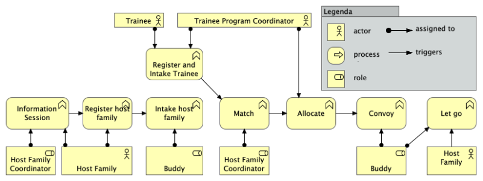
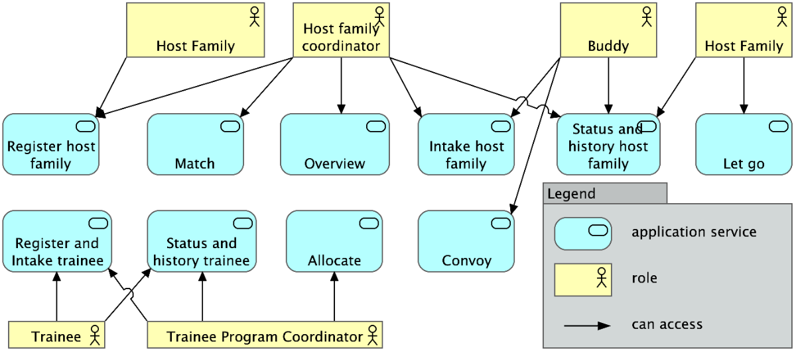
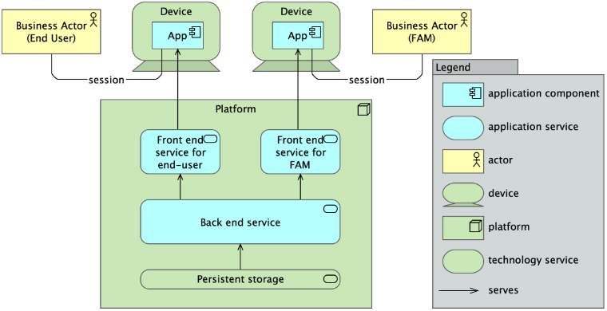

# Information Systems
This first lesson explains information systems because these are the things you will learn to design in this course.

Key takeaways:
1. An information system exists as the collective memory of an organization, so that the organization can act as one single actor.
2. An information system stores facts consistently, to prevent if from contradicting itself. This serves the purpose of integrity of data.
3. Every role gets his or her own view on the data stored in the system, to serve that role in doing his or her job.
4. An information system consists of multiple services, multiple data spaces, and multiple data streams, to support the continuity and flexibility of the organization it serves.
5. An information system has invariants, which encode the laws of the business and must be kept satisfied throughout the lifetime of the system..

## Overview
In general, any information system has a structure like the one depicted below:

An information system is meant to support users (e.g. Peter, Sally, Daisy).
Differences among users can be handled by using roles (e.g. customerRep, sysMgr, MgmtSupporter).
In this diagram, users are coloured to depict different roles.

An information system provides services, each of which realizes a business function.
An example is a service to produce a police report (i.e. the business function), which is to be used only by authorized police officers (i.e. the role).
We distinguish user facing services and non-user facing services.
User facing services (e.g. register a client, sanitize case files, login) can be made available for a limited number of roles,
giving each user access to precisely the services he or she is meant to see.
In the diagram, user-facing services are colored corresponding to the roles they serve.
Non-user facing services are not coloredand are used exclusively by other software.
Services can be either stateful or stateless.
Ampersand stores the state in a database, so all of Ampersand's services are stateless.
This allows scaling an interface manyfold to serve multiple users at a time.
In the diagram, stateful services are drawn with a data container inside.

Each service provides one or more interfaces to communicate with the rest of the world.
We distinguish graphical user interfaces (GUIs) and application programming interfaces (APIs).

Services communicate by means of streams or by means of remote calls.

Let us discuss information systems in more detail from three different perspectives: business, application, and technical.

## Business perspective
From a business perspective, the information system supports actors who execute business processes.
Here is an example of a business process, which shows a process of mediating trainees to a host families.

This example shows various roles, such as a trainee, a trainee program coordinator and a host family.

An information system serves as the collective memory of an organization.
In this example, it would store facts about trainees, host families, and the allocations of trainees to host families.
The purpose is for the organization to remember which facts about trainees and host families were recorded, and which allocations were mede.
Multiple users are typically involved, often in different roles.
This example exhibits trainees, trainee program coordinators, host family coordinators, buddies, and host families.

## Application perspective
From an application perspective, an information system consists of multiple services, multiple data sets, and multiple data streams.
Given the business process, the services of the information system support the roles in the business process corresponding to the business process model.

Typically, every business function is matched by one service in the information system,
so an access mechanism can grant each role access to precisely the right functionality.
(We have colored things that are related to the business yellow. Blue things are related to software and the application.)

However, an information system is more than just a collection of application services.
It also contains data sets, which store the facts that the organization needs to remember.
Data sets are managed by a back-end service, which serves as the corporate memory.
The data must be consistent, so that application services do not contradict each other.
For this reason (i.e. consistency) application services should not contain and store any data separately.

Consistency is defined by invariants. Consider this example:
Assume that at all times, there must be a buddy for each host family with a trainee.
So, if family Ballinger has a trainee, Bill, but has no buddy, the system is inconsistent.
We can detect inconsistencies by coding the constraint and have the computer check it against the data in the system.
We will use the word "invariant" to refer to any constraint (from the business) that must always hold.

Summarizing, an information system not only consists of multiple services and multiple data sets, but there are also invariants that represent the "laws" of the business and must be kept satisfied at all times.

## Technical perspective
To run software and to let users interact with the information system, we need hardware.
So, every physical actor needs a device, e.g. a laptop.
The device runs a client application, e.g. a browser, which connects to the service.
The information system itself typically resides on some platform,
varying from a private data center to a cloud data center, or even on a dedicated computer hidden in a closet at an administrator's residence.
Since they expect it to remember things, it typically has some (or multiple) forms of persistent storage.
The following diagram visualizes this.

The diagram shows two different users: an end-user and a functional application manager (FAM).
In reality, an information system can support any number of roles.
Each user (in whatever role) has a device, e.g. a laptop, with a client application running on it, e.g. a browser.
The core information system serves all roles, each with their own functionality.
In this way, every user gets access only to the functionality to which he or she is entitled.

The back end hides the persistent storage from each front end service.
Typically, the back end contains CRUD functions for every business object in the system.
So, you would expect to find functions to create, read, update, and delete customers, products, orders, etc.
The back end translates these functions to the persistent store, which would be tables in a SQL database, triples in a triple store, etc.

## Ampersand
Ampersand is a tool that helps you design information systems.
The Ampersand compiler generates a complete information system, consisting of a back end with the business logic generated from invariants, a front end with the interface logic, the data model to create the database, and the manifest files to deploy the entire system, all from a single specification.
It lets you deploy with a single command, so you can change and redeploy your specification as often as you like.
The architecture of an Ampersand application is described [here](../reference-material/architecture-of-an-ampersand-application).