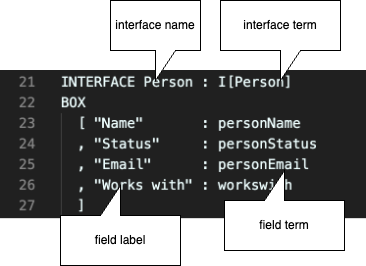
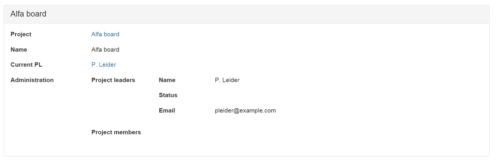
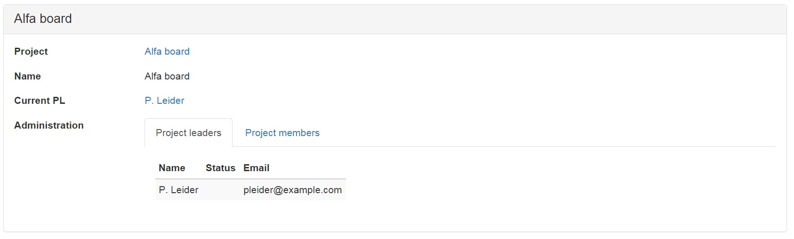

This fifth lesson explains interfaces, so the developer can define different ways to let users change the population of the database.

Key takeaways:
1. Different types of users require different interfaces.
2. Application Programming Interfaces (API) and User Interfaces (UI) have the same structure.

## Purpose

Interfaces are meant to expose functionality and data from a [context](../reference-material/syntax-of-ampersand#the-context-statement), to let users or information systems interact with the system by creating, reading, updating, and deleting data.


## Example

The following figure is an example of a user interface, which shows the name, status, e-mail and co-workers of a person called "J. Lovell".


The specification of this user interface is given in the following interface declaration:


<!-- contents of this picture:
```
INTERFACE Person : I[Person]
BOX
  [ "Name"       : personName
  , "Status"     : personStatus
  , "Email"      : personEmail
  , "Works with" : workswith
  ]
``` -->

An interface declaration contains:
1. a name<br>
   Every interface has a name, which must be unique throughout the name space, so developers can refer to an interface by its name.
   The name of this interface is `Person`.
   In the code, the name immediately follows the keyword `INTERFACE`.
2. the interface term<br>
   The term following the colon, `I[Person]`, is the interface term of this interface.
   At run time, an interface is applied to precisely one atom.
   The interface in the screenshot applies to `"J. Lovell"`.
   This is always the source atom of a pair in the interface term.

   Looking at the screenshot, we can tell that `"J. Lovell"` has one personName (which is `"J. Lovell"`), it has no personStatus, one personEmail and three persons to work with in `RELATION workswith`.

   In other words, the interface applies to one atom, which belongs to the domain of the interface term.
   A consequence is that an interface has a concept, i.e. the source of the interface term, which is the type of every atom to which the interface applies.
3. field labels<br>
   The labels "Name", "Status", "Email", and "Works with" correspond to field names in the user interface.
   The field labels that are declared show up as labels in the actual user interface.
   A field name and the corresponding field term are separated by a colon.
4. field terms<br>
   Each term at the right of a field name specifies which data is presented in the field.
   For this reason it is called the _field term_ for that field.
   Of all pairs `<"J. Lovell", x>` from the field term, the field displays the right atom `x`.
   A field term always works on one specific atom on the left, which is `"J. Lovell"` in this example.

   For this example to work, this interface assumes that the relations `personName`, `personStatus`, `personEmail`, and `workswith` exist. The example was built with the following relations:

   ```
   RELATION personName :: Person * PersonName [UNI]
   RELATION personStatus :: Person * PersonStatus [UNI]
   RELATION personEmail :: Person * Email [UNI,TOT]
   RELATION workswith :: Person * Person
   ```
   The source concepts of a field term must match the target concept of the interface term. The type checker enforces this constraint.


## Nesting

You can create structure in an interface by nesting. Here is an example:



The specification of this interface is given in the following code fragment.

```
INTERFACE "Project"  : I[Project] BOX
  [ "Project"     : I[Project]
  , "Name"        : projectName
  , "Current PL"  : pl
  , "Administration" : I[Project] BOX
     [ "Project leaders" : project~;assignee/\pl BOX
        [ "Name"      : personName
        , "Status"    : personStatus
        , "Email"     : personEmail
        ]
     , "Project members" : project~;assignee/\member BOX
        [ "Name"      : personName
        , "Status"    : personStatus
        , "Email"     : personEmail
        ]
     ]
  ]
```

Notice the following features:\
1\. The structure of an interface is hierarchical. It consists of boxes within a box. This is because a field term may be followed by a `BOX` with a list of subinterfaces. Without it, it is just a field term. 2. When a field term is followed by a `BOX`, every atom in the _codomain of the field term_ is displayed in a box of its own on the screen. That box behaves like an interface with the field term serving as interface term of that subinterface. 3. By this mechanism, the hierarchical structure of the entire interface translates directly to the hierarchical structure of the web-page in which it is displayed. 4. The source concept of a field term must match with the target concept of the field term outside the box. 5. The target concept of a field term that has a box, must match with the source concepts of each field inside that box.

## Formatting

Especially in more complicated interfaces, you will find it nice to adapt the layout of the fields in the user interface. For this purpose, you can refine the word `BOX` with `<FORM>`, `<TABLE>`, or `<TABS>`, as in the following code fragment. Note that these annotation have no meaning other than to change what the user interface looks like.

```
INTERFACE "Project"  : V[SESSION*Project]
BOX<TABLE>
  [ "Project"     : I[Project]
  , "Name"        : projectName
  , "Current PL"  : pl
  , "Administration" : I[Project]
    BOX <TABS>
     [ "Project leaders" : project~;assignee/\pl
       BOX <TABLE>
        [ "Name"      : personName
        , "Status"    : personStatus
        , "Email"     : personEmail
        ]
     , "Project members" : project~;assignee/\member
       BOX <TABLE>
        [ "Name"      : personName
        , "Status"    : personStatus
        , "Email"     : personEmail
        ]
     ]
  ]
```

Notice the effect that these changes have on the user interface.



Notice the following features:\
1\. The keyword `BOX <TABS>` turns the box into a layout with tabs.\
2\. The keyword `BOX <TABLE>` turns the layout 90 degrees into columns.\
3\. The keyword `BOX <FORM>` is default for any box. It does not change the effect of `BOX`.

## Layout and Widgets

TODO

## Assignment

Compile and run the script [Project Administration Example](https://github.com/AmpersandTarski/ampersand-models/tree/master/examples/ProjectAdministration). Start by reproducing everything that is shown above. It is quite likely that you will be trying out your own ideas before you get to the end... Have fun!

## What have you learned?

After finishing your assignment, you have learned:

- to explain how an interface definition is displayed on the screen of a user.
- to predict which data items an interface applies to, if you know which pairs are in an interface term.
- to predict which data items are displayed, if you know which pairs are in a field term.
- to explain which atoms are used in a sub-interface.
- to understand what the keywords `TABS`, `COLS`, and `ROWS` do to your display.

  More than one interface may apply to the same atom. That gives you a choice on runtime to which interface you want to navigate. If no interface applies, that atom is not navigable.
