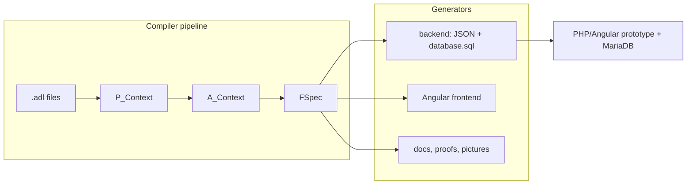

# Ampersand architecture map for incremental evaluation

Ground-truth map of the compiler pipeline, made to locate where a DBSP-style
incremental view maintenance feature (arXiv 2203.16684) could plug in. Every
claim carries a file reference verified against the source on 2026-08-13
(branch `oscillation-in-diagnosis`).

## 1. Pipeline: ADL source → running prototype

- **Parse.** `parseFilesTransitive` reads the root files plus transitive
  INCLUDEs and yields a `Guarded P_Context`
  (`src/Ampersand/Input/Parsing.hs:91`). The grammar lives in
  `src/Ampersand/Input/ADL1/Parser.hs:37` (`pContext`); the parse tree type
  `P_Context` is `src/Ampersand/Core/ParseTree.hs:83`.
- **Type check (P → A).** `pCtx2aCtx`
  (`src/Ampersand/ADL1/P2A_Converters.hs:374`) turns the P-structure into a
  type-checked `A_Context`. Here terms become the `Expression` AST
  (`src/Ampersand/Core/AbstractSyntaxTree.hs:1200`): binary relation algebra
  with constructors `EEqu/EInc/EIsc/EUni/EDif/ELrs/ERrs/EDia/ECps/ERad/EPrd`,
  closures `EKl0/EKl1`, unary `EFlp/ECpl`, and leaves `EDcD` (relation),
  `EDcI` (identity), `EDcV` (full relation), `EMp1` (atom literal), `EBin`.
  A `Rule` (`src/Ampersand/Core/AbstractSyntaxTree.hs:456`) carries its
  `formalExpression` (line 462), an optional violation presentation `rrviol`
  (line 470), and its provenance `rrkind` (line 474: user-defined, property,
  identity, or Enforce).
- **Recipes (FSpec creation).** `createFspec`
  (`src/Ampersand/FSpec/ToFSpec/CreateFspec.hs:73`) picks a recipe
  (Standard/Grind/Prototype/RAP). The Prototype recipe merges the user script
  with the PrototypeContext metamodel and grinds meta-population into it
  (`src/Ampersand/FSpec/ToFSpec/CreateFspec.hs:94-106`).
- **FSpec.** `makeFSpec` (`src/Ampersand/FSpec/ToFSpec/ADL2FSpec.hs:30`)
  builds the central `FSpec` record (`src/Ampersand/FSpec/FSpec.hs:63`): all
  rules, relations, `plugInfos` (line 72), conjuncts and their per-rule /
  per-relation / per-concept maps (lines 114-120), quads (line 122), and
  in-Haskell population evaluation (`pairsInExpr`, line 147; `allViolations`,
  line 150).
- **Generators.** The `proto` command (`src/Ampersand/Commands/Proto.hs:24`)
  calls `doGenFrontend` (`src/Ampersand/Prototype/GenFrontend.hs:23`, Angular
  code from templates) and `doGenBackend`
  (`src/Ampersand/Prototype/GenBackend.hs:19`, the JSON + SQL contract of §5).

## 2. Rules → conjuncts → violation queries (the existing partial incrementality)

- **Conjunct splitting.** `conjuncts env rule = exprIsc2list . conjNF env .
  formalExpression` (`src/Ampersand/FSpec/ToFSpec/NormalForms.hs:1713-1719`):
  the rule term is brought into conjunctive normal form (`conjNF`,
  `src/Ampersand/FSpec/ToFSpec/NormalForms.hs:1676`) and split at top-level
  `/\`. `makeAllConjs` (`src/Ampersand/FSpec/ToFSpec/NormalForms.hs:1906`)
  deduplicates conjuncts across rules and wraps each in a `Conjunct`
  (`src/Ampersand/Core/AbstractSyntaxTree.hs:514`): `rc_id` ("conj_<i>"),
  `rc_orgRules` (all rules sharing it), `rcConjunct` (the term), and
  `rc_dnfClauses`.
- **DnfClause / shifts.** A `DnfClause`
  (`src/Ampersand/Core/AbstractSyntaxTree.hs:523`) holds antecedents and
  consequents (`Dnf antcs conss` means `-antcs \/ conss`). `allShifts`
  (`src/Ampersand/FSpec/ToFSpec/NormalForms.hs:1721`) derives algebraic
  variants of each clause by shifting relations across the inclusion using
  uni/inj/sur properties (`shiftL` line 1731, `shiftR` line 1791). These
  variants were historically the raw material for computing repair actions;
  today they ride along in the `Conjunct`.
- **Affected-conjunct maps.** `makeFSpec` computes
  (`src/Ampersand/FSpec/ToFSpec/ADL2FSpec.hs:225-237`):
  `allConjsPerRule` (line 227), `allConjsPerDecl` (line 228: a conjunct is
  affected by every relation in `bindedRelationsIn` of its term), and
  `allConjsPerConcept` (lines 229-237: source/target concepts of the
  modifiable leaves, including smaller concepts; the leaves come from
  `modifyablesByInsOrDel`, `src/Ampersand/Classes/ConceptStructure.hs:153`).
  This is the compiler's existing incrementality: it tells the runtime *which
  conjuncts* to re-evaluate when a relation or concept population changes —
  but each re-evaluation still runs the full violation query.
- **Quads.** A `Quad` (`src/Ampersand/FSpec/FSpec.hs:263`) pairs one relation
  with one rule and that rule's conjuncts — the "switchboard": "whenever
  relation r is affected, the rule may have to be restored"
  (`src/Ampersand/FSpec/ToFSpec/Calc.hs:109-121`). Quads (`vquads`,
  `src/Ampersand/FSpec/FSpec.hs:122`) are only rendered in the Haskell dump
  (`src/Ampersand/FSpec/ShowHS.hs:247`); the prototype contract uses the
  conjunct maps instead.
- **Violation query.** A conjunct holds when its term equals V; its violations
  are the pairs of the complement. The generated SQL per conjunct is literally
  `sqlQuery fSpec . conjNF env . notCpl . rcConjunct`
  (`src/Ampersand/Output/ToJSON/Conjuncts.hs:37`).

## 3. SQL generation: relation algebra → MariaDB SQL

Module `src/Ampersand/FSpec/SQL.hs`, entry points `sqlQuery` /
`sqlQueryWithPlaceholder` (`src/Ampersand/FSpec/SQL.hs:58-60`) and
`broadQueryWithPlaceholder` (line 35, for interface objects with their UNI
attribute subqueries). The runtime placeholder is the literal `_SRCATOM`
(`src/Ampersand/FSpec/SQL.hs:32-33`).

- **Intermediate form.** Every term compiles to a `BinQueryExpr`
  (`src/Ampersand/FSpec/SQL.hs:1407`): `BinSelect` (a two-column SELECT with
  FROM/WHERE), `BinQueryExprSetOp` (UNION/INTERSECT/EXCEPT), `BinWith`
  (common table expression, possibly recursive), plus a comment wrapper. This
  is then pretty-printed via the `simple-sql-parser` AST
  (`src/Ampersand/FSpec/SQL.hs:20-22`).
- **Translation per operator** (`selectExpr`, `src/Ampersand/FSpec/SQL.hs:143`;
  special-case optimizer `maybeSpecialCase`, line 160):
  - `EDcD r` → SELECT of the two columns storing r in its plug, WHERE both
    NOT NULL (`selectRelation`, `src/Ampersand/FSpec/SQL.hs:1325-1356`; plug
    lookup via `getRelationTableInfo`, `src/Ampersand/FSpec/FSpecAux.hs:9`).
  - `ECps` (composition) → "poles and fences": one FROM entry per factor,
    WHERE equalities joining target column of fence i-1 to source column of
    fence i (`src/Ampersand/FSpec/SQL.hs:561-680`).
  - `EFlp` → swap the src/tgt columns (`src/Ampersand/FSpec/SQL.hs:707`).
  - `EUni` → UNION (`src/Ampersand/FSpec/SQL.hs:552-560`); `EIsc` → join of
    the operands (line 284 ff.), with LEFT-JOIN/NOT-IN special cases for
    `x /\ -y` (lines 197-204) and for `I /\ -(r;r~)` (lines 163-196).
  - `EDif (l,r)` → `l /\ -r` (`src/Ampersand/FSpec/SQL.hs:1171-1173`);
    `EEqu`/`EInc` rewritten into `\/`/`-`/`/\` first (lines 1165-1170).
  - `ECpl e` → **active-domain complement**: the source is the "closed world
    expression" `EDcV (sign e)` — the cartesian product of the two concept
    tables — minus the pairs of `e` via `NOT EXISTS`
    (`src/Ampersand/FSpec/SQL.hs:982-1028`). Special cases: `-V` → empty set
    (line 945), `-I[c]` → self-join of c's concept table with `<>`
    (lines 949-979).
  - `EDcV` → concept tables of source and target
    (`src/Ampersand/FSpec/SQL.hs:777-783`); `EDcI c` → c's concept-table
    column twice.
  - `EKl0` → `I \/ e+` (`src/Ampersand/FSpec/SQL.hs:1029-1041`); `EKl1` →
    `WITH RECURSIVE TransitiveClosure` CTE
    (`src/Ampersand/FSpec/SQL.hs:1042-1064`).
- **Active domain bookkeeping.** Which concepts need a concept table is
  decided by mirroring `selectExpr`'s reads (`sqlConceptTable`,
  `src/Ampersand/FSpec/SQL.hs:1553`; `sqlAttConcept`, line 1560) in
  `src/Ampersand/FSpec/ToFSpec/ConceptTables.hs:1-23` (`conceptsReadBy`,
  issue #1672). Any new SQL emitter must keep that mirror in sync.

## 4. Generated database schema (plugs)

- **Plug types.** `PlugSQL` (`src/Ampersand/FSpec/FSpec.hs:307`): `TblSQL`
  (wide table: kernel of injective-related concepts plus UNI/INJ attribute
  columns; concept lookup `cLkpTbl`, relation lookup `dLkpTbl` of `RelStore`s)
  and `BinSQL` (two-column link table for relations that are neither UNI nor
  INJ).
- **Schema decisions.** `makeGeneratedSqlPlugs`
  (`src/Ampersand/FSpec/ToFSpec/ADL2Plug.hs:55`) builds them: `TblSQL`
  construction at lines 160-210 (with `rsStoredFlipped` deciding whether a
  relation is stored flipped in the table of its target), link tables at
  lines 250-290, key-type suitability `suitableAsKey` at line 383. Which
  concepts get a table at all comes from
  `src/Ampersand/FSpec/ToFSpec/ConceptTables.hs` (only concepts some query
  actually reads).
- **DDL.** `plug2TableSpec` / `createTableSql`
  (`src/Ampersand/Prototype/TableSpec.hs:48,78`) produce the CREATE TABLE
  statements; `databaseStructureSql` / `generateDBstructQueries`
  (`src/Ampersand/Output/FSpec2SQL.hs:13-21`) assemble `database.sql`.

## 5. Runtime contract: compiler → prototype framework

`doGenBackend` (`src/Ampersand/Prototype/GenBackend.hs:23-43`) writes into the
"generics" directory: `database.sql`, `settings.json`, `relations.json`,
`rules.json`, `concepts.json`, `conjuncts.json`, `interfaces.json`,
`views.json`, `roles.json`, `populations.json`, optionally `openapi.json`.
The PHP framework (separate repo AmpersandTarski/prototype) reads these; the
compiler side of the contract is:

- `conjuncts.json`: per conjunct its id, the invariant and signal rule names
  it serves, and the ready-made violation SQL
  (`src/Ampersand/Output/ToJSON/Conjuncts.hs:14-38`).
- `relations.json`: per relation the affected conjunct ids
  (`relJSONaffectedConjuncts`, `src/Ampersand/Output/ToJSON/Relations.hs:74`,
  from `allConjsPerDecl`) plus `RelTableInfo` — which table/columns store the
  relation and whether in the src table, tgt table, or an n-n table
  (`src/Ampersand/Output/ToJSON/Relations.hs:31-44,90-109`) — so the runtime
  can write pairs with plain INSERT/UPDATE/DELETE.
- `concepts.json`: per concept its table/columns and affected conjunct ids
  (`src/Ampersand/Output/ToJSON/Concepts.hs:25,95`, from
  `allConjsPerConcept`).
- `rules.json`: per rule its conjunct ids
  (`src/Ampersand/Output/ToJSON/Rules.hs:76`) and the pair-view segments,
  including per-segment SQL (`src/Ampersand/Output/ToJSON/Rules.hs:111-113`).
- `interfaces.json`: per interface object a full query with the `_SRCATOM`
  placeholder (`exprJSONquery = broadQueryWithPlaceholder …`,
  `src/Ampersand/Output/ToJSON/Interfaces.hs:72,166`).
- `settings.json`: the model hash (`src/Ampersand/Output/ToJSON/Settings.hs:29`,
  `Hashable FSpec` at `src/Ampersand/FSpec/FSpec.hs:181-193`) with which the
  runtime detects that the database must be reinstalled.

The implied runtime behaviour: per transaction the framework collects the
touched relations/concepts, unions their `affectedConjuncts`, reruns those
conjuncts' violation SQL, blocks the transaction on invariant violations, and
feeds signal violations to users and `{EX}`-prefixed violation texts to the
ExecEngine, which repeats until stable or "Maximum reruns exceeded"
(documented at `src/Ampersand/FSpec/Oscillation.hs:1-10`; exit code 45 wiring
at `src/Ampersand/Basics/Exit.hs:43`).

The compiler itself also evaluates rules in two places that would need the
same incremental treatment or none: at compile time in Haskell on the initial
population (`allViolations`, `src/Ampersand/FSpec/ToFSpec/ADL2FSpec.hs:103-108`,
via `fullContents`, `src/Ampersand/FSpec/ToFSpec/Populated.hs:61`), and in
`ampersand validate`, which runs each generated query against a temporary
MariaDB (`evaluateExpSQL`, `src/Ampersand/Prototype/PHP.hs:36-51`).

## 6. Candidate intervention points (options, not a recommendation)

- **(a) Per-relation delta queries at the RA level.** Rewrite each conjunct C
  and relation r ∈ `bindedRelationsIn C` into a delta term ΔC/Δr before SQL
  generation. Touches: a new rewrite module beside
  `src/Ampersand/FSpec/ToFSpec/NormalForms.hs` (the `allShifts` machinery at
  line 1721 already does property-driven term rewriting, and the commented-out
  `delta` placeholder at `src/Ampersand/FSpec/ToFSpec/NormalForms.hs:1148-1168`
  is the historical seed of exactly this idea); the conjunct maps in
  `src/Ampersand/FSpec/ToFSpec/ADL2FSpec.hs:225-238`; serialization in
  `src/Ampersand/Output/ToJSON/Conjuncts.hs` (extra SQL per
  (conjunct, relation) with placeholders for the changed pairs);
  `src/Ampersand/FSpec/SQL.hs` unchanged in principle (it compiles any
  `Expression`), but `ConceptTables.hs` must keep seeing every concept the
  delta queries read. Non-monotone operators (`ECpl`, residuals) and closures
  (`EKl0/EKl1`, `src/Ampersand/FSpec/SQL.hs:1029-1064`) are where DBSP's
  bilinear/recursive treatment would matter.
- **(b) Generate DBSP circuits / Feldera SQL instead of MariaDB queries.** A
  second backend beside `src/Ampersand/FSpec/SQL.hs` translating `Expression`
  (or `BinQueryExpr`) to Feldera's dialect, schema emission beside
  `src/Ampersand/Prototype/TableSpec.hs` and
  `src/Ampersand/Output/FSpec2SQL.hs`, wiring in
  `src/Ampersand/Prototype/GenBackend.hs:23-43`, and a changed runtime
  contract in `src/Ampersand/Output/ToJSON/*`. The prototype framework repo
  would need a matching consumer.
- **(c) Database-side IVM (triggers / materialized violation tables).** Emit,
  next to each table in `generateDBstructQueries`
  (`src/Ampersand/Output/FSpec2SQL.hs:20`), triggers that maintain one
  materialized violation table per conjunct; `conjuncts.json`
  (`src/Ampersand/Output/ToJSON/Conjuncts.hs:37`) would then point at that
  table instead of a query. Compiler changes concentrate in
  `src/Ampersand/Prototype/TableSpec.hs` and `Output/FSpec2SQL.hs`; MariaDB
  10.4 has no native IVM, so the trigger bodies would themselves need the
  delta terms of option (a).
- **(d) Rewrite in the prototype runtime.** The compiler already ships the
  switchboard (`affectedConjuncts` per relation and concept,
  `src/Ampersand/Output/ToJSON/Relations.hs:74` and
  `src/Ampersand/Output/ToJSON/Concepts.hs:95`); a runtime-side change (in the
  AmpersandTarski/prototype repo) could cache conjunct results and re-check
  only pairs derivable from the transaction's writes. Compiler involvement
  would be limited to enriching the JSON contract (e.g. shipping
  `rc_dnfClauses` or delta queries per conjunct-relation pair).

## 7. Existing incremental/delta machinery (and ECA remnants)

- No module in `src/` mentions "incremental"; the only "delta" is the
  commented-out placeholder relation in
  `src/Ampersand/FSpec/ToFSpec/NormalForms.hs:1148-1168`.
- The historical ECA machinery (EcaRule/PAclause derivation of repair actions)
  is gone from the code. What remains: the `Quad` switchboard
  (`src/Ampersand/FSpec/FSpec.hs:263`, `src/Ampersand/FSpec/ToFSpec/Calc.hs:105`,
  now documentation-only), the `DnfClause` shifts (§2), and the ENFORCE
  statement: `AEnforce` (`src/Ampersand/Core/AbstractSyntaxTree.hs:366`) is
  compiled into rules of kind `Enforce` whose violation text is an ExecEngine
  script — `{EX} InsPair;rel;...` / `{EX} DelPair;rel;...`
  (`src/Ampersand/ADL1/P2A_Converters.hs:1109-1199`). Automated enforcement
  therefore runs entirely in the prototype's ExecEngine, driven by the same
  full violation queries.
- `src/Ampersand/FSpec/Oscillation.hs` (Stage 1 of the oscillation-risk
  analysis) statically reads those `InsPair`/`DelPair` texts
  (lines 378-394) to warn about repair loops — the analysis layer closest in
  spirit to reasoning about rule/relation dependencies.
