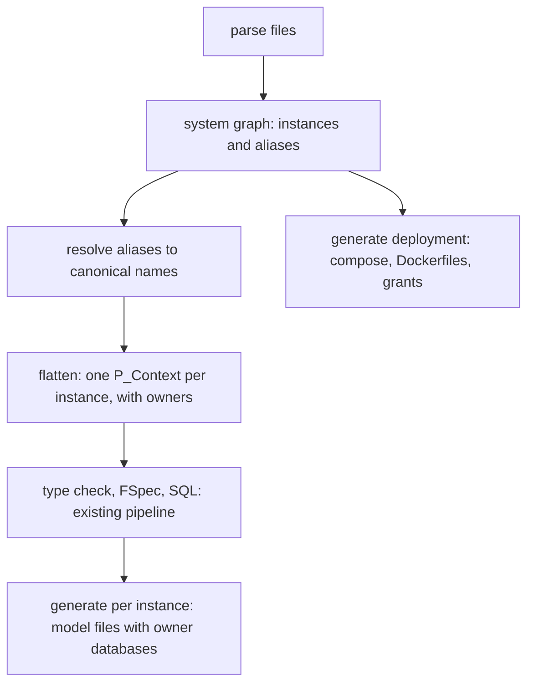
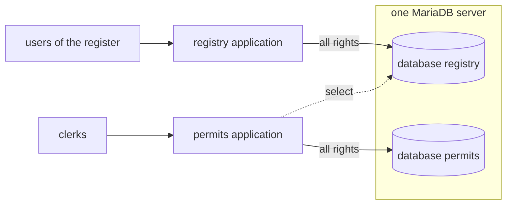
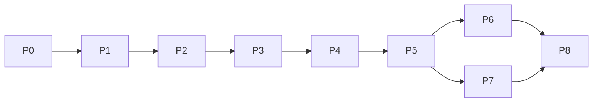

# Multi-context Ampersand: plan of approach

Status: in progress (2026-10-05).
The syntax, the scope and the flattening (phases P1 to P3) are built on the branch `multi-context`,
for contexts that the including application stores in its own database.
Contexts on databases of their own,
the framework and the deployment (phases P4 to P7) are still to do.
The decisions of section 4 were taken provisionally during the build;
[DesignChoices.md](DesignChoices.md) records them and where the build deviates from this plan.
Tracking issue: AmpersandTarski/Ampersand #1509,
"Describe an agreed-upon semantics of the namespace stuff".
Branch: `multi-context`.

## 1. Goal

Today an Ampersand script compiles into one information system with one database.
The goal is that one specification describes a system of several databases,
with one context per database, in which a context can use what another context declares and stores.
The developer writes an `INCLUDE` statement with a prefix, the compiler resolves the names,
and a new command generates everything that is needed to run the system: a compose file,
a Dockerfile per context, and the database set-up.

The reason to do this now is that three pieces have come together.
The compiler has had names with a name space since v5.0.0,
the article of October 2026 gives the semantics that issue #1509 asks for,
and the migration approach of 2024 cannot be built without it.

## 2. What we know

This plan rests on sources that carry the detail; it repeats only what a phase needs.

- **The article** *Multi-Context Information Systems in Ampersand* (`cloudDrive/publicaties/2026 Multi-contexts/multicontext.tex`).
  It defines owners, scope, views, and steps, and proves six theorems.
  The compiler work leans on three of them:
  a view with its closure is one information system (flattening),
  adding an including context changes nothing for the included one (conservative extension),
  and a step affects only contexts that reach what it writes (non-interference).
- **The Lean proofs** (`evidence/lean/MultiContext.lean` next to the article),
  built with `lake build` on 5 October 2026.
- **The literature study** (`Investigative Report: Design Choices in Multi-Context Ampersand.md`, same directory).
  It ends with twelve questions about the article;
  section 4 below turns the ones that block the build into decisions.
- **Earlier decisions of the core team**, which this plan either adopts or names as a divergence:
  - #850 (2018): importing yields a disjoint union, names get the prefix of the imported unit,
    every unit is one file, syntax follows Haskell unless there is a reason.
  - #1307 (2022, open): name spaces in phases; phase 1, the data type `Name`,
    was released in v5.0.0; phase 2 is the import statement.
  - Core team meeting of 24 February 2023: the keyword is `MODULE`, in preference to `NAMESPACE`.
  - #1467 (2024): the semantics of `INCLUDE` has to prepare for distributed systems and data migration; it proposes to replace `CONTEXT` by `MODULE`.
  - #1470 (2024): reuse of designs by including patterns.
  - #1509 (2024): Han asks Stef and Michiel for an agreed semantics,
    "so I (or someone else) can build this one-time-right".
- **The code as it is**, checked on 5 October 2026:
  - `pIncludeStatement` in `src/Ampersand/Input/ADL1/Parser.hs` reads a file name
    and an optional list of preprocessor variables.
  - `parseFilesTransitive` in `src/Ampersand/Input/Parsing.hs` folds all parsed files into one `P_Context` with `mergeContexts`.
  - `mergeContexts` in `src/Ampersand/Core/ParseTree.hs` takes the union:
    it keeps the name of the first context and merges relations with equal name and signature.
  - `pName` in `src/Ampersand/Input/ADL1/ParsingLib.hs` already reads a dotted prefix on every kind of name, and `withNameSpace` in `src/Ampersand/Basics/Name.hs` prepends one.
  - The type checker resolves names in maps keyed by `Name` (`DeclMap` and `conceptMap` in `src/Ampersand/ADL1/P2A_Converters.hs`).
  - `src/Ampersand/FSpec/SQL.hs` refers to a table with a one-part name (`TRSimple [name]`).
  - The compiler does not know the name of the database;
    the framework takes it from `AMPERSAND_DBNAME`, with the context name as default.
  - In PrototypeFramework, `MysqlDB.php` holds one connection and one `dbName`,
    and the installer drops and creates that database.
  - `project-template/project/Dockerfile` runs `ampersand proto` inside the image build,
    for one script and one database.
  - The compiler's regression suite lives in `testing/Travis/testcases/` (run by `stack test`);
    the framework's in `test/projects/` (run by `test/run-regression.sh`).

## 3. What "done" means

Two scenarios run end to end from the scripts, a deployment descriptor, and generated files.

1. **Register and permits.**
   A context `Permits` includes a context `Registry`.
   Both run as prototypes on their own database.
   A clerk sees persons of the register in the permit application.
   Deleting an address in the register makes a signal appear in the permit application,
   and the permit application cannot change the register.
2. **Migration.**
   The demo of the 2024 paper (`Kurk.adl`) is rewritten as three contexts: existing, desired,
   migration.
   The migration context copies the data, users repair the violations of the new invariant,
   and at the moment of completion the desired system starts on its own database without moving data.

Every existing script compiles to byte-identical output, unless it uses the new form of `INCLUDE`.

## 4. Decisions needed before coding

Each decision states what was observed, the options, what each yields and costs,
and a recommendation.
They are in the order in which they block the work.

### D1. What a bare `INCLUDE` means

*Observed.*
Today `INCLUDE "f.adl"` means union, and every existing script and every test relies on it.
The article makes every include a disjoint union
and adds the keyword `QUALIFIED` to ask for prefixes only.
In 2023 Stef expected the opposite split: a bare `INCLUDE` keeps the union,
and `INCLUDE "f.adl" AS x` gives the disjoint union.
The literature study found that Haskell users would like prefixes to be the default,
and that Haskell cannot change its default any more.

*Options.*
(a) A bare `INCLUDE` keeps today's meaning.
The new meaning is selected by `AS`, and its names always carry the prefix.
(b) Every `INCLUDE` becomes disjoint, with `QUALIFIED` and `AS` as in the article.
(c) A new keyword carries the new meaning and `INCLUDE` is left alone.

*What each yields and costs.*
Option (a) keeps every script and test valid without a migration, needs no keyword `QUALIFIED`,
and settles the question of the default: the new form is always qualified.
It costs one deviation from Haskell:
there is no way to bring the names of an included context into scope without a prefix.
Option (b) follows the article literally.
Its cost is unknown until measured:
every script in which two files declare the same relation changes meaning.
Phase 0 measures this with a diagnostic over the test suite and the known projects.
Option (c) costs a keyword and gives nothing that (a) does not give.

*Recommendation.*
Option (a), written as `INCLUDE "f.adl" AS x`, with the alias after the file name.
This departs from the brief of 5 October 2026,
which says that `INCLUDE "foo.adl"` inside context A means that A includes B,
and which asks for the keywords `QUALIFIED` and `AS`.
In the article it changes the section on syntax and the example of the permits context:
the keyword `QUALIFIED` and the two forms without a prefix disappear.
The definitions and theorems of the article are unaffected,
because the form without a prefix was a convenience in the scope relation.

### D2. The unit that gets a name space

*Observed.*
The brief of October 2026 makes the context the unit: one context, one database.
The core team decided for a unit called `MODULE` in 2023,
and #850 and #1470 see the pattern as a unit of reuse inside a context.

*Options.*
(a) The context is the unit for this project; modules and patterns are left to phase 2 of #1307.
(b) Rename `CONTEXT` to `MODULE` first, as #1467 proposes.

*Recommendation.*
Option (a).
The scope relation of the article does not depend on what the unit is called.
This plan builds it once, in a module of its own, so that name spaces for patterns can reuse it.
Renaming a keyword touches every script and adds nothing to the two scenarios.
This is a divergence from the decision of 24 February 2023, and it has to be confirmed in #1509.

### D3. A script is not a database: instances

*Observed.*
Two kinds of inclusion occur in practice.
A design such as SIAM is reused:
every application that includes it wants its own sessions and accounts.
A system such as the population register is referred to: every municipality sees the same register.
The article identifies a context with its script, which covers the second kind only.
The desired system during a migration is of the first kind: it has a database,
and no application of its own yet.

*Options.*
(a) The contexts of the theory are *instances*: a script together with a database.
A deployment descriptor lists the instances and binds every alias of every instance to an instance.
(b) Two different statements in the language, one for reuse and one for reference.

*What each yields and costs.*
Option (a) keeps the language at one statement and the theory unchanged,
since nothing in the article depends on a context being a script.
It costs a descriptor file, which the deployment needs anyway.
Option (b) puts a deployment fact, whether a database is shared, into the script.

*Recommendation.*
Option (a), with a default that needs no descriptor: an included context gets a private instance,
with a database of its own and no application of its own; the including instance serves it.
A shared instance is declared in the descriptor.
Section 6 gives the shape of the descriptor,
which builds on the file `Deployment.yaml` of the 2024 draft on distributed systems.

### D4. Where the databases live

*Observed.*
MariaDB lets one connection read tables of several databases on the same server,
with a two-part name, and lets one transaction span them.
Between servers neither holds.
This was tried on 5 October 2026 on MariaDB 10.4.34 with the script `spike-mariadb.sql` in this directory: a query joined a table of one database with a table of another, a transaction that had inserted in both was rolled back in both, and a user with `SELECT` on the second database could read it and was refused a `DELETE` and a `DROP DATABASE`.

*Options.*
(a) One MariaDB server, one database per instance.
(b) One server per instance.

*What each yields and costs.*
With (a), a rule of A over data of B is one SQL query,
and a step that writes two databases is atomic, which is what the article assumes.
The privileges of the database user of each instance can be generated from the theory:
all rights on its own database and on those of the private instances it serves,
`SELECT` on the databases it reaches, and write rights on the databases it writes.
The database then enforces non-interference.
With (b), reading needs replication or an API, and a step over two databases needs compensation.

*Recommendation.*
Option (a) for this project.
Option (b) is a later project, and the literature study names sagas as its starting point.

### D5. Which instance gets an application

*Options.*
(a) One prototype container per instance that has an application;
an instance without one is served by the instance that includes it.
(b) One container that serves all instances.

*Recommendation.*
Option (a).
It matches "one context, one database", keeps the framework's assumption of one model per backend,
and makes the second scenario possible:
at the moment of completion the desired instance gets its own container.
It costs one container per application, which the generated compose file hides from the developer.

### D6. Statements about a thing of another context

*Observed.*
The article gives every declaration an owner and is silent about `CLASSIFY`, `REPRESENT`,
`POPULATION`, `PURPOSE`, `VIEW` and `IDENT` for a thing that another context owns.
The literature study shows what happened in Haskell,
where the corresponding statements escaped the name space and can no longer be brought back.
In Ampersand, `CLASSIFY` and `REPRESENT` also determine the table layout,
and a table cannot span two databases.

*Recommendation.*
A strict start that can be relaxed later.
`CLASSIFY` relates concepts of one owner only.
`REPRESENT`, `VIEW` and `IDENT` are stated by the owner of the concept.
`POPULATION` for a relation of another instance is a write, and is refused until phase 7.
`PURPOSE` is allowed everywhere, because it is documentation.

### D7. How an instance notices a change in an instance it reaches

*Observed.*
The framework re-evaluates only the conjuncts that a transaction of its own may have affected.
A change made by another application passes unnoticed.

*Options.*
(a) Conjuncts that depend on a table of another instance are re-evaluated at the start of every request.
(b) Every instance writes a change log that the instances that reach it read.

*Recommendation.*
Option (a) first, with a measurement of its cost in the regression project,
and option (b) when the measurement asks for it.
Option (a) is correct by construction and needs no cooperation of the included instance.

## 5. Architecture

### Compiler

The compiler gets one new stage and one new annotation; the type checker,
the normaliser and the SQL generator keep working on a single context.



1. **System graph.**
   Parsing no longer folds everything into one `P_Context`.
   Files joined by a bare `INCLUDE` are merged as today into one context.
   An `INCLUDE … AS` becomes an edge between two contexts.
   The result is a graph of contexts,
   which the descriptor (or the default of D3) turns into a graph of instances.
2. **Alias resolution.**
   A pass over the parse tree of each instance replaces every name `alias.x` by a canonical name `instance.x`, using the scope relation of the article.
   The canonical name uses the identifier of the instance and not the alias,
   so that a thing reached along two paths has one name.
   This pass reports the errors of the article's definition: an unknown alias,
   an alias used for two contexts, an alias equal to the context's own name,
   a name that is used and denotes nothing or two things.
   Names are not transitive, as in the article; the pass rejects `a.b.x`.
3. **Flattening.**
   For each instance, the declarations of all instances it reaches are joined into one `P_Context`,
   each declaration annotated with its owner.
   The flattening theorem says that this single context has the meaning of the system as seen from that instance, so the existing pipeline applies unchanged.
4. **Ownership in the output.**
   The owner travels through `A_Context` and `FSpec` to the generators.
   For an instance, the generated model contains the tables and the initial population of its own things only, the conjuncts of its own rules, and the rules it adopts from the private instances it serves.
   A table of another instance is referred to by a two-part name, database and table.

### The layout of an included instance

The table layout of an instance has to be a function of its own script.
Otherwise including it would change it, against the conservative-extension theorem.
Two optimisations of the compiler make the layout depend on the queries that read it:
a concept gets a table only when a query needs one (v5.9.4),
and a univalent relation is folded into a column.
An including instance may need a concept table that the included instance never created.

Two ways out exist.
In the first, the compiler has a multi-context mode in which every instance materialises every concept.
The layout is then a function of the script and the mode, and the mode is part of the model hash.
The saving of v5.9.4 is given up for systems of several contexts
and kept for every script that is compiled as today.
In the second, the generated layout of an instance is its published interface,
and the compiler of an including instance reads it.
That keeps the optimisation and makes the build of one instance depend on the build output of another.

This plan takes the first.
At start-up, an application compares the model hash of every instance it reaches with the hash it was compiled against, and refuses to start on a mismatch.

### Framework

- One backend serves one instance, with `AMPERSAND_DBNAME` set by the generated compose file.
- Queries arrive from the compiler with two-part table names,
  so reading needs no change in the query layer.
- Writing a relation or concept of another instance is refused in the plug until phase 7.
- The installer creates and drops the database of its own instance
  and of the private instances it serves, and no other;
  the database set-up script creates the databases and the grants.
- An application keeps the invariants of the private instances it serves,
  by adopting their rules as the article describes for the migration context.
- Interfaces can show relations of an instance that the application reaches, read-only.
- Conjuncts that depend on another instance follow D7.
- The session and navigation tables of the prototype context belong to each instance that has an application.

### Deployment



A new command, `ampersand deploy`, runs on the developer's machine and writes a directory:

```text
deploy/
  compose.yaml              one MariaDB service, one service per application, optional phpMyAdmin
  .env.example              passwords and host names
  db-init/00-system.sql     CREATE DATABASE per instance, one user per application, GRANTs from serves, reach and wr
  registry/Dockerfile       FROM the framework image; runs ampersand proto for this instance
  permits/Dockerfile
  README.md                 order of installation, URLs, how to tear down
```

The compiler keeps running inside the image build, as it does in `project-template`,
so the framework image stays as it is.
Each Dockerfile copies the scripts of the whole system and runs `ampersand proto --instance <id>`.
The compose file orders the services so that an included instance is installed
before the instance that includes it.

The descriptor is optional.
Without it, the top-level script gets an application and every included context a private instance.

```yaml
# system.yaml
system: permits-demo
instances:
  - id: registry
    source: registry.adl
    application: true
    port: 8081
  - id: permits
    source: permits.adl
    application: true
    port: 8080
    includes:
      Reg: registry        # binds the alias in permits.adl to an instance
```

Kubernetes follows the same data:
the Helm chart in `project-template/deploy/charts` gets one release per application.
That is a later phase.

## 6. Phases

Every phase has a deliverable, a metric that a machine can compute, a guard that has to stay green,
and one line that says when it is done.
The sizes are relative: S touches a few modules, M one subsystem,
L several subsystems or two repositories.

| Phase | Deliverable | Metric | Guard | Size |
| --- | --- | --- | --- | --- |
| P0 Agreement | Decisions D1 to D7 recorded in #1509 and in `DesignChoices.md`; claims registered as `stated`; diagnostic for D1 | Decisions taken: 7 of 7 | none | S |
| P1 Syntax and system graph | `INCLUDE … AS`; graph of contexts; pretty-printer round trip | New parser cases pass | `stack test` unchanged; corpus output identical | S |
| P2 Scope | Alias resolution with the errors of the article's definition | One `shouldFail` case per requirement passes; scope properties hold on random systems | as P1 | M |
| P3 Flattening | One `P_Context` per instance with owners; `ampersand check` on a system | Oracle agreement on the corpus of systems (section 7) | as P1 | M |
| P4 Generation per instance | Model files per instance; two-part table names; layout rule; model hashes | Oracle of layer 3 on generated SQL; `ampersand validate` once it supports a database per instance | as P1 | L |
| P5 Framework | Ownership in the plug; installer isolation; start-up hash check; D7; read-only interfaces | New regression projects green | `test/run-regression.sh all` | L |
| P6 Deployment | `ampersand deploy`; descriptor; update of `project-template` | Generated system comes up and passes scenario 1 from the scripts and the descriptor alone | P5 guards | M |
| P7 Writing across instances | `wr` derived from `ENFORCE`; admissibility; adoption; scenario 2 | Scenario 2 passes | P5 and P6 guards | L |
| P8 Documentation and release | Syntax and context pages, tutorial, release notes, versions of three repositories | Documentation checks green | all | S |



**Done, per phase.**

- P0 is done when #1509 carries the seven decisions and nobody of the core team objects.
- P1 is done when a script with `INCLUDE "f.adl" AS x` parses,
  prints and parses again to the same tree, and every existing test passes.
- P2 is done when each requirement of the article's definition has a failing script with a message that names the alias and the position.
- P3 is done when, for every system in the corpus,
  the violations per rule equal those of the oracle.
- P4 is done when the generated model of an instance contains no table of another instance
  and every query on one names its database.
- P5 is done when the framework runs two applications on two databases
  and refuses a write to a database it does not own.
- P6 is done when `ampersand deploy` followed by `docker compose up` gives scenario 1 from the two scripts and the descriptor, with no other hand-written file.
- P7 is done when scenario 2 runs
  and the desired instance starts consistent at the moment of completion.
- P8 is done when the documentation site builds
  and the three repositories are released in the order compiler, framework, template.

The generator that derives a migration context from two scripts,
the stated next step of the 2024 paper, is a project of its own after P7.

## 7. Test strategy

The work is meant to be done by AI agents in short loops.
A loop needs a number that goes up and a check that must not go red, both computed without a human.
This section gives every phase such a pair and says how the tests are built
so that an agent cannot pass them by accident.

### The guard that never moves: existing behaviour

Three checks hold in every phase.

- `stack test`, the regression suite of the compiler (through `scripts/test-local.sh`, which provides the database).
- **Corpus identity.**
  A script compiles a fixed corpus (the test suite, FormalAmpersand, the prototype context, and the projects that are available locally) with the released compiler and with the working copy, and compares the generated files byte for byte, apart from the fields of `settings.json` that hold the compiler version, its environment and the model hash.
  A script without the new form must give identical output.
  This is the executable form of "no effect on existing scripts".
- `test/run-regression.sh all` in PrototypeFramework, from P5 on.

### Layer 1: syntax (P1)

Cases in `testing/Travis/testcases/MultiContext/` with a `testinfo.yaml`,
in the form the suite already uses.
The round trip parse, print, parse is checked on every `shouldSucceed` case.

### Layer 2: scope (P2)

- One `shouldFail` case per requirement, with the expected exit code.
- Property tests in the test suite of the compiler, on randomly generated systems of contexts.
  The properties are the Lean theorems, stated over the Haskell functions:
  every visible thing has a qualified name that denotes it;
  resolution of an old context is unchanged when a context is added.
  The incremental evaluator binds code to proofs in the same way.

### Layer 3: meaning (P3 and P4)

The oracle is the flattening theorem.
For a system and a population, the violations of every rule computed by the multi-context compiler must equal those of a single-context script in which every name carries its owner as a prefix.
That single-context script is produced by an independent, small flattener,
written apart from the compiler pass,
so that both would have to make the same mistake to agree wrongly.
The corpus of systems contains at least: two contexts with a name clash; a diamond; a cycle;
a chain of three (to show that names are not transitive and data is); the register and permits;
the three contexts of the migration.
A generator of random small systems extends the corpus, with a fixed seed per run.

A second check mutates the compiler pass deliberately (for instance, resolve by alias instead of by instance) and requires that the oracle test goes red.
A test that cannot fail is not counted.

### Layer 4: running systems (P5)

New projects in `test/projects/`, each with a model directory and an end-to-end specification,
in the form of the existing ones.
The runner gets a variant of its stack with two applications and one database server.
The specifications drive the REST API of both applications.
They include negative cases: a write by the permits application to a relation of the register is refused by the application, and, with the application bypassed, by the database grants.
One project measures D7: the time per request with and without conjuncts over another instance.

### Layer 5: deployment (P6)

- Golden files: the output of `ampersand deploy` for the corpus systems is compared with stored files.
- `docker compose config` accepts every generated compose file.
- The generated system is started in an isolated project name and port range,
  installed in the generated order, checked through its APIs, and torn down.
  This is scenario 1 as a script.

### Layer 6: acceptance (P7)

Scenario 2 as a script over the APIs of three applications: copy, repair, completion.
The check at the end is the moment-of-completion theorem made observable:
the desired application starts and reports no violated invariant.

### Proofs

The Lean project moves to `proofs/multicontext/`,
with `lake build` in the documentation-hygiene workflow.
The claims enter `docs/proofs/README.md` in P0 with status `stated`
and move to `machine-checked` in the change that brings the Lean session,
with the numbers PRF-11 and up after a check of the git history.

### How to vibe-code a phase

1. One issue per phase, written for a reader without this context,
   ending with the "done" line of section 6.
2. One branch and one worktree per phase, from `multi-context`.
3. The tests of the phase are written first and are shown to fail.
4. The loop is: change, commit, run metric and guard, keep or revert.
   The guard is never edited inside the loop.
5. Before a merge, the watchers of the team check what they guard,
   and the corpus identity is run once more against the released compiler.
6. Every pull request that changes a file outside `docs/` adds a line to `ReleaseNotes.md`.

## 8. Vulnerabilities and what removes them

- *The layout of an included instance differs from what the including instance expects.*
  The model hash at start-up turns this into a refusal to start instead of wrong answers.
- *An existing script changes meaning.*
  Decision D1 option (a) and the corpus identity check exclude it.
- *The installer of one application drops the database of another.*
  The grants give an application the right to drop its own database
  and those of the private instances it serves, and no other; a regression project tries it.
- *A rule over another instance is silently stale.*
  D7 option (a) re-evaluates; the regression project for D7 changes the register and expects the signal.
- *Two efforts build name resolution twice.*
  The scope module is written for reuse, and #1509 and #1307 are linked before P1 starts.
- *The article and the implementation drift apart.*
  A change to a definition goes through the proof register,
  and the article is revised for D1 and D3 before P1.

## 9. Not in this project

- Databases on different servers, and steps that are not atomic.
- Authorisation of who may include or write an instance, beyond the generated database grants.
- Export lists or interfaces that restrict what an including context sees.
- Passing on names of included contexts under a prefix.
- A relaxed rule for blocking invariants over data that another instance can only extend.
- Kubernetes deployment, RAP and the Atlas, the language server,
  and the generator of migration scripts.

Each of these is a question in the literature study or a consequence of a decision above,
and each can be added without changing what the phases deliver.

## 10. Open questions

1. Does the core team confirm D2, which keeps `CONTEXT` where the decision of 2023 says `MODULE`?
2. Is the default of D3, a private instance for every included context,
   what the SIAM use case needs, or should SIAM remain a bare `INCLUDE`?
3. Which projects belong in the corpus for the identity check, besides the test suite?
4. Does the compiler version go to 5.10 or to 6.0 with the new form of `INCLUDE`?
