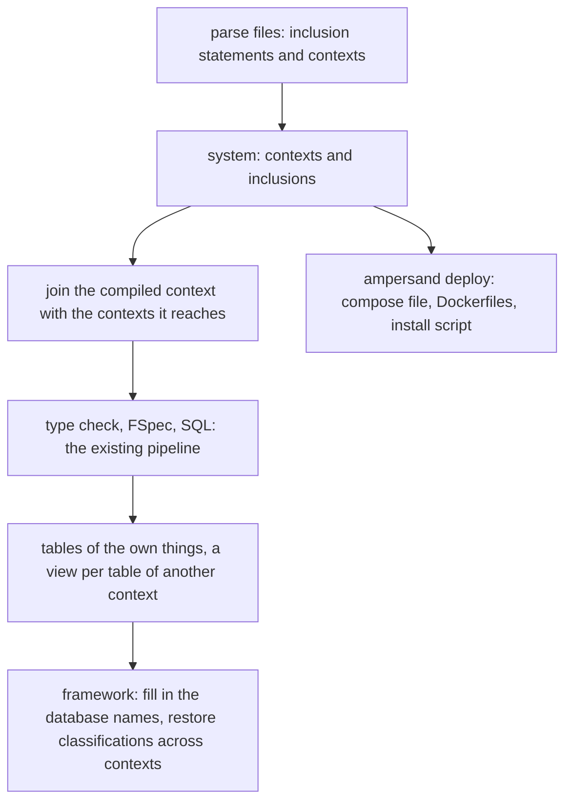

# Multi-context Ampersand: state and next steps

Tracking issue: AmpersandTarski/Ampersand #1509, "Describe an agreed-upon semantics of the namespace stuff".
Branch `multi-context` in Ampersand (pull request #1707) and branch `multi-context` in PrototypeFramework.

## Goal

One specification describes a system of several information systems.
Every context has one database and one application, and can be deployed by itself.
A context uses what another context declares and stores by including it: `CONTEXT A INCLUDES B`.

## Where the design is written down

| What | Where |
| --- | --- |
| The specification | `AmpersandData/FormalAmpersand/MultiContext.adl`, with populations in `memorybank/multi-context/spec-checks/` |
| The mathematics | The article *Multi-Context Information Systems in Ampersand* (`cloudDrive/publicaties/2026 Multi-contexts/`) |
| The proofs | `proofs/multicontext/`, claim PRF-11 in `docs/proofs/README.md` |
| The design choices | [DesignChoices.md](DesignChoices.md) |
| The documentation for users | `docs/reference-material/syntax-of-ampersand.md`, section "Systems of contexts" |

## What is built

Compiler:

- `Ampersand.Input.ADL1.Parser`: a file is a list of inclusion statements and contexts (`pFile`).
- `Ampersand.Input.Parsing`: reads the compiled context and every context it reaches (`growSystem`).
- `Ampersand.Input.Qualify`: labels, the joined context, and the checks on prefixes (`flattenSystem`).
- `Ampersand.FSpec.ToFSpec.ADL2Plug`: tables per owner.
- `Ampersand.Output.FSpec2SQL` and `Ampersand.Prototype.TableSpec`: a view for a table of another context.
- `Ampersand.Commands.Deploy`: the command `ampersand deploy`.
- Options `--context` and `--all-concept-tables`.

Framework:

- `MysqlDB::setContextDatabases` and `resolveContextDatabases`: the names of the databases of other contexts, from `AMPERSAND_CONTEXT_DBNAMES`.
- `MysqlDB::addAtom`, `deleteAtom`, `removeAtom`: a generalization with a table of its own.
- `Transaction::restoreClassifications`: classifications that relate concepts of two contexts.

## How it is tested

| Layer | Check | Where |
| --- | --- | --- |
| Existing behaviour | The regression suite; the generated files of existing scripts compared with the commit this branch started from | `scripts/test-local.sh`, `memorybank/tools/compare_compiler_output.sh` |
| Language and names | One case per rule of the specification, for acceptance and for refusal | `testing/Travis/testcases/MultiContext/` |
| Joining | Properties on arbitrary contexts, among them the diamond | `Ampersand.Test.MultiContext.QualifyProperties` |
| Meaning in one database | `ampersand validate` on the cases that succeed | the same directory |
| Running systems | One application per context on one database server | `test/multi-context/run.sh` in PrototypeFramework: scenarios `diamond` and `migration` |
| Specification | Populations that the specification accepts or refuses | `memorybank/multi-context/spec-checks/` |

## Next steps

1. **Wire the specification into FormalAmpersand.**
   `MultiContext.adl` is not included by `FormalAmpersand.adl` yet.
   It needs a type annotation in `Contexts.adl` line 106, the removal of the rule `eqRelation`,
   an extension of the rules `AllValidConcepts` and `AllValidRules`,
   and a population from the compiler for the new relations.
2. **Signals over another database.**
   An application evaluates a rule on the current data.
   The signals it has stored for a rule over another database are refreshed when it next evaluates that rule.
   Decide whether an application re-evaluates such rules at the start of every request.
3. **Database rights per context.**
   All applications use one database user with all rights.
   [database-rights.md](database-rights.md) compares five solutions; the choice is open.
4. **The directive in the desired system of a migration** (issue #1714).
5. **Positions in error messages** about prefixes, which now point at the first line of the context.
6. **The generator of migration scripts**, the stated next step of the 2024 paper.
7. **Kubernetes**: one release per context of the Helm chart in the project template.

## Not in this design

- Databases on different servers, and transactions that are not atomic.
- Authorisation of who may include or write a context.
- Export lists that restrict what an including context sees.
